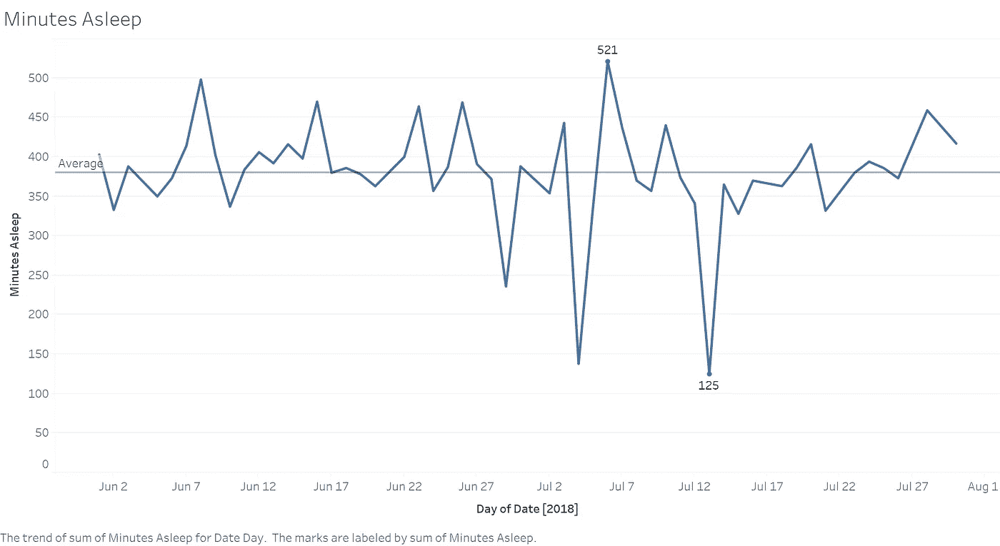
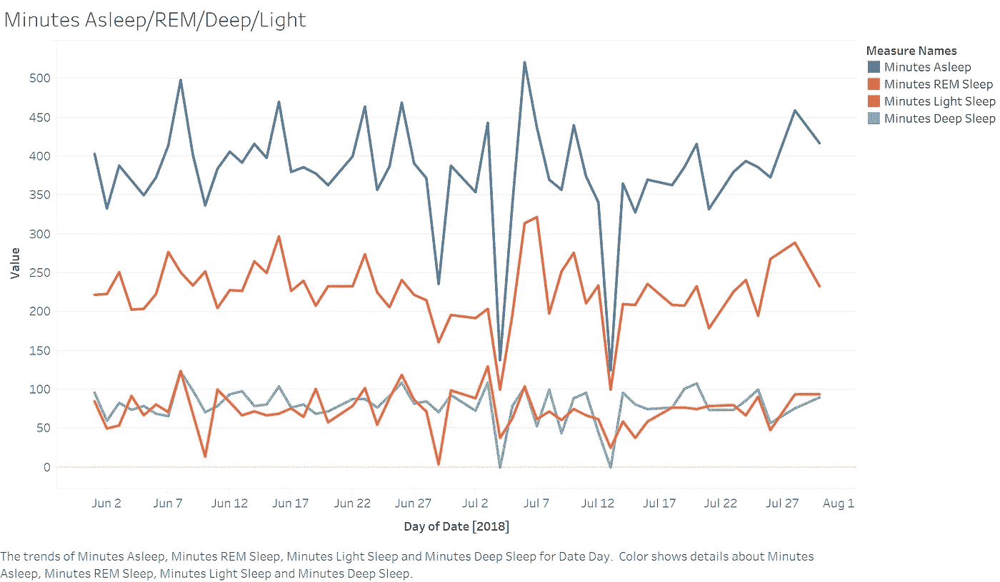
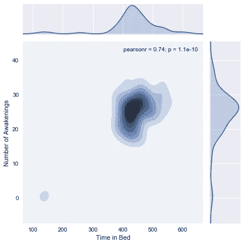
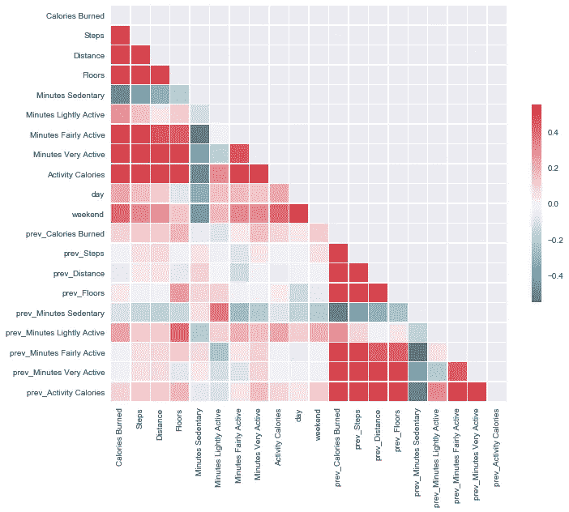
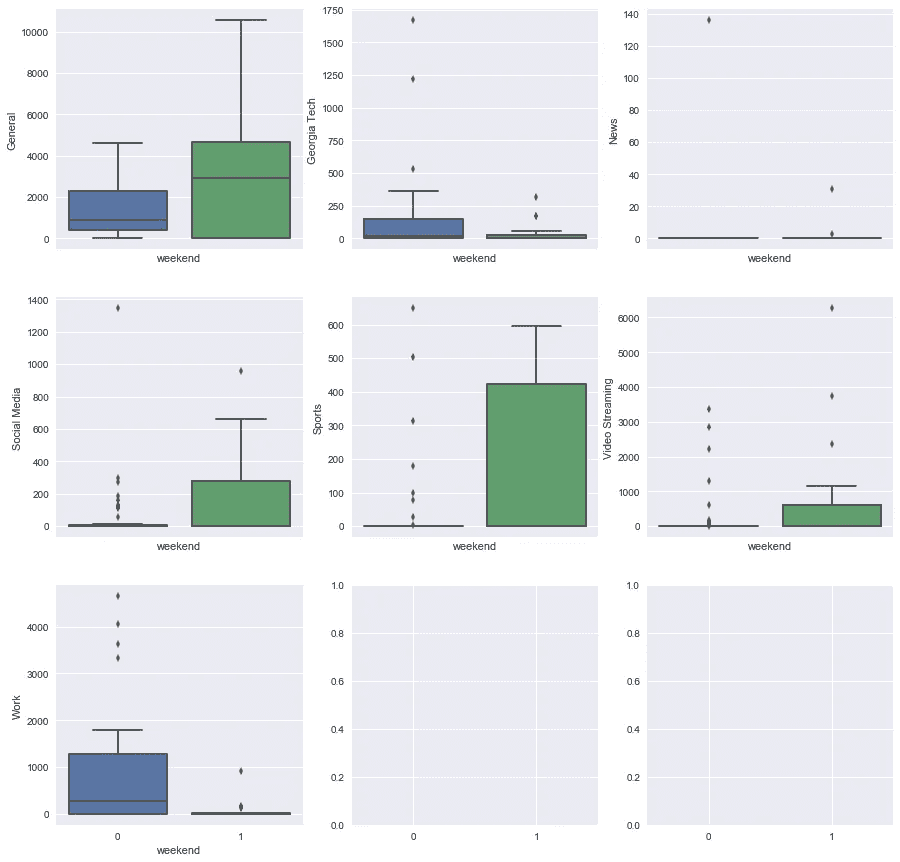
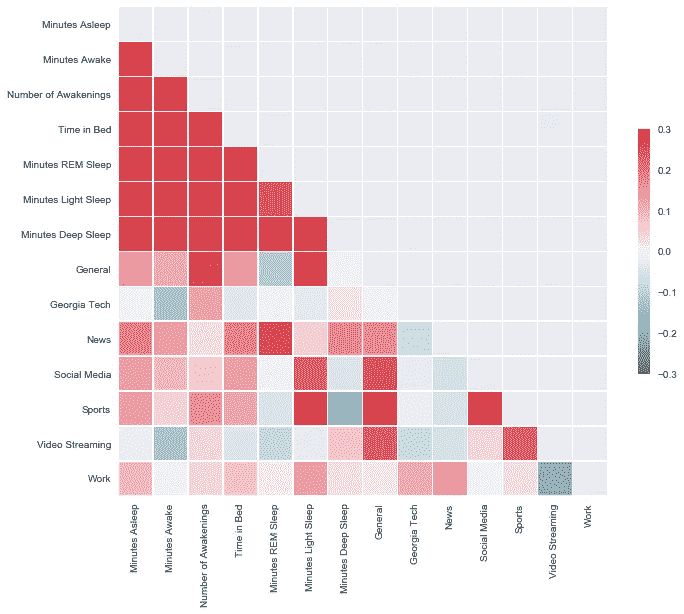

# 睡觉还是不睡觉——Fitbit 数据分析

> 原文：<https://towardsdatascience.com/to-sleep-or-not-to-sleep-fitbit-data-analysis-a81d28acac8e?source=collection_archive---------13----------------------->

## 劳累的一天并不总是能让你晚上睡得更好！你在网上浏览的内容也会影响你的睡眠质量。

我是一个相当健康的人，喜欢踢足球、跑步，通常会努力追求更好的生活方式。不知何故，我仍然在努力管理我的夜间睡眠！

**注:该分析基于有限的样本量，可能不具普遍性。这是一本有趣的读物！**

***通过这个博客，我把我的睡眠、健身和浏览历史结合起来，得出了一些相关性，其中一些“可能”是虚假的！***

今年 5 月，我买了一个新的 Fitbit Versa，从那以后，我几乎全天候跟踪我的睡眠和锻炼情况。在那几个月里，我还做了全职实习，因此我的日程安排很好，没有太大变化。

**工作日** —工作

**周末**——学习或旅行

虽然我是一个非常不稳定的睡眠者。有些日子我睡 9 个小时，有些日子我几乎不睡觉。要么是因为工作或不安，要么是因为温度不合适。我想找出最好的方法来保证晚上睡个好觉，这样第二天我就会精神饱满！

我从在线仪表板上提取了我的 fitbit 数据。它包含以下几列:

## 数据集 1(睡眠数据)

```
**'Start Time', 'End Time', 'Minutes Asleep', 'Minutes Awake',
       'Number of Awakenings', 'Time in Bed', 'Minutes REM Sleep',
       'Minutes Light Sleep', 'Minutes Deep Sleep'**
```

我对数据进行了注释，添加了一个“日期”列，对应于睡眠的夜晚。如果我在 9 月 16 日醒来，看到那行数据，我把它标注为 9 月 15 日。所以即使我在凌晨 12 点之前或之后睡觉，也会被标记为 09/15。



这张图片让你知道我的睡眠有多不稳定。

我的平均睡眠时间是 6.33 小时，标准差是 1.1 小时。理想情况下，我希望标准偏差低于 0.5！

***是的最小已经 2 小时 5 分钟了！*** *(谢谢佐治亚理工！:D)*

> 在床上的时间=睡着的时间+醒着的时间
> 
> *睡眠分钟=快速眼动睡眠分钟+深度睡眠分钟+浅度睡眠分钟*

所有这三种睡眠类型都与睡眠时间呈正相关。

然而，当你醒来时，即使是快速眼动或深度睡眠中的微小变化也会让你变得暴躁或疲倦。



为了更深入地探索，我绘制了我睡觉时间和睡觉时间的直方图。虽然分布看起来只是发生了移动，但峰高还是有一些差异，这表明还有其他因素导致这两个变量之间的关系发生变化(从而导致**分钟清醒**)。


下面的**醒来次数**和**在床上的时间**之间的联合图具有 0.74 的皮尔逊系数。这可能意味着，是的，在花在床上的时间和醒来的次数之间有一个*强有力的正相关关系，但这不是唯一的影响因素。*



醒来的次数可能取决于当天的压力或努力程度或其他一些因素。

## 数据集 2(健身活动数据)

最明显的选择是获取我的活动数据。

```
**['Date', 'Calories Burned', 'Steps', 'Distance', 'Floors',
 'Minutes Sedentary', 'Minutes Lightly Active', 'Minutes Fairly Active', 'Minutes Very Active', 'Activity Calories']**
```

我添加了一周中的**天的变量**和一个**周末标志**，后跟时移变量，以获取前一天消耗的卡路里、步数、距离、楼层和所有活动特征的**值。**

fitbit 将活跃分钟数大致分为:

> **分钟久坐，分钟轻度活动，分钟相当活跃**和**分钟非常活跃**

与睡眠数据不同，这四个类别之间没有直观的关系，你可以非常活跃，而不必花很多时间在相当活跃的类别中。

*然而，如果你仔细观察，会发现在某些情况下，非常活跃的图形(粉色)落后于相当活跃的图形(棕色)。*


不出所料，**周末标志**与**活动分钟数**有相当高的相关性**。它**也和**分钟久坐**高度负相关，暗示我不只是在沙发上度过周末。(抱歉网飞)

我很高兴的一个观察是，我的**活动(消耗的卡路里或活动卡路里)与我前一天的活动** 没有“高度”相关(负相关)，这意味着我不会因为前一天跑步或锻炼就休息。



在结合**数据集 1(睡眠)**和**数据集 2(健康)**时，我得到了一些有趣的假设。


我不得不深入挖掘，从数据中找出一些规律。是的，这不是分析应该做的，但我真的想了解我的活动和睡眠模式之间的关系。

1.  **轻度活动分钟**与**清醒分钟数**和**卧床时间**负相关**。这意味着，当我那天稍微活跃的时候，我会获得更好的睡眠质量。此外，第二天晚上的睡眠也更好。*这一切显然是在控制其他参数***
2.  **分钟非常活跃**与**分钟睡眠**、醒来次数和**在床上的时间**有**轻微正相关**当前睡眠**和**下一个**。这是因为高强度的体力消耗(足球/橄榄球和我的 5 公里跑步)会导致更高的肌肉恢复，这通常会将你踢出睡眠阶段，因此你会睡得更久。这也蔓延到第二天晚上！**

## 数据集 3(网络使用数据)

我一直喜欢在 chrome 上跟踪自己的使用模式，并在 chrome 上安装了一个“Webtime tracker”插件。它追踪了我在每个网站上花费的时间(以秒为单位),并在我空闲 45 秒或离开页面或切换应用程序时停止计数。

所以是时候把这个也放进去了！

我把所有的网站分成 7 类；

> **通用、佐治亚理工学院、新闻、社交媒体、体育、视频流和工作**



1.  乔治亚理工学院的相关浏览在工作日进行，这很令人惊讶，因为我本想在周末处理学校的事情。我想应该改变这一点！
2.  社交媒体在一周内要少得多。(是的，我是一名勤奋的实习生)
3.  周末视频流和体育活动非常多。这一周的体育价值有所上升，这可以归因于“世界杯”！
4.  最后，我再也没有把我的工作带回家，数据不会说谎(也许在周末做了一点)。我猜是启动和关闭 AWS 集群吧？)

## **我终于把 3 个数据集全部组合起来了！**

我不知道为什么，但我很喜欢相关图。由此我想指出体育浏览和睡眠之间的关系。



1.  **体育浏览**与**负相关**与**深睡**同一天晚上**正相关**与**浅睡**。

> **深度睡眠**促进**身体恢复**以及**记忆**和**学习**方面。这个阶段也被证明可以支持你的免疫系统。
> 
> **浅睡**促进**精神**和**身体恢复**。
> 
> 这是 Fitbit 网站提到的。那么，看更多的体育比赛是否会导致更多的浅睡眠，从而有助于精神恢复以克服压力？我非常喜欢足球比赛(即使阿森纳没有比赛)，这很可能是真的。不过话说回来 ***相关性并不意味着因果关系！***

1.  工作期间少视频流！是的，我是一名好员工！(迭代次数:P)
2.  所以在我的案例中，社交媒体与睡眠时间有直接关系。但社交媒体浏览和深度睡眠之间存在反比关系。这有什么意义？

更多社交媒体= >更多睡眠= >深度睡眠减少但浅度睡眠增加(精神恢复？有趣的..)

# **结论**

1.  **分钟相当活跃**起着很好的作用，决定了我那天晚上睡着的**分钟睡眠**。所以，是的，你必须参加一些公平的活动来获得一个好的睡眠时间！
2.  此外，**当天**和**之前**的**分钟轻度活动**在确定夜间睡眠时起到良好的作用。如果你一天的光照活动较少，你的睡眠时间就会减少！但是根据你前一天的活动，你仍然有深度睡眠时间
3.  在我跑步去皮埃蒙特和/或踢足球的日子里，距离很远。这通常会导致大量消耗(增加相当活跃和非常活跃的时间)。此外，在工作日，距离更长，因为我上下班要走很长一段路。 ***前一天走过的距离也会影响当天的睡眠。因此，一夜的睡眠并不能完全克服体力消耗！***
4.  非常活跃的时间对睡眠质量有相反的影响，这意味着过度劳累是不好的。过度劳累通常会导致睡眠期间身体恢复不一致，而且你往往会在晚上醒来更多。深度睡眠*可能会增加，但这是以快速眼动为代价的。当快速眼动不一致时，你会醒来。通常情况下，当晚的深度睡眠会减少，第二天早上你会感到昏昏沉沉。然而，第二天晚上的睡眠更重要，这是你身体恢复的地方*
5.  令人惊讶的是(或者不是),乔治亚理工学院在这份名单上得分很高，这意味着如果我有学校作业，我会睡得更少，晚上醒来更多(相关图表证实了这一点)。我不知道为什么。可能读研压力大吧！

我希望通过这个我至少能够减少我晚上睡眠时间的标准偏差，并且有一个更好更稳定的睡眠时间表！

[](https://github.com/jehlokhande93/FitbitAnalysis) [## jehlokhande93/FitbitAnalysis

### 分析从我的可穿戴设备收集的 fitbit 数据- jehlokhande93/FitbitAnalysis

github.com](https://github.com/jehlokhande93/FitbitAnalysis) [](https://www.linkedin.com/in/jehlokhande/) [## Jeh Lokhande -数据科学家实习生- Cox Communications | LinkedIn

### 查看全球最大的职业社区 LinkedIn 上 Jeh Lokhande 的个人资料。Jeh 列出了 6 项工作…

www.linkedin.com](https://www.linkedin.com/in/jehlokhande/)