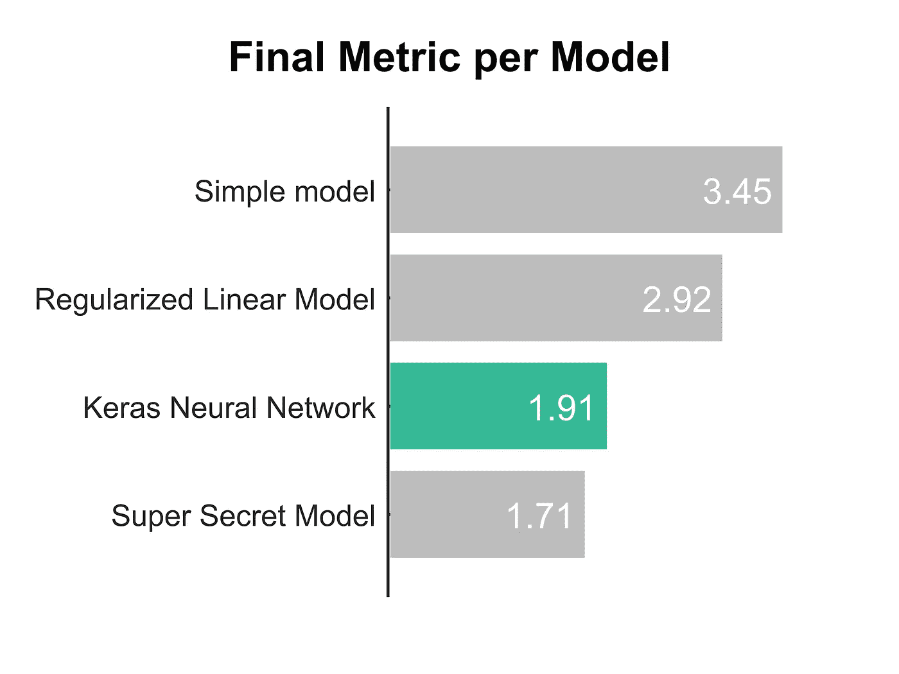

# 今天我在和 Keras 午休的时候建立了一个神经网络

> 原文：<https://towardsdatascience.com/today-i-built-a-neural-network-during-my-lunch-break-with-keras-65dae2c5d690?source=collection_archive---------3----------------------->


> 能够以尽可能少的延迟从想法到结果是做好研究的关键。
> - Keras.io

所以昨天有人告诉我，你可以在 15 分钟内在 Keras 建立一个(深度)神经网络。当然，我根本不相信。上一次尝试(可能是 2 年前？)这仍然是相当多的工作，涉及编程和数学的综合知识。那是非常严肃的手艺。

所以晚上我花了一些时间研究了 Keras 文档，我必须说这看起来很简单。但是当我尝试的时候，我肯定会发现一些困难，对吗？习惯这些软件包有时需要几个月的时间。

## 第二天早上

于是第二天我就着手用自己的数据玩 Keras。首先，我开始在我们自己的内部包中重构一些代码，将数据转换成表格形式。这让我沮丧了一段时间。最后，回复邮件和问题占据了我一上午的时间。完成之后，我可以很容易地将我的一些数据导出到 csv 文件，用 Pandas 读取，转换成 Numpy 数组，我们就可以开始了。

## 午休时间

由于这是一个业余爱好项目，我部分牺牲了午休时间来做模型。Keras 和 Tensorflow 很快就安装好了，自从我上次尝试在 Windows 笔记本电脑上安装 Tensorflow 以来，非常容易。然后我实际上复制粘贴了 Keras 文档中的代码。我甚至不打算启动一个 github 库，这就是我所做的一切:

```
from keras.models import Sequential
from keras.layers import Dense
import numpy as npmodel = Sequential()
model.add(Dense(units=64, activation=’relu’, input_dim=1424))
model.add(Dense(units=2696))
model.compile(loss='mse', optimizer='adam')model.fit(predictors[0:80,], estimator[0:80,], 
     validation_data=(predictors[81:,],estimator[81:,]), 
     epochs=80, batch_size=32)
np.savetxt("keras_fit.csv", model.predict(data), delimiter=",")
```

这是什么？我正在建立一个模型，在一些密集的层上打耳光，完成它，拟合数据，并做预测。所有这些只用了不到 10 行代码。我今天不做任何超参数优化或智能层架构。但我必须说；呸，那太简单了！

## 下午

现在很好奇实际表现。所以我必须用一些基准来测试它。但是不要告诉我的经理我在这上面花了时间！(开个玩笑，他们鼓励一些探索和学习。)所以我将数据加载回我自己的测试框架，并运行一些其他算法。这是我的最终绩效指标的结果。



对于不到一个小时的模型制作来说，这是令人尴尬的好。我们研究了 1.5 年的超级秘密模型仍然胜过它(谢天谢地)。最重要的是，任何神经网络的一个大缺点当然是，对于它实际学到的东西，它是一个完全的黑匣子。而我们的秘密模型使用模式识别，我们可以在以后作为人类进行诊断。

## 结论

所以这也是我有史以来写得最快的文章，完全是在一种狂热的心态下写的。现在，我正在用一天中的最后几分钟写这篇文章，为制作 Keras 的人热烈鼓掌。以下是我的结论:

*   Keras API:牛逼！
*   Keras 文档:太棒了！
*   Keras 成绩:牛逼！

任何想做一些深度/机器学习的人，我当然会建议从 Keras 开始。跑步是一件非常有趣的事情，你可以在以后学习和调整细节。