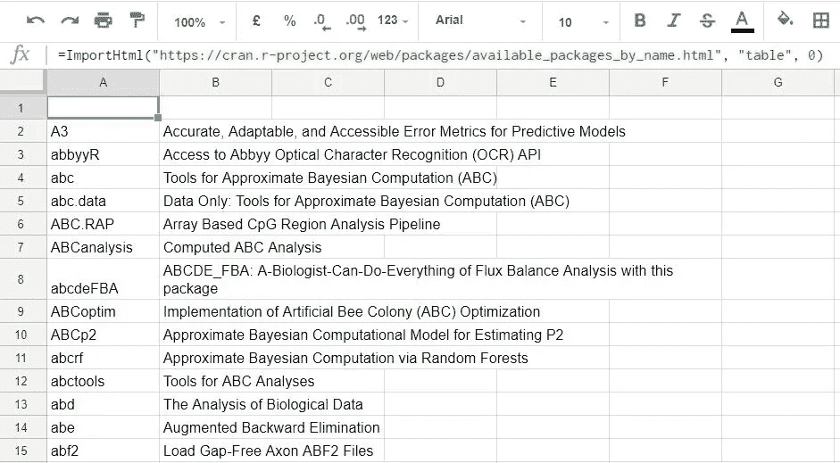
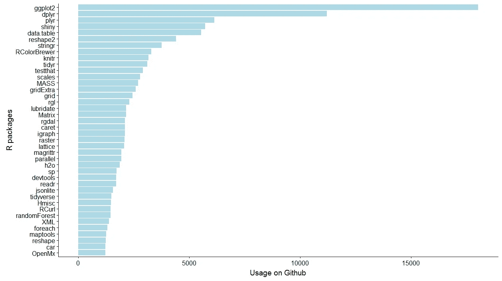
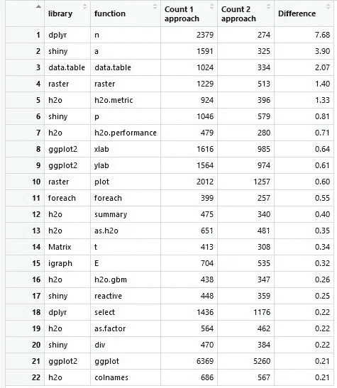
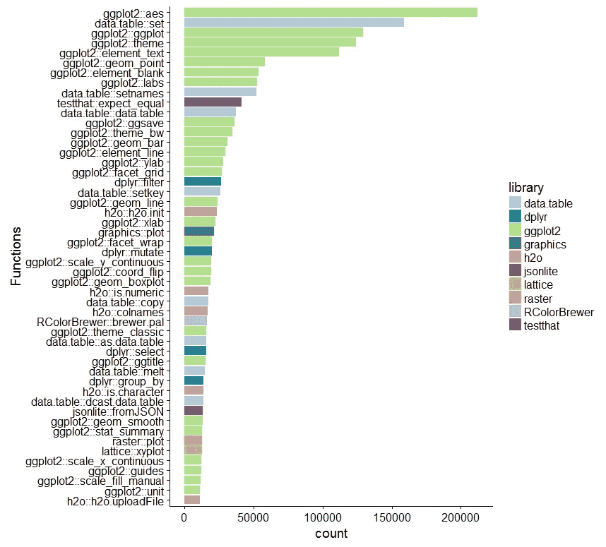
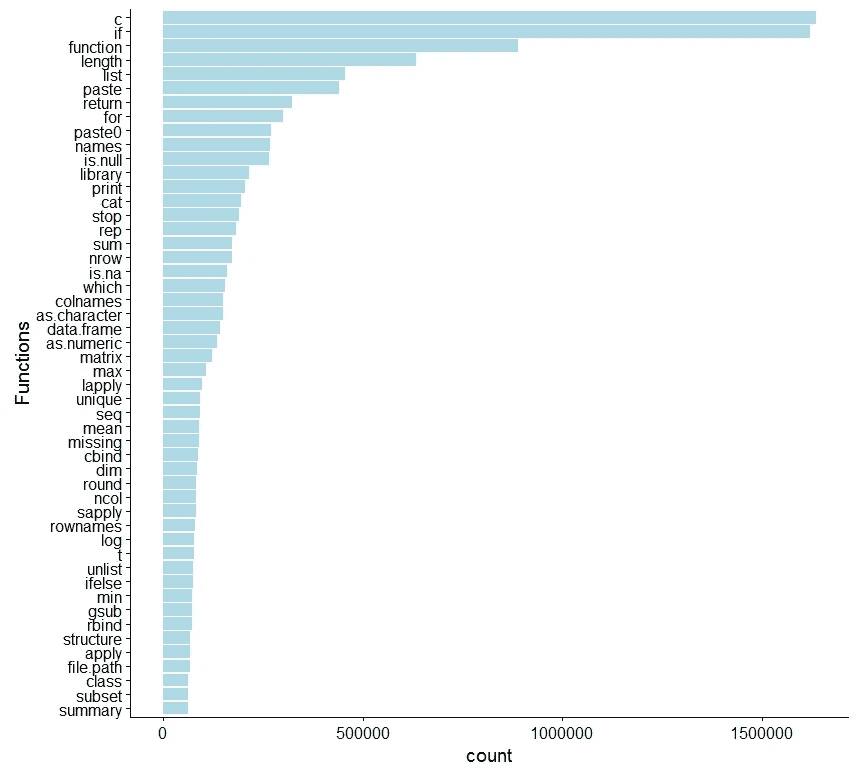
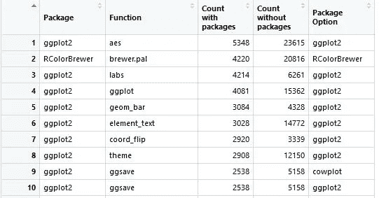
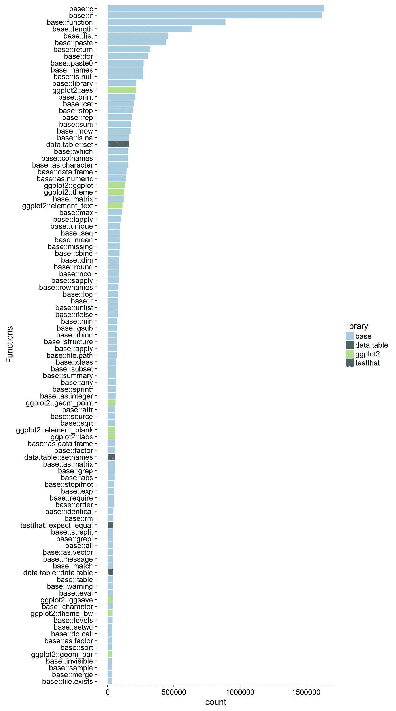

# GitHub 上 100 个最常用的 R 函数

> 原文：<https://towardsdatascience.com/top-100-most-used-r-functions-on-github-9caf2b81b314?source=collection_archive---------2----------------------->


Photo by [Luca Bravo](https://unsplash.com/photos/XJXWbfSo2f0?utm_source=unsplash&utm_medium=referral&utm_content=creditCopyText) on [Unsplash](https://unsplash.com/search/photos/functions?utm_source=unsplash&utm_medium=referral&utm_content=creditCopyText)

互联网提供了大量可供分析的数据。有时，它甚至已经是易于使用的形式，例如，Google BigQuery 数据集中所有 GitHub 存储库的集合。我曾经想过 R 中哪些最常用的函数会影响 GitHub 的使用。

所有公共 Github 存储库的 BigQuery 数据集包含超过 3 TB 的数据。希望我们不需要所有东西，只需要 R 文件。我们将首先提取 big query-public-data:github _ repos . files 中 R 文件的 id，然后使用这些 id 从 big query-public-data:github _ repos . contents 中提取文件的内容。

选择所有 R 文件的 id:

```
SELECT *
FROM [bigquery-public-data:github_repos.files]
WHERE lower(RIGHT(path, 2)) = '.r'
```

选择 R 文件的内容:

```
SELECT *
FROM [bigquery-public-data:github_repos.contents]
WHERE id IN (select id from [bigquery-github-1383:Github.r_files])
```

内容摆在那里！当然，我们可以在这里继续，但是记住 Google BigQuery 不是免费的，我已经使用了大约 2 TB 的数据处理。1 TB 目前是 5 美元，但是如果你第一次注册 Google cloud 并获得 1 年 300 美元，你就可以省钱。您还可以限制处理的最大数据量，这样就不会在出现错误函数的情况下遇到问题。

由于我们也需要从 R 中提取数据，并且我稍后将使用它进行可视化，所以我将切换到 R，而不是在 BigQuery 和 R 之间来回运行。

最终文件的数据量为 1.2 TB。我可以下载它，但是它们将首先被放在 Google 云存储上，只有到那时才可供下载，所以我将使用 R 中的 bigrquery 包建立一个从 R 到 BigQuery 的连接。

```
big_query_data <- "certain-torus-206419"sql <- "SELECT content FROM [certain-torus-206419:Github.content_copy]"destination_table <- "certain-torus-206419:Github.r_2"content_r <- query_exec(sql, project = big_query_data, useLegacySql = FALSE, destination_table = destination_table, max_pages = Inf)
```

该软件包将自行处理授权，下载和处理数据只需 2 分钟。

**最常用的 R 包及其功能**

一旦我们得到了内容，我们就可以开始寻找功能。有两种方法——直接在 GitHub 文件中找到函数，或者在其他地方找到它们，并检查它们在 GitHub 代码中的外观。

第一种方法有一个问题——在不同的包中，不同的函数有时会使用相同的名称，之后我们可能很难区分它们。所以我会先找到所有函数及其包，然后检查它们在 GitHub 文件中的外观。

我想到的第一个想法是简单地运行 apropos(" ")来列出所有函数。然而，这个函数将只列出您环境中的函数，这可能是不完整的。所以，我决定从包装开始。我去看了所有的[克兰套餐](https://cran.r-project.org/web/packages/available_packages_by_name.html)。我使用 Google Sheets 和这个公式(=ImportHtml( *URL* ，【表格】， *num* )从网页导入数据，列出所有包:



r 有 12 000 多个包！对 R 来说很好，但对我来说不是。当然，我们可以尝试列出所有函数，但我会从这一点出发进行优化。我们不太可能在很少使用的包中找到 100 个最流行的函数。所以，我会限制他们。我们先找一下排名前 100 的 R 包，以及其中的函数。希望这是之前由 Kan Nishida [在这里](https://blog.exploratory.io/clustering-r-packages-based-on-github-data-in-google-bigquery-1cadba62eb8d)完成的。然而，我将使用类似的方法，用更多的原生 R 函数代替探索性的包。我还使用了稍微不同的语法来查找包，以包含括号后有空格的情况。这有助于在代码中增加大约 1500 个包的外观。

我找到了前 100 个函数。这真的很有意思，在过去的两年里这是如何改变的。



没有那么多，top4 一点都没变，我也没看到其他包有大的变化。

一旦我们知道了包，是时候获取这些包中的所有函数了。在此之前，我需要确保在我的环境中安装并上传了这些包。

安装是一个棘手的部分，我想控制我要安装什么，所以我一个接一个地安装，而不是用一个函数一次全部加载。不幸的是，手动步骤完成后，我将使用以下命令将它们上传到环境中:

```
 lapply(packages_100$value, require, character.only = TRUE)
```

然后通过以下方式获取所有已安装的软件包和功能:

```
functions <- sapply(search(), ls)
```

我必须说，我没有设法安装所有的 100 个软件包。唯一的原因是有些包不是 CRAN 包或运行 R 第二版(我用的是 3。).希望所有的前 50 名软件包都在那里，所以我认为忽略一些其他的不是问题。此外，当一个包因为某些原因(比如 [limma](https://cran.r-project.org/web/packages/limma/index.html) )从 CRAN 中被删除时，我会有点怀疑。

总之，在清除了全球环境和数据集之后，我们有 99 个包，产生了超过 12000 个函数。挺好的！我可以过滤包含 R 文件内容的原始数据集，只包含这些包。

**识别功能**

现在我有两个选择。我可以尝试检测所有看起来像函数的单词(在 R 函数中可以包含大写/小写字母 _。和数字，我将排除运算符)，然后在列表中搜索相同的函数，或者尝试提取后跟“(”的函数。第一种方法将导致与英语中的单词相似的函数的更高外观。然而，第二种方法会忽略其他函数中函数的使用，比如 apply()，其中包含不带括号的函数。这两种方法都可能有失偏颇。因此，我将在更小的子集上运行这两种方法，看看是否有更好的方法。

我在 10000 行的子集上运行了 2 个方法，然后得到了计数差异高于 20%的结果:



结果有利于第二种方法——第一种方法排名较高的大多数函数要么是单字母函数，“a”文章、常用词，要么与软件包同名(这意味着它们将至少被计算两倍)。唯一出现的问题是 h2o 包装。这很奇怪，因为大多数函数都是标准形式，后面有一个括号。但是，让我们对接下来的 10000 行运行相同的脚本:


现在一切都很好，所以 h2o 包的问题只是一个非代表性子集的偏差。因此，第二种方法得到更准确的结果。

**查找最常用的功能**

另一件事是基础包和其他包之间的区别:当使用基础函数时，通常不会显式加载基础包。所以我将分别运行它们。

还有一个性能问题，我们的数据集相当大，大约 1.2 GB。检查所有的功能是一个更广泛的过程，会减慢这个过程。单独检查包将导致更少的处理。

要处理的过程如下:

-从字符串中提取所有可能的函数，

-取消包含功能的色谱柱，

-按封装和功能分组，

-计算每个实例的出现次数，

-对出现在所有函数列表中的实例进行过滤(对包和函数名使用内部连接)。

前 50 个函数的结果如下:



惊喜？不完全是，我们已经检查过 ggplot2 是最常见的包。

我将对基本函数重复这个过程。



这里也没有太多惊喜。

**假设**

我需要提到几个我没有考虑到的问题:

-自制函数内部的函数只计算一次。这是有疑问的，但我相信不会造成大的不同。但是，如果我愿意的话，我需要计算 function(x){}，并列出内部使用的函数，计算文件中新函数的使用次数，然后计算新函数的使用次数减 1，并添加到原始函数的总数中。在这里我相信这种复杂性不会获得更好的结果。此外，人们可以认为只计数一次更符合逻辑，因为函数实际上只使用一次。

-我没有计算是否有人重写了函数的行为。通常情况下，你不应该这样做，我希望真的很少有人这样做。

-我依赖的假设是，如果有人使用非基础包中的函数，她会显式地将该包添加到环境中。然而，情况并非总是如此。在没有对包名进行过滤的情况下，对 test 10000 行运行另一个脚本，比较对包的过滤和派生差异，我们发现，例如，ggplot2 包在多达 70%的文件中没有被加载。



嗯，不是最好的做法。我也相信非加载包的分布可能倾向于最常用的包。因此，结果可能有偏差，但是它有助于调出不太有名的包。

此外，它表明我们幸运地避免了分配在许多包中使用的常用函数的问题:


**结果**

所以我们来了！所有软件包中 GitHub R 上最常用的 100 个函数是:



它们中的绝大多数是基本函数，这是意料之中的，只有一些来自其他包的函数。

我还在[GitHub](https://github.com/v-kozhevnikov/GitHub_R_commands/tree/master/data)(top _ 2000 _ functions . CSV)上传了一个包含 2000 个最常用函数的文件，所以你不需要运行所有代码来探索它们。

所有代码都在 [GitHub](https://github.com/v-kozhevnikov/GitHub_R_commands) 上。