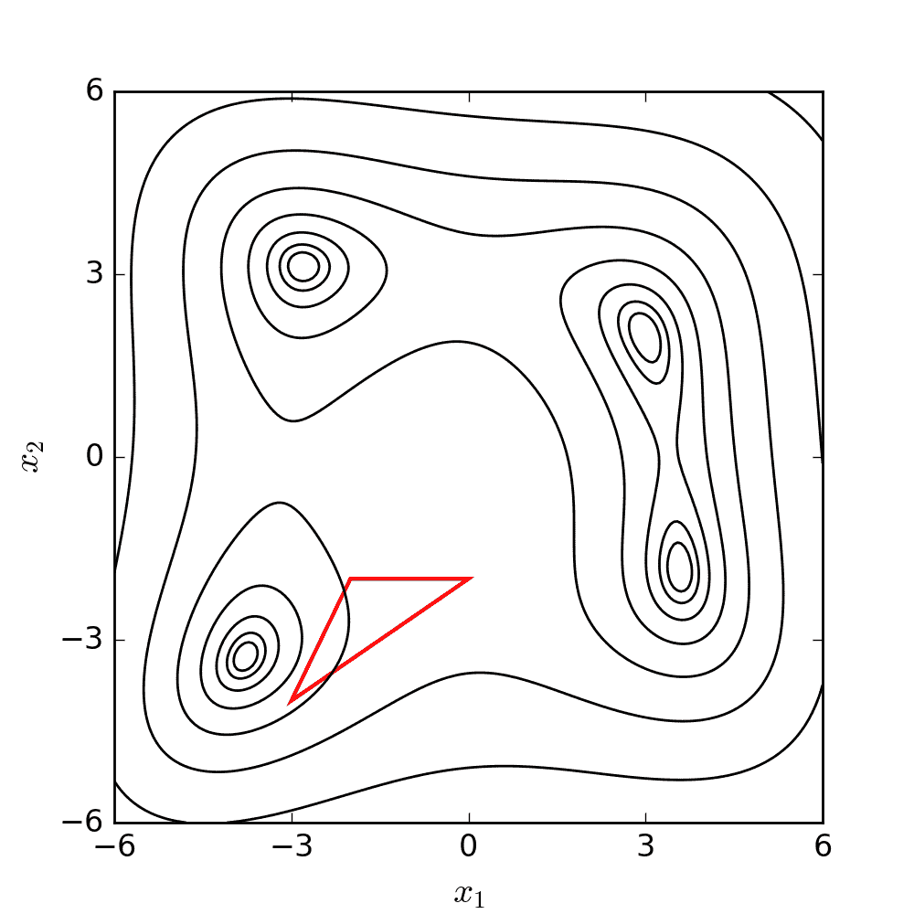

# 说明性分析的 5 大问题以及如何克服它们

> 原文：<https://towardsdatascience.com/top-5-issues-with-prescriptive-analytics-and-how-to-overcome-them-6f5cada83aa4?source=collection_archive---------20----------------------->


[Stopwatch Gears by geralt](https://pixabay.com/en/stopwatch-gears-work-working-time-3699318/), CC0

规定分析有点像类固醇的预测分析。正如在关于这个主题的早期文章中所指出的，规定性分析是对你通常的预测分析的有力补充。你不仅要预测未来的事件，还要利用这种预测来优化你的决策。
当你一头扎进机器学习和优化技术的熔炉，以理解和实施先进技术时，规定性分析提出了独特的挑战。向最终用户传达这一点也是一个挑战。
以下是您在实施此类系统时遇到的 5 大问题，以及解决这些问题的方法:

# I .定义适应度函数

说明性分析要求您定义一个适应度函数。这个适应度函数应该奖励好的优化结果。要定义这个适应度函数，你需要对业务有很好的理解。
得到这个等式有时会很困难，因为它需要从一开始就与企业密切合作。根据我的经验，首先建立准备、建模和说明性分析的完整管道是有益的。这条管道在开始时可能过于简单。整个原型可以快速部署到 BI 系统或 Excel 中。从那里你可以有一个更好的方式与你的终端用户对话，因为他们已经可以体验结果。

# 二。无导数优化



Nelder-Mead optimization on the Himmelblau function. Depending on the start value you get different results. Image by [Nicoguaro](https://commons.wikimedia.org/wiki/User:Nicoguaro). [CC BY 4.0](https://creativecommons.org/licenses/by/4.0/)

依赖于预测模型的适应度函数通常是不可微的。例外当然是像 GLMs 这样的简单模型。因此，您通常必须使用不需要梯度或 Hesse 矩阵的算法来优化您的适应度函数。这不包括神经网络中常用的优化器。

一般来说，可行的解决方案分为两大类。首先是进化优化家族，它总是一个伟大的竞争者。进化优化总是有支持者和反对者。所有优化问题的主要问题是收敛到一个最优值。虽然找到局部最优相对简单，但进化方法试图克服局部最优，并在完整的解空间中找到好的解。这种可能性的代价是，它们有更多的起始参数，这在很大程度上影响了结果的质量。这就是为什么运行时会成为进化方法的一个问题。第二类涉及近似梯度法。这些方法在内部计算梯度的数值近似值。之后，他们使用了通常的梯度下降思想的变体。众所周知的方法是单纯形法或鲍威尔法，但是当然还有更多的方法。

# 三。复杂约束

在许多情况下，您的参数会受到约束。当你的解决方案无法实现时，就会出现这种情况。这种情况的一个例子是负长度。限制的另一个原因可能是业务规则—可能不想提供低于 10 美元的价格。您可以用两种方式处理这些约束——您可以显式命名它们并让优化器知道它们，或者您可以将它们编码到您的适应度函数中。

## 有明确约束的问题

一些算法可以在它们的方法中加入约束。这方面的例子有 BYOBA 或进化优化。其他人不行。
如果你想要的算法支持约束，通常最好使用这个。在某些情况下，这样做是非常困难的。例如，您的约束取决于预测。在这种情况下，您很难在普通的优化器中使用它。在这种情况下，您很难在普通优化器中使用它。

## 适应度函数解决方案的问题

另一种方法是为你不想要的解决方案建立一个惩罚因子。您应该避免使用基于阈值的惩罚，例如:

```
#Fitness should be maximized.
def my_fitness(y_pred):
    fitness = y_pred
    if (y_pred > threshold):
  fitness-=1e6
 return fitness
```

如果你这样做，你的适应度函数就会不连续。如果您在基于梯度的方法中使用它，这可能会非常糟糕。

或者，你也可以像这样对适应度使用惩罚:

```
def my_fitness(y_pred):
 fitness = y_pred
 if (y_pred - threshold > kickin):
  fitness-= factor*abs(y_pred - threshold)
 return fitness
```

不好的一面是，这个适应度值已经不可理解了。在此之前，这是一个带有惩罚的阈值的绝对差值。现在它是一个适应度和惩罚函数的组合。
这里的缺点是你失去了可解释性。以前你可以把你的健康理解为收获。现在歪了。

# 四。全局约束

到目前为止，我们只讨论了可以逐行导出的约束。这些约束是根据机器运行或每个客户定义的约束。您可能会遇到需要使用来自其他示例的信息的约束。这方面的例子有:

> 找到最大利润的价格，同时确保你一个月有 1000 个客户。

这可能意味着您需要寻找无利可图的客户来满足这个业务约束。制造业的另一个例子:

> 为机器的这次运行找到最佳设置，但是设置不允许与上次运行的设置相差太多

在上面的场景中，即使其他解决方案具有更高的适应性，您也可以在最后一次运行的解决方案旁边取一个局部最小值。

## 解决方案 I —全局优化

实现全局优化的一种方法是同时优化所有客户，而不是单个客户或单独运行的机器。这允许您定义一个全局惩罚，您可以将它包含在适应度中。这样，您可以同时优化局部和全局约束。一个障碍是你需要同时改变所有的参数。如果你一个月有 10000 个客户，一个简单的二维优化问题可以变成一个 20000 维的问题。这使得数值优化更加困难。
另一个问题是实时部署。想想预测定价。您无法实时运行此优化。然而，你能做的是通过优化以前的数据来克服这一点，并将其作为另一轮机器学习的输入。

## 解决方案二—后处理

在某些用例中，进行后处理来满足全局约束也是可行的。这样做的一种方法是不仅导出最佳适应度，还导出其他次优数据点。然后，您尝试用这些候选点中的一个来替换您的最优值，以满足全局约束。

# 第五-稀疏输入数据

说明性分析在制造业中有一些重要的用例。一个常见的用例是控制机器或工厂的参数以获得最佳质量。这里的一个常见问题是，您只有“受控情况”的数据。
如果你对这些数据进行规范性分析，你会遇到一些问题，比如进入数据点数量很少的超空间区域——这使得你的预测不可靠。

## 解决方案 I —异常检测


Illustration of the LOF outlier detection algorithm. Points with high distances compared to their neighbors have a high outlier score. It’s not clear if that also means that they are hard to predict. From [Wikipedia](https://de.wikipedia.org/wiki/Datei:LOF.svg), Public Domain.

用有限的输入数据来克服这个问题的一个想法是使用异常检测方法来计算这个特定数据点的超空间有多密集。如果选择的数据点位于您没有足够的预测点的区域，您应该拒绝该数据点。这些方法的例子是局部离群因子(LOF)，一类 SVM 或高斯混合模型。

虽然乍一看去除这些“异常值”听起来很合理，但要证明这一点并不容易。您的预测性能可能不依赖于这种“稀疏性”。不举这些例子可能会导致不必要的拒绝，从而导致更差的表现。这也可能增加另一种对“通常”的偏见，因此可能是老式的解决方案。

## 解决方案二——数字双胞胎

一些植物有一个数字双胞胎。数字双胞胎的概念理应有自己的博客。这个概念是你有一个完整的整个工厂的数值模拟。这个孪生可以用来为超空间中的稀疏区域生成数据点。然后你可以用它来填充更多的例子，并且仍然可以可靠地预测。