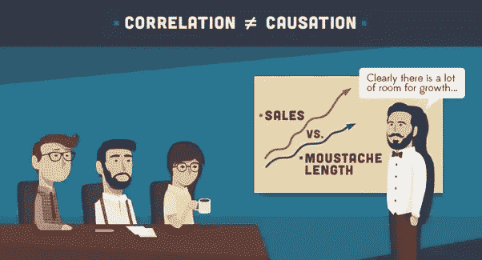

# 数据科学的秘密—业务视角是您所需要的一切

> 原文：<https://towardsdatascience.com/top-advice-for-a-data-scientists-eadaedbe7576?source=collection_archive---------4----------------------->

## 概述了许多新手犯的错误

一个数据科学家需要有批判性，并且总是注意一些其他人忽略的东西。因此，这里有一些建议，人们可以将其纳入日常的数据科学工作中，以便更好地开展工作:

# 1.当心干净数据综合症

即使在开始处理数据之前，你也需要问自己一些问题。**这个数据有意义吗？**错误地假设数据是干净的可能会导致错误的假设。除此之外，通过观察数据中的差异，您可以辨别出许多重要的模式。例如，如果您注意到某个特定的列缺少 50%以上的值，您可能会考虑不使用该列。或者你可能认为一些数据收集仪器有一些误差。

或者说，在一家女性化妆品公司，男女比例为 90:10。你可以假设干净的数据并显示结果，或者你可以用常识询问标签是否被调换。

# 2.明智地管理异常值

离群值可以帮助你更多地了解那些一天 24 小时都在使用你的网站/产品的人。但是在构建模型时包含它们会使模型产生很大的偏差。

# 3.留意异常情况

在**上寻找一些不明显的东西**。如果你发现了什么，你可能已经找到了金子。

例如， [Flickr 一开始是一个多人游戏](https://www.fastcompany.com/1783127/flickr-founders-glitch-can-game-wants-you-play-nice-be-blockbuster)。只有当创始人注意到人们把它作为照片上传服务时，他们才转向。

另一个例子是:fab.com 最初名为 fabulis.com，是一个帮助同性恋者交友的网站。该网站最受欢迎的特色之一是“当日同性恋交易”。有一天，交易是汉堡包——一半的购买者是女性。这让团队意识到向女性出售商品是有市场的。因此 Fabulis 转向 fab，作为设计师产品的快闪销售网站。

# 4.开始关注正确的指标

*   **小心虚荣指标:**例如，活跃用户数量本身并不会泄露很多信息。我宁愿说“活跃用户增长 5% MoM”，也不愿说“10000 活跃用户”。即便如此，这也只是一个虚荣心指标，因为活跃用户总是会增加。我宁愿跟踪活跃用户的百分比，以了解我的产品性能如何。
*   尝试找出与业务目标相关的**指标。例如，特定月份的平均销售额/用户。**

# 5.统计数据也可能会说谎

对引用给你的每件事都要持批评态度。过去，统计数据曾被用于广告、工作场所和许多其他营销场合。人们会不择手段来获得销售或促销。

例如:[你还记得高露洁声称 80%的牙医推荐他们的品牌吗？](http://marketinglaw.osborneclarke.com/retailing/colgates-80-of-dentists-recommend-claim-under-fire/)

这个统计数字初看起来相当不错。原来，在调查牙医的时候，他们可以选择几个品牌——而不是一个。所以其他品牌也可能像高露洁一样受欢迎。

另一个例子:**“百分之九十九的准确率”并不意味着狗屎**。让我创建一个癌症预测模型，我可以用一行代码给你一个 99%准确的模型。怎么会？只需对每一个预测“没有癌症”。因为癌症是一种非常罕见的疾病，所以 99%以上的情况下我都是准确的。然而我却一事无成。

# 6.理解概率是如何工作的

事情发生在 1913 年夏天，在摩纳哥的一个赌场里。赌徒们惊奇地看着赌场的轮盘连续 26 次落在黑色上。由于红色对黑色的概率正好是一半，他们确定红色是“应该的”。这是赌场的大日子。一个[赌徒谬误](https://en.wikipedia.org/wiki/Gambler%27s_fallacy)的完美例子，又名蒙特卡洛谬误。

这在现实生活中也会发生。人们倾向于避免一长串相同的答案。有时为了得到一个看起来更公平或可能的决策模式而牺牲判断的准确性。

例如，如果招生官员已经连续批准了三份申请，他可能会拒绝下一份申请，即使该申请本应根据成绩被接受。

# 7.相关性不等于因果关系

数据科学家工具箱的圣杯。看清事物的本来面目。仅仅因为两个变量一前一后一起移动并不一定意味着一个导致另一个。过去有过这种令人捧腹的例子。我最喜欢的一些是:

*   查看消防部门的数据，你可以推断出派往火灾现场的消防员越多，造成的损失就越大。
*   在调查 80 年代纽约市的犯罪原因时，一位学者发现严重犯罪的数量与街头小贩出售的冰淇淋数量之间有很强的相关性！显然，有一个未被观察到的变量导致了这两者。夏天是犯罪最严重的时候，也是冰淇淋卖得最多的时候。所以卖冰淇淋不会导致犯罪。这两种犯罪都没有增加冰淇淋的销量。

# 8.更多的数据可能会有所帮助

有时候获得额外的数据可能会创造奇迹。通过从各个角度看问题，你也许能更接近真实世界。寻找额外的数据源。

例如，一个城市的犯罪数据可能有助于银行向居住在问题社区的人提供更好的信贷额度，从而提高底线。

*原载于*【mlwhiz.com】