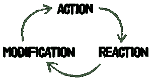

# 为什么数据科学不仅仅是？适合()。预测()

> 原文：<https://towardsdatascience.com/top-examples-of-why-data-science-is-not-just-fit-predict-ce7a13ef7663?source=collection_archive---------4----------------------->

## 在这篇文章中，我将回顾一些我学到的让我从一名技术数据科学家变成一名优秀数据科学家的顶级概念

两个月前，我结束了在 YellowRoad 作为数据科学家的第二年，所以我决定对我的项目进行回顾性分析，我做得好吗？我发现了哪些有趣的方法？我犯了什么错误？最重要的是，我学到了什么？

在这篇文章中，我将回顾我学到的一些顶级概念，在我看来，这些概念使我从一个运行模型并可以很容易被 autoML 取代的技术数据科学家变成了一个优秀的数据科学家，即使不需要最先进的研究，也能在每个项目中提供价值。

**1)数据泄露**

根据 Kaggle 的说法，数据泄漏是在训练数据中创建意外的附加信息，允许模型做出不切实际的良好预测。或者更简单的定义，任何能让你的模型在研究中比在生产中表现更好的东西。我有一百万种类型的数据泄漏，有时是由于模型中的错误(比如将标签作为一个特性输入)，有时是由于数据集创建中的错误(比如创建一个包含未来信息的特性)，有时是由于业务逻辑中的错误(比如使用不能在生产中使用的特性)。关于数据泄漏最危险的事情是很难发现，有时只有当你发现测试集的准确率为 90%而生产的准确率只有 60%时，你才会发现泄漏。如果你想了解更多关于数据泄露的信息，你可以观看[我的闪电谈话](https://www.youtube.com/watch?v=m-tAASQA7XQ)，从 11:15 开始(只有 10 分钟:)。

**2)选择偏差**

选择偏倚是指通过选择个体、群体或数据进行分析而引入的偏倚，这种方法不能实现适当的随机化(来自[维基百科](https://en.wikipedia.org/wiki/Selection_bias))。例如，如果您正在使用贴在脸书墙上的调查问卷构建一个训练集。回答这个问题的人可能和你年龄相仿，来自你的国家甚至城市，拥有你的社会经济属性。如果你只基于这些数据建立一个模型，当它投入生产时，它将暴露给更广泛的人群，你的模型对你的朋友有效的事实并不意味着它对每个人都有效。有时，选择偏差甚至比数据泄露更难，因为如果你可以监控所有群体的标签，你就可以使用这些标签进行训练。选择偏差也更难修复，你可以基于整个群体重新加权你的训练集，或者删除将训练集与整个群体区分开来的特征，但你不能真正评估这些方法是否有效。更多关于卢卡斯·伯纳蒂[精彩演讲](https://www.youtube.com/watch?v=3ZWCKr0vDtc)的选择偏见。

**3)生产反馈回路**

在许多机器学习应用程序中，生产工作流看起来是这样的:机器学习模型对用户行为进行预测，系统根据模型输出采取行动，用户对系统做出反应，模型根据用户行为进行重新训练。这种反馈循环中，模型对其未来训练集的影响会导致一些偏差。例如，在一个推荐引擎中，我们根据用户点击的项目进行排名，但是如果我们首先对一个项目进行排名，那么它的点击概率高于排名第 10 的项目。这样，我们的模型将永远不会学习新的东西，即使有些项目对用户来说更好。为了解决这个问题，我们通常使用 exploration，即使一个项目从模型中以某种概率得到低分，也将其排名靠前，或者相对于项目的先前排名重新调整模型标签，如果项目是从第二页被点击的，那么它比第一个项目被点击的指示更强。另一个例子是预测客户是否会归还贷款。我们不知道如果我们批准我们拒绝的贷款会发生什么，因此，我们正在为模型的下一个训练集创建一个偏差。

**4)特殊交叉验证技术**

在某些情况下，使用随机交叉验证是不够的，因为生产数据看起来与研究数据不同，我们需要使用特殊的交叉验证方法。例如，在时间序列数据集中，由于自然或特殊事件，数据分布通常会发生变化。如果我们将使用随机交叉验证，训练和测试数据分布将是相同的，我们不知道我们的模型是否对这种数据分布变化具有鲁棒性。因此，在时间序列中，我们需要使用滑动窗口交叉验证，而不是随机验证。关于时间序列交叉验证的更多信息，你可以在[这篇文章](/time-series-nested-cross-validation-76adba623eb9)中阅读。另一种特殊情况是当您的数据中有组时，例如在医学临床试验中，您在试验期间有同一患者的许多实例。为了确保我们的模型将推广到新的组，我们需要使用组交叉验证，其中每个文件夹包含几个组的所有示例，在测试时间，我们将测试新的组。

**5)选择“正确的”评估指标**

这是一个有点陈词滥调的句子，有时在真实场景中很难做到，但是你评估你的模型的方式应该与你的用例的业务需求高度相关。我会举一些例子，我有一个项目，在一个广告技术公司建设一个投标人，将决定支付多少印象。我们的方法是建立一个模型，预测公司可以从一个印象中赚多少钱，然后根据预测设定出价。在这个模型中，MSE 是一个糟糕的评估指标，尽管它可能是回归模型中最流行的指标。MSE 对大错误的惩罚比对小错误的多。在这个模型中，当公司设法以非常高的价格出售印象时，大多数大错误都是异常的。预测异常几乎是不可能的，所以即使在这些异常中，其他人也会提供与其他印象大致相同的出价。如果我们的预测会更低，我们有时仍然会购买这些异常，但如果我们对常规印象提供大量出价，我们会损失很多钱。另一个例子是排名模型，准确性和 MSE 显然与业务用例不匹配，但即使不同的排名指标也可以适合不同的用例。如果您只向用户呈现前 K 项，那么 K 处的回忆应该是您的评估指标。但是，如果你向用户展示一个长长的排序列表，并且他看到一个项目的概率随着排序的降低而降低，那么 NDCG 是一个非常好的度量。

**6)从一个简单的模型开始**

使用新的深度 Cnn Rnn 与 Gans 的残余变压器注意力和一些网络区块链层的流行语很酷，甚至非常酷，但这不是一个开始项目的好方法。从具有少量特征的简单模型开始有几个优点。调试模型和发现错误或数据泄漏更容易，你更好地理解模型的预测，并知道如何使它表现得更好，以及哪些研究方向更有前途，如果你看到数据中没有信号，你会很快失败，并花一点时间转移到你的下一个项目，这可能是最重要的优势，有时简单的模型足以满足你的业务需求，所以你节省了大量的研究和 GPU 时间。

**7)不要使用ε型号**

在 Kaggle 比赛中，获胜的模特通常是拥有数百种特征的 30 个模特的组合。这些模型通常比一个好模型或 2-3 个简单模型的集合好 0.01 点。这些复杂的模型被称为 epsilon 模型，因为它们只增加了一个 epsilon 的性能，但给生产系统带来了巨大的复杂性。每个模型甚至特征都是另一个潜在的漏洞，它需要更多的训练和推理时间以及更多的内存。在由于复杂性和性能导致的成本权衡中，除了模型的准确性与收入高度相关的特殊情况，较简单的模型胜出。

**8)监控生产中的模型**

在大多数实际应用中，由于业务决策、用户行为的变化、模型引起的变化等等，数据分布总是在变化。这意味着您的模型性能可能会随着时间的推移而下降。为了阻止这种现象，我们需要监控模型的性能，并在性能显著下降时重新训练模型甚至返回研究阶段。但是，在许多情况下，我们没有新的标签(例如，如果我们用 Mechanical Turk 标记我们的训练集)，或者我们在很长时间后发现了这些标签(例如，如果我们预测某个企业是否会归还其 5 年贷款)。在这些情况下，我们应该监视定型集和生产数据之间的数据变化，甚至监视模型预测概率分布的变化。[这里](https://www.youtube.com/watch?v=IqKunD0Bl5c)是 Jannes Klaas 关于监控生产中的机器学习模型的精彩演讲。

**感谢阅读:)**

我希望这篇文章能给你一些启发，也希望你能从我过去的错误中吸取教训，以后不会再犯同样的错误。

希望你喜欢我的帖子，非常欢迎你阅读和关注我的博客。