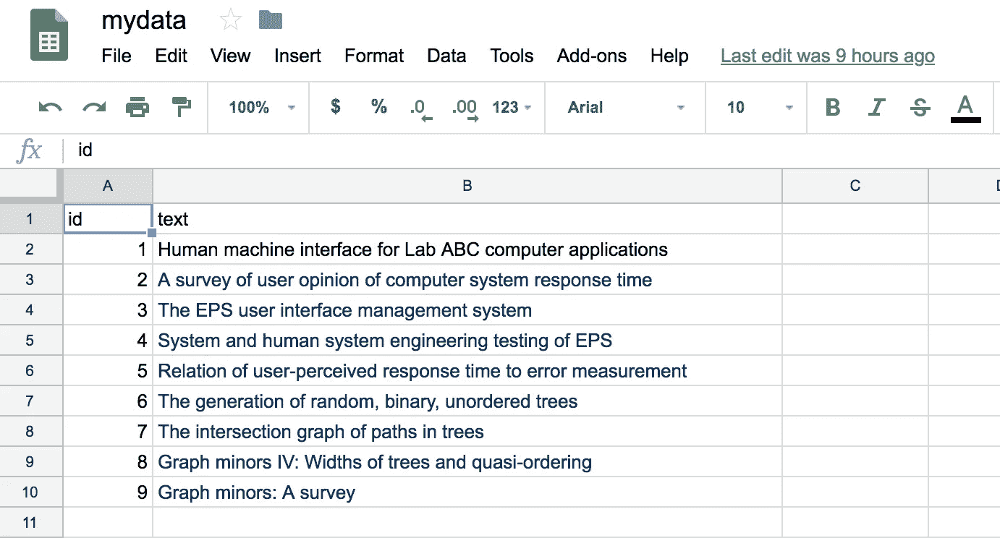
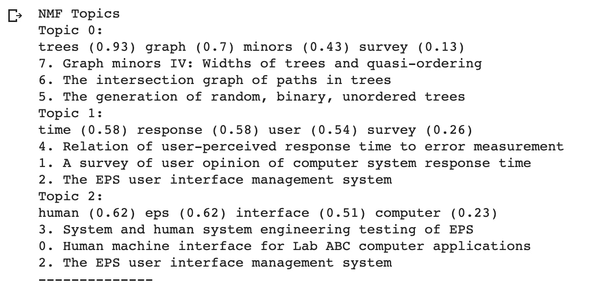

# 使用 Google Colab 为每个人进行主题建模

> 原文：<https://towardsdatascience.com/topic-modeling-for-everybody-with-google-colab-2f5cdc99a647?source=collection_archive---------5----------------------->

Image from [Pixabay](https://pixabay.com/en/geology-red-sandstone-2445205/)

**注意:Google Colab 笔记本已经针对 Python 3 进行了更新，包括 pyLDAvis 可视化，并改进了主题中热门单词和热门文档的原始显示。**

您现在可以在文本中查找主题，而无需安装任何库或编写一行 python 代码。这一切都是由 Google Colab 实现的，这是一款定制的协作 Jupyter 笔记本，可以托管在 Google Drive 上。包含两个主题建模算法的奇妙的 Scikit-Learn 库默认安装在 Google Colab 上，这使得在文本中查找主题变得非常容易。

这篇博文和附带的 Google Colab 笔记本的目的是让主题建模能够被更广泛的受众所接受。诸如非负矩阵分解(NMF)和潜在狄利克雷分配(LDA)的主题建模算法在文档集合中寻找主要主题或主题。文档集合可以是短文档，如 tweets 或自由文本调查回复，也可以是长文档，如博客帖子或新闻文章。NMF 和 LDA 算法有两个有利于文本聚类的特点，这是其他算法如 k-means 所没有的。这两种算法都将文档集合作为输入，并返回主题中的主要单词和属于主题的文档——这一特性使得输出可解释。NMF 和 LDA 还支持主题之间的重叠(即文档可以属于多个主题)。我特别希望看到研究人员和定性内容分析师开始使用主题建模算法，现在他们可以了，这要归功于一个简单的 Google Colab 笔记本，它可以处理来自 Google Sheet 的数据。只需遵循以下简单步骤:

*   去 [https://colab。研究。Google . com/Github/aneesha/Google colab _ topic modeling/blob/master/Colab _ topic modeling . ipynb](https://colab.​research.​google.com/github/aneesha/googlecolab_topicmodeling/blob/master/colab_topicmodeling.ipynb)
    以上网址将从 Github repo 中打开 Colab 笔记本。
*   Colab 笔记本将会打开。只有将 Colab 笔记本保存到 Google Drive 文件夹后，您才能使用它。点击文件菜单，选择“保存一份拷贝到驱动器…”。
*   接下来，您需要在您的驱动器文件系统上找到 Colab 笔记本。点击文件菜单，选择“在驱动器上定位”。
*   该文件夹通常被称为“Colab 笔记本”。创建一个新的 Google 工作表并导入文本数据。文本数据需要两列，即 id 和 text。

Figure 1: The required columns in the Google Sheet

*   返回到 Colab 笔记本，输入 Google 工作表的名称。您可以更改代码，但会提供一个表单字段。单击位于单元格左侧的播放按钮，运行第一个笔记本单元格。您需要通过点击链接来授权访问您的 Google Drive。在授权过程结束时，您需要输入一个验证码。

Figure 2: Authorizing access to a Google Sheet

*   运行“从 Google Sheet 加载和预览数据”笔记本单元格。将显示数据集的前几行。
*   使用提供的表单字段设置需要生成的主题数、热门单词数和必须显示的热门文档数。

Figure 3: Specifying the NMF and LDA algorithm parameters

*   运行 NMF 或 LDA 细胞。将显示主题模型的输出。

Figure 4: Topics discovered by the NMF topic modeling algorithm

*   笔记本现在是你的了。你可以把它移到一个新的文件夹，并添加新的谷歌工作表进行分析。
*   就这样——没有更多的步骤了。

Google Colab 笔记本的发布能够对来自 Google Sheet 的文本数据进行主题建模，这消除了开始主题建模的所有技术障碍。NMF 和 LDA 主题建模算法可以应用于一系列个人和商业文档集合。让你开始的一些例子包括自由文本调查回复、客户支持电话记录、博客帖子和评论、匹配标签的推文、你的个人推文或脸书帖子、github 提交、招聘广告和技术文章。如果你想出一种新的方法来使用 Google Colab 笔记本应用主题建模，请在评论区发布你的例子。