# Tensorflow 中的地形/正则化特征学习[TF 中的手动反向投影]

> 原文：<https://towardsdatascience.com/topographic-regularized-feature-learning-in-tensorflow-manual-backprop-in-tf-f50507e69472?source=collection_archive---------12----------------------->

Photo by [Nick Dunlap](https://unsplash.com/photos/EFeiyoDCFa8?utm_source=unsplash&utm_medium=referral&utm_content=creditCopyText) on [Unsplash](https://unsplash.com/search/photos/topography?utm_source=unsplash&utm_medium=referral&utm_content=creditCopyText)

今天我想比较不同的正则化方法得到的不同结果，看看每种方法是如何影响梯度的。

*情况 a) 0 范数自动编码器(p = 0)无正则化
情况 b) 0.5 范数自动编码器(p = 0.5 )
情况 c) 1 范数自动编码器(p = 1 )
情况 d)软化 1 范数自动编码器(p = 1.5 )
情况 e) 2 范数自动编码器(p = 2)
情况 f)软化 2 范数自动编码器(p = 2.5 )
情况 g) 3 个范数自动编码器(p = 3 )
情况 h) 4 个范数自动编码器(p = 4 )
情况 I)稀疏拓扑自动编码器(KL 发散方法)*

> **请注意，这篇帖子是为了我未来的自己回顾这些话题以及纯粹的好奇。**

**审查向量规范**

Video from this [website](http://Ritvik Kharkar)

如果任何人需要一个向量范数的基本审查，请观看上面的视频。

**P 范数正则化/软化正则化**

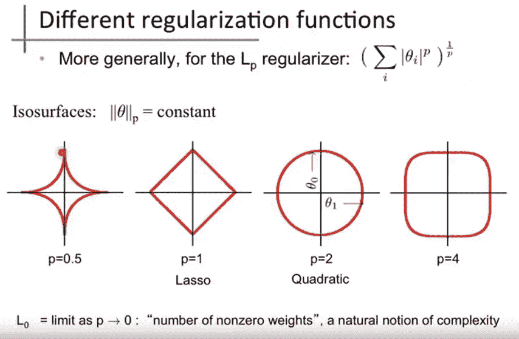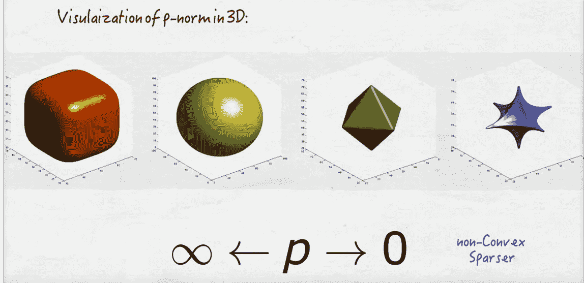

Image from this [website](https://www.youtube.com/watch?v=sO4ZirJh9ds&t=334s) [website](https://www.youtube.com/watch?v=jEVh0uheCPk&t=123s)

L1 和 L2 正则化通常用于防止过拟合，但是从 P 范数正则化的定义中，我们实际上可以选择许多不同的 P 值正则化，今天让我们看看每个正则化项给出什么不同的结果。最后我会链接真正帮助我的视频。

Video from [Alexander Ihler](https://www.youtube.com/channel/UCUSRKgnYeos2aX_JnV9qa3w)

现在当我看到 L2 范数的定义时，我感到困惑，根据 P 范数的方程,“适当的”L2 范数是由…

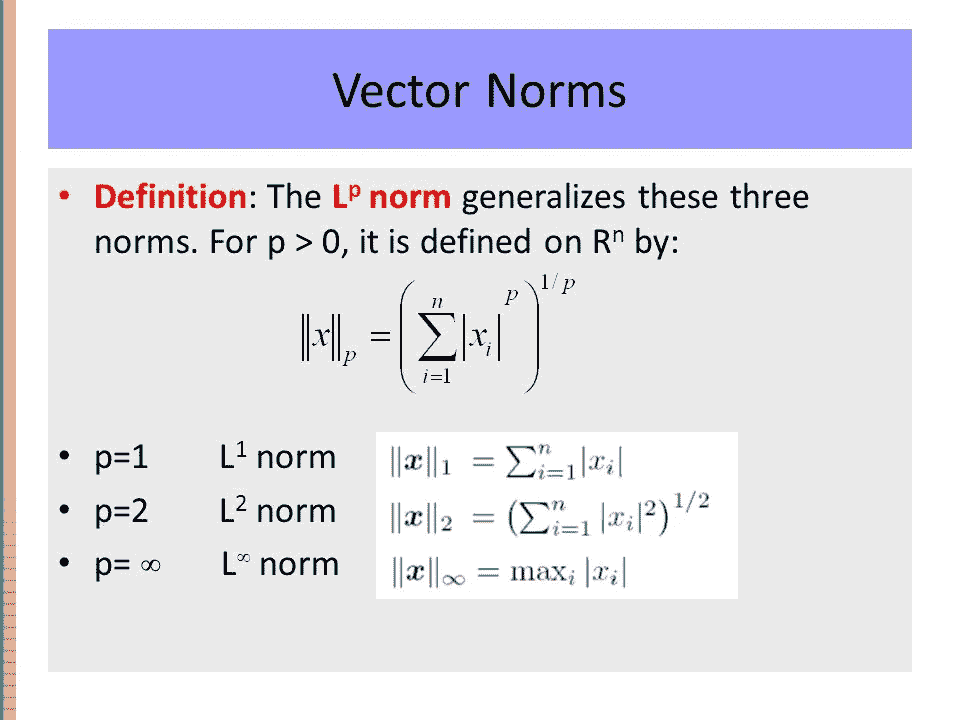

Image from this [website](https://slideplayer.com/slide/6006587/)

然而，当我们看到许多不同的机器学习教程时，我们会看到 l2 规范，如下所示。

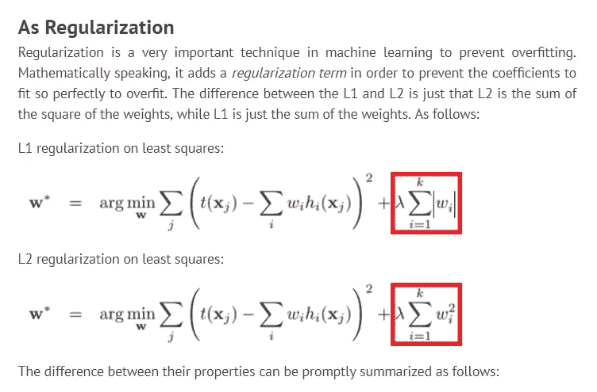

Image from this [website](http://www.chioka.in/differences-between-l1-and-l2-as-loss-function-and-regularization/)

这两项明显不同，也要注意导数也不同。此外，这种情况也发生在 L1 诺姆身上，我们不时会遇到 L1 诺姆'软化'版本。

Image from this [website](http://ufldl.stanford.edu/wiki/index.php/Sparse_Coding:_Autoencoder_Interpretation)

上面的图片来自吴恩达的无监督学习课程。我们之所以用那个方程，是因为当|x|为零时，没有导数。然而，我们也可以简单地忽略这个事实，使用原始的绝对正则化，让导数只是权重的符号。(如下图。)

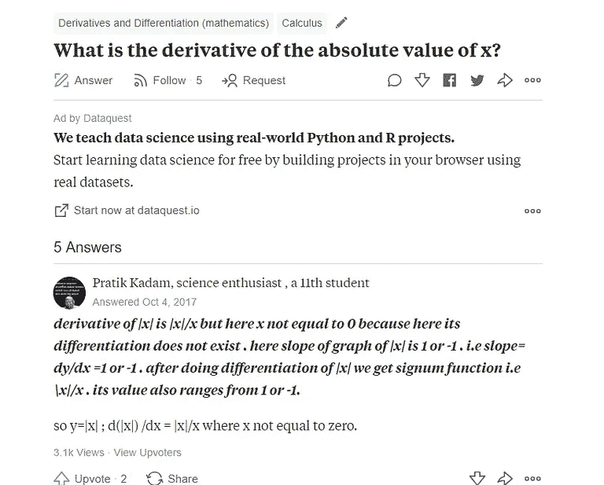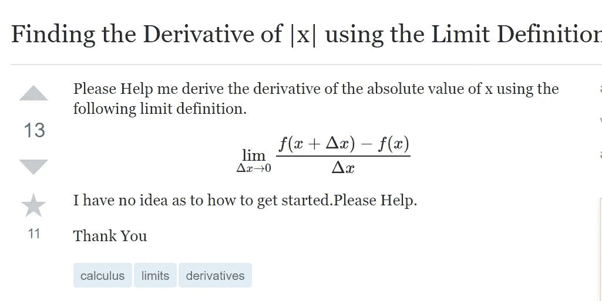

Image from this [website](https://www.quora.com/What-is-the-derivative-of-the-absolute-value-of-x) and this [website](https://math.stackexchange.com/questions/83861/finding-the-derivative-of-x-using-the-limit-definition)

**不同 P 范数正则化函数的导数**

在实现之前，让我们练习一下数学，手动计算不同 p 值的导数。

**KL 散度的导数**

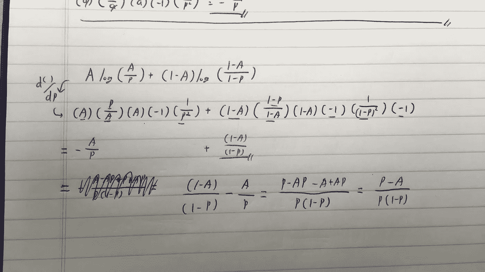

image from this [website](http://www.wolframalpha.com/input/?i=y*log(y%2Fx)+%2B+(1-y)+*+log(+(1-y)%2F(1-x)))

并且因为我们必须通过最小化 KL 散度来实现稀疏编码，所以让我们也导出关于 KL 散度损失函数的导数。如上所述，我们的数学检查。

**地形稀疏编码**

Image from this [website](http://ufldl.stanford.edu/wiki/index.php/Sparse_Coding:_Autoencoder_Interpretation)

最后，我们有拓扑稀疏编码，我们的目标是学习具有一些有序方式的特征。(当输入类似的特征时，我们大脑中相互靠近的神经元就会激活。)

Image from this [website](http://ufldl.stanford.edu/wiki/index.php/Exercise:Sparse_Coding)

如上所述，当我们将拓扑结构的概念应用到我们的网络中时，我们可以看到，在学习过的过滤器中，彼此接近的过滤器倾向于激活相似的特征。如果有人需要衍生品方面的帮助，请点击[此处](http://ufldl.stanford.edu/wiki/index.php/Deriving_gradients_using_the_backpropagation_idea)。

***情况 a) 0 范数自动编码器(p = 0)无正则化***

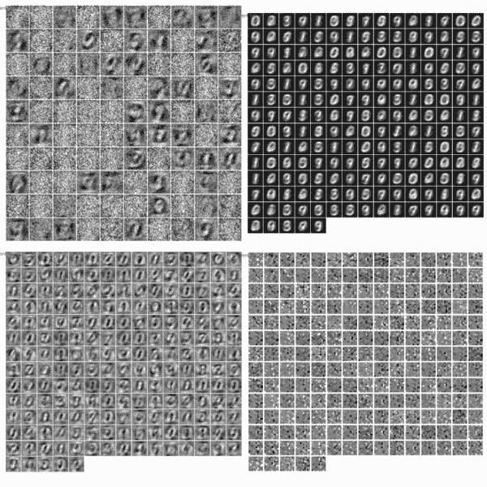

**左上** →编码层权重的收敛过程
**右上** →重构图像
**左下** →相对于输入图像的梯度
**右下** →相对于编码层的梯度

在编码部分没有任何约束的情况下，我们可以清楚地看到，学习到的权重没有任何特定的顺序。好的一面是重建的图像非常清晰，然而，这是由于过度拟合。并且当我们观察梯度如何相对于输入变化时，我们可以看到大部分梯度变成灰色图像，不管图像中的数字是什么。下图显示了最终的结果。

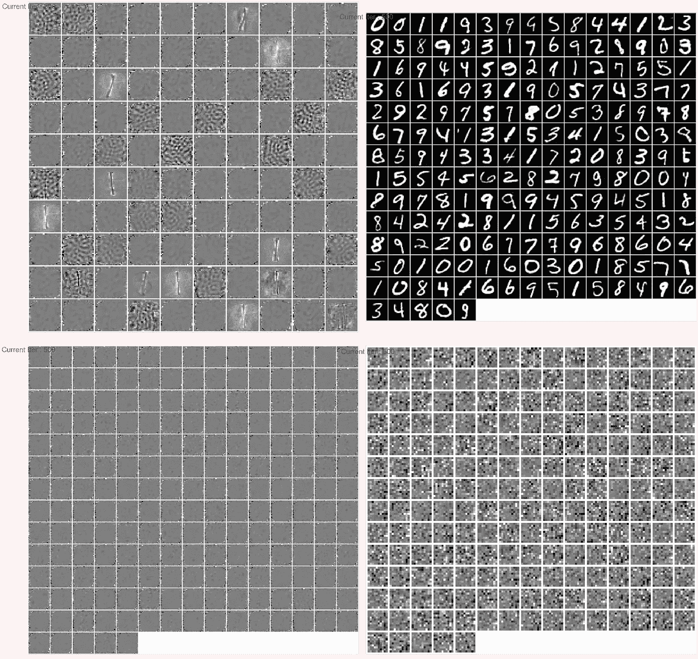

***情况 b) 0.5 范数自动编码器(p = 0.5 )***

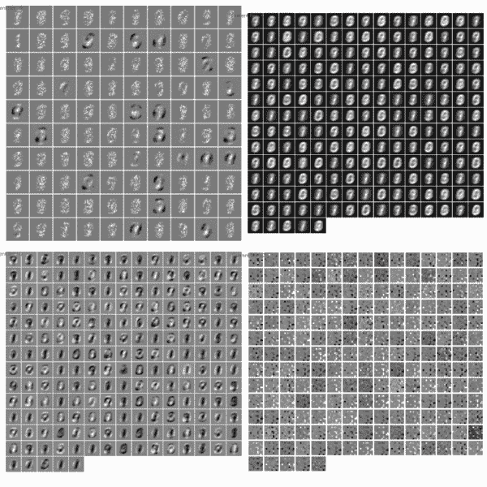

**左上** →编码层权重的收敛过程
**右上** →重建图像
**左下** →相对于输入图像的梯度
**右下** →相对于编码层的梯度

当我们添加 0.5 范数正则化时，我们可以立即注意到差异，在左上角的图像中，黑色方块立即出现。这表明学习到的权重为零，并且学习到的权重中存在大量漏洞。这是意料之中的，因为 p 值为 0.5 会促进稀疏性。此外，我们现在注意到，相对于输入的梯度开始显示类似边缘的数字符号。

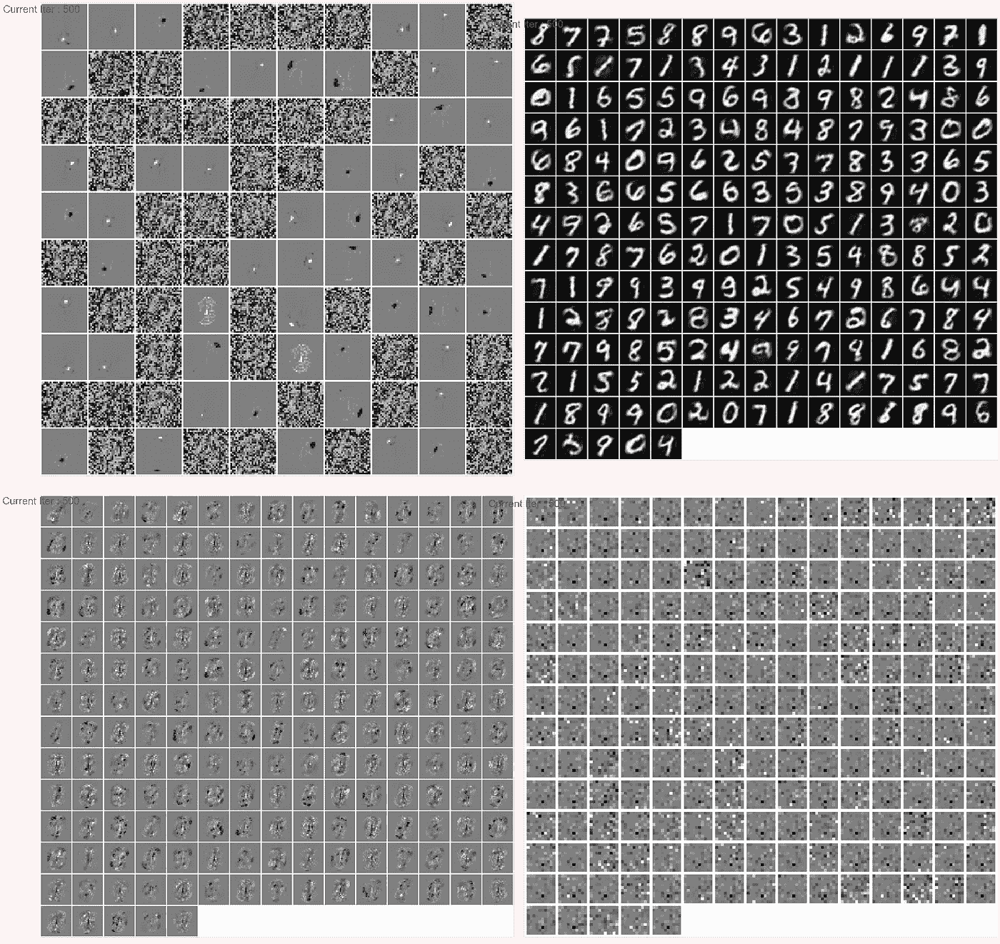

***案例 c) 1 范数自动编码器(p = 1 )***

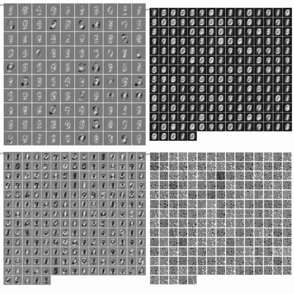

**左上** →编码层权重的收敛过程
**右上** →重构图像
**左下** →相对于输入图像的梯度
**右下** →相对于编码层的梯度

当 P 值设置为 1(也称为曼哈顿范数)时，当 P 值设置为 0.5 时，网络会生成类似的结果。这也是预料中的，然而如下所示，当与该值被设置为 0.5 的情况相比时，在最终时期学习的权重更亮。(向上滚动自己对比！)

***案例 d)软化 1 定额自动编码器(p = 1.5 )***

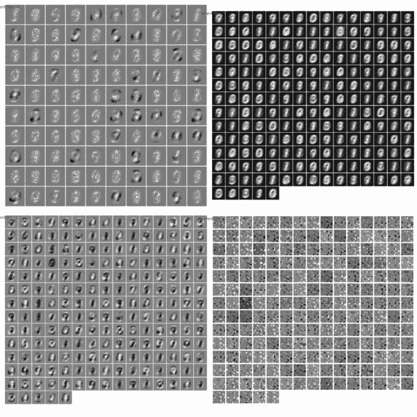

**左上** →编码层权重的收敛过程
**右上** →重构图像
**左下** →相对于输入图像的梯度
**右下** →相对于编码层的梯度

现在事情变得有趣了，吴恩达使用了这个不包含绝对函数的 L1 范数的软化版本。当我们观察学习到的权重时，我们可以直接看到结果的差异，现在我们可以观察到学习到的权重中间的数字。

***情况 e) 2 个标准自动编码器(p = 2)***

**左上** →编码层权重的收敛过程
**右上** →重建图像
**左下** →相对于输入图像的梯度
**右下** →相对于编码层的梯度

当我们使用标准的 L2 范数(不是软化版本)时，我们可以看到学习到的权重看起来与我们使用 1 范数的软化版本时的情况非常相似。然而，一个区别是梯度，当我们仔细观察输入的梯度时，我们可以观察到边缘变得更加清晰。

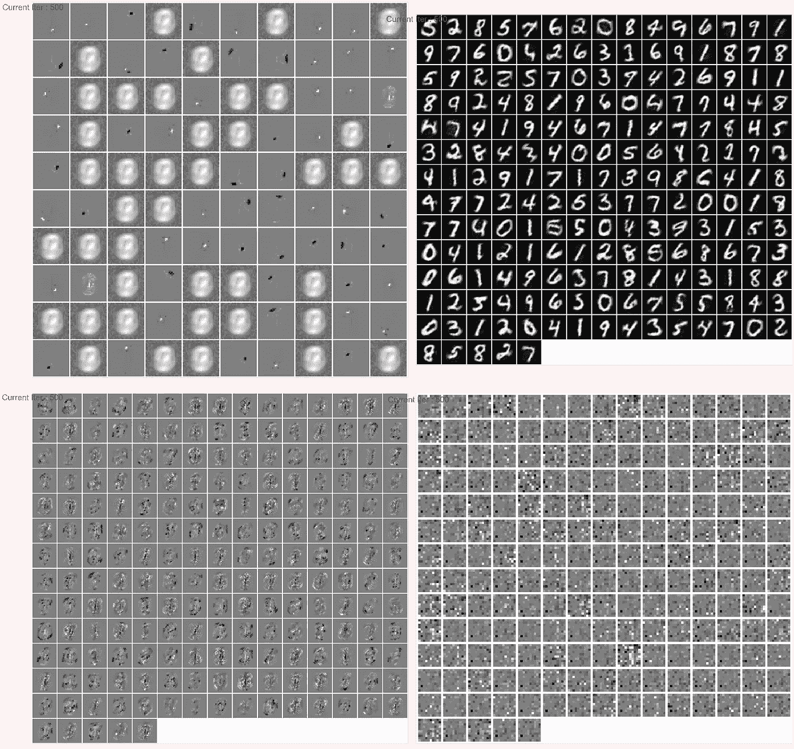

***情况 f)软化 2 个标准自动编码器(p = 2.5 )***

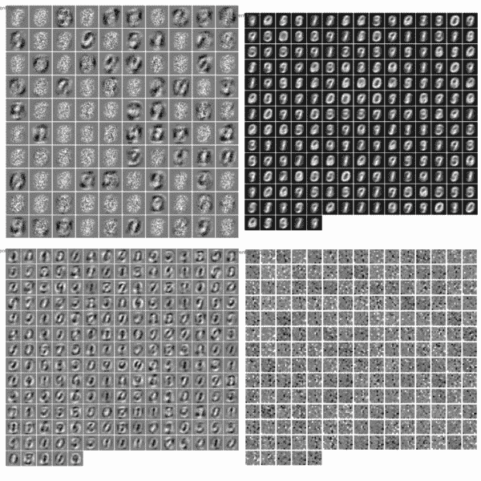

**左上** →编码层权重的收敛过程
**右上** →重构图像
**左下** →相对于输入图像的梯度
**右下** →相对于编码层的梯度

然而，当我们使用 L2 常模的软化版本时，我们得到(在我看来)更好的结果。其中所学习的重量代表每个手指的不同手笔画。不仅梯度更清晰，我们还可以观察到不同梯度之间更鲜明的对比。(相对于编码层的梯度)(当我们考虑它时，绝对函数在零处的导数是未定义的，并且我们已经软化了它，所以导数不是+就是-。然而，这似乎无助于学习更好的表达。此外，我们将权重初始化为具有零均值的高斯分布，这表明相对于原始权重的大部分导数必须被软化，并且这可以转化为噪声。)

***例 g) 3 定额自动编码器(p = 3 )***

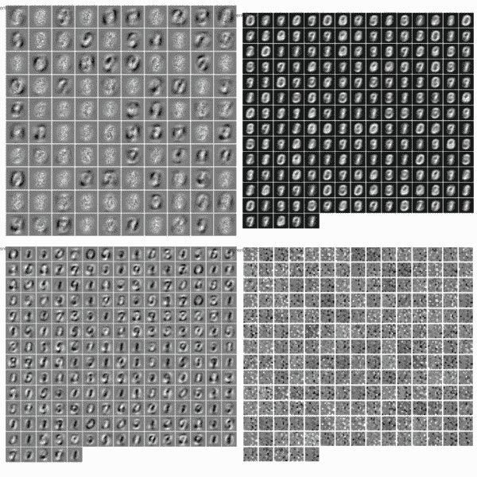

**左上** →编码层权重的收敛过程
**右上** →重构图像
**左下** →相对于输入图像的梯度
**右下** →相对于编码层的梯度

当我们接近更高的 p 值时，我们仍然使权重变小，但是我们放弃了稀疏性。并且每个权重之间的关系变得更加相互独立。上面看到的结果与我们使用 p 值 2 时非常相似，在我看来没有太大的不同。

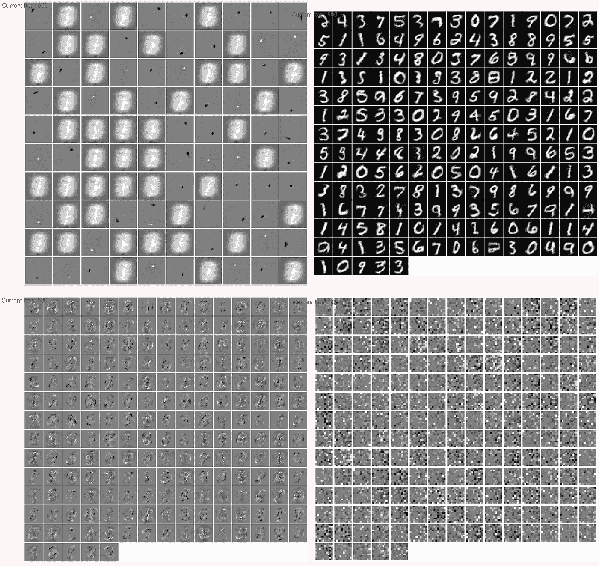

***情况 h) 4 个范数自动编码器(p = 4 )***

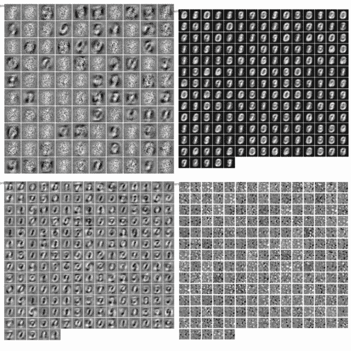

**左上** →编码层权重的收敛过程
**右上** →重构图像
**左下** →相对于输入图像的梯度
**右下** →相对于编码层的梯度

当我们将 p 值设置为 4(我们的最高值)时，我们可以立即注意到，与其他情况相比，学习到的权重看起来更加不同。学习的过滤器实际上类似于一个数字，但是具有相反的对比度。

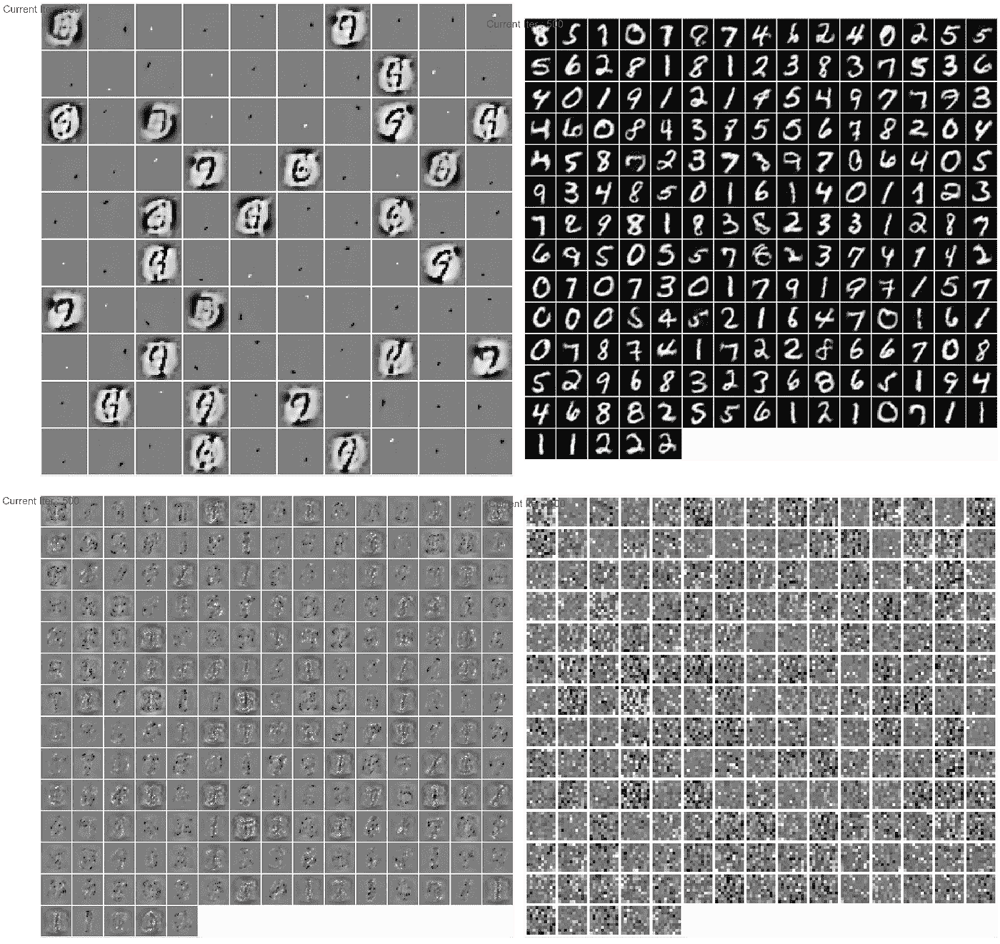

***情况 I)稀疏地形自动编码器(KL 发散方法)***

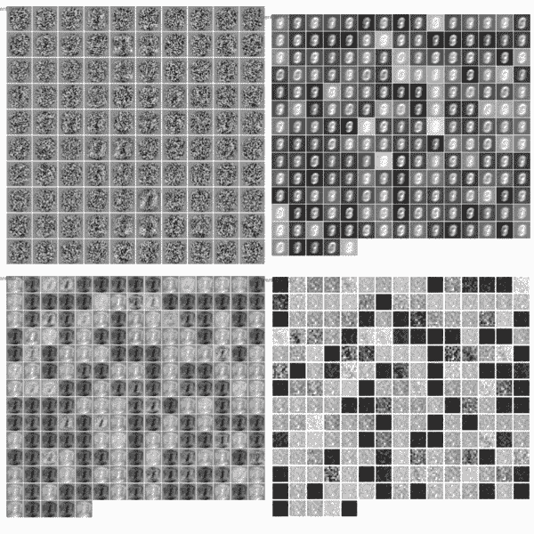

**左上** →编码层权重的收敛过程
**右上** →重建图像
**左下** →相对于输入图像的梯度
**右下** →相对于编码层的梯度

最后，当我们通过分组矩阵将编码权重分组在一起时，我们可以看到一个结构正在形成。不仅仅是学习到的权重，还有梯度。当我们观察渐变时，现在它不像一个椒盐噪声类型的图像，而是看起来有某种一般的结构。

从学习到的权重(见底部)我们可以看到，每个细胞响应某种类型的数字，如 0 或 1。例如，在左/右角的图像似乎喜欢边缘，而中心更喜欢圆形的图像。

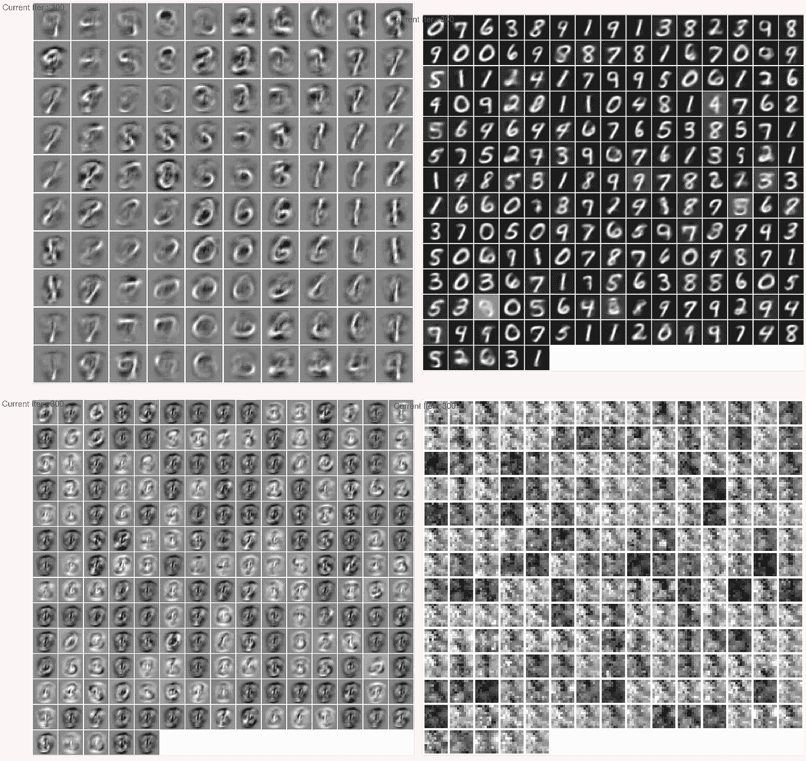

**交互代码**

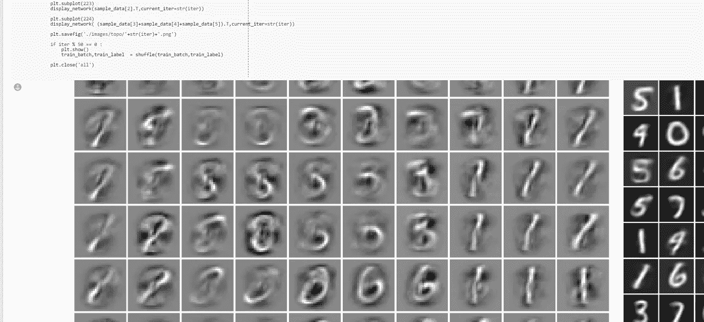

对于 Google Colab，你需要一个 Google 帐户来查看代码，而且你不能在 Google Colab 中运行只读脚本，所以在你的操场上做一个副本。最后，我永远不会请求允许访问你在 Google Drive 上的文件，仅供参考。编码快乐！

要获取这篇文章的代码，请[点击这里。](https://colab.research.google.com/drive/1xWTtq6msd7gWbOzjk9a3k05s5_6wT4Kt)

**最后的话**

如果有人想知道 L1 的一些优点和其他信息，请参见下面的[，这很有趣，因为我们可以组合许多不同的正则化项来优化给定的函数，这本身就是一个优化问题。](https://www.quora.com/What-is-the-advantage-of-the-L2-L1-norm-over-the-L1-L2-norm-for-feature-normalization)

Image from this [website](https://www.quora.com/What-is-the-advantage-of-the-L2-L1-norm-over-the-L1-L2-norm-for-feature-normalization)

此外，这篇博客[的文章也是一篇很好的阅读材料](http://www.chioka.in/differences-between-l1-and-l2-as-loss-function-and-regularization/),可以用来概括正则化术语。

如果发现任何错误，请发电子邮件到 jae.duk.seo@gmail.com 给我，如果你希望看到我所有写作的列表，请[在这里查看我的网站](https://jaedukseo.me/)。

同时，在我的推特[这里](https://twitter.com/JaeDukSeo)关注我，并访问[我的网站](https://jaedukseo.me/)，或我的 [Youtube 频道](https://www.youtube.com/c/JaeDukSeo)了解更多内容。我也实现了[广残网，请点击这里查看博文 pos](https://medium.com/@SeoJaeDuk/wide-residual-networks-with-interactive-code-5e190f8f25ec) t。

**参考**

1.  NumPy . fill _ diagonal—NumPy 1.15 版手册。(2018).Docs.scipy.org。检索于 2018 年 9 月 17 日，来自[https://docs . scipy . org/doc/numpy/reference/generated/numpy . fill _ diagonal . html](https://docs.scipy.org/doc/numpy/reference/generated/numpy.fill_diagonal.html)
2.  稀疏编码:自动编码器解释。(2018).Ufldl.stanford.edu。检索于 2018 年 9 月 17 日，来自[http://uf LDL . Stanford . edu/wiki/index . PHP/Sparse _ Coding:_ auto encoder _ Interpretation](http://ufldl.stanford.edu/wiki/index.php/Sparse_Coding:_Autoencoder_Interpretation)
3.  利用反向传播思想推导梯度。(2018).Ufldl.stanford.edu。检索于 2018 年 9 月 17 日，来自[http://ufldl . Stanford . edu/wiki/index . PHP/derivating _ gradients _ using _ the _ back propagation _ idea](http://ufldl.stanford.edu/wiki/index.php/Deriving_gradients_using_the_backpropagation_idea)
4.  Deep Learning 12_ 深度学习 UFLDL 教程：Sparse Coding_exercise（斯坦福大学深度学习教程） — 夜空中最帅的星 — 博客园. (2018). Cnblogs.com. Retrieved 17 September 2018, from [http://www.cnblogs.com/dmzhuo/p/4994947.html](http://www.cnblogs.com/dmzhuo/p/4994947.html)
5.  练习:稀疏编码— Ufldl。(2018).Ufldl.stanford.edu。检索于 2018 年 9 月 17 日，来自[http://ufldl . Stanford . edu/wiki/index . PHP/Exercise:Sparse _ Coding](http://ufldl.stanford.edu/wiki/index.php/Exercise:Sparse_Coding)
6.  Wolfram|Alpha:让世界知识可计算。(2018).Wolframalpha.com。检索于 2018 年 9 月 19 日，来自[http://www.wolframalpha.com/input/?I = y * log(y % 2Fx)+% 2B+(1-y)+*+log(+(1-y)% 2F(1-x))](http://www.wolframalpha.com/input/?i=y*log(y%2Fx)+%2B+(1-y)+*+log(+(1-y)%2F(1-x)))
7.  对数的导数—log(x)’。(2018).Rapidtables.com。检索于 2018 年 9 月 19 日，来自[https://www . rapid tables . com/math/algebra/logarity/logarity _ derivative . html](https://www.rapidtables.com/math/algebra/logarithm/Logarithm_Derivative.html)
8.  稀疏编码:自动编码器解释。(2018).Ufldl.stanford.edu。检索于 2018 年 9 月 19 日，来自[http://ufldl . Stanford . edu/wiki/index . PHP/Sparse _ Coding:_ auto encoder _ Interpretation](http://ufldl.stanford.edu/wiki/index.php/Sparse_Coding:_Autoencoder_Interpretation)
9.  稀疏编码:自动编码器解释。(2018).Ufldl.stanford.edu。检索于 2018 年 9 月 19 日，来自[http://ufldl . Stanford . edu/wiki/index . PHP/Sparse _ Coding:_ auto encoder _ Interpretation](http://ufldl.stanford.edu/wiki/index.php/Sparse_Coding:_Autoencoder_Interpretation)
10.  练习:稀疏编码— Ufldl。(2018).Ufldl.stanford.edu。检索于 2018 年 9 月 19 日，来自[http://ufldl . Stanford . edu/wiki/index . PHP/Exercise:Sparse _ Coding](http://ufldl.stanford.edu/wiki/index.php/Exercise:Sparse_Coding)
11.  利用反向传播思想推导梯度。(2018).Ufldl.stanford.edu。检索于 2018 年 9 月 19 日，来自[http://ufldl . Stanford . edu/wiki/index . PHP/derivating _ gradients _ using _ the _ back propagation _ idea](http://ufldl.stanford.edu/wiki/index.php/Deriving_gradients_using_the_backpropagation_idea)
12.  基于稀疏性的正则化。(2018).YouTube。检索于 2018 年 9 月 19 日，来自[https://www.youtube.com/watch?v=jEVh0uheCPk&t = 123s](https://www.youtube.com/watch?v=jEVh0uheCPk&t=123s)
13.  线性回归(6):正则化。(2018).YouTube。检索于 2018 年 9 月 19 日，来自[https://www.youtube.com/watch?v=sO4ZirJh9ds&t = 334s](https://www.youtube.com/watch?v=sO4ZirJh9ds&t=334s)
14.  科学计算矩阵范数、收敛和矩阵条件数。— ppt 下载。(2018).Slideplayer.com。检索于 2018 年 9 月 19 日，来自[https://slideplayer.com/slide/6006587/](https://slideplayer.com/slide/6006587/)
15.  定义，F. (2018)。用极限定义求|x|的导数。数学栈交换。检索于 2018 年 9 月 19 日，来自[https://math . stack exchange . com/questions/83861/finding-the-derivative-of-x-using-the-limit-definition](https://math.stackexchange.com/questions/83861/finding-the-derivative-of-x-using-the-limit-definition)
16.  Anon，(2018)。[在线]可从以下网址获取:[https://www . quora . com/What-is-the-derivative-of-the-absolute-value-of-x](https://www.quora.com/What-is-the-derivative-of-the-absolute-value-of-x)【2018 年 9 月 19 日获取】。
17.  Anon，(2018)。[在线]可从以下网址获得:[https://www . quora . com/What-is-the-advantage-of-the-L2-L1-L1-L2-诺姆-诺姆-特征标准化](https://www.quora.com/What-is-the-advantage-of-the-L2-L1-norm-over-the-L1-L2-norm-for-feature-normalization)【2018 年 9 月 19 日获取】。
18.  模特，W. (2018)。为什么稀疏模型的 L1 范数？交叉验证。检索于 2018 年 9 月 19 日，来自[https://stats . stack exchange . com/questions/45643/why-L1-norm-for-sparse-models](https://stats.stackexchange.com/questions/45643/why-l1-norm-for-sparse-models)
19.  L1 和 L2 作为损失函数和正则化的区别。(2018).chioka . in . 2018 年 9 月 19 日检索，来自[http://www . chioka . in/differences-between-L1-and-L2-as-loss-function-and-regulation/](http://www.chioka.in/differences-between-l1-and-l2-as-loss-function-and-regularization/)
20.  向量范数。(2018).YouTube。检索于 2018 年 9 月 19 日，来自[https://www.youtube.com/watch?annotation _ id = annotation _ 1494666085&feature = iv&src _ vid = 5 ASL 5 eq 2 x0a&v = 5 fn 2j 8 wyn fw](https://www.youtube.com/watch?annotation_id=annotation_1494666085&feature=iv&src_vid=5asL5Eq2x0A&v=5fN2J8wYnfw)