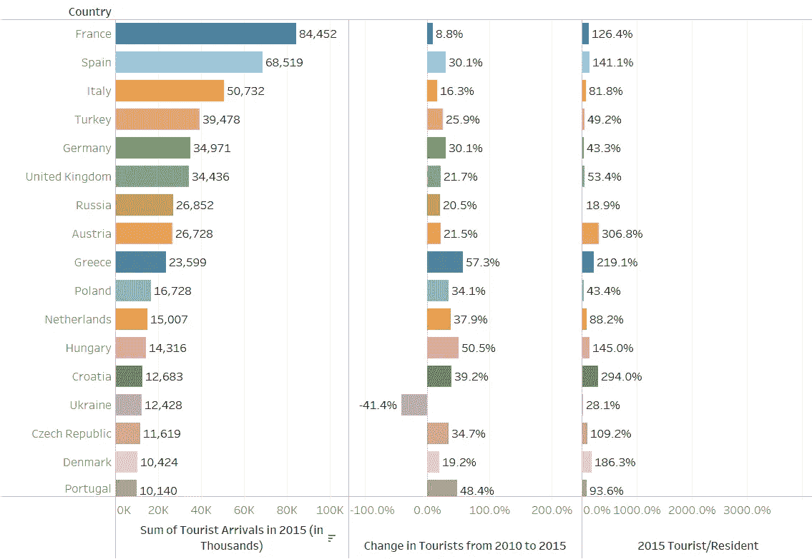
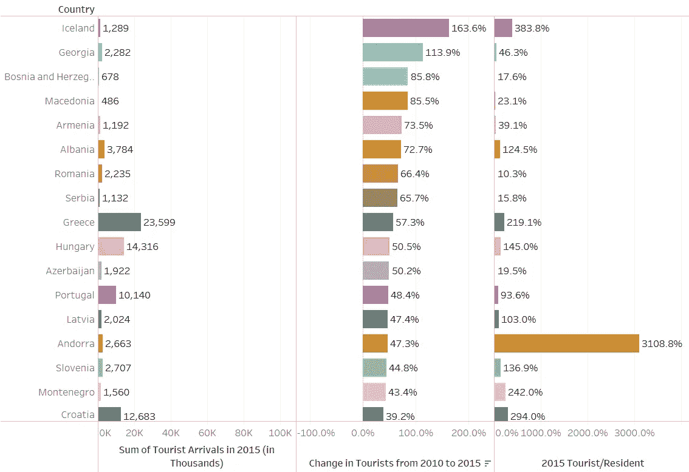
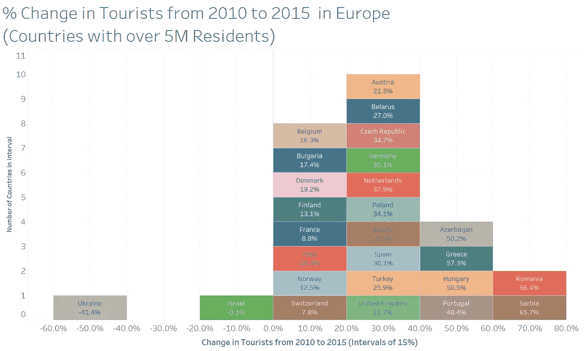

# 哪些欧洲国家游客泛滥？(以及其他数据支持的欧洲旅游趋势)

> 原文：<https://towardsdatascience.com/tourism-trends-in-europe-which-european-countries-are-overrun-with-tourists-f60c860bd23a?source=collection_archive---------5----------------------->

去年，当我第一次计划去意大利、西班牙和匈牙利等几个国家的欧洲度假时，我把研究重点放在寻找所有“必看”的旅游景点上。然而，当我回忆起那些旅行时，这些品牌景点没有一个在我的记忆列表中名列前茅。尽管明信片上的地方令人敬畏，但周围的环境几乎就像一个游乐园，街道两旁是游客陷阱餐厅，多语言菜单，街头企业家向像我这样的人出售各种仿制品。你在附近找不到当地人是有原因的。

事实证明，我度过的一些最美好的时光是在巴塞罗那传统的 Gràcia Barrio、奥斯陆肮脏但富有艺术气息的 grünerl kka 区以及罗马以美食为主的 Trastevere 街区漫步度过的。虽然所有这三个提到的地区都位于主要目的地的一英里范围内(因此仍然拥有游客的存在)，但这些景点提供了当地人如何生活的一瞥(更重要的是，ate)。

经过最近的两次旅行，我意识到下次我去欧洲时，我想去那些我能真正观察到文化的地方，一个没有受到游客太多影响的地方。

**欧洲国家旅游(按 2015 年游客总数排序)**

利用现有的最新[乡村居民人口](https://www.cia.gov/library/publications/the-world-factbook/rankorder/2119rank.html)和[旅游业](http://go.euromonitor.com/rs/805-KOK-719/images/2017%20Top%20100%20Cities%20Destinations%20Final%20Report.pdf)数据，我决定专注于三个主要指标来回答我的问题*:

-2015 年游客总数(千人)

-五年期间游客抵达的百分比变化

-2015 年期间游客人数除以该国居民的比率

*在编写这些报告时，瑞典或斯洛伐克没有完整的数据，因此这两个国家都没有包括在本报告中。

当然，当你按年度游客数量对这些国家进行排名时，排名第一并不令人惊讶。法国在 2015 年以 8450 万游客领先，其次是西班牙(6850 万)和意大利(5070 万)。但是当你观察 2010 年到 2015 年游客的变化时，你会发现这些顶级旅游国家的旅游增长率有很大的不同。

从 2010 年到 2015 年，法国的旅游人数仅增长了 8.8%，是整体旅游人数排名前 10 位的国家中最低的。另一方面，希腊以令人印象深刻的 57.3%的旅游业增长率位列前十。

这里还需要注意的是，不仅像法国这样的主要旅游强国每年都有大量的游客，而且游客人数已经超过了当地居民。在法国，2015 年的 8450 万游客超过当地人口 26.4%。在西班牙，情况更糟，游客数量比当地人多 41.1%(然而西班牙的旅游业增长率是法国的三倍多)。然而，没有一个国家胜过奥地利，它的游客与居民的比率是令人难以置信的 306.8%。

**欧洲国家的旅游业(按 2010 年至 2015 年游客到达的变化百分比排序)**

说到时尚国家，世界上没有什么比冰岛更受欢迎的了。如果法国是星巴克，那么冰岛就是[菲尔茨咖啡](http://www.philzcoffee.com/)(有意冒犯，法国)。五年来，冰岛的游客数量增长了 163.6%。130 万国际游客超过当地冰岛人口 284%。

上面的地图描绘了每个国家，根据国际游客与实际居民的比例进行着色。

暗绿色表示游客比例较低的国家，而暗红色表示游客与居民比例较高的国家。较浅的阴影表示居民和游客的比例几乎相等。

去年我去过五个欧洲国家(意大利、瑞士、匈牙利、西班牙和挪威)，我不可能猜到意大利的游客与当地人的比例最低(81.8%)，我的意思是在 10 月下旬那里挤满了游客。说实话，我会赌匈牙利(145%)，但最近的想法，我意识到，虽然我注意到在布达佩斯完全没有美国游客，但毫无疑问，我记得有很多东欧游客。

在主要国家中，令我惊讶的是，尽管德国南部与卢森堡(187%)、法国(126%)、瑞士(114%)、奥地利(307%)和捷克共和国(109%)接壤，但它的游客/居民比率为 43%。

纵观所有人口超过 500 万的欧洲国家，几乎每个国家的游客数量都在大幅增长。当分析五年间游客数量的变化时(将这些国家按 20%的区间分组)，大多数国家的增长幅度在 20-40%之间，紧随其后的是增长相对较低的国家(旅游业增长< 20%)。

最后，结合这两个因素，这是一个象限图，只显示人口超过 500 万的国家。x 轴是游客与居民的比率，y 轴是 5 年来游客抵达的变化，圆圈的大小表示各个国家居民人口的规模。

**游客与居民比率低&旅游业增长低**

这些地区处于最佳状态，增长速度并不快。

虽然俄罗斯、乌克兰和芬兰等国家因其地理位置或各种其他旅行限制而在一定程度上有意义，但我对英国出现在这份名单中感到意外。

**高游客与居民比率&旅游业高增长**

这些地区的游客已经饱和，而且这种趋势也没有减缓。远在右上角的是希腊。追赶希腊的是匈牙利、西班牙、捷克、荷兰。

尽管我对冒险进入匈牙利等(相对而言)较少人去的领域感到自豪，但它确实属于这一类，这意味着我不是我想象中的那么时髦的旅行者。

**低游客与居民比率&旅游业高增长**

这些国家仍然很少被国际游客光顾，但这些美景的时间正在流逝。网格的最左边是罗马尼亚，游客/居民比率只有 10%，但它也越来越受欢迎。毫无疑问，更实惠的价格和旅游兴趣的扩大促成了东欧国家在短短五年内超过 65%的繁荣。这一部分还包括德国、土耳其和波兰。

高游客/居民比率&旅游业低增长

虽然这些国家可能已经到了无法回头的地步，但令人欣慰的是，它们的增长速度并不快。像法国和意大利这样的旅游大腕在这个名单上占据了重要位置，但是像挪威、瑞士和奥地利这样的小国也榜上有名。

*感谢您阅读我最新的数据帖子。作为一名产品营销和数据分析专业人士，我对数据支持的讲故事充满热情。这些数据新闻帖子是我将真实数据与我个人的不同兴趣整合起来的方式，这些兴趣包括从旅行和娱乐到经济和社会问题的任何事情。如果您有任何评论、故事想法或预期的数据项目，请随时发送电子邮件至我的 dwpwriting <邮箱至> gmail < dot > com 或通过*[*LinkedIn*](https://www.linkedin.com/in/davidwpeterson/)*联系我。*