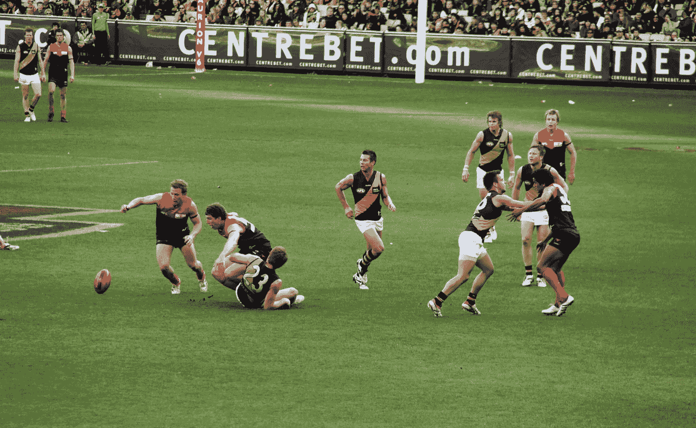
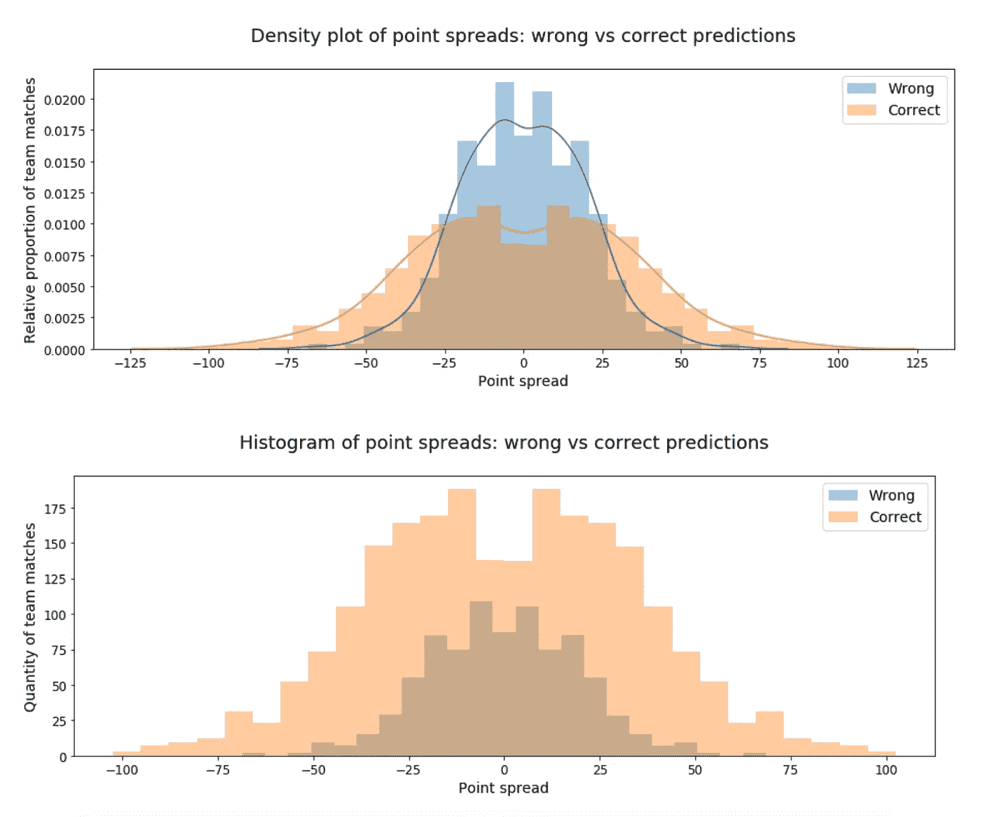
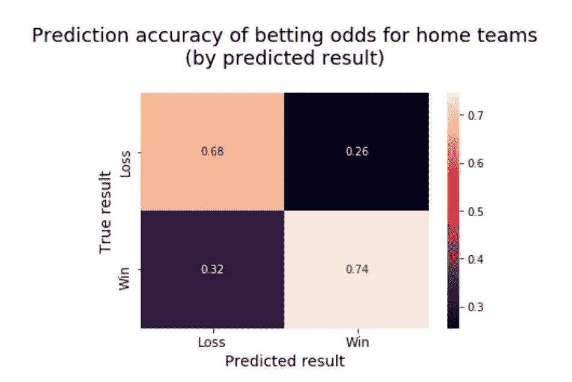
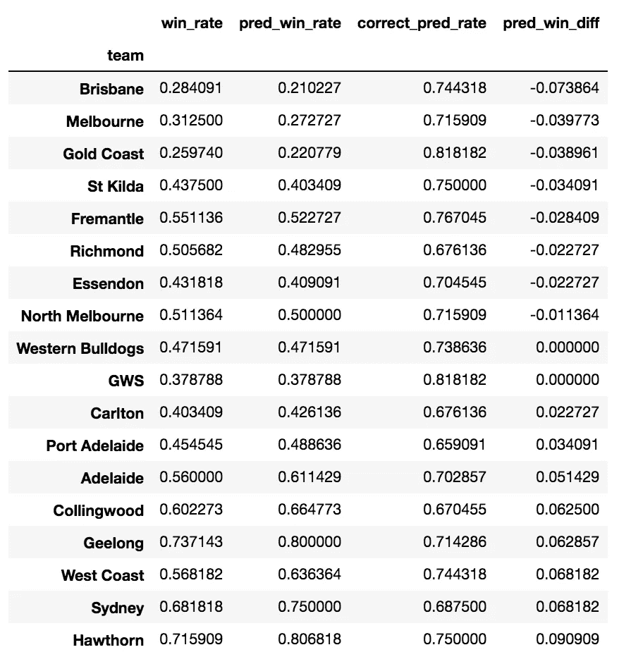
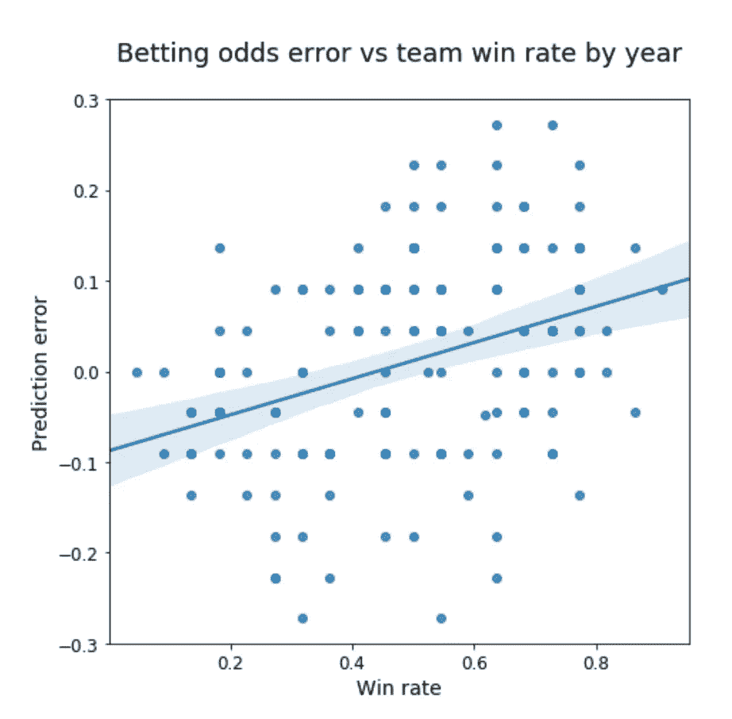
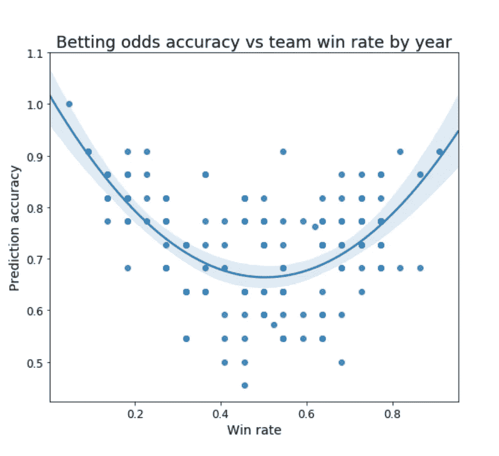

# 走向一个更好的无足轻重的小费模式:一个基本的启发式分析

> 原文：<https://towardsdatascience.com/toward-a-better-footy-tipping-model-an-analysis-of-basic-heuristics-80de4235e768?source=collection_archive---------5----------------------->

这是我尝试开发一个关于无足轻重的小费的数据模型的系列文章的第一部分。你可以在这里阅读前奏**和第二部* [*在这里*](https://medium.com/@craigjfranklin/toward-a-better-footy-tipping-model-the-folly-of-memory-9351670abe19) *。这篇文章使用的数据和代码在*[*Footy Tipper*](https://github.com/cfranklin11/footy-tipper)*GitHub repo 中(在实验文件夹中)。所有数据来自 2010 年至 2017 年的 AFL 比赛。**

**

*Photo by [Charles Van den Broek](https://www.flickr.com/photos/charlot17/) on [Flickr](https://www.flickr.com/)*

*足球小费是澳大利亚人每周挑选澳大利亚规则足球(AFL)球队赢得比赛的流行消遣(就像填写三月疯狂括号，只不过每次都是一轮，当球队得分时，裁判会把手指变成手枪)。每个给小费的人都可以因正确选择赢家而得到一分，如果是平局，也可以得到一分。在赛季结束时，获胜者是得分最多的一方，预测每轮第一场比赛的差距作为决胜局。*

*有各种各样的试探法可以用来挑选本周的赢家和输家。在我与小费者和足球爱好者的交谈中，我发现普通参与者倾向于接受数据，例如哪个队更受青睐，哪个队是主队，每个队最近的表现如何，以及他们预计其他竞争对手会给谁小费，然后凭直觉处理这些信息，以这种方式得出他们对本轮的预测。*

*下面，我将介绍一些预测比赛结果的基本试探法，比较它们各自的准确性，然后对 AFL 比赛结果的赔率中包含的偏差进行更深入的分析。*

# ***基本启发式算法的准确性比较***

*下面是一个简单而合理的给 AFL 比赛小费规则的简要调查。这当然不是一个全面的列表，但对于一个并不真正关注球队目前比赛情况的人来说，每个启发都代表了一种在使用单个容易找到的数据点时实现高于 50%的准确率的方法。*

## *启发 1:永远给主队小费*

*尽管很少有人会选择主队赢得每场比赛，但一个普遍公认的事实是，主场比赛比客场比赛更好，以至于季后赛系列赛都是围绕这一前提的接受而构建的，在线小费比赛通过默认客队来惩罚不付小费的人。*

*总是给主队小费时的准确率:57.29%*

## *启发 2:总是给排名较高的团队小费*

*这虽然简单，但可能更接近于一个普通球迷可能给出的提示:参数是快速的两个词谷歌搜索(你甚至不必去另一个网站)，并且人们总是选择从赛季开始到当前一轮的历史上更成功的球队。当然，令人沮丧的事情确实会发生，1 号和 15 号之间的差别比 7 号和 8 号之间的差别要大得多。*

*总是给排名较高的团队小费时的准确率:68.00%*

## *启发 3:总是提示胜算最大的人*

*从最终用户的角度来看，这是一种启发式方法，几乎与提示排名更高的团队一样简单，但它的行为几乎像一个复杂的黑盒集合模型:据我们所知，局外人可以获得与 oddsmakers 相同的数据，我们知道他们正在优化收入，但我们不知道什么过程——什么秘方——产生了人们押注的线赔率和点差。也许一群戴着软呢帽、穿着廉价西装、棱角分明的老人抽着雪茄，争论着悉尼究竟会以多少分击败圣基尔达；也许是一个分布式深度学习模型，日夜在 GPU 上运行，每 5 分钟计算一次赔率到 100 个有效数字；也许一个预言家会观察天空，看鸟儿在某一天是如何飞行的。在任何情况下，博彩赔率肯定代表了比前面描述的任何试探法多得多的数据的集合。*

*总是预测胜算最大的概率时的准确率:72.32%*

## *试探法概述*

*如上面的平均准确率所示，启发式算法的可靠性随着其来源所考虑的数据输入数量的增加而增加。*

*   *计算主队只需要一个数据:哪个队在主场。*
*   *计算排名更高的球队需要更多的东西:两支球队在本赛季的累计胜场、平局、得分和对手的得分。*
*   *最后，在计算每场比赛的赔率时，可能会考虑上述所有因素，加上每支球队最近的胜率、他们的比赛统计数据、他们球员的个人统计数据、是否有球员受伤、每场比赛的正面交锋历史等等。*

*由于超过 4%的几率是最准确的启发式方法，我将使用它作为基准，来衡量我稍后将开发的机器学习模型的性能。因此，我将把进一步分析的重点放在检查投注赔率中的偏差上，目标是使用这些信息来帮助我的模型确定何时反驳赔率，希望最终实现更高的准确性。*

# *博彩赔率分析*

*既然我们知道仅基于投注赔率的小费提供了最高的准确性，让我们探索在什么条件下投注赔率更准确或更不准确。赔率是由博彩公司设置的反馈回路决定的，博彩者基于感知的低效率而冒险(“卡尔顿不可能输给墨尔本超过 50 分！”)，然后这些公司根据总体博彩行为调整赔率，以实现收入最大化。这意味着博彩赔率代表了足球迷对每支球队获胜概率的传统看法，因为赔率制造者和赌博公众之间的任何差异都会很快得到解决。所以，问题是是否有偏见倾向于形成对球队获胜概率的总体看法。在什么情况下更有可能出现心烦意乱？如果我们能够理解博彩赔率何时以及为什么会不太准确，我们就可以在训练模型时强调这些特征，希望它能够更准确地预测比赛结果。*

**

*当价差很小时(大约在-25 和 25 点之间)，下注赔率不成比例地错误。这并不奇怪。然而，在每个点差值上，下注赔率正确的次数多于错误的次数，这意味着即使是在势均力敌的比赛中，你最好还是下注最有希望的一方。*

## *主队的赔率*

*正如我们所展示的，在其他条件相同的情况下，主队的胜率要比客队略高一些(约 57%)。那么，奇怪的制造者是如何考虑到这一点的呢？他们对主队和客队有偏见吗？*

**

*赔率制定者在支持主队方面保持合理的平衡，选择他们获胜的概率为 57.68%，这与主队 57.29%的胜率一致。当选择主队时，赔率制造者的总体准确性提高了约 2%(当选择客场时，比平均水平差约 4%)，这表明他们更善于识别主场优势何时会成为决定性因素，何时不会。*

## *主队的赔率:跨州比赛*

*除了被广泛接受的跨体育和联赛的主场优势的影响，AFL 起源的一个怪癖给我们的分析增加了一条皱纹。澳大利亚规则足球始于该国南部和西部的地区运动，橄榄球联盟是北部和东部的主要接触运动。事实上，澳大利亚足球联盟曾经是维多利亚足球联盟，即使现在联盟的 18 支球队中有 10 支位于维多利亚州，他们的主场距离彼此只有一小时多一点的车程(根据谷歌地图，1 小时 1 分钟)。因此，根据我的各种对话，关于主场优势的传统观点是，对于来自同一地区的球队来说，主场优势很小，甚至可能不存在，而当球队来自不同的州时，主场优势就更加重要了。*

*考虑到这一点，我将研究跨州比赛，看看在这些情况下主场优势的影响是否更大。*

**

*主场球队赢得了 58.16%的跨州比赛，总体上比主场球队多赢了大约一分，这表明额外旅行距离的影响是真实的，尽管很小。然而，奇怪的是，61.51%的时候支持跨州主场球队，大约多三分，这意味着传统智慧认为跨州效应是实际的三倍。这是一个证据，赌赔率往往会放大关于影响球队获胜概率的因素的传统智慧。跨州比赛的投注赔率准确率为 72.65%，比整体准确率高出不到半个点。上面的标准化混淆矩阵也显示了我们在所有匹配中看到的预测误差之间的类似平衡。*

## *为排名较高的队伍下注*

*如前所述，比一支球队是否在主场比赛更强的获胜概率预测因素是他们是否比他们的对手更高(约 57%比约 68%)。因此，博彩公司通常青睐排名更高的球队是有道理的。问题是这种趋势有多强，在多大程度上得到了排名更高的球队的实际表现的支持。*

**

*尽管排名较高的球队只赢得了 68.00%的比赛，但赔率制造者选择他们赢得 82.45%的时间，这比我们在其他细分市场看到的不平衡要大得多。*

*通过观察混淆矩阵，我们发现，下注赔率错误地偏向于排名较高的球队的情况比偏向于排名较低的球队的情况更多。此外，就像挑选主队一样——更是如此——赔率制造者在识别更好的球队(根据他们的排名)何时会赢比差的球队何时会赢要好得多。*

*看起来真实的效果越强(主场优势，跨州比赛的主场优势，阶梯排名作为获胜的预测因素)，越不平衡的投注赔率变得有利于应该获胜的球队。即使这些偏差似乎不会显著影响投注赔率的整体准确性，但它们确实显示了一些赔率不太准确的情况，即当它们与传统观点相反时。这意味着，至少在势均力敌的比赛中，当赔率有利于排名较低和/或客场的球队时，偶尔给对手小费可能是值得的。*

## *按团队下注的赔率*

*在组织形式上，AFL 比欧洲足球联盟更接近于美国体育联盟:赛季之间有一个选秀，在这个选秀中，烂队可以优先得到顶级业余球员，有工资帽，自由球员等等。这些规则中的许多都是为了促进球队之间的平等，防止一组球队进入决赛，而另一组球队年复一年地在阶梯的底部徘徊。尽管如此，在与足球迷的交谈中，我感觉到一些球队获得了常年赢家或输家的名声，而这些看法很难改变。这有可能影响 oddsmakers 如何对待不同的球队，将预测建立在声誉而不是实际表现的基础上。*

**

*Team win rate vs predicted win rate, sorted by difference between the two (predicted win rate — win rate)*

*正如胜率和预测胜率之间的百分比差异所表示的那样，似乎确实有一种倾向，即过分青睐有获胜记录的球队(山楂，悉尼)，而不太看好有失败记录的球队(布里斯班，黄金海岸)。*

**

*团队胜率与赔率制定者倾向于过分偏爱好团队而不偏爱坏团队之间的关系是存在的，但并不明显。此外，支持好团队的偏见，像其他被检查的偏见一样，对下注赔率的准确性没有太大影响，因为高准确性和低准确性在具有不同预测误差值的团队中传播。然而，似乎确实有一种模式，好的和坏的团队与高投注准确性相关联，而平庸的团队与低准确性相关联。*

**

*它有些嘈杂，但上面的图表明，oddsmakers 在预测坏队和好队的结果方面有些更好，但对那些赢了 40%到 60%比赛的平庸球队来说就有麻烦了。当预测势均力敌的比赛结果时，这种趋势符合下注赔率不太准确的一般模式。虽然我能理解在尝试与那些能够在一周击败顶级球队，而在下一周输给垫底球队的中游球队比赛时的挫败感，但这并不是一个非常有趣的观察结果。在势均力敌的比赛中翻牌是很难的一部分，但你需要做好这些才能有机会赢得底池。*

# *最后*

*在这里探讨的简单试探法中，基于大量数据输入的试探法往往更好地预测 AFL 比赛结果，其中博彩赔率是最准确的预测因素。从不同的维度来分析比赛，显示出博彩公司在预测赢家和输家的能力上存在一些偏差和弱点。下注赔率往往会放大关于促成胜利的因素的传统智慧，有利于以高于胜率保证的比率从这些因素中受益的团队。然而，这些偏差对博彩赔率的表现几乎没有影响，较低的准确性通常集中在接近的比赛上，无论一个人的方法的质量和复杂程度如何，都很难预测。模型可以利用的一个轻微的弱点是，当下注赔率违背传统智慧，偏向排名较低和/或客场球队时，下注赔率的准确性会受到影响。*

*我没有提到的一个重要方面是时间。AFL 比赛数据可以按球队或主场对客场或高排名对低排名进行汇总，但它们代表的是按顺序发生的离散事件，过去的比赛不仅影响未来的比赛，而且球队在球场上的表现趋势会影响关于下周谁将获胜的传统观点，这反过来会影响下周比赛的投注赔率。然而，时间是一个很大的主题，所以我将在下一篇文章中深入探讨。*