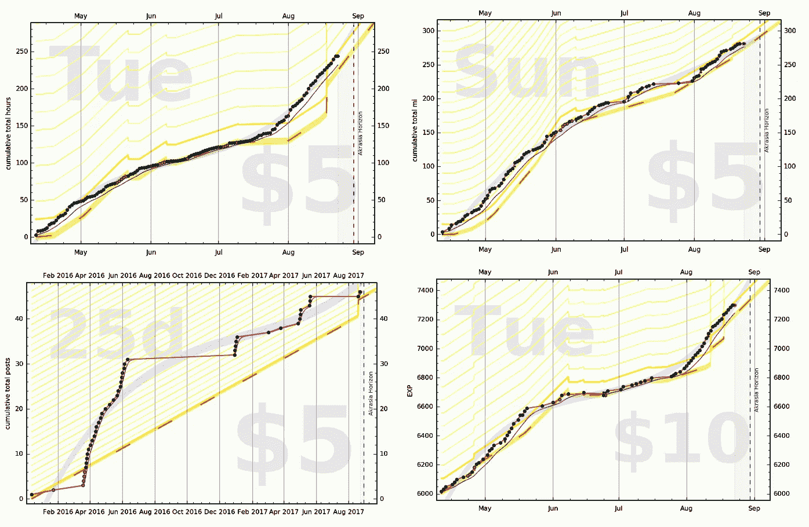

# 永久跟踪

> 原文：<https://towardsdatascience.com/tracking-for-good-db4809c9f456?source=collection_archive---------3----------------------->

**Top Left: Total Productive Hours | Top Right: Total Miles Travelled | Bottom Left: Total Blog Posts | Bottom Right: Total Duolingo EXP**

## 我虔诚地使用 Beeminder 一个月所学到的。

大约在过去的三十天左右，我一直在自己身上做实验。我试图努力追踪我生活的方方面面。可以说，这是我在吃自己的狗粮——过着一种在抽象层面上感觉良好的准动机生活。这是一个案例研究，这些是我的想法和结果。

*这是对我之前文章的更新:*

 [## 如何更好地创造和计划

### 使用互联网和蜜蜂

medium.com](https://medium.com/@brennanbrown/planning-better-e0d60edbe271) 

## 一.自我跟踪的初始问题

虽然我多年来一直是自我量化的粉丝，但我从未深入研究过。这有几个原因:

*预先警告:我并不精通数据科学，这些论文只是我通过观察哪些对我有用，哪些没用，艰难地发现的东西。*

1.  **错误的数据集**。需要深入了解你自己和你每天实际使用的工具，才能知道你应该跟踪什么指标。我没能在[*Todoist*](https://en.todoist.com/app?lang=en)*——*上追踪我的待办事项清单，只是因为我意识到我是那种只会把工作写在纸上的人。)
2.  **缺乏意义。类似地，追踪你追踪的东西必须有充分的理由——追踪必须能提供某种有益的帮助。一个强有力的、基于价值的目标会激励你坚持定期追踪。**
3.  **缺乏威慑/鼓励**。对于*没有*做你想追踪的事情，应该有一个固有的惩罚，对于做了这件事，应该有一个奖励*。*
4.  缺乏自动化。在大多数情况下，我的数据集是用 API 或 [*IFTTT*](https://ifttt.com/discover) 收集的，或者有非常简单快速的手动输入。数据收集不应该是一件苦差事。
5.  **数据不一致**。你所追踪的东西必须能够在一致的基础上产生数据。如果太频繁，你会太专注于跟踪本身。如果太不频繁，你最终会忘记跟踪。

所有这些都是我发现 [Beeminder](https://medium.com/u/e60c422184be?source=post_page-----db4809c9f456--------------------------------) 对自我量化如此有效的原因。在大多数情况下，应用程序会为您完成所有的跟踪工作。你所要做的就是*的工作。* Beeminder 是一种[的关键习惯](http://jamesclear.com/keystone-habits)，如果你能养成在 Beeminder 上签到的习惯，你就可以把它作为你想改变或开始的任何其他习惯的起点。

## 二。蜜蜂之道

1.  想清楚你想在生活中改变什么。所有的自我量化跟踪都应该从这里开始。坚定的目标就是一切。
    例 1。*我想多写点。*
    例二。我想更积极地锻炼身体。
2.  **找出定性目标有意义的量化。不要让含糊不清让你溜了——给你想要完成的事情一个确切的数字。
    例 1。*我想一年写 10 万字。*
    例二。我想一年跑/走 500 公里。**
3.  将你的定性目标转化为日常系统。上面的那些目标看起来令人畏惧，但是当你分解它们的时候，它们实际上更容易实现。
    例 1。 *10 万字/ 365 天≈每天 275 字*
    例 2。 *500 公里/ 365 天≈每天 1800 步*
4.  想办法跟踪这个新的每日系统。现在有很多针对特定指标的应用程序和工具，通常都有完善的 API，可以轻松传输和绘制数据。
    例 1。*利用*[*draft . in*](https://draftin.com)*同步 Beeminder 上的每日字数。*
    例二。*利用众多* [*健身应用*](http://www.active.com/fitness/articles/17-best-health-and-fitness-apps-of-2017) *和* [*可穿戴设备*](https://www.wareable.com/fitness-trackers/the-best-fitness-tracker) *在 Beeminder 上同步每日步数。*

## 三。我在追踪什么

[手动输入的一个很大的好处是，它可以作为我实现其他 Beeminder 目标的日常检查。](https://www.beeminder.com/brennanbrown/gratitude)

[**写作**](https://www.beeminder.com/brennanbrown/writing) :另一个手动输入，这是我每天写的字数，每个数据点具体说明我主要写的是什么。通常要么只是日常日志写作或博客帖子。

[**博客文章**](https://www.beeminder.com/brennanbrown/blogging) :跟踪我上传到 Medium 的文章数量。与其他活动不同，我追溯性地添加了我在 Medium 上的所有旧帖子，这些数据让我明白我真的需要开始发布更多。

[**生产性**](https://www.beeminder.com/brennanbrown/productivity) **/** [**非生产性**](https://www.beeminder.com/brennanbrown/distraction) **时间:**这两者都通过时间记录器 RescueTime 进行跟踪。我试图每天完成一定数量的有成效的工作，无论是写作、编程还是参考/学习。我也试着限制我浪费在无脑和无结果的活动上的时间。

**:记录我旅行的英里数，无论是走路、跑步还是骑自行车。我用 *Runkeeper* 追踪这个，没有花哨的可穿戴。它不计算我所有的旅行，只有当我特别记录一项活动时，它还会给我一张我的路线的 GPS 地图，这样我就可以看到那天我去了哪里。**

**[**编程**](https://www.beeminder.com/brennanbrown/github) :跟踪我推送到 GitHub 的提交数量(以及其他贡献，如报告的问题和拉请求)。我承认这不是最好的跟踪方式，因为代码在达到适合部署的程度之前不应该提交，但我目前正在开发 [*熨斗学校*](https://flatironschool.com/) 的课程，它会自动将我的作业实验室推送到我的 GitHub 帐户，这很酷。**

**社交媒体( [**)推特**](https://www.beeminder.com/brennanbrown/tweets)**/**[**insta gram**](https://www.beeminder.com/brennanbrown/photos)**)**:这可能对一些人来说是违反直觉的，但我很少使用任何社交媒体。通过跟踪我上传的照片和我写的推文，我被鼓励去寻找每天发生的有趣的事情，并与我的朋友和家人分享。**

**[**语言学习**](https://www.beeminder.com/brennanbrown/french) :追踪我在 Duolingo 上赚取的经验值。在过去的几年里，我一直在努力自学法语，虽然很难，但每天练习一点点对我记忆的帮助远远超过了偶尔的补习班。**

## **四。每日系统**

**以下是我在 Beeminder 上追踪的事情，展示我今天的样子。这实质上是将理论付诸实践，并落笔。事实是，除了编程，这些习惯根本不会占用我一天的太多时间，事实上，我因此有了更多的时间放松或尝试新事物。**

1.  **以写下我感激的事情开始新的一天，并检查我在当前目标上的进展。**
2.  **花十五或二十分钟在 Duolingo 和 TinyCards 上练习我的法语。**
3.  **在我家附近散步或骑自行车。外出时拍摄任何有趣的东西。**
4.  **花一两个小时编程。学习新的东西，很好的文档化，然后推送到 GitHub 上。**
5.  **不要浪费时间漫无目的地浏览脸书或 Reddit。节约使用屏幕时间，当我想休息的时候做一些我真正喜欢的事情。(看一部纪录片，玩一个电子游戏，等等。)**
6.  **花半个小时写我的日记或者写一篇博客。**
7.  **在一天结束时，写一篇关于一天中发生的任何有趣事情的推文。**

## **动词 （verb 的缩写）最后的想法**

*   **不要承诺任何不能让你兴奋的事情。对你的目标有自由意志的心理是必不可少的。如果你觉得你做的事情不仅仅是为了你自己，这将会是另一件苦差事。不要因为别人认为你应该而承诺什么。只有你。**
*   **对自己负责。我在我的脸书和推特个人资料里放了一个我的 Beeminder 账户的公开链接，这样任何人都可以看到我是否没有实现目标。我也写了这篇文章。利用公众压力作为动力和行善的工具。**
*   **任何事物都不会自己到位。自我的拼图有很多块，可能不会一下子全部拼起来。没有放之四海而皆准的方法，适合我的不一定适合你。T2 的普遍现象是良好价值观的重要性——如果你努力工作，幸运的 T4 法则最终会对你有利。**
*   **你的第一次尝试总是很糟糕。与上面类似，当你第一次尝试的时候，不要期望能搞定任何事情。我使用 Beeminder 快两年了，刚刚掌握了它的窍门。所有东西的初稿——不仅仅是写作——都将是垃圾。**
*   ****慢行。我没有尝试一下子开始追踪所有的事情。我从最小和最容易的(我已经在做的事情)开始，每周添加一些新的东西。如果经过一周的跟踪，我发现有些东西不好用了，我会直接删除它。没什么大不了的。****
*   **成功的灵丹妙药就是认识到没有灵丹妙药。这只是许多艰苦的工作，并弄清楚如何为做这些艰苦的工作感到快乐。**