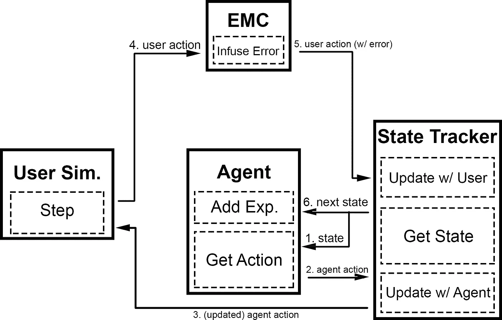

# 用深度强化学习训练面向目标的聊天机器人——第三部分

> 原文：<https://towardsdatascience.com/training-a-goal-oriented-chatbot-with-deep-reinforcement-learning-part-iii-dialogue-state-d29c2828ce2a?source=collection_archive---------8----------------------->

## 第三部分:对话状态跟踪器

如果你还不知道我们在哪里了解这个领域的培训和 DQN 代理，请查看前面的部分！这个代理的目标是为用户选择合适的电影票。

在这一部分中，将解释状态跟踪器以及状态跟踪器所使用的数据库的查询系统。

这个系列教程是基于 [TC-Bot](https://github.com/MiuLab/TC-Bot) 的。这个系列的 github 代码可以在[这里](https://github.com/maxbren/GO-Bot-DRL)找到。我们将与`[state_tracker.py](https://github.com/maxbren/GO-Bot-DRL/blob/master/state_tracker.py)`和`[db_query.py](https://github.com/maxbren/GO-Bot-DRL/blob/master/db_query.py)`一起工作。

这是我们根据前两部分得出的图表:



Dialogue flow of a single round

# 对话状态跟踪器

在面向目标的对话系统中，对话状态跟踪器(st)的主要工作是为代理准备状态。正如我们在前一部分所讨论的，代理需要一个有用的状态，以便能够对采取什么行动做出好的选择。ST 通过收集用户和代理采取的动作来更新其对话的内部历史。它还跟踪当前剧集中迄今为止包含在任何代理和用户动作中的所有通知片段。代理使用的状态是由来自 ST 的当前历史和当前通知的信息组成的 numpy 数组。此外，每当代理希望通知用户一个槽时，ST 查询数据库以获得给定其当前通知时有效的值。本质上，ST 为代理准备了一个状态，给出了它的情节历史和到目前为止在情节中由用户和代理发出的所有通知时隙，并且为代理查询数据库。

## 重要的操作类型

在继续之前，让我们回顾一下第一部分中一些值得注意的动作意图:*通知*、*请求*和*匹配找到*。

**通知** 表示动作包含发送方希望提供给接收方的通知槽。

**请求**例如，如果发送者请求一个日期(“UNK”的值)，那么接收者要采取的适当行动(尽管它不是必须的)将是通知原始发送者“明天”或某个其他值。

只有代理可以向用户发送**匹配发现**动作。这意味着，当 ST 接收到代理操作时，它会找到一个与当前通知一起工作的票据，并用票据中的所有槽填充该操作的通知槽，此外还有实际的票据 ID 本身。然而，如果代理决定采取匹配发现操作，但是实际上没有有效的票据，那么操作通知槽保持为空，除非有没有匹配的特殊指示。这种动作类型很重要，因为代理必须在剧集中的某个点采取匹配发现动作，即*包含与用户的约束条件相匹配的标签*以在剧集中成功，这将在下一部分中解释。

*最后注意:代理只能包含一个插槽，而用户 sim 操作可以包含多个插槽。*唯一的*例外*是匹配发现操作，因为它可能包含票据的所有插槽。

下面是匹配找到操作的示例。

# 更新状态跟踪器的历史记录

`update_state_agent(self, agent_action)`将代理动作作为输入，并更新 ST 的历史和当前通知。`update_state_user(self, user_action)`将用户动作作为输入，并更新这两个变量。

该类的重置方法(在`[train.py](https://github.com/maxbren/GO-Bot-DRL/blob/master/train.py)`中的重置函数中调用)重置当前通知、历史以及回合数，该回合数指示剧集的当前回合:

## 使用用户操作更新

1.  用操作中的任何通知槽更新当前通知
2.  将操作附加到历史记录
3.  增加回合数(当前回合结束)

## 使用代理操作更新

在某些情况下，把代理的动作想象成原始的或者未填充的版本，把状态跟踪器想象成用数据库信息填充任何通知槽。如果代理操作是通知，则将在数据库中查询与当前通知不冲突的匹配值。如果该动作是找到的匹配，那么将查询数据库以寻找符合当前通知的匹配票据。对于所有其他意图，没有必要进行询问。注意:在对话配置中，下面的`self.match_key`被设置为`'ticket'`。

意向动作`‘inform’`和`‘match_found’`以特定的方式处理。

**处理意向动作** `**‘inform’**`

1.  通过使用当前通知作为约束查询数据库来填充动作的通知槽(最初值为`‘PLACEHOLDER’`)
2.  用填充的通知槽更新当前通知

**处理意图动作** `**‘match_found’**`

1.  从数据库中获取一个票据列表，其中每个票据的槽与当前通知的槽(键和值)相匹配，当前通知充当约束
2.  如果有匹配的票据，则将代理操作的通知槽设置为此列表中票据的槽；此外，创建并设置代理动作的通知槽中的值`self.match_key`为该票据的 ID
3.  否则设置`self.match_key = ‘no match available’`
4.  用上面找到的新值更新当前通知中`self.match_key`的值

*成功查询找到匹配的示例*操作:`{'intent': 'match_found', 'inform_slots': {'ticket': 24L, 'moviename': 'zootopia', 'theater': 'carmike 16', 'city': 'washington'}, 'request_slots': {}}`

一个*不成功查询匹配发现动作的例子* : `{'intent': 'match_found', 'inform_slots': {'ticket': ‘no match available’}, 'request_slots': {}}`

最后，将轮数添加到代理操作，并将代理操作附加到历史记录。

请记住，动作是字典，在 python 中是可变的，所以发送到该方法中的原始代理动作实际上是由查询信息和轮数值自行更新的。

# 状态准备

st 最重要的工作是为代理提供当前事件历史的有用状态或表示。`get_state(self, done)`取一个 done bool，表示本轮结束后该集是否结束，并输出一个 numpy 形状的数组`(state size,)`。知道州的大小并不重要，因为它只是基于我们在州中存储了多少信息。但是如果您想删除或添加更多信息，您可以很容易地更改它。

状态由关于剧集状态的有用信息组成，例如最后用户动作和最后代理动作。这是为了通知代理最近的历史，这足以让代理采取接近最佳的行动。此外，`round_num`被编码以让代理知道该集的紧急程度(如果该集接近其允许的最大回合数，代理可以考虑采取匹配发现动作以在太晚之前查看它是否有匹配)。最后，状态由关于当前通知的信息以及数据库中有多少项匹配那些当前通知的信息组成。

有很多研究和工作被投入到状态跟踪中，例如编码信息的最佳方式以及在状态中提供什么信息。这种状态准备方法可能远非最佳，但需要进行大量调整来优化这一过程。请看一下第五部分中关于状态跟踪的参考资料。

# 查询系统

正如我们在上面看到的，状态跟踪器需要查询票据信息的数据库，以填充通知并匹配找到的代理动作。状态准备方法也使用它来为代理收集有用的信息。这里实现的查询系统可以用于任何与这个电影票数据库结构相同的数据库。

我不打算详细介绍`[db_query.py](https://github.com/maxbren/GO-Bot-DRL/blob/master/db_query.py)`中方法的实际实现，因为理解这一点并不能真正提高对这个对话系统如何工作的理解。然而，如果有足够的需求来实现完整的运行，那么我会做一个关于这个类的新帖子。

**公共方法总结:**

## 获取数据库结果

`get_db_results(constraints) -> dict`:在`update_state_agent(self, agent_action)`中调用，以响应具有意图`‘match_found’`的代理动作，如上所述。查看数据库中的每个项目，如果项目槽包含所有约束键，并且具有这些槽的匹配值，则将该项目添加到返回字典中。因此，它在数据库中查找给定约束的所有匹配项。

例如，假设数据库如下所示:

```
{0: {'theater': 'regal 6', 'date': 'tonight', 'city': 'seattle'},1: {'date': 'tomorrow', 'city': 'seattle'},2: {'theater': 'regal 6', 'city': 'washington'}}
```

约束条件是:`{'theater': 'regal 6', 'city': 'seattle'}`

输出将是`{0: {'theater': 'regal 6', 'date': 'tonight', 'city': 'seattle'}}`,因为这是唯一包含所有约束键并匹配其所有值的项目

## 填充通知槽

`fill_inform_slot(inform_slot_to_fill, current_inform_slots) -> dict`:在`update_state_agent(self, agent_action)`中调用，以响应带有意图`‘inform’`的动作，如上所述。首先，它调用`get_db_results(current_informs)`来获取所有的数据库匹配。然后计算`matches[inform_slot_to_fill]`的值，并返回出现的最高值。

例如，假设这些是从`get_db_results(constraints)`返回的匹配:

```
{2: {'theater': 'regal 6', 'date': 'tomorrow', 'moviename': 'zootopia'},45 : {'theater': 'amc 12', 'date': 'tomorrow'},67: {'theater': 'regal 6', 'date': 'yesterday'}}
```

如果`inform_slot_to_fill`是`'theater'`，那么这个方法将返回`{'theater': 'regal 6'}`，同样，如果`inform_slot_to_fill`是`'date'`，那么输出将是`{'date': 'tomorrow'}`。选择我们关心的键的多数值。

## 获取插槽的数据库结果

`get_db_results_for_slots(current_informs) -> dict`:调入`get_state(self, done=false)`。遍历整个数据库，统计当前通知中每个槽`(key, value)`的所有出现次数，并返回所有键的`key: count` 字典；此外，`'matching_all_constraints': #` 是状态中另一个有用的信息，它存储了多少数据库项匹配所有当前的通知槽。

例如，使用与上面相同的数据库:

```
{0: {theater: regal 6, date: tonight, city: seattle},1: {date: tomorrow, city: seattle},2: {theater: regal 6, city: washington}}
```

如果 current informs 为:`{'theater': 'regal 6', 'city': 'washington'}`，则输出将为`{'theater': 2, 'city': 1, 'matching_all_constraints': 1}`，因为两个数据库项具有`‘theater’: ‘regal 6’`，一个数据库项具有`‘city': 'washington’`，并且一个数据库项匹配所有约束(项 2)。

在**结论**中，状态跟踪器使用每个代理和用户动作来更新其历史和当前通知，以便在代理需要采取动作时为其准备有用的状态。它还使用一个简单的查询系统来为通知和匹配找到的操作填充代理通知槽。

在[下一部分](https://medium.com/@maxbrenner110/training-a-goal-oriented-chatbot-with-deep-reinforcement-learning-part-iv-user-simulator-and-a0efd3829364)中，我们将学习用强化学习训练代理的最重要的部分之一:用户模拟器。我们将学习我们的用户 sim 将使用的特定规则来做出类似人类的动作！