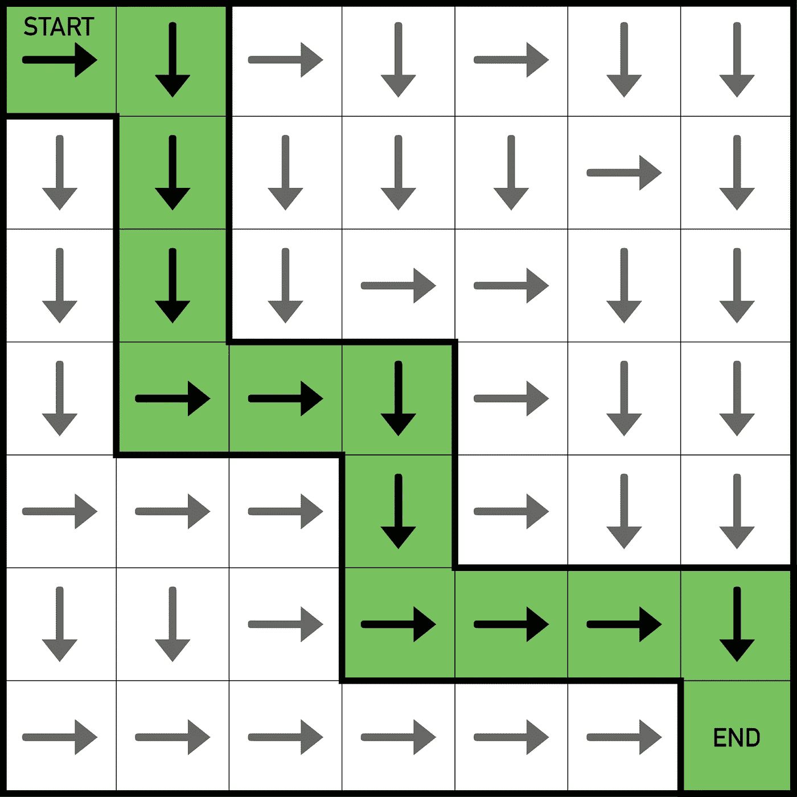

# 训练一个代理来打败网格世界

> 原文：<https://towardsdatascience.com/training-an-agent-to-beat-grid-world-fac8a48109a8?source=collection_archive---------2----------------------->

什么是网格世界？网格世界是一个大小为(Ny，Nx)的 2D 矩形网格，代理从一个网格方块开始，并试图移动到位于其他地方的另一个网格方块。这种环境是应用强化学习算法来发现网格上的代理的最佳路径和策略的自然环境，以便以最少的移动次数到达他们期望的目标网格方格。就我个人而言，我一直认为解决网格世界是开始学习强化学习的一个很好的方式，因为它直观的几何图形和它与许多现实世界应用的相关性。



在我们的网格世界实现中，我们从左上角的网格角(0，0)开始代理，目标是以最少的步数(Ny + Nx 步)到达右下角的网格角(Ny-1，Nx-1)。代理只允许在*上、下、左、右*方向移动 1 个方格的动作。

为了打败这个游戏，我们使用了一个*策略上的蒙特卡罗平均奖励抽样的强化学习算法，以及带有一个*ε贪婪代理*的*在网格世界环境*中导航。在这个实现中使用了奖励、状态-动作值和策略的表格形式(在这里适用于小网格尺寸)，上面的大部分理论可以在萨顿&巴尔托的“强化学习”教科书中找到。这个算法的 Python 代码实现可以在我的 Github 中找到:*

> [**https://github . com/ankonzoid/learning x/tree/master/classical _ RL/grid world**](https://github.com/ankonzoid/LearningX/tree/master/classical_RL/gridworld)

通过运行我们的代码，可以找到最佳策略的示例代码输出:

```
Final policy:

  [[2 1 1 2 2 2 2]
   [2 2 1 1 2 1 2]
   [1 2 1 1 2 2 2]
   [2 1 1 2 1 1 2]
   [1 1 2 2 2 1 2]
   [1 1 1 1 1 2 2]
   [1 1 1 1 1 1 3]]

  action['up'] = 0
  action['right'] = 1
  action['down'] = 2
  action['left'] = 3
```

注意，在这种情况下不存在唯一的最优策略！只要最终训练的策略中的所有动作是“向下”或“向右”移动，那么我们将知道我们处于(非唯一的)最优策略。

在本文的剩余部分，我们将在代码中简要介绍代理和环境的组成。

更多我关于深度学习和强化学习的博客、教程、项目，请查看我的 [**中**](https://medium.com/@ankonzoid) 和我的 [**Github**](https://github.com/ankonzoid) **。**

# 我们的 Python 代码中使用的方法的演练

我发现通过定义 4 个不同的对象类，我们可以使代码在概念上更容易理解。具体来说，这些类是:

(1)环境
(2)智能体
(3)大脑(智能体)
(4)记忆(智能体)

训练周期包括让代理通过采取行动、收集相应的奖励以及将其状态转换到其他状态来与环境进行交互。基于大脑通过处理存储在存储器中的事件的过去状态和动作历史而进行的操作，可以完成代理如何建立其未来决策。正是这种大脑和记忆的结合，提供了对什么样的状态和行动序列可以导致对代理人的高和低长期回报的评估。

## **问题 1:** 我们如何设置环境？

我们定义了一个 2D 网格，并开始定义代理在每个网格方格*上允许的动作，即代理可以在中间方格的所有 4 个方向上移动，在网格边缘的 3 个方向上移动，在网格角落的 2 个方向上移动。*我们还将智能体的起始状态定义为坐标(0，0)对应网格的左上角，将(Ny-1，Nx-1)定义为网格右下角的终止状态。至于对代理人的奖励，我们对到达期望的目标方格给予 R=+100 的奖励，以及 R=-0.1 的奖励，以激励代理人减少过多的移动次数来达到目标。

## 问题 2:我们如何设置代理？

我们在这里为代理选择一个ε贪婪策略，这意味着对于每个动作决策，代理尝试完全随机动作的概率为ε(不需要代理大脑)，否则它将贪婪地选择一个动作*，即 argmax{action} Q(state，action)* (需要代理大脑)。

## 问题 3:我们如何设置大脑？

我们初始化一个列表状态-动作值函数 Q(s，a ),它将被迭代更新以帮助代理的开发机制。回想一下，Q(s，a)表示对状态“s”应用动作“a ”,然后对剩余的状态转换遵循最优策略所收集的预期长期贴现或未贴现回报。

特别是对于我们的网格世界示例代码，我们使用一种*奖励平均抽样*技术作为我们的 Q(s，a)更新方法，这是一种计算 Q(s，a)的简单方法，作为当(s，a)被代理体验时收集的平均总奖励(更多细节请参考萨顿&巴尔托)。Q(s，a)更新发生在每一集之后，其中我们获取从该集收集的总报酬，并且准确地更新代理在该集期间经历的(s，a)状态-动作对的 Q(s，a)值；正是记忆储存了这些信息，供大脑处理。

## 问题 4:我们如何设置内存？

记忆的目的是通过记录一个情节中发生的状态、动作和奖励来帮助大脑进行计算。因此，这就像在训练期间和之后反复更新我们的计数器一样简单。