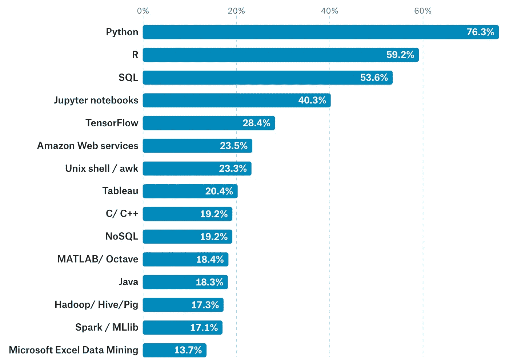

# 在数据科学方面培训您的员工？以下是如何选择正确的编程语言

> 原文：<https://towardsdatascience.com/training-your-staff-in-data-science-heres-how-to-pick-the-right-programming-language-dda349354b18?source=collection_archive---------11----------------------->

## 超越技术辩论，为您的团队获得最佳结果

各个行业的企业都在投资数据科学教育项目。在科技教育公司 [Decoded](http://decoded.com) 工作时，我发现看到数据技能可以给各个领域带来巨大价值是一件令人着迷的事情——从银行和零售商，到慈善机构和政府。当着手这样一项计划时，我们的客户需要做出大量的战略决策。我们最常见的问题之一是:

> "我们应该教我们的员工哪种编程语言？"

数据科学社区定期讨论这个问题，快速的谷歌搜索会发现大量讨论每种语言的技术优点和优雅的博客和视频。但是从商业角度来看，决策通常取决于一系列不同的因素。

这里有一个快速问答，可能会帮助你做出决定。

## **问:对于数据科学或数据分析，我们的员工应该学习哪种编程语言？**

Python 或者 r。

这是目前最流行和最通用的两种语言。它们都是免费和开源的。每个都有数百个库，简化了转换、探索、分析和可视化数据的过程。

在线数据科学社区 Kaggle 的年度调查“数据科学和机器学习的现状”提出了一个问题“工作中使用什么工具？”

在[最新公布的调查结果](https://www.kaggle.com/surveys/2017)中，r 和 Python 出现在列表的顶部。76.3%的受访者使用 Python，59.2%使用 R。*(值得注意的是，接下来流行的物品并不是等价的工具。比如 SQL 是一种允许你查询数据库的语言，在数据分析的时候不会有太大帮助)。*

接下来的编程语言远没有那么常用:C/C++占 19.2%，MATLAB 占 18.4%，Java 占 18.3%。所有这些语言都有自己的优点，但当涉及到学习数据科学时，它们就不那么容易理解、灵活和受支持了。

## **问:好的，那么你为我们的学员推荐哪一款呢？Python 还是 R？**

通常，最大的决定因素是您现有的数据科学团队是否已经偏好 Python 或 r。在一致的环境中工作有巨大的好处，因为:

*   如果学习者遇到任何问题，他们可以利用现有的内部支持网络。
*   代码可以在团队之间共享和重用。
*   对于您的 IT 团队来说，白名单和安装可能会更简单。

所以如果你现有的数据科学家主要用 Python，那就用 Python 吧。如果他们大部分时间都在休息，那就去休息吧

## **问:如果我没有现有的数据科学团队，或者他们没有偏好，该怎么办？**

Python。因为:

*   Python 是最流行的数据科学语言(也是发展最快的)。因此，您可以期待更好的在线学习和故障排除资源，以及支持现代数据分析常见任务的大量代码库。
*   对于 IT 团队来说，Python 通常比 R 更容易管理(例如[花旗风险投资刚刚投资了一个流行的 Python 数据科学平台 Anaconda](https://www.anaconda.com/blog/company-blog/anaconda-funded-citi-ventures/) )。
*   Python 在数据科学之外的环境中也很流行(例如 web 开发)。这意味着学习者可以获得更广泛的教育资源，并将其应用到生活的其他领域。

## **问:R 有什么优势吗？**

是啊！Kaggle 的调查显示，虽然 Python 总体上更受欢迎，但 R 在统计学家中更受欢迎。r 可能是一个不错的选择，因为它是专门为统计分析而构建的。

这意味着许多常见的统计工具都内置在 R 中(而 Python 更依赖于外部包)。传统上，R 也有更大范围的统计和专家可视化软件包。然而，随着 Python 越来越受欢迎，它也开始迎头赶上。如今，你在 R 中可以做的几乎任何事情都可以很容易地在 Python 中复制。

好的，我想我已经做出了决定。如果事实证明我犯了一个可怕的错误呢？

不要惊慌。你可能已经注意到了，Kaggle 的调查显示，76.3%的受访者使用 Python，59.2%的人使用 R——所以社区中有很大的重叠。大多数数据科学家都习惯使用这两种工具，即使他们固执地偏爱其中一种。

学习任何一种语言都会使学习另一种语言变得简单得多。别忘了，除了编程本身，还有很多东西要学——从数学和统计概念，到数据管道和可视化。这两种语言都是探索这些主题的良好基础，并开始您作为数据科学家的旅程。