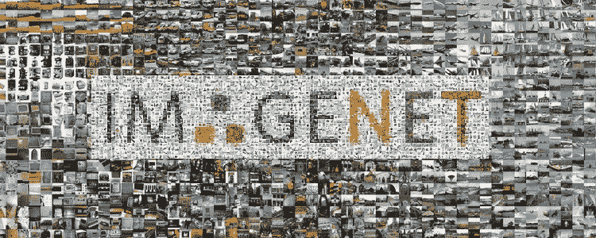

# 基于 Keras 的图像分类迁移学习

> 原文：<https://towardsdatascience.com/transfer-learning-for-image-classification-using-keras-c47ccf09c8c8?source=collection_archive---------4----------------------->

## 用几个简单的步骤训练一个图像分类器



> 我为学习者写了一份名为《强大的知识》的时事通讯。每一期都包含链接和最佳内容的关键课程，包括引文、书籍、文章、播客和视频。每一个人都是为了学习如何过上更明智、更快乐、更充实的生活而被挑选出来的。 [**在这里报名**](https://mighty-knowledge.ck.page/b2d4518f88) 。

在本教程中，您将学习如何为图像分类任务进行迁移学习。Keras 的高级 API 使这变得非常容易，只需要几个简单的步骤。

迁移学习允许我们使用比我们从头开始训练时少得多的数据来训练深度网络。通过转移学习，我们实际上是*将模型从之前的任务中学到的“知识”转移到我们当前的任务中。这个想法是，这两个任务并不是完全分离的，因此我们可以利用模型通过大量训练学习到的任何网络参数，而不必自己进行训练。*

迁移学习一直被证明可以提高模型准确性并减少所需的训练时间。更少的数据，更少的时间，更高的准确性。

# 装东西

我们要做的第一件事是准备我们的数据。对于 Keras 中的影像分类，最简单的方法是将您的数据分成每个类别的文件夹。例如，如果你的数据集有 3 个类:Pizza、Burger 和 Taco，那么你应该有 3 个名为 Pizza、Burger 和 Taco 的文件夹。你的每个文件夹都应该包含该特定类别的图像。您的文件夹结构应该如下所示:

```
food_dataset
---> Pizza
-------> p_1.jpg
-------> p_2.jpg
-------> p_3.jpg
-------> ....
---> Burger
-------> b_1.jpg
-------> b_2.jpg
-------> b_3.jpg
-------> ....
---> Taco
-------> ....
```

接下来，我们可以选择要对其执行迁移学习的模型。Keras 为此提供了许多选项。在进行选择时，您可以大致相信(出于我们的目的)较小的模型(以 MB 为单位)会更快但不太准确，而较大的模型会更慢但更准确。截至今天的文章，MobileNet 是最快的，NASNetLarge 是最准确的。我们今天将选择 ResNet50 型号，它位于光谱的中间。

查看下面的代码。我们从导入必要的模型和预处理函数开始。ResNet50 模型使用一些非常特殊的预处理进行训练，我们希望重用这些预处理，以便正确地重新训练它。请注意，当我们初始化基本模型时，我们是如何设置`include_top=False`的。这个设置很重要，因为这意味着我们**不会**在模型的末尾保留全连接(FC)层。这正是我们想要的，因为我们要为迁移学习训练我们自己的*全新的* FC 层。

# 流动数据

现在我们需要创建一个数据生成器，以自动的方式从我们的文件夹中获取数据并放入 Keras。为此，Keras 提供了方便的 python 生成器函数。

我们定义了名为“food_dataset”的训练目录，其中包含我们之前设置的每类图像的文件夹。我们还定义了图像尺寸和批量大小；Keras 生成器将使用双线性插值法自动将所有加载的图像调整到`target_size`的大小。

我们将向生成器添加一些额外的数据增强，翻转和旋转，以尝试提高我们模型的准确性。我们使用`flow_from_directory`函数创建我们的最终生成器，它将使用一个队列来保持加载和准备图像的连续流！

# 弹出图层

是时候建立我们迁移学习的最终模型了。如果将来要再次使用它，您可能会发现为此编写一个函数非常方便。下面有一个你可以从它开始。

我们从冻结基本模型的所有层开始。我们不想训练这些层，因为我们试图利用网络从以前的数据集(在这种情况下是 ImageNet)中学习的知识。通过设置`layer.trainable=False`，我们告诉 Keras *而不是*在训练期间更新那些权重，这正是我们想要的！

现在，我们可以添加 FC 层。我们在一个循环中这样做，因为许多网络有多个 FC 层，循环通过一个列表使事情变得简单明了。我们还将在每个 FC 层中添加一些 dropout，以减少过度拟合的机会(这部分是可选的)。最后，我们加上最终的 Softmax 层，建立 Keras 模型。

一旦我们的功能都设置好了，创建最终模型就变得非常简单了。只需忽略 softmax 层的类的数量、列表中 FC 层的大小(因为我们对它进行了循环)和丢失概率。

# 训练它

最后一步是设置我们的训练，并点击大红色按钮，使所有运行！

我们将使用 Adam 优化器，它的学习率值很小。我们选择 Adam 是因为它比 SGD 更快更容易使用。我们将学习率设置得很小，因为我们在这里只是微调我们的模型，特别是 FC 层；我们不寻求任何大的改变，只是微调。

我们还将设置一些检查点，为以后保存权重。应用`fit_generator`函数运行整个训练团，可选择时期数、批量大小和数据混排。一旦训练全部完成，我们可以使用`history`输出来绘制我们的训练结果。

瞧，转移学习！

# 喜欢学习？

在[推特](https://twitter.com/GeorgeSeif94)上关注我，我会在那里发布所有最新最棒的人工智能、技术和科学！也在 [LinkedIn](https://www.linkedin.com/in/georgeseif/) 上和我联系吧！