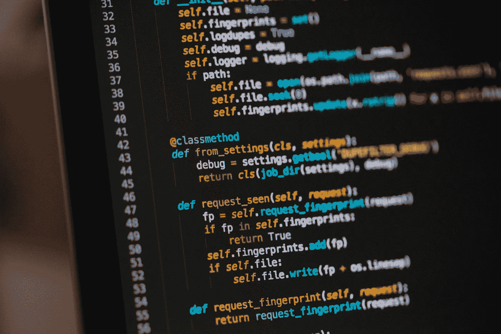
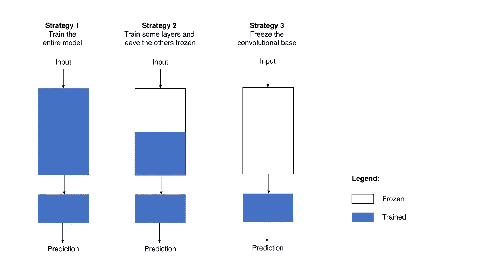
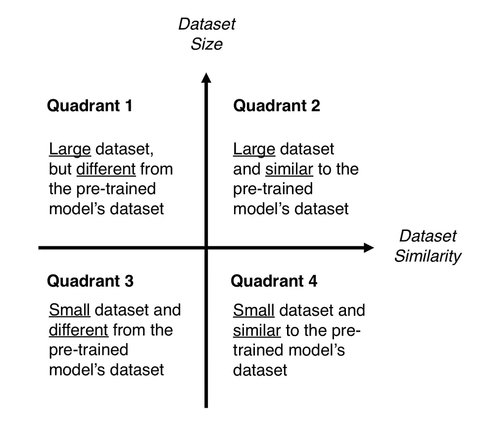
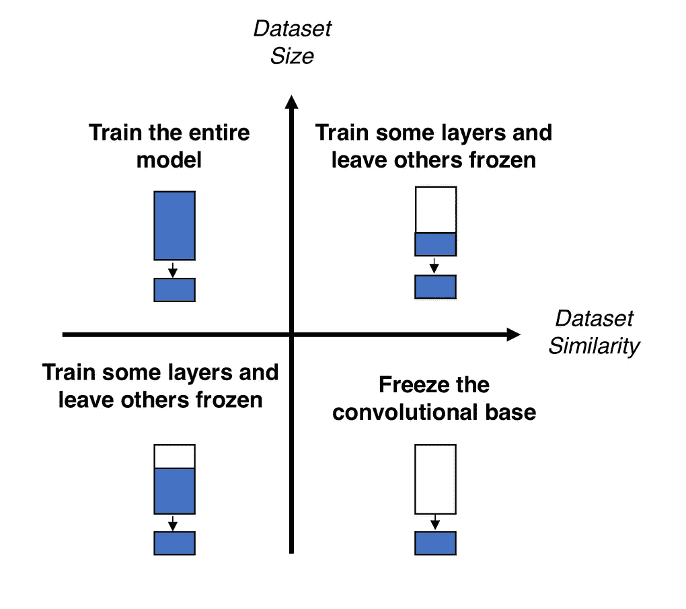
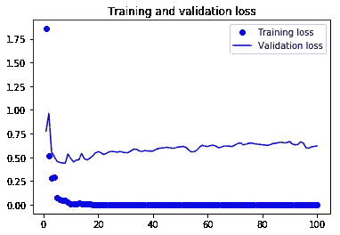
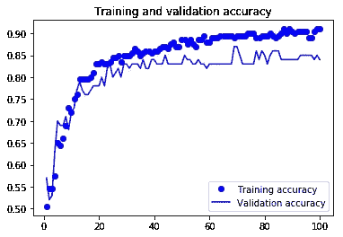
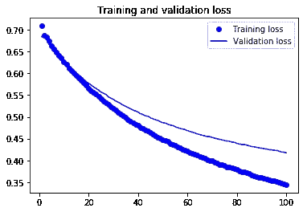
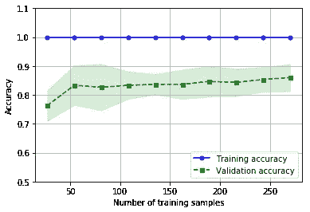

# 从预先训练的模型中转移学习

> 原文：<https://towardsdatascience.com/transfer-learning-from-pre-trained-models-f2393f124751?source=collection_archive---------0----------------------->

# 如何快速简单地解决任何图像分类问题

*本文教你如何利用迁移学习解决图像分类问题。为了演示的目的，给出了一个使用 Keras 及其预训练模型的实例。*

The beauty of code by [Chris Ried](https://unsplash.com/photos/ieic5Tq8YMk?utm_source=unsplash&utm_medium=referral&utm_content=creditCopyText) on [Unsplash](https://unsplash.com/search/photos/programming-python?utm_source=unsplash&utm_medium=referral&utm_content=creditCopyText)

**深度学习**正在迅速成为人工智能应用的关键工具(LeCun et al. 2015)。例如，在计算机视觉、自然语言处理和语音识别等领域，深度学习已经产生了显著的成果。因此，对深度学习的兴趣越来越大。

深度学习擅长的问题之一是**图像分类** (Rawat & Wang 2017)。图像分类的目标是根据一组可能的类别对特定图片进行分类。图像分类的一个经典例子是在一组图片中识别猫和狗(例如[狗对猫 Kaggle 比赛](https://www.kaggle.com/c/dogs-vs-cats))。

从深度学习的角度来看，图像分类问题可以通过**迁移学习**来解决。实际上，图像分类中的几个最先进的结果都是基于迁移学习解决方案(Krizhevsky 等人 2012，Simonyan & Zisserman 2014，he 等人 2016)。潘&杨(2010)对迁移学习进行了全面综述。

**本文展示了如何针对图像分类问题实现迁移学习解决方案。**本文提出的实现基于 Keras (Chollet 2015)，它使用编程语言 Python。按照这个实现，您将能够快速而轻松地解决任何图像分类问题。

这篇文章是按以下方式组织的:

1.  迁移学习
2.  卷积神经网络
3.  重新利用预先训练的模型
4.  迁移学习过程
5.  深度卷积神经网络上的分类器
6.  例子
7.  摘要
8.  参考

# 1.迁移学习

迁移学习是计算机视觉中一种流行的方法，因为它允许我们以省时的方式**建立精确的模型** (Rawat & Wang 2017)。使用迁移学习，你不是从零开始学习过程，而是从解决一个不同的问题时已经学到的模式开始。这样你可以利用以前的经验，避免从头开始。就当是深度学习版的[沙特尔](https://en.wikipedia.org/wiki/Standing_on_the_shoulders_of_giants)‘表情’站在巨人的肩膀上。

在计算机视觉中，迁移学习通常通过使用**预训练模型**来表达。预训练模型是在大型基准数据集上训练的模型，用于解决与我们想要解决的问题类似的问题。因此，由于训练这种模型的计算成本，通常的做法是从出版的文献(例如，， [Inception](https://arxiv.org/pdf/1512.00567.pdf) ， [MobileNet](https://arxiv.org/pdf/1704.04861.pdf) )中导入和使用模型。Canziani 等人(2016 年)使用 ImageNet (Deng 等人，2009 年)挑战赛中的数据，对预训练模型在计算机视觉问题上的表现进行了全面综述。

# 2.卷积神经网络

迁移学习中使用的几个预训练模型都是基于大型**卷积神经网络****(CNN)**(Voulodimos et al . 2018)。总的来说，CNN 在广泛的计算机视觉任务中表现出色(Bengio 2009)。它的高性能和易于训练是过去几年来推动 CNN 流行的两个主要因素。

典型的 CNN 有两部分:

1.  **卷积基**，由一堆卷积层和池层组成。卷积库的主要目标是从图像中生成特征。关于卷积层和池层的直观解释，请参考 Chollet (2017)。
2.  **分类器**，通常由全连接层组成。分类器的主要目标是基于检测到的特征对图像进行分类。全连接层是其神经元与前一层中的所有激活具有全连接的层。

图 1 显示了一个基于 CNN 的模型的**架构。请注意，这是一个简化版本，符合本文的目的。事实上，这种模型的架构比我们在这里提出的要复杂得多。**

Figure 1\. Architecture of a model based on CNN.

这些深度学习模型的一个重要方面是，它们可以自动学习**层次特征表示**。这意味着第一层计算的要素是通用的，可以在不同的问题域中重复使用，而最后一层计算的要素是特定的，取决于所选的数据集和任务。根据 Yosinski et al. (2014)，'*如果第一层特征是一般的，而最后一层特征是特定的，那么在网络的某个地方肯定有从一般到特定的过渡'*。因此，我们的 CNN 的卷积基(尤其是其较低层(那些更接近输入的层))指的是一般特征，而分类器部分以及卷积基的一些较高层指的是专门特征。

# 3.重新利用预先训练的模型

当您根据自己的需要重新调整预训练模型的用途时，您首先要删除原始的分类器，然后添加一个符合您的目的的新分类器，最后您必须根据三种策略之一对您的模型进行**微调:**

1.  **训练整个模型。**在这种情况下，您使用预训练模型的架构，并根据您的数据集对其进行训练。您正在从头开始学习模型，因此您将需要一个大的数据集(和强大的计算能力)。
2.  训练一些层，让其他层保持冷冻。如您所知，较低层指的是一般特性(与问题无关)，而较高层指的是特定特性(与问题相关)。这里，我们通过选择我们想要调整网络权重的程度(一个冻结的层在训练期间不会改变)来处理这种二分法。通常，如果你有一个小的数据集和大量的参数，你会保持更多的层冻结，以避免过度拟合。相比之下，如果数据集很大而参数数量很少，则可以通过为新任务训练更多的层来改进模型，因为过度拟合不是问题。
3.  **冻结卷积基数。**这种情况对应于训练/冻结权衡的极端情况。主要思想是保持卷积基的原始形式，然后使用其输出来馈送分类器。您正在使用预训练模型作为固定的特征提取机制，这在您计算能力不足、数据集较小和/或预训练模型解决的问题与您想要解决的问题非常相似的情况下非常有用。

图 2 以示意图的方式展示了这三种策略。

Figure 2\. Fine-tuning strategies.

与**策略 3** 的应用**简单明了**不同，**策略 1** 和**策略 2** 要求你**小心**卷积部分使用的学习速率。学习率是一个超参数，它控制着你调整网络权重的程度。当您使用基于 CNN 的预训练模型时，使用小的学习率是明智的，因为高学习率会增加丢失先前知识的风险。假设预训练模型已经被很好地训练，这是一个公平的假设，保持小的学习率将确保你不会过早和过多地扭曲 CNN 权重。

# 4.迁移学习过程

从实践的角度来看，整个迁移学习过程可以总结如下:

1.  **选择预先训练好的模型**。从大量可用的预训练模型中，您可以选择一个看起来适合您的问题的模型。例如，如果您正在使用 Keras，您可以立即访问一组模型，如(Simonyan & Zisserman 2014)、InceptionV3 (Szegedy 等人 2015)和 ResNet5(何等人 2015)。[在这里](https://keras.io/applications/)你可以看到 Keras 上所有的车型。
2.  **根据规模-相似度矩阵对你的问题进行分类。**在图 3 中，你有一个“矩阵”来控制你的选择。该矩阵根据数据集的大小及其与训练预训练模型的数据集的相似性，对您的计算机视觉问题进行分类。根据经验，如果每个类的图像少于 1000 幅，则认为数据集很小。关于数据集相似性，让常识占上风。例如，如果您的任务是识别猫和狗，ImageNet 将是一个类似的数据集，因为它有猫和狗的图像。然而，如果你的任务是识别癌细胞，ImageNet 就不能被认为是一个类似的数据集。
3.  **微调你的模型。**在这里，您可以使用大小-相似性矩阵来指导您的选择，然后参考我们之前提到的关于重新调整预训练模型用途的三个选项。图 4 提供了以下文本的可视化摘要。

*   **象限 1** 。大型数据集，但不同于预训练模型的数据集。这种情况会把你引向*策略 1* 。因为你有一个大的数据集，你可以从头开始训练一个模型，做任何你想做的事情。尽管数据集不同，但在实践中，使用预训练模型的架构和权重从预训练模型初始化模型仍然是有用的。
*   **象限 2。**大型数据集，类似于预训练模型的数据集。你现在在啦啦世界。任何选择都可行。可能，最有效的选择是*策略 2* 。由于我们有一个大的数据集，过度拟合应该不是问题，所以我们可以想学多少就学多少。然而，由于数据集是相似的，我们可以通过利用以前的知识来节省大量的训练工作。因此，训练分类器和卷积基的顶层应该足够了。
*   **第三象限。**小数据集，与预训练模型的数据集不同。这是计算机视觉问题的第 2-7 手脱衣牌。一切都和你作对。如果抱怨不是一个选项，你唯一的希望就是策略 2。很难在训练和冷冻的层数之间找到平衡。如果你深入研究，你的模型可能会过拟合，如果你停留在模型的浅层，你将不会学到任何有用的东西。很可能，您需要比象限 2 更深入，并且您需要考虑数据扩充技术(这里[提供了关于数据扩充技术的很好的总结](https://medium.com/nanonets/how-to-use-deep-learning-when-you-have-limited-data-part-2-data-augmentation-c26971dc8ced))。
*   **象限 4。**小数据集，但类似于预训练模型的数据集。我向尤达大师询问过这个问题，他告诉我‘*是最好的选择，策略 3 应该是*’。我不知道你怎么想，但我不会低估原力。相应地，转到*策略 3* 。你只需要去掉最后一个全连接层(输出层)，把预训练好的模型作为固定特征提取器运行，然后用得到的特征训练一个新的分类器。

Figures 3 and 4\. Size-Similarity matrix (left) and decision map for fine-tuning pre-trained models (right).

# 5.深度卷积神经网络上的分类器

如前所述，基于预训练卷积神经网络的迁移学习方法**产生的**图像分类模型**通常由**两部分**组成:**

1.  **卷积基**，进行特征提取。
2.  **分类器**，根据卷积基提取的特征对输入图像进行分类。

因为在这一节中我们关注分类器部分，所以我们必须首先说明可以遵循不同的方法来构建分类器。一些最受欢迎的是:

1.  **完全连接的层。**对于图像分类问题，标准方法是使用一堆完全连接的层，然后是 softmax 激活层(Krizhevsky 等人 2012 年，Simonyan & Zisserman 2014 年，泽勒& Fergus 2014 年)。softmax 层输出每个可能类别标签上的概率分布，然后我们只需要根据最可能的类别对图像进行分类。
2.  **全球平均统筹。**林等人(2013 年)提出了一种基于全球平均池的不同方法。在这种方法中，我们没有在卷积基础之上添加完全连接的层，而是添加了一个全局平均池层，并将其输出直接馈入 softmax 激活层。Lin 等人(2013 年)详细讨论了这种方法的优缺点。
3.  **线性支持向量机。**线性支持向量机(SVM)是另一种可能的方法。根据唐(2013)，我们可以通过在卷积基提取的特征上训练线性 SVM 分类器来提高分类精度。关于 SVM 方法的优点和缺点的更多细节可以在该文件中找到。

# 6.例子

在这个例子中，我们将看到**如何在图像分类的迁移学习解决方案中实现这些分类器**。根据 Rawat 和 Wang (2017)，'*在深度卷积神经网络上比较不同分类器的性能仍需要进一步研究，因此成为一个有趣的研究方向*。因此，看看每个分类器在标准图像分类问题中的表现会很有趣。

你可以在我的 GitHub 页面上找到这个例子的完整代码。

## 6.1.准备数据

在本例中，我们将使用原始数据集的较小版本。这将允许我们更快地运行模型，这对于计算能力有限的人(像我一样)来说是非常好的。

为了构建更小版本的数据集，我们可以修改 Chollet (2017)提供的代码，如代码 1 所示。

Code 1\. Create a smaller dataset for Dogs vs. Cats.

## 6.2.从卷积基中提取特征

卷积基底将用于提取特征。这些特征将提供给我们想要训练的分类器，以便我们可以识别图像中是否有狗或猫。

再次改编 Chollet (2017)提供的代码。代码 2 显示了所使用的代码。

Code 2\. Extract features from convolutional base.

## 6.3.分类器

## 6.3.1.完全连接的层

我们提出的第一个解决方案基于完全连接的层。这个分类器添加了一个全连接层的堆栈，该堆栈由从卷积基提取的特征提供。

为了保持简单(和快速)，我们将使用 Chollet (2018)提出的解决方案，稍加修改。特别是，我们将使用 Adam 优化器而不是 RMSProp，因为 [Stanford 是这么说的](http://cs231n.github.io/neural-networks-3/#adam)(多么美妙的 *argumentum ad verecundiam* )。

代码 3 显示了所使用的代码，而图 5 和图 6 显示了学习曲线。

Code 3\. Fully connected layers solution.

Figure 5\. Accuracy of the fully connected layers solution.

Figure 6\. Loss of the fully connected layers solution.

**成绩简述:**

1.  验证精度约为 0.85，考虑到数据集的规模，这是令人鼓舞的。
2.  该模型严重过度拟合。训练曲线和验证曲线之间有很大的差距。
3.  由于我们已经使用了 dropout，我们应该增加数据集的大小来改善结果。

## 6.3.2.全球平均池

这种情况与前一种情况的区别在于，我们将添加一个全局平均池层，并将其输出馈送到 sigmoid 激活层，而不是添加一个完全连接的层堆栈。

请注意，我们讨论的是 sigmoid 激活层，而不是 softmax 激活层，后者是 Lin 等人(2013)推荐的。我们改为 sigmoid 激活，因为在 Keras 中，要执行二进制分类，您应该使用 *sigmoid* 激活和 *binary_crossentropy* 作为损失(Chollet 2017)。因此，有必要对林等人(2013)的原始提案进行这一小小的修改。

代码 4 显示了构建分类器的代码。图 7 和图 8 显示了最终的学习曲线。

Code 4\. Global average pooling solution.

Figure 7\. Accuracy of the global average pooling solution.

Figure 8\. Loss of the global average pooling solution.

**结果简述:**

1.  验证精度与全连接图层解决方案的结果相似。
2.  该模型不会像前一种情况那样过度拟合。
3.  当模型停止训练时，损失函数仍在减小。或许，可以通过增加历元数来改进模型。

## 6.3.3 线性支持向量机

在这种情况下，我们将在卷积基提取的特征上训练线性支持向量机(SVM)分类器。

为了训练这个分类器，传统的机器学习方法是优选的。因此，我们将使用 k-fold 交叉验证来估计分类器的误差。由于将使用 k-fold 交叉验证，我们可以连接训练集和验证集以扩大我们的训练数据(我们保持测试集不变，就像我们在前面的案例中所做的那样)。代码 5 显示了数据是如何连接的。

Code 5\. Data concatenation.

最后，我们必须知道 SVM 分类器有一个超参数。这个超参数是误差项的惩罚参数 C。为了优化这个超参数的选择，我们将使用穷举网格搜索。代码 6 展示了用于构建这个分类器的代码，而图 9 展示了学习曲线。

Code 6\. Linear SVM solution.

Figure 9\. Accuracy of the linear SVM solution.

**结果的简要讨论:**

1.  模型的精度约为 0.86，与之前解决方案的精度相似。
2.  过度合身指日可待。而且训练精度总是 1.0，这是不常见的，可以解释为过拟合的标志。
3.  模型的准确性应该随着训练样本的数量而增加。然而，那似乎不会发生。这可能是由于过度拟合。当数据集增加时，观察模型如何反应会很有趣。

# 7.摘要

在本文中，我们:

*   介绍了迁移学习、卷积神经网络和预训练模型的概念。
*   定义了基本的微调策略，以重新调整预训练模型的用途。
*   描述了一种基于数据集的大小和相似性来决定应该使用哪种微调策略的结构化方法。
*   介绍了三种不同的分类器，它们可以用在从卷积基提取的特征之上。
*   为本文中的三个分类器提供了一个端到端的图像分类示例。

我希望你有动力开始开发关于计算机视觉的深度学习项目。这是一个伟大的研究领域，每天都有令人兴奋的新发现出现。

我很乐意帮助你，所以如果你有任何问题或改进建议，请告诉我！

# 8.参考

1.纽约州本吉奥市，2009 年。学习人工智能的深度架构。机器学习的基础和趋势，2(1)，第 1–127 页。

2.Canziani，a .，Paszke，a .和 Culurciello，e .，2016 年。面向实际应用的深度神经网络模型分析。arXiv 预印本 arXiv:1605.07678。

[3。Chollet，2015。喀拉斯。](https://keras.io/)

4.[乔莱，女，2017。用 python 进行深度学习。曼宁出版公司..](https://amzn.to/2CeEySF)

5.邓军，董文伟，索契，李，李力军，李，，李，2009 年 6 月。Imagenet:一个大规模分层图像数据库。计算机视觉和模式识别，2009。CVPR 2009。IEEE 关于(第 248–255 页)的会议。Ieee。

6.何刚，张，徐，任，孙，2016。用于图像识别的深度残差学习。IEEE 计算机视觉和模式识别会议论文集(第 770-778 页)。

7.Krizhevsky，a .，Sutskever，I .和 Hinton，G.E .，2012 年。基于深度卷积神经网络的图像网分类。神经信息处理系统进展(第 1097-1105 页)。

8.LeCun、y . beng io 和 and Hinton，2015 年。深度学习。自然，521(7553)，第 436 页

9.2013 年，林，硕士，陈，秦，严。网络中的网络。arXiv 预印本 arXiv:1312.4400。

10.潘世杰和杨，2010。迁移学习研究综述。IEEE 知识与数据工程汇刊，22(10)，第 1345–1359 页。

11.Rawat，w .和王，z .，2017 年。用于图像分类的深度卷积神经网络:综述。神经计算，第 29 卷第 9 期，第 2352–2449 页。

12.Simonyan，k .和 Zisserman，a .，2014 年。用于大规模图像识别的非常深的卷积网络。arXiv 预印本 arXiv:1409.1556。

13.Szegedy，c .，Vanhoucke，v .，Ioffe，s .，Shlens，j .和 Wojna，z .，2016 年。重新思考计算机视觉的初始架构。IEEE 计算机视觉和模式识别会议论文集(第 2818-2826 页)。

14.唐，2013 年。使用线性支持向量机的深度学习。arXiv 预印本 arXiv:1306.0239。

15.Voulodimos，a .，Doulamis，n .，Doulamis，a .和 Protopapadakis，e .，2018。计算机视觉的深度学习:简要综述。计算智能与神经科学，2018。

16.约辛斯基、克鲁内、本吉奥和利普森，2014 年。深度神经网络中的特征有多大的可转移性？。神经信息处理系统进展(第 3320-3328 页)。

17.泽勒医学博士和弗格斯研究中心，2014 年 9 月。可视化和理解卷积网络。在欧洲计算机视觉会议上(第 818-833 页)。斯普林格，查姆。

# 感谢

感谢[若昂·科埃略](https://www.linkedin.com/in/joaopcoelho/)阅读本文的草稿。

***想了解更多？*** *我正在为那些想学习 Python 中机器学习基础知识的人建立一个互动的、基于群组的 5 周课程，并且不再怀疑他们是否能够在这个领域开始职业生涯。请* [*填写这份简短的调查问卷*](https://tinyurl.com/learn-machine-learning) *加入等候名单，并享受特别早到优惠。*