# PyTorch 中卷积神经网络的迁移学习

> 原文：<https://towardsdatascience.com/transfer-learning-with-convolutional-neural-networks-in-pytorch-dd09190245ce?source=collection_archive---------0----------------------->


([Source](https://www.flickr.com/photos/pinks2000/19160002254))

## 如何用 PyTorch 使用预训练的卷积神经网络进行对象识别

虽然 Keras 是一个很棒的库，有一个简单的 API 来构建神经网络，但是最近关于 PyTorch 的兴奋终于让我有兴趣探索这个库。虽然我是一个盲目跟风炒作的人，但研究人员采用[和](https://hub.packtpub.com/what-is-pytorch-and-how-does-it-work/)将[纳入 fast.ai 库](https://www.fast.ai/2017/09/08/introducing-pytorch-for-fastai/)让我相信，深度学习的这个新条目背后一定有什么东西。

由于学习新技术的最好方式是用它来解决问题，我学习 PyTorch 的努力从一个简单的项目开始:使用一个预先训练好的卷积神经网络来完成物体识别任务。在本文中，我们将看到如何使用 PyTorch 来实现这个目标，同时了解一些关于库和迁移学习的重要概念。

> 虽然 PyTorch 可能不适合所有人，但在这一点上，还不能说哪个深度学习库会胜出，能够快速学习和使用不同的工具对于数据科学家的成功至关重要。

这个项目的完整代码可以从 GitHub 上的 [Jupyter 笔记本中获得。这个项目诞生于我参与的](https://github.com/WillKoehrsen/pytorch_challenge/blob/master/Transfer%20Learning%20in%20PyTorch.ipynb) [Udacity PyTorch 奖学金挑战赛](https://www.udacity.com/facebook-pytorch-scholarship)。


Predicted from trained network

# 迁移学习方法

我们的任务将是训练一个卷积神经网络(CNN)，它可以识别图像中的对象。我们将使用[加州理工学院 101 数据集](http://www.vision.caltech.edu/Image_Datasets/Caltech101/)，它包含 101 个类别的图像。大多数类别只有 50 幅图像，这通常不足以让神经网络学习到高精度。因此，我们将使用应用迁移学习的预先构建和训练的模型，而不是从头开始构建和训练 CNN。

[转移学习](https://machinelearningmastery.com/transfer-learning-for-deep-learning/)的基本前提很简单:取一个在大数据集上训练的模型，*将其知识转移*到一个更小的数据集。[对于 CNN](http://cs231n.github.io/transfer-learning/) 的物体识别，我们冻结了网络的早期卷积层，只训练最后几层进行预测。这个想法是，卷积层提取适用于图像的一般、低级特征，如边缘、图案、梯度，后面的层识别图像中的特定特征，如眼睛或车轮。

因此，我们可以使用在大规模数据集(通常是 Imagenet)中的不相关类别上训练的网络，并将其应用于我们自己的问题，因为图像之间存在通用的低级特征。加州理工学院 101 数据集中的图像与 [Imagenet 数据集](http://www.image-net.org/)中的图像非常相似，模型在 Imagenet 上学习的知识应该很容易转移到这项任务中。

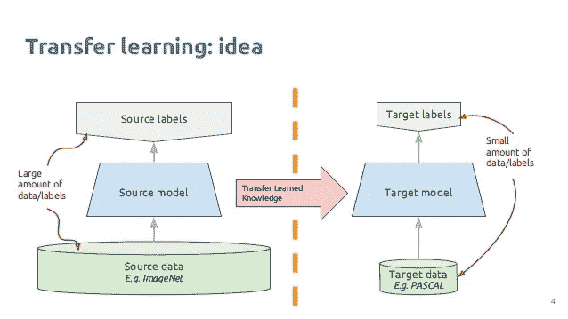

Idea behind Transfer Learning ([source](https://www.slideshare.net/xavigiro/transfer-learning-d2l4-insightdcu-machine-learning-workshop-2017)).

以下是用于对象识别的迁移学习的一般概述:

1.  加载在大型数据集上训练的预训练 CNN 模型
2.  冻结模型较低卷积层中的参数(权重)
3.  向模型添加带有多层可训练参数的自定义分类器
4.  根据任务可用的训练数据训练分类器层
5.  微调超参数并根据需要解冻更多层

这种[方法已被证明在许多领域取得了成功](http://ruder.io/transfer-learning/)。这是一个很好的工具，并且通常是当遇到新的图像识别问题时应该尝试的第一种方法。

## 数据设置

对于所有的数据科学问题，正确格式化数据将决定项目的成败。幸运的是，加州理工学院 101 数据集图像是干净的，并以正确的格式存储。如果我们正确地设置了数据目录，PyTorch 可以很容易地将正确的标签与每个类关联起来。我将数据分成 50%、25%、25%的*培训、验证和测试*集，然后将目录构建如下:

```
/datadir
    /train
        /class1
        /class2
        .
        .
    /valid
        /class1
        /class2
        .
        .
    /test
        /class1
        /class2
        .
        .
```

按类别分类的训练图像的数量如下(我交替使用术语类别和种类):


Number of training images by category.

我们期望模型在有更多例子的类上做得更好，因为它可以更好地学习将特征映射到标签。为了处理数量有限的训练示例，我们将在训练过程中使用*数据扩充*(稍后将详细介绍)。

作为另一个数据探索，我们还可以看看大小分布。

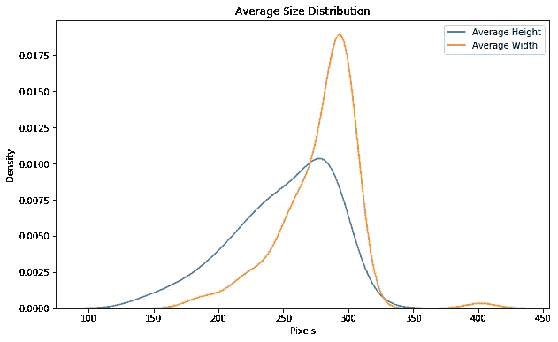

Distribution of average image sizes (in pixels) by category.

Imagenet 模型需要 224 x 224 的输入尺寸，因此*预处理*步骤之一就是调整图像的大小。预处理也是我们为训练数据实现数据扩充的地方。

## 数据扩充

[数据扩充](http://cs231n.stanford.edu/reports/2017/pdfs/300.pdf)的想法是通过对图像进行随机变换，人为增加我们的模型看到的训练图像的数量。例如，我们可以随机旋转或裁剪图像，或者水平翻转它们。我们希望我们的模型能够区分对象，而不考虑方向，数据扩充也可以使模型[对输入数据的变换不变](https://stats.stackexchange.com/questions/239076/about-cnn-kernels-and-scale-rotation-invariance)。

不管面向哪个方向，大象还是大象！

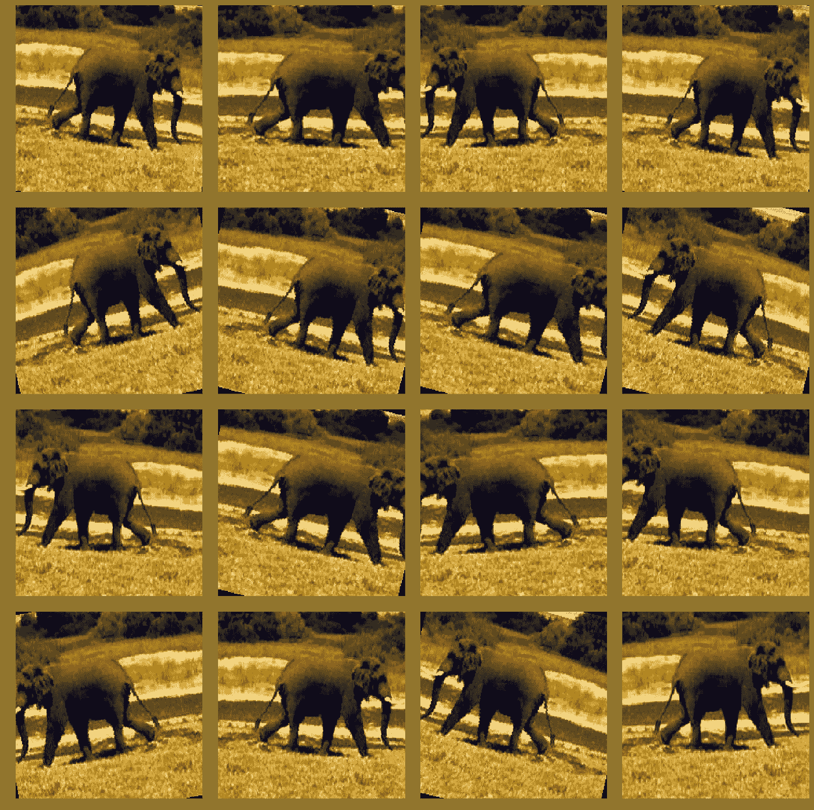

Image transformations of training data.

增强通常仅在训练期间完成(尽管[测试时间增强在](https://blog.floydhub.com/ten-techniques-from-fast-ai/) `[fast.ai](https://blog.floydhub.com/ten-techniques-from-fast-ai/)`库中是可能的)。每个历元(通过所有训练图像的一次迭代)对每个训练图像应用不同的随机变换。这意味着，如果我们迭代数据 20 次，我们的模型将看到每幅图像的 20 个略有不同的版本。总的结果应该是一个学习对象本身的模型，而不是它们如何呈现或图像中的伪像。

# 图像预处理

这是处理图像数据最重要的一步。在图像预处理过程中，我们同时为我们的网络准备图像，并对训练集应用数据扩充。每个模型都有不同的输入要求，[，但是如果我们通读 Imagenet 的要求](https://github.com/pytorch/vision/issues/39)，我们会发现我们的图像需要是 224x224，并标准化到一个范围。

为了在 PyTorch 中处理图像，我们使用了`transforms`，这是应用于数组的简单操作。验证(和测试)转换如下:

*   调整大小
*   居中裁剪至 224 x 224
*   转换成张量
*   用平均值和标准偏差标准化

通过这些变换的最终结果，是可以进入我们网络的张量。训练变换是相似的，但是增加了随机增强。

首先，我们定义培训和验证转换:

然后，我们创建`datasets`和`DataLoaders`。通过使用`datasets.ImageFolder`制作数据集，PyTorch 将自动将图像与正确的标签关联起来，前提是我们的目录如上所述设置。然后数据集被传递给一个`DataLoader`，一个迭代器，产生一批图像和标签。

我们可以看到`DataLoader`的迭代行为，如下所示:

```
# Iterate through the dataloader once
trainiter = iter(dataloaders['train'])
features, labels = next(trainiter)
features.shape, labels.shape**(torch.Size([128, 3, 224, 224]), torch.Size([128]))**
```

一批的形状是`(batch_size, color_channels, height, width)`。在训练、验证和最终测试期间，我们将遍历`DataLoaders`，一次遍历包含一个时期的完整数据集。每个时期，训练`DataLoader`将对图像应用稍微不同的随机变换，用于训练数据扩充。

# 用于图像识别的预训练模型

有了我们的数据，我们接下来将注意力转向模型。为此，我们将使用预训练的卷积神经网络。PyTorch 拥有许多模型，这些模型已经在 Imagenet 的 1000 个类的数百万张图像上进行了训练。完整的型号列表可以在[这里看到](https://pytorch.org/docs/stable/torchvision/models.html)。这些模型在 Imagenet 上的性能如下所示:

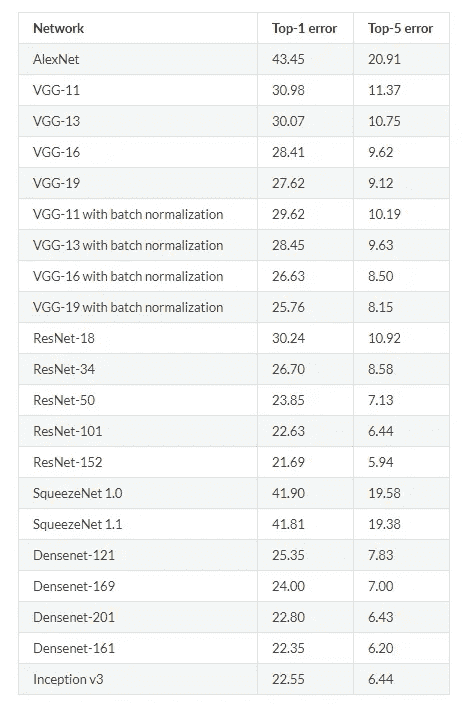

Pretrained models in PyTorch and performance on Imagenet ([Source](https://pytorch.org/docs/stable/torchvision/models.html)).

对于这个实现，我们将使用`VGG-16`。虽然它没有记录最低的错误，但我发现它很适合这项任务，并且比其他模型训练起来更快。使用预先训练好的模型的过程已经建立:

1.  从在大型数据集上训练的网络中加载预先训练的权重
2.  冻结较低(卷积)层中的所有权重:根据新任务与原始数据集的相似性来调整要冻结的层
3.  用一个定制的分类器代替网络的上层:输出的数量必须设置成等于类的数量
4.  仅为任务训练自定义分类器层，从而为较小的数据集优化模型

在 PyTorch 中加载预先训练好的模型非常简单:

```
from torchvision import models
model = model.vgg16(pretrained=True)
```

这个模型有超过 1.3 亿个参数，但我们将只训练最后几个完全连接的层。最初，我们冻结模型的所有权重:

```
# Freeze model weights
for param in model.parameters():
    param.requires_grad = False
```

然后，我们添加我们自己的自定义分类器，包含以下层:

*   与 ReLU 激活完全连接，shape = (n_inputs，256)
*   辍学几率为 40%
*   与 log softmax 输出完全连接，shape = (256，n_classes)

```
import torch.nn as nn# Add on classifier
model.classifier[6] = nn.Sequential(
                      nn.Linear(n_inputs, 256), 
                      nn.ReLU(), 
                      nn.Dropout(0.4),
                      nn.Linear(256, n_classes),                   
                      nn.LogSoftmax(dim=1))
```

当额外的层被添加到模型中时，它们被默认设置为可训练的(`require_grad=True`)。对于 VGG-16，我们只改变了最后一个原始的全连接层。卷积层和前 5 个全连接层中的所有权重都是不可训练的。

```
# Only training classifier[6]
model.classifier**Sequential(
  (0): Linear(in_features=25088, out_features=4096, bias=True)
  (1): ReLU(inplace)
  (2): Dropout(p=0.5)
  (3): Linear(in_features=4096, out_features=4096, bias=True)
  (4): ReLU(inplace)
  (5): Dropout(p=0.5)
  (6): Sequential(
    (0): Linear(in_features=4096, out_features=256, bias=True)
    (1): ReLU()
    (2): Dropout(p=0.4)
    (3): Linear(in_features=256, out_features=100, bias=True)
    (4): LogSoftmax()
  )
)**
```

网络的最终输出是我们数据集中 100 个类别中每个类别的*对数概率*。该模型共有 1.35 亿个参数，其中仅超过 100 万个将被训练。

```
# Find total parameters and trainable parameters
total_params = sum(p.numel() for p in model.parameters())
print(f'{total_params:,} total parameters.')
total_trainable_params = sum(
    p.numel() for p in model.parameters() if p.requires_grad)
print(f'{total_trainable_params:,} training parameters.')**135,335,076 total parameters.
1,074,532 training parameters.**
```

## 将模型移动到 GPU

PyTorch 最好的一个方面是可以轻松地将模型的不同部分移动到一个或多个 GPU 上，这样你就可以充分利用你的硬件。由于我使用 2 个 GPU 进行训练，我首先将模型移动到`cuda`，然后创建一个分布在 GPU 上的`DataParallel`模型:

```
# Move to gpu
model = model.to('cuda')
# Distribute across 2 gpus
model = nn.DataParallel(model)
```

(此笔记本应在 gpu 上运行，以便在合理的时间内完成。cpu 的加速比可以轻松提高 10 倍甚至更多。)

## 培训损失和优化

训练损失(预测值和真实值之间的误差或差异)是[负对数似然](https://ljvmiranda921.github.io/notebook/2017/08/13/softmax-and-the-negative-log-likelihood/) (NLL)。(PyTorch 中的 NLL 损失预期对数概率，因此我们从模型的最终层传入原始输出。) [PyTorch 使用自动微分](https://pytorch.org/tutorials/beginner/blitz/autograd_tutorial.html)这意味着张量不仅记录它们的值，还记录每一次运算(乘法、加法、激活等)。)对价值有贡献。这意味着我们可以计算网络中任何张量相对于任何先前张量的梯度。

这实际上意味着损失不仅跟踪*误差*，还跟踪*在模型中每个权重和偏差*对误差的贡献。计算损耗后，我们可以找到损耗相对于每个模型参数的梯度，这个过程称为[反向传播](http://neuralnetworksanddeeplearning.com/chap2.html)。一旦我们有了梯度，我们就用它们来更新优化器的参数。(如果一开始没有理解，不要担心，需要一点时间来掌握！这张幻灯片有助于澄清一些观点。)

[优化器是 Adam](https://machinelearningmastery.com/adam-optimization-algorithm-for-deep-learning/) ，它是[梯度下降](https://www.kdnuggets.com/2017/04/simple-understand-gradient-descent-algorithm.html)的有效变体，通常不需要手动调整学习速率。在训练期间，优化器使用损失的梯度来尝试通过调整参数来减少模型输出的误差(“优化”)。*只有我们在自定义分类器中添加的参数才会被优化*。

损失和优化程序初始化如下:

```
from torch import optim# Loss and optimizer
criteration = nn.NLLLoss()
optimizer = optim.Adam(model.parameters())
```

有了预先训练好的模型、自定义分类器、损耗、优化器以及最重要的数据，我们就可以开始训练了。

# 培养

PyTorch 中的模型训练比 Keras 中的模型训练需要更多的动手操作，因为我们必须自己完成反向传播和参数更新步骤。主循环在多个时期上迭代，并且在每个时期上我们迭代通过火车`DataLoader`。`DataLoader`产生我们通过模型传递的一批数据和目标。在每个训练批次之后，我们计算损失，反向传播损失相对于模型参数的梯度，然后用优化器更新参数。

我建议您查看[笔记本](https://github.com/WillKoehrsen/pytorch_challenge/blob/master/Transfer%20Learning%20in%20PyTorch.ipynb)了解完整的培训细节，但基本伪代码如下:

我们可以继续迭代数据，直到达到给定的历元数。然而，这种方法的一个问题是，我们的模型最终会开始*过度适应训练数据*。为了防止这种情况，我们使用我们的验证数据和*提前停止*。

## 提前停止

[提前停止](https://en.wikipedia.org/wiki/Early_stopping)表示当验证损失在多个时期内没有减少时，停止训练。随着我们继续培训，培训损失只会减少，但验证损失最终会达到最小值，并趋于平稳或开始增加。理想情况下，我们希望在验证损失最小的时候停止训练，希望这个模型能够最好地概括测试数据。当使用早期停止时，在验证损失减少的每个时期，我们保存参数，以便我们可以稍后检索具有最佳验证性能的参数。

我们通过在每个训练时期结束时迭代验证`DataLoader`来实现早期停止。我们计算验证损失，并将其与最低验证损失进行比较。如果损失是目前为止最低的，我们保存模型。如果损失在一定数量的时期内没有改善，我们停止训练并返回已经保存到磁盘的最佳模型。

同样，完整的代码在笔记本上，但伪代码是:

要了解提前停止的好处，我们可以查看显示训练和验证损失以及准确性的训练曲线:

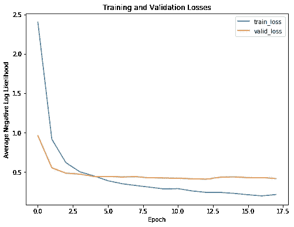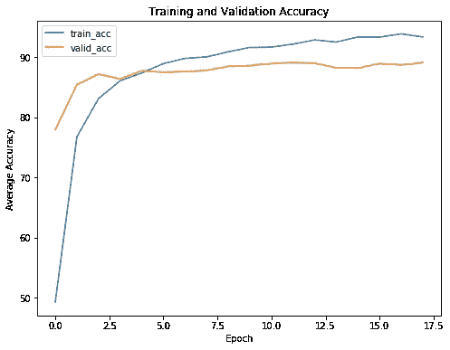

Negative log likelihood and accuracy training curves

不出所料，随着进一步的培训，培训损失只会继续减少。另一方面，验证损失达到最小值并处于平稳状态。在某个时期，进一步训练是没有回报的(甚至是负回报)。我们的模型将只开始记忆训练数据，而不能推广到测试数据。

> 如果不提前停止，我们的模型将训练超过必要的时间*和*将过度适应训练数据。

我们可以从训练曲线中看到的另一点是，我们的模型没有过度拟合。总会有一些过拟合，但是第一个可训练全连接层之后的[下降](https://medium.com/@amarbudhiraja/https-medium-com-amarbudhiraja-learning-less-to-learn-better-dropout-in-deep-machine-learning-74334da4bfc5)防止训练和验证损失偏离太多。

# 做出预测:推理

在笔记本中，我处理了一些无聊但必要的保存和加载 PyTorch 模型的细节，但这里我们将直接进入最精彩的部分:对新图像进行预测。我们知道我们的模型在训练甚至验证数据方面做得很好，但最终的测试是它在以前从未见过的测试集上的表现。我们保存了 25%的数据，目的是确定我们的模型是否可以推广到新数据。

用经过训练的模型进行预测非常简单。我们使用与训练和验证相同的语法:

```
for data, targets in testloader:
    log_ps = model(data)
    # Convert to probabilities
    ps = torch.exp(log_ps)ps.shape()**(128, 100)**
```

我们概率的形状是(`batch_size`，`n_classes`)，因为我们对每一类都有一个概率。我们可以通过找到每个示例的最高概率来确定准确性，并将这些概率与标签进行比较:

```
# Find predictions and correct
pred = torch.max(ps, dim=1)
equals = pred == targets# Calculate accuracy
accuracy = torch.mean(equals)
```

当[诊断用于对象识别的网络](https://www.coursera.org/lecture/machine-learning/model-selection-and-train-validation-test-sets-QGKbr)时，查看测试集的整体性能和单个预测会很有帮助。

## 模型结果

这是模型钉子的两个预测:

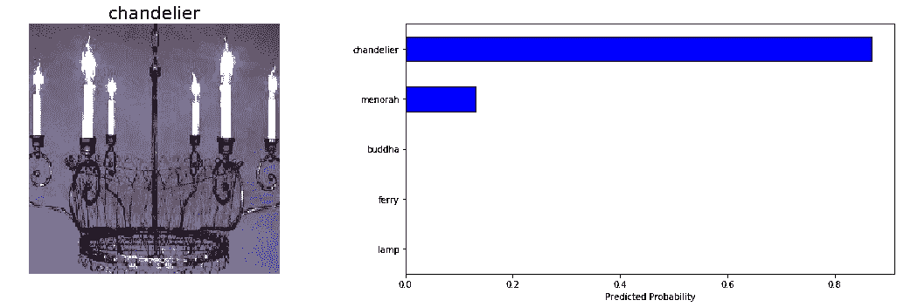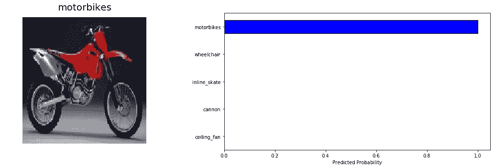

这些都很简单，所以我很高兴这个模型没有问题！

我们不想只关注正确的预测，我们很快就会看到一些错误的输出。现在，让我们评估整个测试集的性能。为此，我们想要迭代测试`DataLoader`并计算每个例子的损失和准确性。

用于对象识别的卷积神经网络一般用 [topk 精度](https://stats.stackexchange.com/questions/95391/what-is-the-definition-of-top-n-accuracy)来衡量。这指的是真实的类是否在 k 个最可能预测的类中。例如，前 5 名准确率是指正确的类别在 5 个最高概率预测中所占的百分比。您可以从 PyTorch 张量中获得 topk 个最可能的概率和类，如下所示:

```
top_5_ps, top_5_classes = ps.topk(5, dim=1)
top_5_ps.shape**(128, 5)**
```

在整个测试集上评估模型，我们计算指标:

```
**Final test top 1 weighted accuracy = 88.65%
Final test top 5 weighted accuracy = 98.00%
Final test cross entropy per image = 0.3772.**
```

与验证数据上接近 90%的前 1 名准确度相比，这是有利的。**总的来说，我们得出结论，我们的预训练模型能够成功地将其知识从 Imagenet 转移到我们更小的数据集。**

## 模型调查

虽然这个模型做得很好，但可能还需要采取一些措施来使它变得更好。通常，找出如何改进模型的最佳方法是调查其错误(注意:这也是一种有效的自我改进方法。)

我们的模型不擅长识别鳄鱼，所以让我们来看看这一类别的一些测试预测:

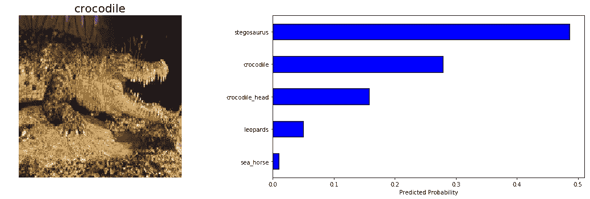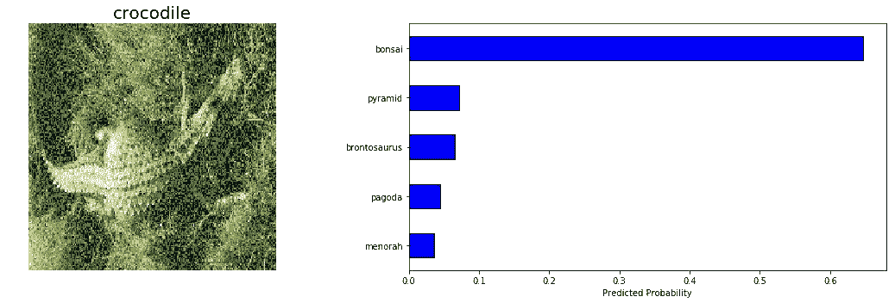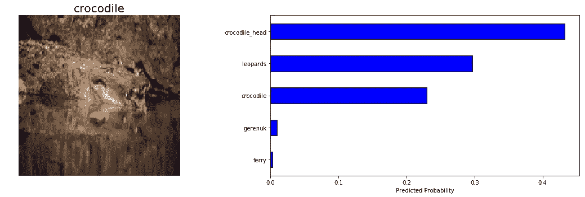

鉴于`crocodile`和`crocodile_head`之间的微妙区别，以及第二幅图像的难度，我要说我们的模型在这些预测中并非完全不合理。图像识别的最终目标是超越人类的能力，我们的模型就快实现了！

最后，我们希望该模型在包含更多图像的类别中表现更好，因此我们可以查看给定类别的准确性与该类别中训练图像数量的关系图:

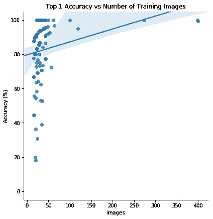

在训练图像的数量和前 1 名测试准确度之间确实存在正相关。这表明*更多的训练数据增加可能是有帮助的* l，或者，甚至我们应该使用[测试时间增加](https://forums.fast.ai/t/change-to-how-tta-works/8474/3)。我们还可以尝试不同的预训练模型，或者构建另一个自定义分类器。目前，深度学习仍然是一个经验领域，这意味着经常需要实验！

# 结论

虽然有更容易使用的深度学习库，但 PyTorch 的[优势是](http://www.goldsborough.me/ml/ai/python/2018/02/04/20-17-20-a_promenade_of_pytorch/)[速度](https://www.netguru.co/blog/deep-learning-frameworks-comparison)，对模型架构/训练的每个方面的控制，使用[张量自动微分](/getting-started-with-pytorch-part-1-understanding-how-automatic-differentiation-works-5008282073ec)的反向传播的有效实现，以及由于 PyTorch 图形的[动态特性而易于调试代码](https://medium.com/intuitionmachine/pytorch-dynamic-computational-graphs-and-modular-deep-learning-7e7f89f18d1)。对于生产代码或您自己的项目，我不确定是否有令人信服的理由使用 PyTorch 而不是学习曲线较平缓的库，如 Keras，但是知道如何使用不同的选项是有帮助的。

通过这个项目，我们能够看到使用 PyTorch 的基础知识以及*迁移学习*的概念，这是一种有效的对象识别方法。我们可以使用已经在大型数据集上训练过的现有架构，然后针对我们的任务调整它们，而不是从头开始训练模型。这减少了训练的时间，通常会带来更好的整体表现。这个项目的成果是迁移学习和 PyTorch 的一些知识，我们可以在此基础上构建更复杂的应用程序。

我们确实生活在一个令人难以置信的深度学习时代，任何人都可以利用容易获得的资源建立深度学习模型！现在，走出去，通过构建自己的项目来利用这些资源。

一如既往，我欢迎反馈和建设性的批评。可以通过推特 [@koehrsen_will](http://twitter.com/@koehrsen_will) 或者通过我的个人网站 [willk.online](https://willk.online) 找到我。