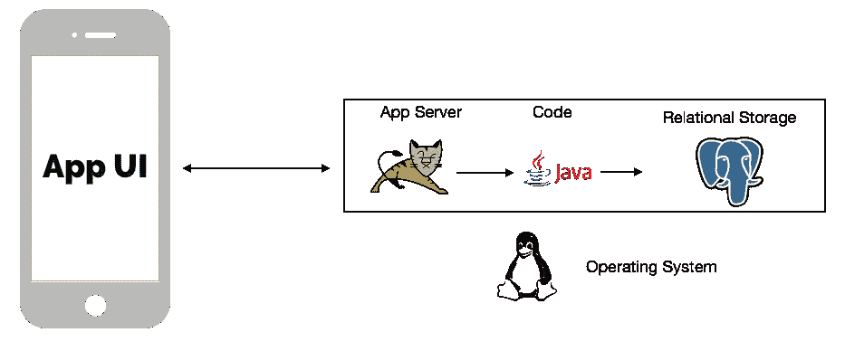

# 转变数据驱动的文化从顶层开始:如何让你的 CTO 接受数据驱动的战略

> 原文：<https://towardsdatascience.com/transforming-the-data-driven-culture-starts-from-the-top-how-to-get-your-cto-to-embrace-c2e5af868eba?source=collection_archive---------7----------------------->

Teamwork makes the (Data) Dream work

在之前的一篇文章中，我讨论了为什么公司需要[数据战略，而不仅仅是更多的数据人员](/become-data-driven-or-perish-why-your-company-needs-a-data-strategy-and-not-just-more-data-people-aa5d435c2f9)，在这篇文章中，我想分解一下头号原因，为什么大多数想要成为数据驱动的公司都在为之奋斗，以及如何克服它。

正如我在之前的帖子中所描述的那样，“[要么成为数据驱动，要么灭亡](/become-data-driven-or-perish-why-your-company-needs-a-data-strategy-and-not-just-more-data-people-aa5d435c2f9)”，在开始实施您的战略之前，任何组织都需要经历四个步骤。即；
— *第一*，让专人负责数据，
— *第二*，将组织的关键抱负与数据价值链结合起来，*第三*，根据这些抱负制定战略，
— *第四*，吸引实现战略所需的人才。

## 技术驱动还是数据驱动

每当我讨论为什么有人需要对公司的数据负责时，我经常会注意到，首席技术官或开发部门的负责人对为什么有必要这样做最为关键。他们批评的原因不是来自对数据的不信任，而是来自这样一种观念，即大多数首席技术官看不到成为数据驱动的投资回报，更不用说引入一个完全负责数据的新高管了。

大多数首席技术官将检查组织的短期和长期技术需求视为自己的责任，并利用资本进行旨在帮助组织实现其目标的投资，但直到现在，大多数公司尚未证明在分析、数据科学、大数据、机器学习和人工智能方面的资本投资，以说服大多数首席技术官做出这一决定。

因此，当讨论作为驱动因素的数据时，CTO 的第一反应通常是技术不应该由数据战略决定，而是开发解决方案所需的技术应该是其他人可以获得数据并将结果用于决策的基础。

举例来说，如果你正在建立一家科技公司，创始人处于发展的早期阶段，首席执行官将为客户的需求列出案例，他或她可能充当产品所有者(在没有 CPO 的情况下)，并列出需要建立什么来解决客户的问题。然后由 CTO 决定并创建构建它所必需的基础设施。

大多数 CTO 会根据他们以前的经验来构建产品，使用他们最熟悉的堆栈，通常不会担心未来的需求。他们正在构建的最低可行产品需要解决最初的问题，随着公司的发展，首席技术官的工作将发生变化，寻找新的方法来扩展平台的基础设施和功能。

因此，当你引入首席数据官、数据主管或其他任何负责数据的人时，就会带来看待基础设施和已构建内容的不同方式，这导致大多数首席技术官的本能反应。

例如，一家正在开发应用程序的公司(想象下一个[优步](https://www.uber.com/)、 [Tinder](https://tinder.com/) 或 [WhatsApp](https://www.whatsapp.com/) )可以决定使用 [Apache Tomcat](http://tomcat.apache.org/) 作为应用程序服务器，使用 [JAVA](https://www.java.com/) 应用程序编写代码，使用 [PostgreSQL](https://www.postgresql.org/) 作为数据库，所有这些都在 Linux 服务器上运行。这听起来是一个很好的开始，但随着成功和增长的到来，引入数据驱动的工作方式和可扩展性，将需要对平台的核心进行重大改变，以允许真正实现数据驱动所需的分析和数据科学功能。

## **如何对付一个有抵抗力的 CTO？**

就在不久前，CTO 的角色被引入。在 20 世纪 90 年代末和 21 世纪初，首席信息官(CIO)负责监管 IT，但随着信息技术复杂性的不断升级，许多公司将 CIO 的部分职责分配给了 CTO。

现在大多数新公司都是技术驱动的，所以首席信息官的角色已经完全被首席技术官取代了。在以信息技术为关键的大多数网络公司或其他技术导向型公司中，首席技术官负责确定如何利用技术来实施业务战略，但随后，首席技术官负责实际集成和运行技术，即“运营经理”的角色。

随着大数据、机器学习和人工智能为公司提供了真正实现数据驱动的机会，首席技术官需要知道，CDO 或数据主管的角色不是取代或威胁首席技术官，而是成为在技术堆栈中实施新的数据驱动技术的合作伙伴。

**提供数据驱动型公司将新技术融入现有体系的例子** 通过真正了解公司当前的基础设施、底层技术并研究哪些产品符合已构建的体系，CTO 数据主管可以将首席技术官转变为拥护者而不是反对者。通过展示核心基础架构如何保持不变，但数据是位于技术基础架构之上的层，CTO 可以看到，即使是非常小的投资也可以使技术变得更好。

**从 MVP 开始，让结果自己说话** 幸运的是，在过去二十年中，设备的处理能力显著增强，以至于数据分析师/数据科学家可以使用像 [RStudio](https://www.rstudio.com/) 或 [Python](https://www.python.org/) 这样的应用来创建一个最小的可行产品。如果可以通过命令行访问数据库，有一些简单的方法可以将数据直接导入 RStudio 或 Python。使用不同的包，数据分析师可以创建仪表板，以显示分析如何为企业提供对存储在数据库中的数据的洞察。

数据科学家可以更进一步，展示如何清理、处理和组织(大)数据，从而产生新产品或服务或增强现有产品或服务。在本地展示这一点，可以为可以与现有技术集成的生产版本打开大门。

**创建一个非技术性用例来阐述您的观点** 随着业务从非数字化向数字化的转变，我们能够访问公司外部生成的数据。从营销、销售到人力资源，一切都产生数据，这些数据提供了改进和构建用例的机会，以展示数据驱动的潜力。

该网站采用了 [Google Analytics](https://www.google.com/analytics/) ，使公司能够改善网站性能，增加销售线索或销售更多产品。通过 [Mailchimp](https://mailchimp.com/) 进行的电子邮件营销，通过 [HubSpot](https://www.hubspot.com/) 进行的客户关系管理，或者通过 [ADP](https://www.adp.nl/) 进行的人力资源管理，都提供了大量的数据，这些数据可用于提高转化率、交付周期或揭示对员工行为的洞察。通过使用非核心数据来改善业务，可以向董事会成员展示成为数据驱动型企业的好处，并为首席技术官的参与提供依据。

## **不要勉强**

最终，这一切都归结于改变一个组织的文化，不是通过推动或自上而下的执行，而是通过建立一个案例，说明为什么数据应该得到高管的充分关注。就像二十年前，当公司开始雇佣首席技术官时，因为技术驱动的方法创造了世界上最大的一些公司。信息时代的最新阶段，让那些真正接受数据驱动的工作方式的公司，有能力使自己与众不同，抢占市场份额和利润，而那些不愿意适应的公司则被搁置一旁。

## 感谢阅读；)，如果你喜欢它，请点击下面的掌声按钮，这对我意义重大，也有助于其他人了解这个故事。通过联系 Twitter 或 Linkedin 让我知道你的想法。