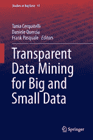

# 大数据和小数据的透明数据挖掘

> 原文：<https://towardsdatascience.com/transparent-data-mining-for-big-and-small-data-6564ca7bc004?source=collection_archive---------6----------------------->

我和[塔妮娅](http://dbdmg.polito.it/tcerquitelli/)([@塔妮娅 _ 托里诺](https://twitter.com/tania_torino))和[弗兰克](https://www.law.umaryland.edu/faculty/profiles/faculty.html?facultynum=984)([@弗兰克帕斯夸莱](http://twitter.com/FrankPasquale))合编的[书现在出了！长话短说，这里有一个总结。算法正在越来越多地影响我们的生活，然而它们背后的过程是隐藏的——它们通常像黑盒一样工作。这本书为更好的算法提供了设计原则。世界知名专家介绍了各种旨在提高透明度的解决方案，这些方案不仅是算法上的，也是监管上的。](http://www.springer.com/gp/book/9783319540238)

**前言**(说来话长)

算法正越来越多地影响着我们的生活。他们通过推荐最小化风险的活动来促进健康习惯，通过从多个来源估计信用评分来促进金融交易，并通过描述购买模式来推荐购买什么。他们所做的一切不仅基于人们直接披露的数据，还基于从行为模式和社交网络中推断出来的数据。

算法影响着我们，然而它们背后的过程却是隐藏的。他们经常作为黑盒工作。由于缺乏透明度，不道德行为是可能的。由于有偏见的训练数据，算法可以只为人口的子集推荐最小化健康风险的活动。他们可能会基于与种族不完全相关的因素拒绝抵押贷款，从而延续种族歧视。他们可能通过向有支付能力的人提供更高的网上购物价格来促进不公平的价格歧视。在秘密和复杂性的笼罩下，算法决策很可能会延续偏见和成见。

这本书为更好的算法提供了设计原则。为了便于阅读，本书分为三个部分，分别针对不同背景的读者。*为确保透明采矿，解决方案首先应增加透明度(第一部分)，此外，它们不仅应是算法性的(第二部分)，还应是监管性的(第三部分)。*

首先从第一部分开始，算法越来越多地被用于对公共产品(如健康、安全、金融、就业)做出更好的决策，透明度和问责制等要求也是急需的。[章节“数据的暴政？《数据驱动的社会公益决策的光明面和黑暗面》](https://link.springer.com/chapter/10.1007/978-3-319-54024-5_1)([pdf 预印本](https://arxiv.org/pdf/1612.00323.pdf))、Lepri *等人(* [@brulepri](https://twitter.com/brulepri?lang=en) 、@ [dsango](https://twitter.com/dsango) 、[@ brulepri](https://twitter.com/brulepri)[@ stja co](https://twitter.com/stjaco)[@ nuriaoliver](https://twitter.com/nuriaoliver)[@ ManuLetouze](https://twitter.com/ManuLetouze)*)*提出了一些关键观点在“后真相”政治时代——政治上使用“感觉真实”但没有事实依据的断言——新闻媒体也可能受益于透明度。如今，算法被用于制作、分发和过滤新闻文章。在“[启用算法媒体的责任:作为建设性和批判性透镜的透明性](https://link.springer.com/chapter/10.1007%2F978-3-319-54024-5_2)一章中，Diakopoulos([@ ndiakopoulos](http://twitter.com/ndiakopoulos))介绍了一个模型，该模型列举了可能被披露的关于这种算法的不同类型的信息。通过这样做，该模式实现了透明度和媒体问责制。更一般地说，为了支持整个网络的透明度，[普林斯顿网络透明度和问责制项目](https://webtap.princeton.edu)(第"[章普林斯顿网络透明度和问责制项目](https://link.springer.com/chapter/10.1007%2F978-3-319-54024-5_3) ") ( [pdf 预印本](http://randomwalker.info/publications/webtap-chapter.pdf))持续监控了数千个网站，以揭示用户数据是如何被收集和使用的，潜在地减少了信息不对称(更多更新来自 [@random_walker](https://twitter.com/random_walker?ref_src=twsrc%5Egoogle%7Ctwcamp%5Eserp%7Ctwgr%5Eauthor) )。

更好算法的设计原则也是算法的本质，这就是为什么**第二部分**关注算法解决方案。达塔*等人*引入了一系列量化不同输入数据对输出的影响程度的方法(章节“[通过量化输入影响实现算法透明](https://link.springer.com/chapter/10.1007/978-3-319-54024-5_4)”)。这些措施被称为定量输入影响(QII)措施，有助于确定各种算法中的歧视和偏见，包括黑箱算法(只需要完全控制输入和完全观察输出)。但并不是所有的算法都是黑盒。基于规则的分类器可以很容易地被人类理解，但是它们已经被证明不如最先进的算法准确。这也是因为无效的传统训练方法。为了部分解决这个问题，Malioutov 等人在章节[用布尔压缩感知学习可解释分类规则](https://link.springer.com/chapter/10.1007/978-3-319-54024-5_5)中提出了训练基于布尔规则的分类器的新方法。这些方法不仅在理论上有充分的依据，而且在实践中也证明是准确的。尽管如此，深度神经网络所达到的精确度迄今为止还是无人能敌。大量的训练数据被输入到神经元的输入层，信息被处理到几个(中间)隐藏层，结果从输出层出来。为了揭示这些隐藏层，最近提出了神经网络内部功能的可视化方法。Seifert 等人提供了这些方法的综合概述，并且他们是在计算机视觉的背景下这样做的(第“[章计算机视觉中深度神经网络的可视化:调查](https://link.springer.com/chapter/10.1007%2F978-3-319-54024-5_6)”)。

最后，**第三部分**详细介绍了与数据发布和处理相关的监管解决方案——在私有数据的基础上，创建模型，这些模型反过来又产生算法决策。这里有三个步骤。第一个问题涉及数据发布。当前的隐私法规(包括“最终用户许可协议”)没有为个人提供足够的保护。Hutton 和 Henderson (@ [tnhh](https://twitter.com/tnhh) )介绍了获得持续和有意义的同意的新方法(章节“[超越 EULA:改善数据挖掘的同意](https://link.springer.com/chapter/10.1007%2F978-3-319-54024-5_7)”)。第二步涉及数据模型。尽管从私人数据中生成，但算法生成的模型在严格的法律意义上并不是个人数据。为了将隐私保护扩展到这些新兴模型，Giovanni Comandè提出了一种新的监管方法(第"[章)监管算法的监管？第一伦理——算法的法律原则、问题和机遇](https://link.springer.com/chapter/10.1007%2F978-3-319-54024-5_8))。最后，第三步涉及算法决策。在章节“[中，一个监督组织在确保算法问责中能扮演什么角色？](https://link.springer.com/chapter/10.1007%2F978-3-319-54024-5_9)"，[算法手表](https://algorithmwatch.org)呈现(作者 [@spielkamp](http://twitter.com/spielkamp) )。这是一个监督和倡导倡议，分析算法决策对人类行为的影响，并使它们更加透明和可理解。

在我们的社会中，数据挖掘有着巨大的潜力，但需要更多的透明度和问责制。这本书只介绍了一些开始出现的令人鼓舞的倡议。