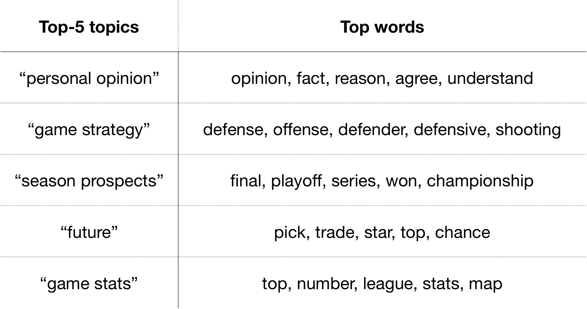
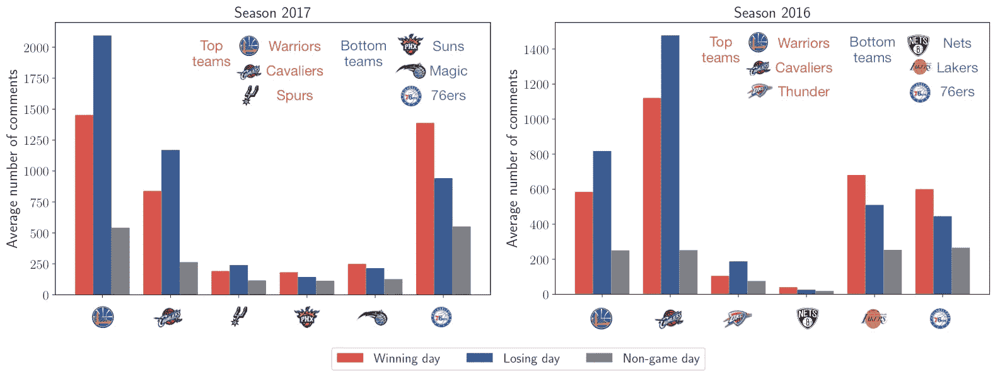
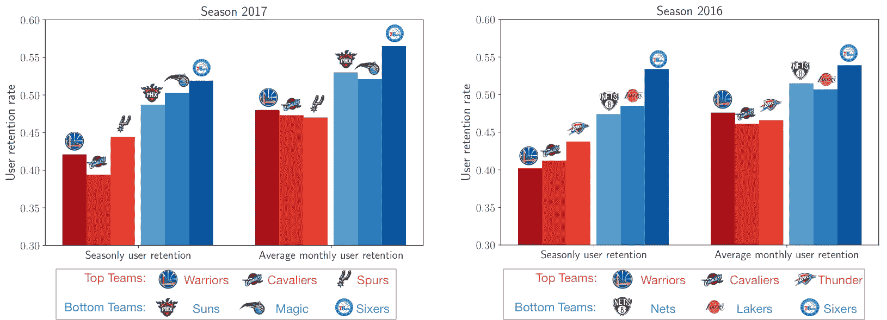
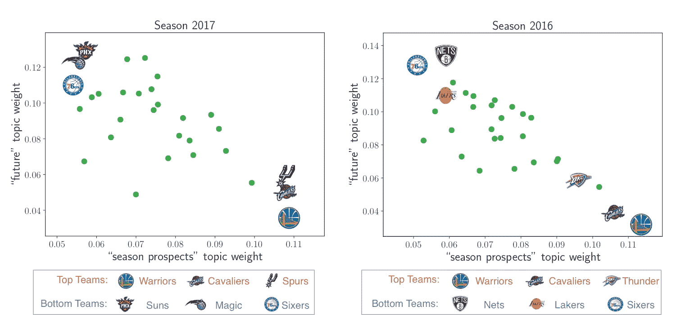

# “信任流程？”在线体育社区是如何被线下环境塑造的

> 原文：<https://towardsdatascience.com/trust-the-process-the-interplay-between-online-sports-communities-and-offline-context-bc1b37a7ff74?source=collection_archive---------27----------------------->

*本博客总结了我们的*[*【CSCW】2018*](https://cscw.acm.org/2018/)*论文“‘*[*这就是我们打球的原因”:NBA 各支球队*](http://jasondarkblue.com/papers/CSCW2018NBA.pdf) *【网上球迷社区】由* [*贾森·*](http://jasondarkblue.com/)*[*谭*](https://chenhaot.com/)*[*吕钦*](https://www.cs.colorado.edu/~lv/)**

****(** 交叉发布至 [ACM CSCW](https://medium.com/acm-cscw) **)****

**许多在线社区不仅存在于虚拟世界中，而且也深深嵌入到线下环境中，吸引着具有类似线下兴趣的人。了解在线社区与线下环境的关联程度和方式是一个重要的研究问题。**

**职业体育提供了一个有趣的案例，因为在某种程度上，这些在线粉丝社区只是作为线下运动队和游戏的结果而存在。这种联系也突出了结合多种数据源来理解在线社交媒体中粉丝行为如何与他们感兴趣的主题的持续事件相关联的必要性。**

**在这里我们分享一个 Reddit 上的有趣故事。2018 年 2 月 7 日，NBA 球队菲尼克斯太阳队以 48 分之差输给圣安东尼奥马刺队，追平了球队历史上最糟糕的输球。在巨大的损失之后，当然，太阳队的球迷非常失望。但是，他们没有放弃团队，也没有抛弃团队子编辑，而是把这个体育子编辑变成了科学子编辑，开始讨论太阳系的太阳！那天晚上贴了很多搞笑的标题，比如这个:“你知道吗，太阳包含了太阳系所有质量的 99.86%？”**

****

**After the huge loss, the fans of the Phoenix Suns turned their team subreddit into a science subreddit, starting to talk about the Sun in the Solar System.**

**在我们新的[CSCW](http://cscw.acm.org/)T2 论文中，我们着迷于在线粉丝社区中的这种用户行为，我们从 Reddit 构建了一个[大规模数据集](http://jasondarkblue.com/)，它结合了 NBA 相关社区(30 个球队子社区和/r/NBA)中的 150 万个帖子和 4300 万个评论，以及记录 NBA 球队表现的离线统计数据。我们在比赛层面和赛季层面研究了球队表现和球迷行为之间的相互作用。**

## **用户活动与 NBA 赛季的结构密切相关。**

**首先，我们发现 NBA 赛季的结构驱动了 NBA 相关子区域的用户活动。如果我们按月使用/r/NBA 中生成的评论数来衡量用户活跃度，那么在每个休赛期(7 月-10 月中旬)，用户活跃度都会急剧下降，因为在此期间没有比赛。在常规赛中(10 月下旬-次年 3 月)，用户活跃度稳步上升。活动在五月和六月达到高峰，因为冠军赛在这两个月举行。**

****

**User activity in /r/NBA by month.**

## **线上粉丝活动反映了线下的游戏玩法。**

**NBA 相关 subreddits 的一个重要特点就是支持游戏相关的讨论。实际上，每个游戏在相应的 team subreddit 中都有一个游戏线程。我们鼓励粉丝在游戏主题中发表与游戏相关的评论。通过比较 2017 赛季比赛当天每个小时在每个团队子编辑中发表评论的平均比例(根据一场比赛的开始时间进行归一化)，我们观察到比赛时间是团队子编辑中最活跃的时间。用户活动在比赛开始前一个小时开始增加，在第二个小时达到峰值。这一趋势与持续约 2.5 小时的典型 NBA 比赛完全一致。**

****

**User activity by hour on the game day.**

## ****粉丝都聊些什么？****

**接下来，我们使用主题建模来分析这些 NBA 相关子主题中的用户评论内容。权重最高的五个主题可以概括为:“个人观点”、“游戏策略”、“赛季前景”、“未来”和“游戏统计数据”我们稍后将回到这一点，看看团队绩效如何影响讨论。**

****

**The Top-5 topics discussed by fans in /r/NBA.**

## ****游戏层面的团队表现如何影响粉丝活跃度？****

**有人可能会假设，赢得一场比赛会在团队子编辑中引发更高水平的活动。然而，我们发现并非所有团队都是如此。我们的分层回归分析表明，顶级球队的球迷在输球后往往更活跃，而底层球队的球迷则表现出完全相反的趋势。使用 2017 和 2016 赛季的前 3 名和后 3 名球队，出现了一致的模式:**

*   **在所有这些球队中，比赛日的平均评论数明显高于非比赛日；**
*   **对于所有排名靠前的球队，输球日的平均评论数都高于赢球日，但对于排名靠后的球队，结果正好相反。**

****

***The top-3 team subreddits have more comments on losing days, while the bottom-3 team subreddits show the opposite trend.***

**顶级团队和底层团队之间的互动表明，“惊喜”可能是一个相当重要的因素。例如，在 2017 赛季，前三名球队的平均胜率在 75%以上。顶级球队的球迷可能习惯于他们支持的球队赢得比赛，在这种情况下，输掉比赛对他们来说是一件令人惊讶的事情。相比之下，倒数三名球队的平均胜率都在 30%以下。看着自己的球队获胜，这些球迷感到振奋。“惊喜”带来了额外的兴奋，可以刺激相应游戏线程中的更多评论。**

***关于本博客中提到的所有层次回归分析的细节，请参考我们的* [*论文*](http://jasondarkblue.com/papers/CSCW2018NBA.pdf) *。***

## ****赛季级别的团队表现如何与团队子区域中的粉丝忠诚度相关联？****

**我们的结果表明，团队绩效(根据 FiveThirtyEight.com[提供的 Elo 评级估算)对赛季级用户留存率和月度用户留存率都有显著的负面影响。再次使用 2017 和 2016 赛季的前 3 名和后 3 名球队，无论是赛季之间还是月份之间，垫底球队的用户留存率都比顶级球队高得多。](https://fivethirtyeight.com/)**

****

***Fans of the top-3 teams are less loyal, and fans of the bottom-3 teams tend to stay.***

**职业体育中著名的“赶时髦”现象可能有助于解释这一现象:一些球迷可能会“赶时髦”，开始追随一支目前表现最好并卫冕冠军的运动队。只要团队开始表现不佳，他们就会跳下船，加入另一个表现更好的团队。相比之下，糟糕的团队表现可以作为忠诚度过滤器。经过一段时间的糟糕表现，只有铁杆粉丝会保持积极乐观。不管这个队表现得多差，他们都会继续支持他们。**

## ****赛季级别的团队表现如何影响团队子栏目中的讨论话题？****

**我们的结果表明，团队的表现也驱动着球迷们谈论的话题。“赛季展望”和“未来”话题与团队表现高度相关。好的球队更多讨论“赛季前景”，差的球队更多谈论“未来”如果我们对 2017 和 2016 赛季所有 30 支 NBA 球队进行“未来”和“赛季展望”的话题权重投影，可以看到前 3 名球队一致位于右下角(高“赛季展望”，低“未来”)，后 3 名球队均位于左上角(低“赛季展望”，高“未来”)。**

****

**Fans of the top-3 teams tend to discuss more “season prospects,” and fans of the bottom-3 teams discuss more “future.”**

**我们的结果呼应了体育管理中的一个早期发现:对于表现不佳的球队的球迷来说，框定未来是一种重要的策略，可以在最近缺乏成功的情况下保持积极的身份认同。结合我们之前对球队表现和球迷忠诚度的观察，这可能表明一支运动队的奋斗可以提供一个与忠诚球迷建立深厚感情的绝佳机会。某些球迷可能愿意与他们支持的球队一起经历几乎任何事情，包括多年的失败，以此来承认自己是铁杆球迷。通过这样做，当球队在未来取得成功时，他们获得了在粉丝群体中收获更多情感意义的感觉。**

## **数据集和更多有趣的观察**

**本文的数据集可在 http://jasondarkblue.com/.[获得](http://jasondarkblue.com/.)文中还讨论了更多有趣的观察结果。例如，我们发现球队的市场价值、平均年龄、全明星球员的数量和比赛风格都在球迷活动中发挥着重要作用。**

**还有“[这就是我们玩的原因！](https://www.forbes.com/sites/archenemy/2015/10/12/sneak-peek-nba-launches-new-campaign-this-is-why-we-play/#7d3d23ea4f1b)**

**合作者:[谭](https://chenhaot.com/)和[吕钦](https://www.cs.colorado.edu/~lv/)。**