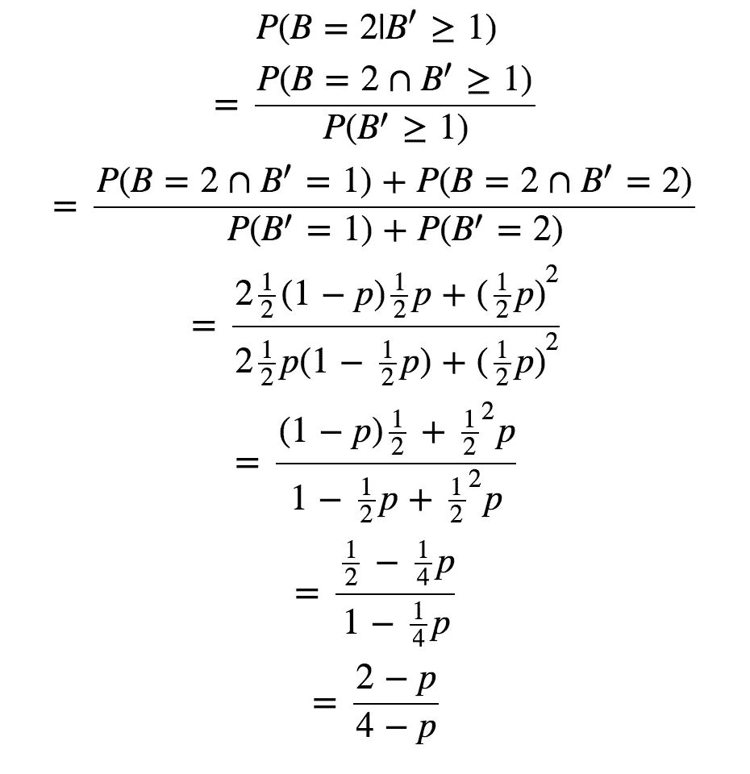
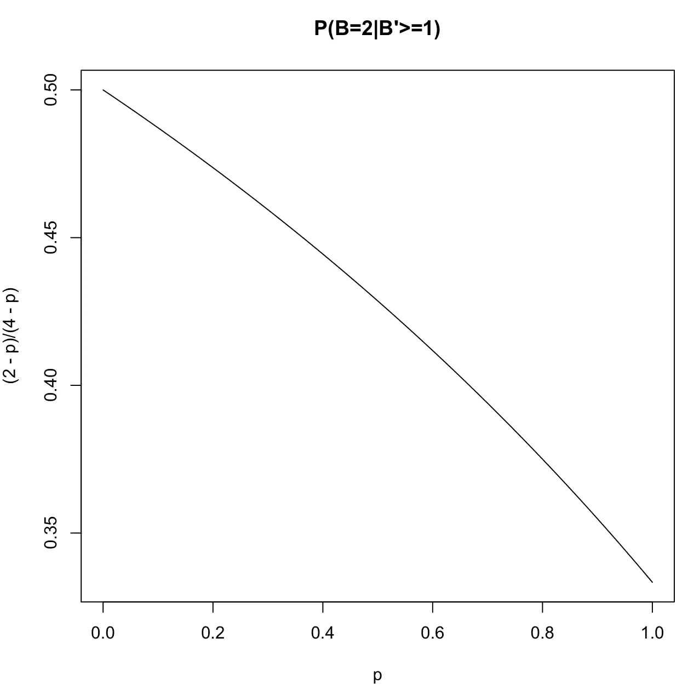

# 周二生日问题

> 原文：<https://towardsdatascience.com/tuesday-birthday-problem-2927e83e5af3?source=collection_archive---------5----------------------->

下面是关于孩子的一系列经典概率问题。它们开始时很温和，逐渐变得越来越难，直到与直觉相悖的程度。这些问题多年来困扰了足够多的人，以至于赢得了“男孩或女孩悖论”的称号。

首先，让我们陈述一些贯穿整个问题的假设。就像现实生活一样，一个孩子生下来是男孩还是女孩的概率是相等的，1/2。每个孩子的性别都是独立的。一个孩子同样有可能在一周中的任何一天出生，而这一天又是独立于他人和性别的。在统计符号中，孩子的性别~iid *伯努利* (1/2)和出生日期在七天内是一致的。


## 1.生男孩的概率有多大？

答案:1/2

在没有任何额外信息的情况下，我们参考给出的假设，即一个男孩出生有 1/2 的几率。

## 2.一个家庭有两个孩子。大的那个是个男孩。另一个也是男生的概率有多大？

答案:1/2

大孩子是男孩与小孩子的性别没有关系，因为每个孩子的性别都是独立的。

## 3.一个家庭有两个孩子。至少有一个孩子是男孩。另一个也是男生的概率有多大？

答案:1/3

惊讶于它不是 1/2？

我们可以从基本原理来解决这个问题。按出生顺序列举二孩家庭的四个等概率事件，得到{GG，GB，BG，BB}，其中 B 代表男孩，G 代表女孩。由于问题陈述家庭至少有一个男孩，GG 情况被排除，只剩下 3 个同等概率事件{GB，BG，BB}。其中 1 有两个男孩，给出了 1/3 的答案。

这个问题和上一个类似，只是我们不再知道提到的男孩是哪个孩子。如果他是更小的孩子，两个可能的事件是{GB，BB}。如果他是年长的那个，也存在两种可能:{BG，BB}。看起来，综合起来，有 4 种可能性，其中 2 有两个男孩，但实际上 BB 的情况在两个集合之间是重复的。在合并它们时，我们必须小心不要重复计算。这一见解将在下一个问题中被证明是有用的。

另一种解决问题的方法是应用条件概率的定义:P(A|B) = P(A 和 B)|P(B)，其中 P(A|B)是给定 B 已经发生的情况下 A 发生的概率。如果 B 是男生数，问题可以表述为:

```
P(B=2|B≥1) 
= P(B=2 and B≥1)/P(B≥1)
= P(B=2)/P(B≥1)
= P(B=2)/(P(B=1) + P(B=2)) 
= ((1/2)²)/(2 * (1/2)² + (1/2)²) 
= (1/4) / (3/4) 
= 1/3
```

## 4.一个家庭有两个孩子。至少有一个孩子是在星期二出生的男孩。另一个也是男生的概率有多大？

答案:13/27

为什么孩子出生的那一天很重要？给定的信息改变了样本空间，样本空间增长了 7 * 7 倍，现在每个孩子的出生日期是一个因素。

让“w”代表一周中任何一天的生日，而“t”代表星期二。

如果在星期二出生的男孩是更小的孩子，在给定的条件下有两种可能:{GwBt，BwBt}。如果他是年长的那个，那么也有两种可能:{BtBw，BtGw}。在合并这些集合时，我们必须小心地移除重复的 BtBt，它包含在 BwBt 和 BtBw 两种情况中。因此，组合集是:{GwBt，BwBt，BtBw，BtGw} - {BtBt}。该集合具有 7(GwBt)+7(BwBt)+7(BtBw)+7(BtGw)-1(BtBt)= 27 个元素。其中 7 (BwBt) + 7 (BtBw) - 1 (BtBt) =13 有两个男孩，给出 13/27。

13/27 ~ .48，更接近 1/2 而不是 1/3，上一个问题的答案。

## 5.概括:一个家庭有两个孩子。至少有一个孩子是男孩，其病情以概率 p 发生，另一个孩子也是男孩的概率是多少？

答案:(2-p)/(4-p)

让 B '是有这种情况的男孩的数量。



如果 p = 1，这意味着条件适用于每个男孩和女孩，因此它没有给出任何信息。我们恢复第三部分列出的“至少有一个是男孩”问题，以及它的概率(2-1)/(4-1) = 1/3。

在第 4 部分中，p = 1/7，其中条件是一周中的生日是星期二。它的概率是(2-(1/7)) / (4-(1/7)) = 13/27。



因为 p，患这种疾病的概率范围是从 0 到 1，一个家庭有两个男孩的概率是从 1/2 到 1/3。

这些问题说明了一种违反直觉的现象，即通常独立的两个变量，在给定某些其他信息的情况下，变得有条件依赖。