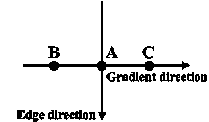
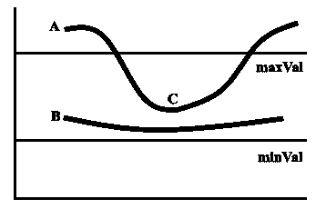
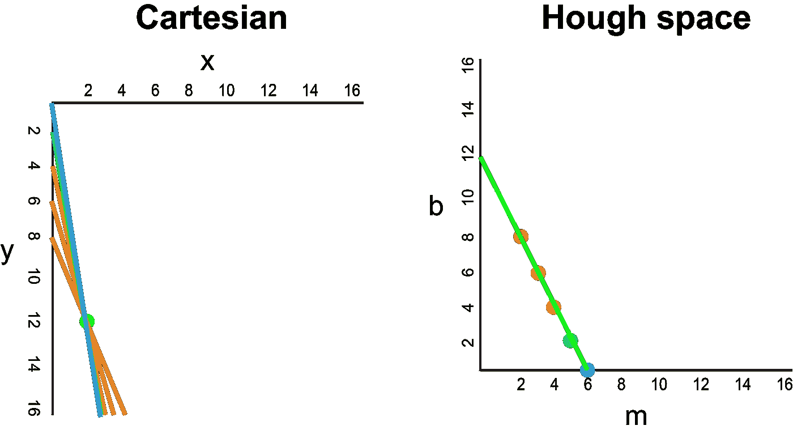
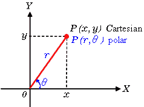
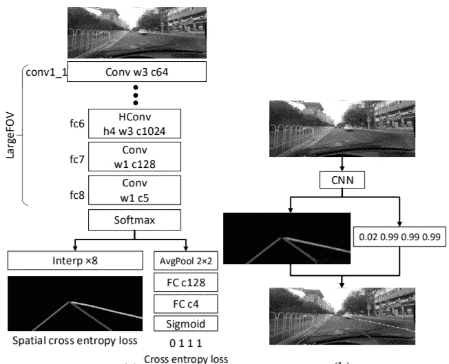

# 教程:构建车道检测器

> 原文：<https://towardsdatascience.com/tutorial-build-a-lane-detector-679fd8953132?source=collection_archive---------2----------------------->

[Waymo 的自动驾驶出租车服务🚕](https://techcrunch.com/2018/12/05/waymo-launches-self-driving-car-service-waymo-one/)本月刚刚上路——但是自动驾驶汽车是如何工作的呢？道路上画的线向人类驾驶员指示车道在哪里，并作为相应地驾驶车辆的方向的指导参考，以及车辆代理如何在道路上和谐互动的约定。同样，识别和跟踪车道的能力对于开发无人驾驶车辆的算法至关重要。


在本教程中，我们将学习如何使用计算机视觉技术建立一个跟踪道路车道的软件管道。我们将通过两种不同的方法来完成这项任务。

## 目录:

[方法一:霍夫变换](#127c)
[方法二:空间 CNN](#bbac)

# 方法 1:霍夫变换

大多数车道设计得相对简单，不仅是为了鼓励有序，也是为了让人类驾驶员更容易以一致的速度驾驶车辆。因此，我们的直观方法可能是首先通过边缘检测和特征提取技术来检测相机馈送中的突出直线。我们将使用 OpenCV，一个计算机视觉算法的开源库来实现。下图概述了我们的管道。


在我们开始之前，这里是我们的成果演示:

## **1。设置您的环境**

如果您尚未安装 OpenCV，请打开终端并运行:

```
pip install opencv-python
```

现在，通过运行以下命令克隆教程存储库:

```
git clone [https://github.com/chuanenlin/lane-detector.git](https://github.com/chuanenlin/lane-detector.git)
```

接下来，用文本编辑器打开`detector.py`。我们将在这个 Python 文件中编写本节的所有代码。

## **2。处理视频**

我们将以一系列间隔为 10 毫秒的连续帧(图像)的形式输入车道检测的样本视频。我们也可以随时按“q”键退出程序。

## **3。应用 Canny 检测器**

Canny 检测器是一种针对快速实时边缘检测而优化的多阶段算法。该算法的基本目标是检测亮度的急剧变化(大梯度)，例如从白到黑的转变，并在给定一组阈值的情况下将它们定义为边缘。Canny 算法有四个主要阶段:

**A .降噪**

与所有边缘检测算法一样，噪声是一个至关重要的问题，经常导致错误检测。5x5 高斯滤波器用于卷积(平滑)图像，以降低检测器对噪声的灵敏度。这是通过使用正态分布数字的内核(在本例中为 5x5 内核)在整个图像上运行来实现的，将每个像素值设置为其相邻像素的加权平均值。


5x5 Gaussian kernel. Asterisk denotes convolution operation.

**B .强度梯度**

然后，沿 x 轴和 y 轴对平滑后的图像应用 Sobel、Roberts 或 Prewitt 内核(Sobel 用于 OpenCV ),以检测边缘是水平的、垂直的还是对角线的。


Sobel kernel for calculation of the first derivative of horizontal and vertical directions

**C .非最大抑制**

非最大抑制应用于“薄”和有效锐化边缘。对于每个像素，检查该值是否是先前计算的梯度方向上的局部最大值。



Non-maximum suppression on three points

a 在垂直方向的边上。由于梯度垂直于边缘方向，B 和 C 的像素值与 A 的像素值进行比较，以确定 A 是否是局部最大值。如果 A 是局部最大值，则测试下一点的非最大抑制。否则，A 的像素值被设置为零，并且 A 被抑制。

**D .滞后阈值**

在非最大值抑制之后，强像素被确认为在最终的边缘图中。但是，应该进一步分析弱像素，以确定它是构成边缘还是噪声。应用两个预定义的 minVal 和 maxVal 阈值，我们设置任何强度梯度高于 maxVal 的像素是边缘，任何强度梯度低于 minVal 的像素不是边缘并被丢弃。如果像素连接到强度梯度高于 maxVal 的像素，则强度梯度在 minVal 和 maxVal 之间的像素仅被视为边缘。



Hysteresis thresholding example on two lines

边 A 高于 maxVal，因此被视为边。边 B 位于 maxVal 和 minVal 之间，但不连接到 maxVal 之上的任何边，因此被丢弃。边 C 位于 maxVal 和 minVal 之间，并连接到边 A，即 maxVal 之上的边，因此被视为边。

对于我们的流水线，我们的帧首先被灰度化，因为我们只需要亮度通道来检测边缘，并且应用 5×5 高斯模糊来降低噪声以减少伪边缘。

## **4。分割车道区域**

我们将手工制作一个三角形遮罩来分割车道区域，并丢弃帧中不相关的区域，以增加我们后期的有效性。


The triangular mask will be defined by three coordinates, indicated by the green circles.

## **5。霍夫变换**

在笛卡尔坐标系中，我们可以通过绘制 y 对 x 将直线表示为`y = mx + b`，然而，我们也可以通过绘制 b 对 m 将该直线表示为霍夫空间中的单个点，例如，具有方程`y = 2x + 1`的直线可以在霍夫空间中表示为`(2, 1)`。


现在，如果我们要在笛卡尔坐标系中画一个点，而不是一条线。有许多可能的线可以通过该点，每条线具有不同的参数 m 和 b 值。例如，点(2，12)可以通过`y = 2x + 8`、`y = 3x + 6`、`y = 4x + 4`、`y = 5x + 2`、`y = 6x`等等。这些可能的直线可以在霍夫空间中绘制为`(2, 8)`、`(3, 6)`、`(4, 4)`、`(5, 2)`、`(6, 0)`。注意，这在霍夫空间中产生了一条 m 对 b 坐标的线。



每当我们看到笛卡尔坐标系中的一系列点，并且知道这些点由一些线连接，我们就可以通过首先将笛卡尔坐标系中的每个点绘制到霍夫空间中的相应线，然后找到霍夫空间中的交点，来找到该线的方程。霍夫空间中的交点表示始终通过系列中所有点的 m 和 b 值。


由于我们通过 Canny 检测器的帧可以简单地解释为表示图像空间中边缘的一系列白点，因此我们可以应用相同的技术来识别这些点中的哪些点与同一条线相连，如果它们相连，其方程是什么，以便我们可以在我们的帧上绘制这条线。

为了解释的简单，我们使用笛卡尔坐标来对应霍夫空间。然而，这种方法有一个数学缺陷:当直线是垂直的时，梯度是无穷大，不能用霍夫空间表示。为了解决这个问题，我们将使用极坐标来代替。过程还是一样的，只是除了在霍夫空间中绘制 m 对 b，我们将绘制 r 对θ。



例如，对于极坐标系统上带有`x = 8`和`y = 6`、`x = 4`和`y = 9`、`x = 12`和`y = 3`的点，我们可以绘制出相应的霍夫空间。


我们看到霍夫空间中的线相交于`θ = 0.925`和`r = 9.6`。由于极坐标系统中的一条线由`r = xcosθ + ysinθ`给出，我们可以推导出穿过所有这些点的单条线被定义为`9.6 = xcos0.925 + ysin0.925`。

通常，在霍夫空间中相交的曲线越多，意味着由该交点表示的线对应的点越多。对于我们的实现，我们将在霍夫空间中定义最小阈值数量的交叉点来检测直线。因此，霍夫变换基本上跟踪帧中每个点的霍夫空间交点。如果交叉点的数量超过定义的阈值，我们用相应的θ和 r 参数识别一条线。

我们应用霍夫变换来识别两条直线，这两条直线将是我们的左右车道边界

## **6。可视化**

车道被可视化为两个浅绿色的线性拟合多项式，它们将覆盖在我们的输入帧上。

现在，打开终端并运行`python detector.py`来测试您的简单车道检测器！如果您错过了任何代码，这里是完整的解决方案和注释:

# 方法 2:空间 CNN

方法 1 中的这种手工制作的传统方法似乎还不错……至少在笔直的道路上是这样。然而，很明显，这种方法在弯道或急转弯时会立即失效。此外，我们注意到车道上由直线组成的标记的存在，如彩色箭头标志，可能会不时干扰车道检测器，从[演示渲染](#35b6)中的小故障可以明显看出。克服这个问题的一种方法是将三角形遮罩进一步细化为两个独立的、更精确的遮罩。然而，这些相当任意的掩模参数根本不能适应各种变化的道路环境。另一个缺点是，由于没有满足霍夫变换阈值的连续直线，车道检测器也会忽略具有虚线标记或根本没有清晰标记的车道。最后，影响线路可见度的天气和照明条件也可能是一个问题。

## **1。架构**

虽然[卷积神经网络](/applied-deep-learning-part-4-convolutional-neural-networks-584bc134c1e2)(CNN)已被证明是[有效的架构](https://medium.com/@sidereal/cnns-architectures-lenet-alexnet-vgg-googlenet-resnet-and-more-666091488df5)，既可以识别图像低层的简单特征(例如边缘、颜色梯度)，也可以识别更深层次的复杂特征和实体(例如对象识别)，但它们通常难以表示这些特征和实体的“姿态”——也就是说，CNN 在从原始像素中提取语义方面很棒，但在捕捉帧中像素的空间关系(例如旋转和平移关系)方面表现不佳。然而，这些空间关系对于车道检测的任务是重要的，其中存在强的形状先验但弱的外观一致性。

例如，仅通过提取语义特征很难确定交通杆，因为它们缺乏明显和连贯的外观线索，并且经常被遮挡。


The car to the right of the top left image and the motorbike to the right of the bottom left image occlude the right lane markings and negatively affect CNN results

然而，由于我们知道交通杆通常表现出类似的空间关系，例如垂直竖立，并放置在道路的左侧和右侧，我们看到了加强空间信息的重要性。类似的情况也适用于车道检测。

为了解决这个问题， [Spatial CNN](https://arxiv.org/pdf/1712.06080.pdf) (SCNN)提出了一种架构，“将传统的深度逐层卷积推广到特征地图内的逐层卷积”。这是什么意思？在传统的逐层 CNN 中，每个卷积层接收来自其前一层的输入，应用卷积和非线性激活，并将输出发送到后续层。SCNN 更进一步，将单个特征图的行和列视为“层”，顺序应用相同的过程(其中顺序是指一个切片仅在接收到来自前面切片的信息后才将信息传递给后面的切片)，允许同一层内神经元之间的像素信息的消息传递，有效地增加了对空间信息的重视。


SCNN 相对较新，今年(2018 年)早些时候才发布，但已经超过了 [ReNet](https://arxiv.org/pdf/1505.00393.pdf) (RNN)、 [MRFNet](https://arxiv.org/pdf/1601.04589.pdf) (MRF+CNN)、更深层次的 [ResNet](https://arxiv.org/pdf/1512.03385.pdf) 架构，并以 96.53%的准确率在 [TuSimple 基准车道检测挑战](http://benchmark.tusimple.ai/)中排名第一。


此外，在发表《SCNN》的同时，作者还发布了 [CULane 数据集](https://xingangpan.github.io/projects/CULane.html)，这是一个大规模数据集，带有带立方刺的车道标注。CULane 数据集还包含许多具有挑战性的场景，包括遮挡和变化的光照条件。


## **2。型号**

车道检测需要精确的逐像素识别和车道曲线预测。SCNN 的作者没有直接训练车道线并在之后进行聚类，而是将蓝色、绿色、红色和黄色车道线作为四个独立的类别。该模型输出每条曲线的概率图(prob map ),类似于[语义分割](/semantic-segmentation-with-deep-learning-a-guide-and-code-e52fc8958823)任务，然后通过一个小型网络传递该概率图，以预测最终的立方刺。该模型基于 [DeepLab-LargeFOV](https://arxiv.org/pdf/1606.00915.pdf) 模型变体。



对于每个存在值超过 0.5 的车道标志，以 20 个行间隔搜索相应的 probmap，以找到具有最高响应的位置。为了确定是否检测到车道标线，计算地面真实值(正确标签)和预测值之间的[交集/并集](https://medium.com/@jonathan_hui/map-mean-average-precision-for-object-detection-45c121a31173) (IoU)，其中高于设定阈值的 IoU 被评估为真阳性(TP)以计算精度和召回率。

## **3。测试和培训**

你可以跟随这个库来重现 SCNN 论文中的结果，或者用 CULane 数据集测试你自己的模型。

**就这样！**🎉希望本教程向您展示了如何使用传统方法构建一个简单的车道检测器，其中涉及许多手工制作的功能和微调，并向您介绍了一种替代方法，这种方法遵循了解决几乎任何类型的计算机视觉问题的最新趋势:您可以添加一个卷积神经网络！


[*亡国？*🙂](https://chuanenlin.medium.com/membership)