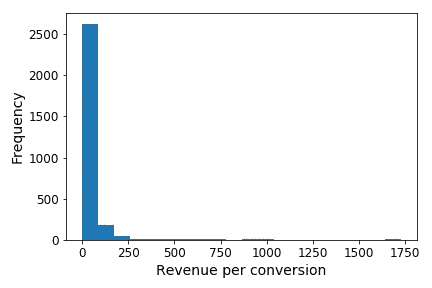
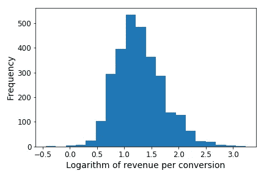
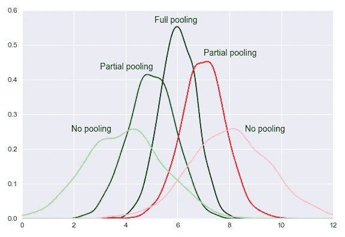
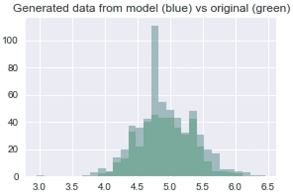
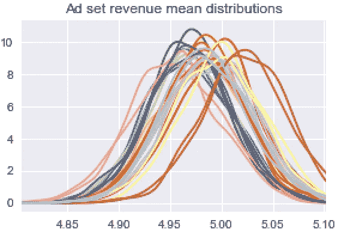
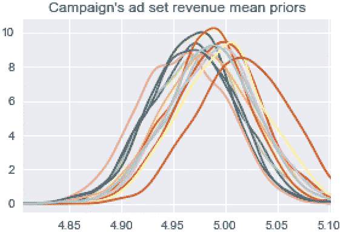
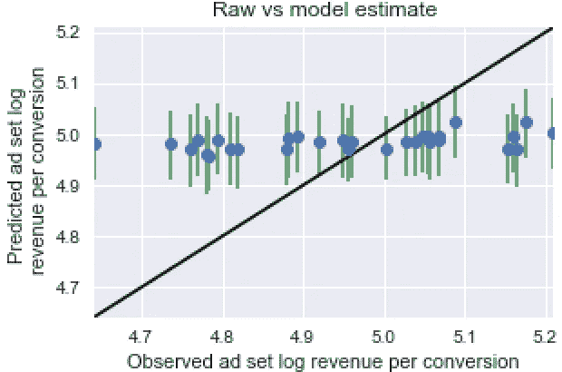

# 教程:我们如何用 Stan 实现贝叶斯收入估计

> 原文：<https://towardsdatascience.com/tutorial-how-we-productized-bayesian-revenue-estimation-with-stan-a10306437875?source=collection_archive---------6----------------------->

在线广告商正转向优化广告支出的总收入，而不仅仅是提高转化率或点击量。最大化收入是棘手的，因为单个用户带来的收入数量存在巨大的随机变化。如果没有考虑到这一点，很容易对错误的信号做出反应，并在不太成功的广告活动上浪费金钱。幸运的是， [*贝叶斯推理*](https://en.wikipedia.org/wiki/Bayesian_inference) *通过对观察到的数据中的变化进行建模，让我们能够在粒度级别上做出合理的决策。*

[概率编程语言](https://en.wikipedia.org/wiki/Probabilistic_programming_language)，像 [Stan](http://mc-stan.org/) ，让贝叶斯推理变得简单。Stan 提供了一种灵活的方式来定义模型和进行推理，并且它有很棒的诊断工具，如 [ShinyStan](https://github.com/stan-dev/shinystan) 。概率编程语言对于贝叶斯建模与 [TensorFlow](https://www.tensorflow.org/) 或 [Keras](https://keras.io/) 对于[深度学习](https://en.wikipedia.org/wiki/Deep_learning)是一样的。由于框架的发展，近年来深度学习已经被广泛采用。贝叶斯建模现在也是如此。

目前，Stan 主要用于对静态数据收集进行描述性分析。在生产中运行它是可能的，但具有挑战性。在这篇博文中，我们描述了让 Stan 投入生产的经验。我们还为我们的特定用例进行了基本建模:对每次购买的收入进行建模，以比较多个广告之间的性能。我们将详细讨论如何通过在 Stan in production 中使用贝叶斯多层建模来解决这个用例。

1.用例:最大化广告支出的收入

2.如何对收入建模？

*   模拟每次购买的收入
*   共享信息的多级建模
*   分析收入模式

3.Stan 的贝叶斯建模经验

4.讨论

# 1.用例:最大化广告支出的收入

在线广告传统上侧重于获得印象和点击。近年来，大多数广告商已经转向直接优化他们的网页或移动应用程序的转换。广告中的转换可以意味着任何事情，从在线购买到完成游戏中的一个关卡。在这种情况下，广告商希望最大化他们获得的转化量，或者换句话说，在给定的预算下，最小化每次行动的成本(CPA)。

今天，我们看到广告商的目标是[最大化来自转化的总收入](https://www.smartly.io/blog/manage-budgets-automatically-to-maximize-roas),而不仅仅是增加转化数(这就是我们在这篇博文中讨论的)。在未来，广告商将能够最大化单次转换的预期终身价值:客户可能会在未来再次购买更多，或者吸引他们的朋友成为新客户。


我们越深入漏斗，证明我们决策的数据就越少。例如，如果每天有 100，000 人看到您的广告，其中 1%的人会点击该广告，这将导致 1，000 次网站访问。在这些网站访问中，只有 1%导致购买。购买的这 10 个人的收入和终身价值可能会有很大差异。虽然只有很少的随机变化的数据，但你仍然需要决定明天把你的广告预算放在哪里。贝叶斯推理通过量化不确定性解决了这个问题。

在收入方面，最常见的指标是广告支出回报率(ROAS ),这意味着每笔广告支出的总收入。有趣的是，ROAS 可以分为两部分:


因此，要估计单个广告的 roa，您可以分别估计 CPA 和每转换级别的收入。类似地，CPA 可以进一步分为模拟每次花费的印象数、每次印象的点击数和每次点击的转化率。在比较广告之间的表现时，这些部分通常在行为上有很大不同(查看下面的转换漏斗)。


在 Smartly.io，我们已经为每个行动的成本部分建立了一个模型，该模型利用了这个漏斗并能够对变化做出快速反应。它被用作[我们的预算分配](https://www.smartly.io/blog/insights-to-predictive-budget-allocation)的一部分，该预算分配基于贝叶斯多臂强盗，并根据其表现在多个广告集之间分配预算。为了改变我们的预测预算分配，以优化 roa 而不是 CPA，我们只需要插入多个广告(或脸书环境中的实际广告集，因为预算和目标受众是在该级别上定义的)的每次转换收入的平均分布的稳定估计值。

# 2.如何对收入建模？

## 模拟每次购买的收入

虽然每次转换的收入在单次购买之间会有很大的变化，但大多数变化通常是正常的随机变化，而不是由于广告集之间的差异。例如，如果你购买了 10 次，其中 9 次带来了 10 美元的收入，最后一次带来了 1000 美元，你每次转换的平均收入将接近 100 美元。如果没有那一单大额购买，平均价格将是 10 美元。如果您必须预测未来每次转换的平均收入，您会说它更接近 10 美元而不是 100 美元吗？如果你的第二个广告系列也有 10 次购买，但都带来了接近 20 美元的收入，你会把钱押在哪个广告系列上？

在大多数情况下，我们已经看到，尽管原始数据会显示出很大的差异，但广告组合带来的每次转化的平均收入并没有什么不同。要让广告系列在每次转化产生的收入方面真正有所不同，针对受众或报价的广告应该真正影响广告商的收入产生过程。例如，针对不同国家/地区的广告组合可以带来不同的每次转化收入。

好的，那么我们如何得到稳定的估计来比较广告组之间的性能呢？在这里，贝叶斯多级建模开始发挥作用。在多级建模中，你可以说广告集彼此相似，除非数据证明不是这样。让我们首先估算单个广告集的每次转化收入。



收入通常遵循一个厚尾分布。这意味着大部分收入金额很小，但也可能有一些收入金额非常大的转换。上图是一个真实的例子，展示了电子商务广告账户中所有购买的收入分配。我们通过使用[对数正态分布](https://en.wikipedia.org/wiki/Log-normal_distribution)来模拟每次转换的收入。下面，是同样的对数变换分布。它非常接近正态分布，支持对数正态方法的可行性。



因此，我们假设广告组 *a* 的单次转换 *R_a* 的收入遵循对数正态分布，位置和比例参数𝜃*a*和𝜎_ *a* 可以在广告组之间变化。


我们没有从脸书获得每一次转换的数据，这让事情变得有点复杂。取而代之的是，我们每天或每小时获得广告集的总收入和转化率。我们可以用另一个对数正态分布来近似这些观察水平收入 *R* _ *i* ，其均值和方差与 *n_i* 个独立同分布对数正态随机变量之和的均值和方差相匹配([芬顿-威尔金森近似](http://leo.ugr.es/pgm2012/submissions/pgm2012_submission_6.pdf))。设 *a_i* 为观察值 *i* 的 ad 集合。然后


有趣的是，对数正态分布随机变量 *R_a* 的均值并不直接与分布的众数和中位数 exp(𝜃_ *a* 相同，而是


这就是为什么在估算收入平均值时，应包括罕见但大量的收入金额。

为了简化模型，我们假设每次转换的收入 *R_a* 不随时间变化。CPA 模型考虑了时间序列的变化。因此，我们将前两周的所有每小时收入数据集中到一个广告集中。我们使用每小时的数据来尽可能接近交易数据。

现在给定观察到的收入 *r_i* 和计数 *n_i* 我们可以通过在 Stan 中编写模型来直接估计对数正态参数𝜃_ *a* 和𝜎_ *a* 。我们对获得这些的点估计(最大后验概率，MAP)不感兴趣，而是从后验分布中获得样本，以捕捉估计中的不确定性。

对于一个完整的模型，我们需要一些合理的位置和比例参数的先验知识。如果排除了前科，Stan 会自动使用无信息前科。下面是一个简单的 Stan 代码，它实现了对收入建模的非层次估计。

```
data {
  int adsets;
  int observations;
  int observation_adset[observations];
  vector[observations] observation_conversion_count; // n_i
  vector[observations] observation_conversion_revenue; // r_i
}
parameters {
  vector[adsets] adset_mu; // theta_a
  vector[adsets] adset_sigma; // sigma_a
}
model {
  vector[observations] observation_mu; // theta_i
  vector[observations] observation_sigma; // sigma_i

  observation_sigma = sqrt(log(1 + (
      exp(square(adset_sigma[observation_adset])) - 1
    ) ./ observation_conversion_count));
  observation_mu = adset_mu[observation_adset] + 
    log(observation_conversion_count) + 0.5 * (
      square(adset_sigma[observation_adset]) - 
      square(observation_sigma)
    );

  observation_conversion_revenue ~ 
    lognormal(observation_mu, observation_sigma);
}
generated quantities {
  vector[adsets] adset_mean;
  adset_mean = exp(adset_mu + 0.5 * square(adset_sigma)); 
}
```

Stan 的好处在于，我们的模型定义几乎是一行一行地变成了最终代码。然而，让这个模型符合 Stan 是很困难的，因为我们还没有为变量指定任何限制，或者给出合理的先验。这个模型不适合。我们稍后将回到这一点。

## 共享信息的多级建模

第一种方法的问题是广告集估计将仅仅基于来自单个广告集的数据。在这种情况下，如果只有几十个转换事件(这是一种常见情况)，一个随机的 1000 美元的大额购买可以从根本上影响单个广告集的平均估计。由于如此大的收入事件也可能发生在其他广告组中，我们可以通过在广告组之间共享信息来获得更好的估计。

通过多级建模，我们可以实现部分池化方法来共享信息。上面的第一个模型对应于无池方法。完全池化意味着将所有广告集的数据组合在一起，并为所有广告集生成一个共享的评估。如果数据很少，多水平模型产生的结果与完全汇集的结果相似。如果有大量数据，它会产生接近无池的结果。



Examples of different levels of pooling with two ad sets.

由于对数正态分布的收入事件非常不稳定，需要大量数据来进行稳定的估计，这使得部分池化很有吸引力。使用部分池，如果广告集没有足够的数据来估计其自身的参数，则估计被吸引向共享的平均值。

在我们的模型中，我们使用简单的脸书广告层级:广告账户>活动>广告系列。也就是说，一个活动中的广告集应该比客户中其他活动中的广告集更相似。为了指定这个层次，让 *c_a* 成为广告组 *a* 所属的活动。我们假设广告设置级别参数𝜃_ *a* 和𝜎_ *a* 先前具有共享的活动级别。让我们首先关注我们分三步建模的位置参数𝜃 *_a* :

1.  𝜃_ *a* 的活动级别正常，参数为𝜇_ *c* 和 t_c
2.  活动级别位置参数𝜇_ *c* 的帐户级别优先
3.  帐户级别比例𝜆的对数比例不正确的统一先验

那么位置部分的多级模型看起来像


因此，如果活动级别尺度 t_ *c* 小，则广告集级别均值𝜃 *_a* 预计接近活动级别均值𝜇_ *c* 。这给出了部分池。

接下来，我们应该为标度参数𝜎 *_a* 分配先验。这里，我们进一步简化模型，假设所有对数正态比例参数在帐户级别的广告集之间共享。这种简化对应于设置强先验。注意，由于最终模型是对数正态的，这些比例参数变成了相对差异，而不是绝对差异。因为我们主要对分布均值的差异感兴趣，所以这个假设是一个很好的起点，并解决了可能的随机大收入观察的主要问题。


我们对对数正态收入分布的主要尺度参数𝜎建模，以遵循参数为𝛼和𝛽.的逆伽马分布我们通过使用基于真实数据的参数值𝛼 = 6 和𝛽 = 4 来设置信息先验，使得𝜎的平均值大约为先验的 2/3，但是如果有足够的数据存在，允许它容易地变化。

对于一个完整的模型，我们只缺少多级模型中尺度参数 t_ *c* 和𝜙的超先验。为了再次简化，我们假设活动共享尺度参数 t_ *c* 。我们给他们两个一个单独的弱指数先验，峰值在 0，平均 1/𝛾在 0.05 左右。


所以最后，定义一个多级模型有很多步骤，尽管我们在开始的时候做了很多简化。为了改进模型，我们也可以通过使用例如加性柯西先验来对分级尺度参数建模，如在[陶曼，第 6 章](http://www.stat.columbia.edu/%7Egelman/research/published/taumain.pdf)中所解释的。对时序效应建模将是有益的，例如，通过使用[贝叶斯结构时序模型](https://docs.google.com/viewer?a=v&pid=sites&srcid=ZGVmYXVsdGRvbWFpbnxzdGV2ZXRoZWJheWVzaWFufGd4OjI2ZGEwMTk4M2VmOWRkOTE)。此外，t 分布被广泛用于允许更多的变化，而不是使用正常的多级先验。

然而，最好从一个简单的模型开始，因为我们的目标是得到一些我们可以以可伸缩的方式针对不同类型的数据自动运行的东西。只有在用真实数据验证性能的基础上，才能进行改进。具有新层次结构的更新后的 Stan 模型如下所示。此外，基于对数百个帐户的分析，对参数添加了严格的限制。此外，我们使用了标准的重新参数化来加速模型，更多细节参见[标准手册，26.6，分层模型和非中心参数化](https://github.com/stan-dev/stan/releases/download/v2.15.0/stan-reference-2.15.0.pdf)。

```
data {
  int<lower=0> adsets;
  int<lower=0> campaigns;
  int<lower=1> adset2campaign[adsets];
  int<lower=0> observations;
  int<lower=1> observation_adset[observations];
  vector<lower=1>[observations] observation_conversion_count; // n_i
  vector<lower=0>[observations] observation_conversion_revenue;//r_i
}
transformed data {
  vector[observations] log_observation_conversion_count = 
    log(observation_conversion_count);
  vector[observations] log_observation_conversion_revenue = 
    log(observation_conversion_revenue);
}
parameters {
  real<lower=-5, upper=20> account_mu; // lambda
  real<lower=0, upper=5> account_mu_sd; // phi
  vector[campaigns] campaign_mu_z;
  real<lower=0, upper=5> campaign_mu_sd; // tau
  vector[adsets] adset_mu_z;
  real<lower=0.001, upper=2.5> revenue_sigma; // sigma
}
transformed parameters {
  vector[campaigns] campaign_mu; // mu_c
  vector[adsets] adset_mu; // theta_a

  campaign_mu = account_mu + account_mu_sd * campaign_mu_z;
  adset_mu = campaign_mu[adset2campaign] + 
    campaign_mu_sd * adset_mu_z;
}
model {
  vector[observations] observation_mu; // theta_i
  vector[observations] observation_sigma; // sigma_i

  campaign_mu_z ~ normal(0, 1);
  adset_mu_z ~ normal(0, 1);

  account_mu_sd ~ exponential(1 / 0.05);
  campaign_mu_sd ~ exponential(1 / 0.05);

  revenue_sigma ~ inv_gamma(6, 4);

  observation_sigma = sqrt(log(1 + (
      exp(square(revenue_sigma)) - 1
    ) ./ observation_conversion_count));
  observation_mu = adset_mu[observation_adset] + 
    log_observation_conversion_count + 
    0.5 * (square(revenue_sigma) - square(observation_sigma));

  log_observation_conversion_revenue ~ 
    normal(observation_mu, observation_sigma);
}
generated quantities {
  vector[campaigns] campaign_mean;
  vector[adsets] adset_mean;
  campaign_mean = exp(campaign_mu + 0.5 * square(revenue_sigma));
  adset_mean = exp(adset_mu + 0.5 * square(revenue_sigma)); 
}
```

## 分析收入模式

最后，我们有一个模型，我们可以用 Stan 拟合并分析结果。我们得到每个广告集的收入分布估计。从这个输出中，我们对平均分布特别感兴趣。

通过基于拟合的模型生成新数据并将其与原始数据进行比较，检查我们的模型对数据的描述程度总是好的。这被称为后验预测检查。以下是原始广告集收入观察值(绿色)的后验预测检查结果，数据来自对数标度的模型(蓝色)。该模型似乎与数据吻合得很好。原始数据包含一个更大的峰值。举例来说，可能有一个单一的产品价格来解释这一点，但这没什么可担心的。



我们现在可以比较单个广告集的平均收入分布，以及如下所示的活动级别分布。同一活动中的广告系列共享同一颜色。在这种情况下，我们看到分布重叠了很多，单个活动中的广告集没有什么不同。有很多广告集，但每个广告集的数据很少。这些活动彼此略有不同。



一个有趣的方面是将直接从观测值计算的原始平均值与从模型计算的平均值进行比较。下图以 95%的预测间隔对所有广告集进行了分析。原始平均值在 4.6 和 5.2 之间变化，这意味着在最小和最大的广告集之间，每次转换的观察收入要大 4 倍。在拟合模型中，我们最多只能得到大约 25%的较大估计。这是由于部分汇集效应，在图中几乎所有的点都在一条水平线上。



我们对生产中的所有客户运行了类似的图，以检查模型是否合理。尽管有许多图需要手动检查，但这仍然是识别模型中问题的最简单、最快速的方法。后验预测数据应该与原始数据相匹配。如果数据很少或者确实没有任何差异，部分池应该会使结果变平。

在大多数情况下，我们观察到广告集大量集中在一起。然而，在有些情况下，广告集确实互不相同，并且不会发生池化。此外，与上面的图不同，有时活动层级不会带来额外的价值。

# 3.Stan 的贝叶斯建模经验

具有不同分布和参数的所有贝叶斯多级建模细节可能看起来很复杂——事实也确实如此。斯坦并没有让事情变得简单。阅读像约翰·k·克鲁施克的[做贝叶斯数据分析或者盖尔曼等人](http://www.indiana.edu/%7Ekruschke/DoingBayesianDataAnalysis/)的[贝叶斯数据分析这样的东西来了解更多关于贝叶斯数据分析的知识是很好的。](http://www.stat.columbia.edu/%7Egelman/book/)

然而，当您熟悉了编写模型之后，Stan 是一种表达性语言，它不再需要编写定制优化或采样代码来适应您的模型。它允许您轻松地修改模型和增加复杂性。对于 CPA 建模方面，我们仍然使用 Python 中的定制模型，依赖于共轭分布和近似。它运行良好，但改变它有点麻烦。将来，我们也可以用 Stan 来做这个部分。

Stan 中的模型拟合基于采样和[马尔可夫链](https://en.wikipedia.org/wiki/Markov_chain)。粗略地说，该过程从参数的随机初始值开始，并且在每一步中它们都被稍微修改。如果新的参数值更符合数据，则接受它们。如果更糟，他们被接受的概率由[大都会-黑斯廷斯](https://en.wikipedia.org/wiki/Metropolis%E2%80%93Hastings_algorithm)马尔可夫链蒙特卡罗 (MCMC)方法定义。预热一段时间后，我们从后验分布中获取样本。

简单的 MCMC 可能非常慢。斯坦使用先进的技术，如[不掉头采样](https://arxiv.org/abs/1111.4246) (NUTS)和[哈密顿蒙特卡罗](https://en.wikipedia.org/wiki/Hybrid_Monte_Carlo) (HMC)来加速采样。对于较大的数据集，这通常仍然太慢。有各种其他的近似方法可以缓解这个问题。例如，您可以只计算[最大后验概率](https://en.wikipedia.org/wiki/Maximum_a_posteriori_estimation) (MAP)点估计，这非常快，但通常不适用于多级模型，并且无法捕捉不确定性。

[变分贝叶斯推断](https://en.wikipedia.org/wiki/Variational_Bayesian_methods)是另一种近似方法，其中后验分布由变分分布近似，通常为正态分布。如果模型相当简单，就像我们的例子一样，这就很好。Stan 实现了一个[自动微分变分推理](https://arxiv.org/abs/1603.00788) (ADVI)，于 2016 年底发布。

当前的 ADVI 实施仍处于早期阶段，在生产中使用它之前，最好确保它能产生与全采样类似的结果。ADVI 在 2017 年 4 月可用于 [PyStan](https://pystan.readthedocs.io/en/latest/) Python 接口，现在我们正在生产中使用它。我们已经评估了 Stan 和其他概率编程语言几次，但是它们从来没有扩展到我们的用例。ADVI 使我们能够在生产中使用 Stan。

然而，使用斯坦仍然是痛苦的。如果学习发散，模型拟合很容易崩溃。在大多数情况下，这可以通过为变量添加合理的限制和信息先验，并可能为参数添加自定义初始化来解决。分层模型也需要非中心参数化。

这些是在生产中运行模型的必备条件。您希望模型适合 100%的情况，而不仅仅是 90%的情况，这在交互模式下是很好的。然而，发现模型的问题是困难的。最好是从非常简单的模型开始，一步一步地添加东西。此外，针对各种数据集运行模型并自动生成后验图有助于尽早发现问题。要进一步优化标准代码，请参考[第 26 节，效率优化标准代码](https://github.com/stan-dev/stan/releases/download/v2.15.0/stan-reference-2.15.0.pdf)。

标准代码需要编译，这可能会很慢。可以通过[缓存模型](https://pystan.readthedocs.io/en/latest/avoiding_recompilation.html)来避免。但是当你在开发和调试模型的时候，这真的很令人沮丧。尽管如此，它仍然是通过 PyStan 接口包装的编译后的 C++代码。界面需要更多的爱。离最常用的接口 [RStan](http://mc-stan.org/interfaces/rstan) 还差得远。但是[我们使用 Python](https://www.smartly.io/blog/experiences-in-using-r-and-python-in-production) ，因为它更适合产品化分析。

对于调度，我们使用[芹菜](http://www.celeryproject.org/)，这是一个很好的分布式任务队列。我们还验证了[阿兹卡班](https://azkaban.github.io/)、[气流](https://airflow.incubator.apache.org/)和其他常见的分析调度系统，但发现标准 Python 调度程序更容易使用。

# 4.讨论

贝叶斯建模正在成为许多应用领域的主流。应用它仍然需要很多关于分布和建模技术的知识，但是最近概率编程语言的发展已经使它变得更容易处理。Stan 是一种很有前途的语言，非常适合单一的分析案例。随着近似方法的改进，如果在定义和验证模型时小心谨慎，它可以扩展到生产级别。此处描述的模型是我们在生产中运行的模型的基础，并有各种附加的改进。

我们计划将 Stan 与其他概率编程语言进行比较，即 [PyMC3](https://github.com/pymc-devs/pymc3) 和 [Edward](http://edwardlib.org/) ，但是让 Stan 在我们的例子中工作已经足够具有挑战性了。我们希望将来能做这样的比较。幸运的是，鲍勃·卡彭特写了一篇关于同一主题的精彩的[对比博文](http://andrewgelman.com/2017/05/31/compare-stan-pymc3-edward-hello-world/)。简而言之，PyMC3 似乎提供了与 Python 最流畅的集成，但缺乏建模特性。另一方面，Edward 是建立在 TensorFlow 之上的非常低级的语言，支持最新的变分推理方法。这是一个非常前沿的技术，有很多突破性的变化，对于生产使用来说，这是一个有点冒险的选择。

我们现在每天晚上都在为数以千计的不同账户运行收入模型，这些账户包含不同数量的活动、广告设置和收入观察。最长的跑步需要几分钟。我们的大多数客户仍在使用转换优化，但正在过渡到使用[收入优化功能](https://www.smartly.io/blog/manage-budgets-automatically-to-maximize-roas)。总的来说，我们的预测性预算拨款管理了约 100 万欧元的日常广告支出。将来，我们会看到 Stan 或其他概率编程语言在[的优化特性中扮演重要角色。](https://www.smartly.io/)