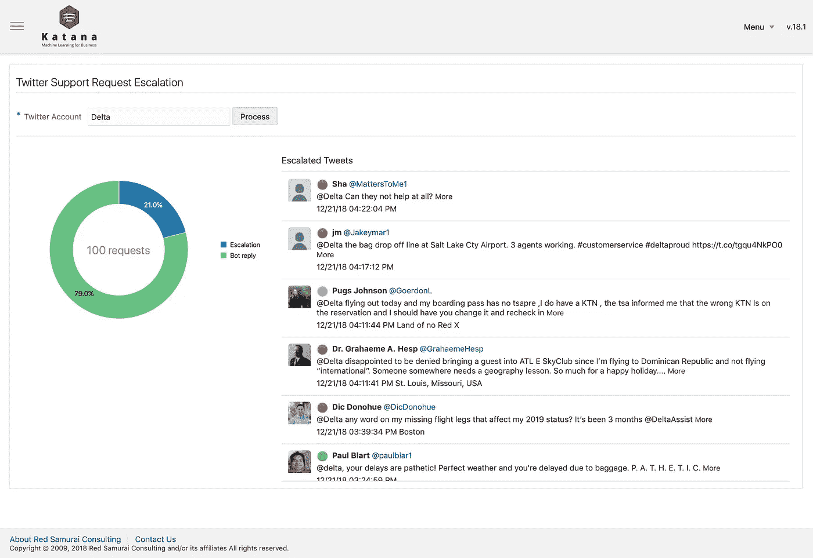
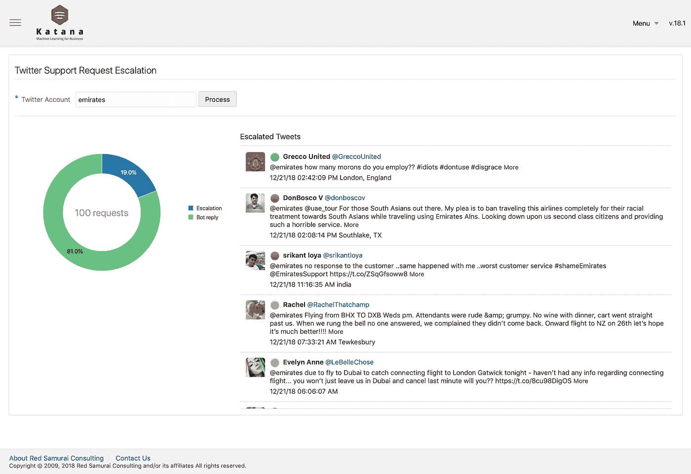
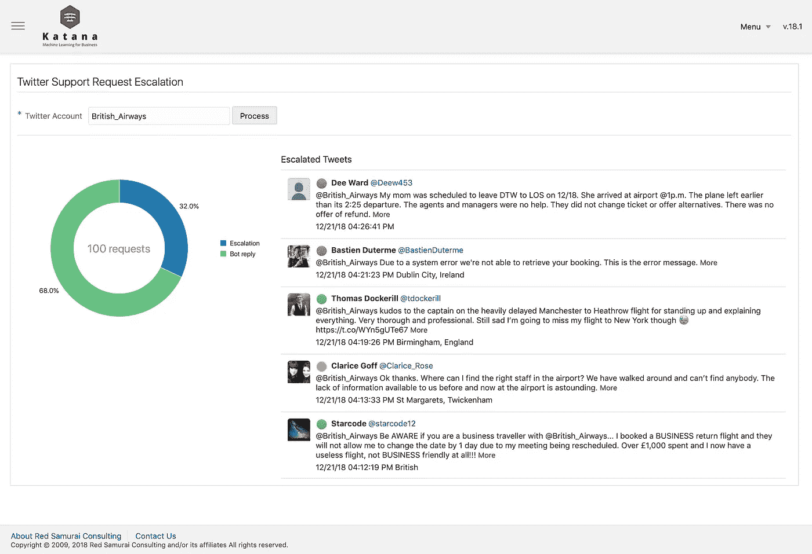
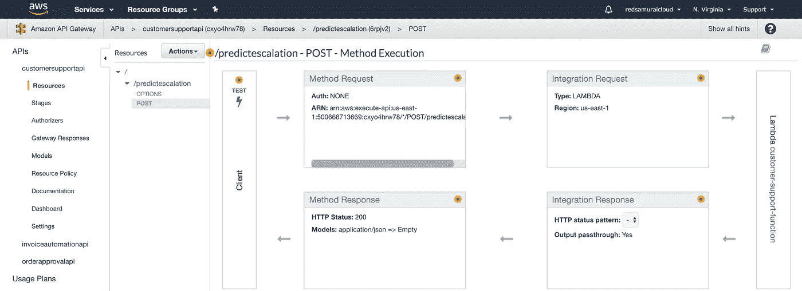
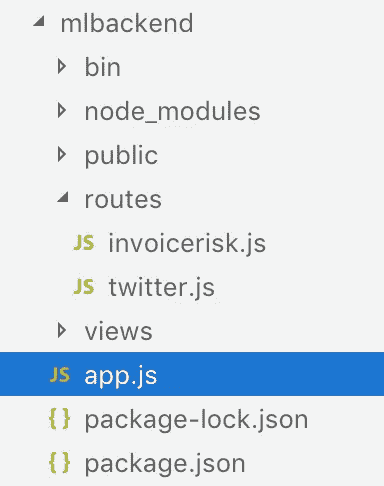

# 向您的支持团队提交推文—使用机器学习进行情感分析

> 原文：<https://towardsdatascience.com/tweet-escalation-to-your-support-team-sentiment-analysis-with-machine-learning-14db1744d1b4?source=collection_archive---------12----------------------->

## 用于航空公司支持请求升级的自动推文情感处理解决方案

Source: Pixabay

我将解释端到端技术解决方案，它将有助于简化您的公司支持流程。我将重点关注从 Twitter 收到的航空公司支持请求。如果支持部门能够提前知道哪个请求更重要并且必须以更高的优先级处理，那么他们可以节省大量的时间和金钱。

本文将涵盖哪些内容:

*   用例解释
*   预测推文文本情感的机器学习解决方案—检查是否需要支持请求上报
*   在 AWS SageMaker 中访问机器学习模型
*   Node.js 和 Express 的后端实现
*   使用 JavaScript 和 Oracle JET toolkit 实现客户端 UI

图表解释了所有技术位是如何连接在一起的。

Solution architecture

让我们从用例解释开始。我认为实现用例会很有趣也很有用，它将允许报告人们向航空公司发送的推文，人们在那里寻求帮助。航空公司每天肯定会收到很多这样的推文，其中一些根本不相关。我的目标是只挑选那些需要升级和人工审核的推文。这应该会改善支持团队的结果，也许有助于保持更多的忠诚客户。

受本书(第 4 章)中给出的指导的启发，我实现了用于推特情感分析的机器学习模型— [商业机器学习](https://www.manning.com/books/machine-learning-for-business)。我强烈推荐任何人阅读这本书，他们正在寻找如何在他们的公司实施机器学习的实用方法。

基于航空公司(不仅限于航空公司，可以是任何 Twitter 账户)账户，我们获取 100 条写到该账户的最新 tweets。只有那些需要上报并且必须由人工处理的推文才会显示在列表中。即使 tweet 被归类为要升级的那个，我们也可以通过概率得分来确定它升级的可能性有多大(见红黄绿点)。这有助于进一步过滤掉推文，甚至在选择升级的推文列表中。

*AmericanAir* 结果— 24%的推文需要升级并由人工处理:

American Air

*Delta* 结果— 21%的推文需要升级并由人工处理:

Delta

*阿联酋*结果——19%的推文需要升级并由人工处理:

Emirates

*英国航空公司*的结果——32%的推文需要升级并由人工处理:

British Airways

*Lufthansa* 结果— 28%的推文需要升级并由人工处理:

Lufthansa

大约 20%-30%的推文需要所有航空公司升级，这似乎是一种常见的模式。

支持人员可以点击 twitter 帐户名称或*更多*链接，以获得关于推文的更多详细信息，并做出相应的回应。

我使用 AWS SageMaker 和 BlazingText 机器学习算法来建立一个情感分析模型。你可以在本书(第 4 章)——[商业机器学习](https://www.manning.com/books/machine-learning-for-business)中阅读 BlazingText 以及如何在 AWS SageMaker 中运行它，所有这些都是一步一步描述的，非常简单易懂。你不需要购买这本书来下载源代码(从源代码链接获得)。在我之前的帖子中阅读更多技术细节— [亚马逊 SageMaker ML 情绪分析的 API](https://medium.com/@andrejusb/api-for-amazon-sagemaker-ml-sentiment-analysis-c10b567d749b)。

BlazingText 情感分析模型是使用 Stuart Axelbrooke 从思维向量(【www.thoughtvector.io/】)上传到 Kaggle 的数据集来训练和构建的。原始数据集可以在这里查看:[www . ka ggle . com/thought vector/customer-support-on-Twitter/home](https://www.kaggle.com/thoughtvector/customer-support-on-twitter/home)。除了源代码，您还可以下载经过处理的数据集。图书作者处理了原始数据集——他们删除了除原始推文之外的所有推文，并使用回复将原始推文标记为升级或未升级。大约有 50 万条推文用于构建支持升级情绪模型。

当在 AWS SageMaker 中构建机器学习(ML)模型时，您需要创建一个端点，这将允许从外部访问模型并调用预测函数。端点创建包含在 Jupyter 笔记本中。

有了活动端点，我们就可以创建 AWS Lambda 函数，作为 ML 模型和 REST API 之间的代理。Lambda 允许在调用 ML 模型之前建立数据转换逻辑，并在将结果发送回 REST API 之前处理由 predict 函数返回的结果。点击此处了解更多信息— [来自 Oracle JET 的 Amazon SageMaker 模型端点访问](https://medium.com/oracledevs/amazon-sagemaker-model-endpoint-access-from-oracle-jet-e4ca9370cfab)。

Lambda 函数的示例代码:

ENDPOINT_NAME 变量指向运行 Jupyter notebook 时创建的*客户支持*端点名称。下一步是在 AWS 中定义 REST API(在上面引用的文章中阅读更多相关内容):

AWS REST API

确保为此 API 启用 CORS 支持。CORS 允许从外部主机调用 API，例如从 JavaScript 应用程序:

AWS REST API CORS

总结机器学习部分:

*   您需要运行 Jupyter 笔记本、培训/验证模型。模型构建完成后，创建 AWS 端点
*   定义 AWS Lambda 函数以访问 ML 模型
*   定义 AWS REST API 将传入的请求传递给 AWS Lambda

接下来，我们继续讨论 Node.js 和 Express 的后端实现。我已经用快速应用程序生成器生成了 Node.js 应用程序。点击阅读更多可用命令[。您得到 app.js 文件，它充当中央路由器——在这里您可以定义后端处理的所有 REST 端点。每个端点都可以映射到一个单独的模块——在下面的例子中是 *invoicerisk.js* 或 *twitter.js* 。这带来了更大的灵活性，并允许将代码构建到单独的模块中:](https://expressjs.com/en/starter/generator.html)

Backend app structure

[快速](https://expressjs.com/)路由代码由快速生成器创建。在 app.js 中，我们可以定义 Node.js 模块的路径。我们将使用这个路径从 UI 执行 REST API 调用。

您可以使用以下命令运行使用 Express 生成的 Node.js 应用程序:

*DEBUG =<appname>:* NPM start*

我们为什么要使用 Node.js 后端？原因很明显——要访问 Twitter API，我们需要提供映射到 Twitter 帐户的键，我们不能将这些键保存在客户端。一旦请求来自客户端，它将转到 Node.js 后端 POST handler 方法。在这个方法中，我们将通过 Twitter API 获取最新的 tweets，准备用于分类的数据集，并通过 REST API 调用将其传递给 AWS SageMaker。响应将被解析以构造结果，该结果将被发送回客户端。检查代码段内的注释:

后端的主要任务是帮助获取推文，将它们发送到机器学习模型进行分类，并构建客户端可以处理的响应。

UI 客户端是用 [Oracle JET](https://www.oracle.com/webfolder/technetwork/jet/index.html) 工具包和 JavaScript 创建的。我使用 Oracle JET 是因为它提供了一套很好的开箱即用的 UI 组件，允许构建美观实用的企业应用程序。

您可以从命令行运行 Oracle JET app:

*发球*

JavaScript 代码，用于执行后端调用，并构建带有支持升级请求的 tweets 数组。

这段代码使用了许多 Oracle JET 库。我建议浏览一下 [Oracle JET cookbook](https://www.oracle.com/webfolder/technetwork/jet/jetCookbook.html) ，它为每个 UI 组件提供了一个交互式示例列表。

图表和列表组件由 Oracle JET 标记呈现:

我的目标是展示用于情感分析的机器学习模型如何适应企业应用架构，包括后端和客户端 UI 实现。我希望这个航空公司支持请求升级的实际用例有助于在您的组织中应用机器学习，并给出如何解决您自己的业务挑战的想法。