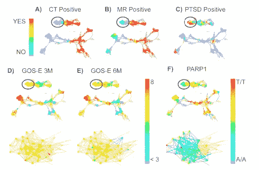

# UCSF 科学家利用人工智能发现创伤性脑损伤的特征

> 原文：<https://towardsdatascience.com/ucsf-scientists-use-artificial-intelligence-to-uncover-hallmarks-of-traumatic-brain-injury-a672ae75704a?source=collection_archive---------5----------------------->

我们在 UCSF 大学的长期合作者几周前刚刚发表了一篇论文，题为“使用 [PLOS 一号](http://journals.plos.org/plosone/article/file?id=10.1371/journal.pone.0169490&type=printable)中的拓扑数据分析揭示创伤性脑损伤(TBI)中的精确表型-生物标记关联”。UCSF 也发布了一份[新闻稿](http://www.ucsf.edu/news/2017/02/405926/artificial-intelligence-aids-scientists-uncovering-hallmarks-mystery-concussion)。这是我们与 UCSF 合作的第二份出版物([以前的《自然》论文](http://www.nature.com/ncomms/2015/151014/ncomms9581/full/ncomms9581.html)、[快公司文章](http://www.fastcoexist.com/3052282/the-latest-medical-breakthrough-in-spinal-cord-injuries-was-made-by-a-computer-program)和我们的[以前的博客](https://www.ayasdi.com/blog/bigdata/fast-company-times-two/))。这项研究得到了美国国立卫生研究院——国家神经疾病和中风研究所的资助。这些分析可能为 TBI 患者的未来临床试验中的患者分层和治疗计划提供一种可靠的方法。我已经在另一个[博客](https://www.ayasdi.com/blog/topology/shape-genome-going-beyond-double-helix-topological-data-analysis/)中写了这项研究。

创伤性脑损伤是一种复杂的疾病，通常根据临床体征和症状来描述。最近的成像和分子生物标记创新为改善护理提供了机会，结合了病理解剖和分子机制。用于 TBI 诊断和患者分层的不同数据是一个挑战。来自扎克伯格旧金山总医院创伤中心、匹兹堡大学医学中心和德克萨斯州奥斯汀大学医学中心 Brackenridge 的急性创伤性脑损伤患者参与了这项研究。创伤性脑损伤的转化研究和临床知识(TRACK-TBI)试点多中心研究招募了 586 名急性 TBI 患者，并收集了研究人群的不同公共数据元素(TBI-CDEs)，包括影像学、遗传学和临床结果。这些 CDEs 包含 944 个变量，包括人口统计学、临床表现、影像学和心理测试。

该论文阐述了机器智能(MI)如何揭示患者结果中的数据驱动模式，以识别潜在的恢复生物标志物，这可以使用更传统的单变量统计测试方法，显著预测 TBI 后患者结果的恢复。MI 算法在多维空间中组织并绘制了 TBI 患者的数据，确定了轻度 TBI 患者的一个子集，该子集具有与损伤后 3 个月和 6 个月的不利结果相关的特定多变量表型。进一步的分析显示，该患者亚组具有较高的创伤后应激障碍(PTSD)发生率，并且富含几种与细胞对应激和 DNA 损伤的反应以及纹状体多巴胺加工相关的独特遗传多态性。最后，MI 确定了一个独特的诊断亚组，该亚组由轻度 TBI 后出现不良结果的患者组成，这些患者可通过特定基因多态性的存在进行显著预测。

如果你想合作，请联系我们在 collaborators@ayasdi.com