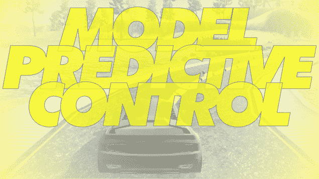
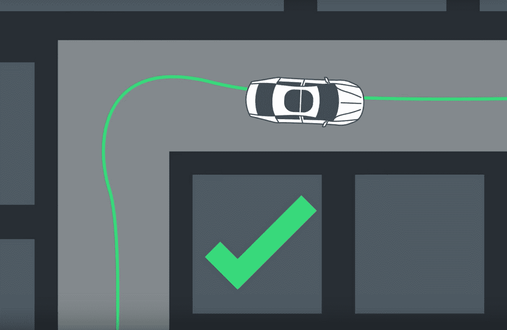
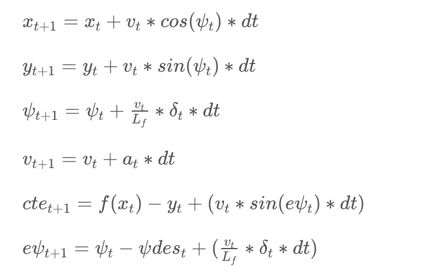

# Udacity 无人驾驶汽车纳米度项目 10 —模型预测控制

> 原文：<https://towardsdatascience.com/udacity-self-driving-car-nanodegree-project-10-model-predictive-control-e9b4195d3f9?source=collection_archive---------3----------------------->

Udacity 自动驾驶汽车工程师纳米学位项目的第十个项目，也是第二学期的期末项目，题为“模型预测控制”(MPC)。MPC 将 [PID 控制](http://jeremyshannon.com/2017/06/16/udacity-sdcnd-PID-control.html)的概念提升到无数个层次，随之而来的是无数倍的复杂性。不过，Udacity 将大部分复杂性卸载到了 [IPOPT](https://projects.coin-or.org/Ipopt) 和 [CPPAD](https://www.coin-or.org/CppAD/) 包中。

像 PID 控制和[行为克隆](http://jeremyshannon.com/2017/02/10/udacity-sdcnd-behavioral-cloning.html)项目一样，这个项目的目标是在 Udacity 提供的[模拟器](https://github.com/udacity/self-driving-car-sim/releases)中导航一条轨道。我很高兴看到他们从“湖”赛道上获得了一些额外的里程(明白吗？).这三个项目都需要我们的代码通过 websocket 与模拟器通信，根据它提供的数据向模拟器发送转向和油门命令。在行为克隆中，它提供相机馈送，在 PID 控制中，它提供跨轨道误差(CTE，大约是从轨道中心线的距离)，这次它提供遥测(位置、速度、方向)和未来一段轨道的几个航路点。这个项目的奖金挑战原来是强制性的(什么？！):一旦我们让我们的控制器工作，我们必须在发送控制命令之前投入 100 毫秒的延迟，以模拟我们在现实世界中可能遇到的延迟类型。

首先要做的是对提供的路点拟合一条曲线，最好是在它们已经从轨迹坐标转换到车辆视点之后，以简化未来的计算。我称之为最佳拟合曲线。然后，IPOPT 和 CPPAD 软件包可用于计算最佳轨迹及其相关的驱动命令，以便以最佳拟合最小化误差。你可能会想，“那么，为什么不遵循最合适的呢？”当然，这就是我们在 PID 控制中所做的事情，但现在我们知道接下来会发生什么，可以更聪明地规划我们的控制。当你开车转弯时，你并不完全是九十度，对吗？或许更像这样？

Image credit: Udacity

MPC 可以考虑车辆的运动模型，在给定一组约束的情况下，根据车辆运动的限制以及定义我们希望车辆如何移动的成本组合(如保持接近最佳拟合和所需方向，或防止车辆过快猛打方向盘)，规划出有意义的路径。

优化只考虑短时间内的航路点，因为这是我们真正需要计划的(就我们的执行器控制而言)。我们可以调整优化器在其计划中使用的离散时间点的数量，以及它们之间的时间间隔，以便它可以在合理的时间内计算出最佳计划(我们当然希望它足够快，以实时控制汽车)。优化器需要一个巨大的一维向量，其中包括计划中每个时间步的状态变量和约束，以及总成本函数——坦率地说，不是特别直观，但易于管理。

由于未来时间步长的变量取决于先前的时间步长，因此它们的约束利用了车辆的运动学模型。运动学模型包括车辆的 x 和 y 坐标、方位角(psi)和速度，以及跨轨迹误差和 psi 误差(epsi)。执行器输出只是加速度和 delta(转向角)。该模型将前一时间步的状态和动作结合起来，根据以下公式计算当前时间步的状态:

经过一些调试和调整成本函数，我的车在赛道上行驶。是时候通过增加延迟来彻底摧毁它了——这就是所发生的事情。我处理它的方法是双重的(不仅仅是限制速度):最初的运动学方程依赖于前一个时间步的驱动，但是有 100 毫秒的延迟(恰好是我的时间步间隔)，驱动在另一个时间步之后应用，所以我改变了方程来说明这一点。(*注意:我的项目评审员建议了一个更简单的解决方案——在运行 MPC 求解器方法之前，将汽车的当前状态预测到未来 100 毫秒。例如，按照现在的情况，传递给解算器的我的汽车的 x 和 y 位置是[0，0](它的当前位置，从它自己的角度来看)，但是 100 毫秒后它应该是不同的。*)此外，除了课程中建议的成本函数，我还加入了一个惩罚速度和转向组合的成本，这导致了更多的可控转弯。

下面是一段轻松愉快的视频回顾:

*这个项目的源代码可以在我的 GitHub* 上找到

**原载于 2017 年 6 月 30 日*[*【http://jeremyshannon.com/2017/06/30/udacity-sdcnd-mpc.html】*](http://jeremyshannon.com/2017/06/30/udacity-sdcnd-mpc.html)*。**