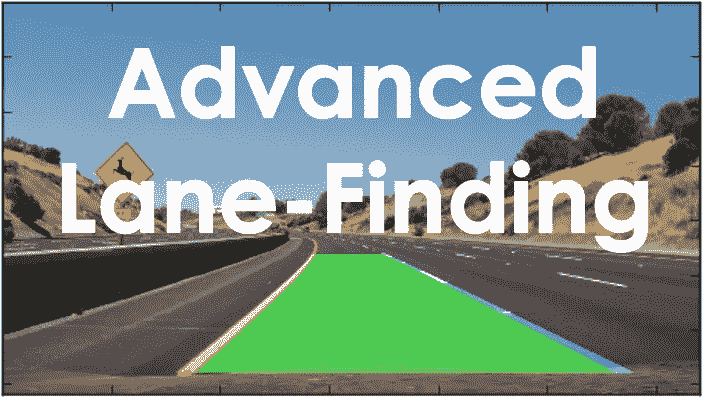
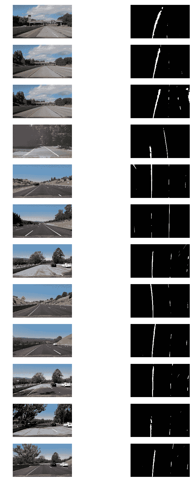
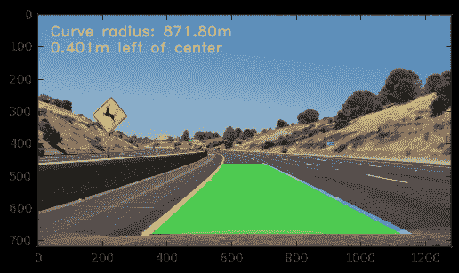

# Udacity 无人驾驶汽车纳米学位项目 4 —高级车道发现

> 原文：<https://towardsdatascience.com/udacity-self-driving-car-nanodegree-project-4-advanced-lane-finding-f4492136a19d?source=collection_archive---------2----------------------->

*欢迎来到“妈妈报告”(嗨妈妈！);如果技术术语和晦涩难懂的语言更符合你的风格，那么* [*请点击这里*](https://github.com/jeremy-shannon/CarND-Advanced-Lane-Lines) *，否则请尽情享受吧！*

Udacity 自动驾驶汽车工程师 Nanodegree 第一学期的第四个项目建立在第一个项目的[之上，超过了第二个项目](http://jeremyshannon.com/2016/12/23/udacity-sdcnd-finding-lane-lines.html)和第三个项目。虽然这看起来很明显，因为它们都涉及到寻找车道线，但这背后的原因是项目 2 和项目 3 向我们介绍了深度学习的新奇之处，几乎可以为我们编写代码，而项目 1 和项目 4 依赖于更传统的计算机视觉技术来非常明确地了解我们如何从输入到输出。这几乎让人失望——就像用键盘换铅笔一样——但是人们会说:(我听起来像总统吗？)公司仍然依赖这些技术，所以它绝对值得学习(并且仍然有趣和具有挑战性), OpenCV 库是承担所有重担的人。

"所以让我们拿个仪表盘找些车道！"你是说？好吧，等一下，特克斯。你不能随便就开始找车道。首先，你用的摄像机？它扭曲了图像。你可能看不出来，但这是真的！看:

幸运的是，这可以通过几张棋盘照片和 OpenCV 函数`findChessboardCorners`和`calibrateCamera`来纠正(对于单个相机/镜头)。看看这个:

我知道——对我来说它看起来也几乎一样，但失真在图像的角落最明显(看看底部汽车引擎盖形状的差异)。

现在我们可以开始有趣的事情了。下一步是应用透视变换来获得前方车道的鸟瞰图。它看起来是这样的:

我可能做了不必要的努力来使我的透视变换*恰到好处*(使直线在最终的鸟瞰图中完全垂直)，但是因为变换是根据相同的规则反向的，所以最终可能没什么关系。

接下来，我探索了一些不同的颜色转换和渐变阈值，试图隔离车道线，并生成一个二进制图像，其中车道线处为 1(白色)，其他地方为 0(黑色)。这无疑是整个过程中最微妙的部分，对光线条件和褪色非常敏感(更不用说那些该死的白色汽车了！)在路上。我不会用细节来烦你；我只想说这是我在这个项目上花了大部分时间的地方。最后，我结合了一个在 [Lab 色彩空间](https://en.wikipedia.org/wiki/Lab_color_space)的 B 通道上提取黄线的阈值和一个在 [HLS 色彩空间](https://en.wikipedia.org/wiki/HSL_and_HSV)的 L 通道上提取白色的阈值。这是每一个的样子:

这是它们在几幅测试图像上的组合:

不算太寒酸！

现在，聪明的一点是:搜索整个图像来识别哪些像素属于左车道和右车道是不必要的(并且计算量很大),因此我们计算了二进制图像下半部分的直方图，如下所示:

左半部分和右半部分的峰值为我们提供了车道线开始位置的良好估计，因此我们可以从底部开始搜索小窗口，并基本上沿着车道线一直到顶部，直到识别出每条线中的所有像素。然后可以将多项式曲线应用于识别的像素，瞧！

不仅如此，使用前一帧的拟合并在附近搜索，可以更容易地在视频的连续帧中找到像素，如下所示:

它只是在多项式线和多边形中着色以填充它们之间的通道，应用反向透视变换，并将结果与原始图像相结合。我们还做了一些简单的计算和转换，以确定道路的曲率半径和汽车离车道中心的距离。这是最终的结果:

这是我应用于下面链接的视频的管道，带有一点平滑(整合来自过去几帧的信息)和健全性检查以拒绝异常值(例如忽略不在特定距离内的拟合)。

该视频可爱地展示了图像处理管道中的步骤:

这里有一个[链接到我的视频结果](https://github.com/jeremy-shannon/CarND-Advanced-Lane-Lines/blob/master/project_video_output.mp4)，这里有一个[奖励视频，其中有一些额外的诊断信息](https://github.com/jeremy-shannon/CarND-Advanced-Lane-Lines/blob/master/challenge_video_output_diag.mp4)，在这里你可以看到算法与困难的照明和路面条件进行斗争(在某些情况下会崩溃)。

*再说一遍，如果你感兴趣的是技术类的东西，* [*去这里*](https://github.com/jeremy-shannon/CarND-Advanced-Lane-Lines) *。*

*最初发表于* [*..//2017/03/03/uda city-SD CND-advanced-lane-finding . html*](..//2017/03/03/udacity-sdcnd-advanced-lane-finding.html)*2017 年 3 月 3 日。*