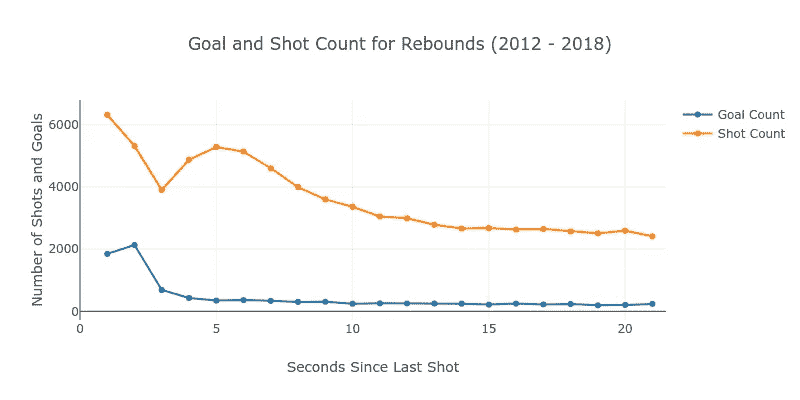
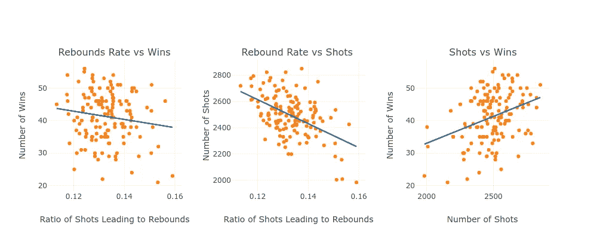
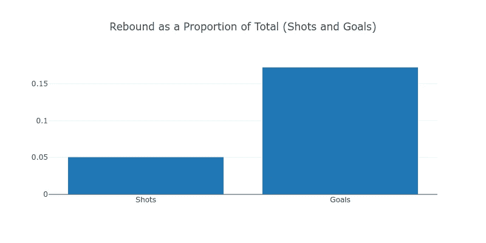
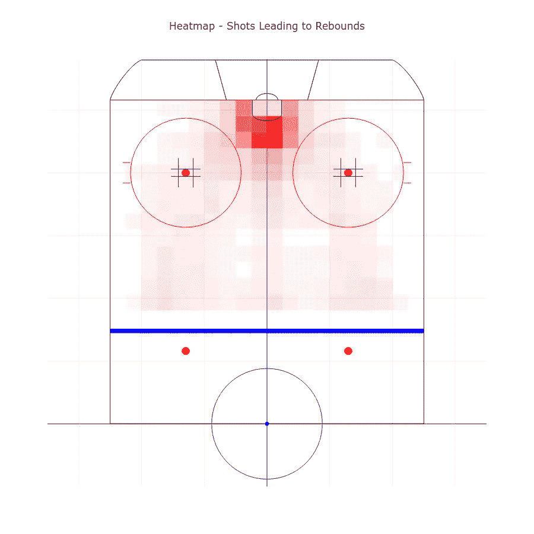

# 在分析项目的掩护下

> 原文：<https://towardsdatascience.com/under-the-hood-of-an-analytics-project-1cc2348a5411?source=collection_archive---------11----------------------->

Photo by [Markus Spiske](https://unsplash.com/@markusspiske?utm_source=medium&utm_medium=referral) on [Unsplash](https://unsplash.com?utm_source=medium&utm_medium=referral)

## 新数据项目早期阶段的演练

几周前，我写了一篇[文章](https://jessemoore.ca/2018/nhl-shot-analysis/)深入 NHL 的详细拍摄，如何转化为篮板，以及这两个事件如何影响比赛的结果。

在你现在正在阅读的文章中，我想从不同的角度来看同样的分析。我希望它能帮助潜在的/新的数据科学家了解如何开始构建自己的项目，并让我的想法更加清晰。

# 找到正确的问题

找到正确的问题通常是开始一个新的数据科学项目的最困难的部分，尤其是当这个问题没有提供给你的时候。很难找到动力去完成一个没有真正目的的项目，花时间定义你在做什么是至关重要的。

我喜欢散步，思考数据集，用它可以实现什么，我可以回答什么样的问题。通过这个项目，我可以访问过去 4 年中每场 NHL 比赛的详细数据，我想建立一个预测比赛结果的系统。

下面 Vox 的视频总结了这样做的动机。NHL 的结果被认为很大程度上是运气的结果。在运气-技能连续体中，曲棍球被归类为最“随机”的运动之一。我有疑问，我想深入了解一下。

# 深入研究

随着我更多地思考如何解决这个问题，我意识到我想要建立的系统会有多复杂。一开始，我不知道哪些数据与获胜相关，更重要的是，似乎其他人也不知道。显然已经对游戏的各个方面进行了研究，但我找不到我想做的事情的完美起点。

为了解决这个问题，我会从更简单的问题开始，然后建立一个最终模型。我预计这个项目将花费数百个小时，随着时间的推移，可能会增加到数千个小时——但你需要从某个地方开始。我决定在一系列我称之为“深度潜水”的游戏中系统地移动游戏的各个部分。这些深入的研究将建立在我对该领域的整体理解上，但也会产生我可以在最终模型中使用的特性。

所以我建立了一个灵活的计划来一次解决这些问题。我不知道我会在每个部分花多长时间——这个选择可以让我决定是否在必要时进一步追求一个想法。我要挖掘的一些数据不可避免地会相当不直观，可能会鼓励更多的探索。

经过一些初步的探索性挖掘，我采用了以下策略:

逐一深入以下类别，在数据中寻找有意义的相关性

*   射击
*   惩罚
*   打
*   失误
*   守门
*   主客场优势

然后，我会把我发现的见解构建到预测系统中。

在我分析的早期，很明显这将是一项艰巨的任务。我全神贯注于拍摄统计数据，亲眼目睹了为什么许多统计学家把这么多事情归结于偶然。然而，我也发现了一些我以前不知道的有趣信息(也找不到任何其他信息)。

最重要的是，我开始对游戏的一个非常具体的部分有了感觉。这让我相信，可以建立许多可以预测整个季节的特征，但这些相同的统计数据充满了嘈杂的异常值。我一直怀疑 NHL 是一个非常基于动力的游戏，一支球队如何在长期的基础上行动是他们成功的预测，行为比进球或射门等个人数据更重要。这篇文章的一个重要观点可以在下面的三张图中得到解释。

首先，我们发现什么是反弹。

其次，我们查看出现的次数来衡量重要性。

最后，我们查看了过去 4 年中的所有团队，以了解这些信息如何预测结果。

我们的结论。

**“从分析的数据来看，更高的篮板球率实际上并不意味着更高的胜率。事实上，较高的反弹率与较低的胜场数相关联！**

**我们还发现，篮板率越高，投篮次数越少，投篮次数越多，胜率越高。”**

# 代码走查

为了更好地介绍这个过程，并让您了解我是如何实现这一目标的，我提供了一些感兴趣的人来浏览代码。首先，你可以在这里得到原始数据。我们不会使用所有的数据集，我们主要关注的是详细的数据。

我们的第一步是加载比赛数据，提取进球和射门，创建标识射手和守门员的列，并缩放 x 和 y 位置，以便我们可以在我在 Plotly 上制作的曲棍球图上显示我们的射门分析。

然后，我们编写一个函数，它接受 shooting_df 函数的输出，并添加一些我们需要的数据。我们将添加球队名称，构建数据集，以便我们可以分析主场/客场，而不是输赢。

现在，我们将构建将在最终分析中使用的数据集。我想确定什么是反弹，这样我就可以利用这些信息来确定好的拍摄位置。由于没有明确的定义，我需要自己分析。

我对数据集中的独特游戏进行循环，并按时间顺序对每个游戏进行排序。然后，我可以在数据集上逐个镜头地迭代，并构建镜头之间的时间、这些镜头的结果以及反弹的位置。然后，我们添加一些必要的列，允许我们以几种不同的方式切割数据进行分析，特别是添加一个“for”列，以便我们可以查看整个赛季的球队。

为了更好地理解什么是反弹，我们需要按时间步长汇总我们的反弹数据框架。与此同时，我为 Plotly 图表添加了几个文本列，我们将使用它们来更好地了解篮板的影响和得分率。

这让我们可以创建我们在上面看到的前两个图，让我们知道什么是反弹。

知道了 3 秒以内的投篮命中率会有大幅上升，我按照前一次投篮在那个时间段内的任何一次投篮对篮板进行了分类。它让我们很好地了解了反弹的整体影响。

和下面的图表。

虽然抢篮板的投篮只占所有投篮的 5%,但他们占所有进球的 15%以上。

我也想知道高质量的照片是否有某种模式。在溜冰场制作热图的代码很长——所以我不会全部嵌入这里，但你可以在这个[链接](https://github.com/jes-moore/nhl_analytics/blob/master/plotting.py)找到它。

概括地说，我们经历了以下过程:

1.  我们创造了各种情节性的形状，产生了一个空的曲棍球场作为情节。X 和 Y 轴用于模拟竞技场的一半。
2.  我们创建了一组盒子，将半溜冰场分成 625 个大小相等的盒子(25 x 25)。
3.  我们从数据中选取一个子集，使其符合上一步中为盒子创建的 x-y 坐标。然后我们根据需要(射门、进球或进球率)给它上色
4.  我们在每个框的中心产生一个数据点来提供鼠标悬停信息。

结果如下(互动版[此处](https://plot.ly/~jes-moore/11))

为了更好地理解拍摄地点，我回顾了这个图的一些变化。没有什么非显而易见的东西跳出来，但它给出了一些创建一个功能的想法，该功能涉及到在一些进一步的分析中使用这些框来产生镜头质量度量。从像这样的噪声数据到预测特征可能涉及几个阶段。

为了更好地理解拍摄地点，我回顾了这个情节的一些变化。没有什么非显而易见的东西跳出来，但它给出了一些创建一个功能的想法，该功能涉及到在一些进一步的分析中使用这些框来产生镜头质量度量。从像这样的噪声数据到预测特征可以包括几个阶段。

然后，我们有一个相对较长的代码片段来生成我们在原始文章中看到的 Plotly 图表。

我们取三个 x-y 对。

1.  反弹率与获胜次数
2.  反弹率与投篮次数
3.  击球次数与获胜次数

我们在这里发现了一些非直觉的信息，这让我相信曲棍球的特征在一段时间内比一场比赛更相关。我们还发现了一些可能会引导我们找到另一组特征的东西。也许我们需要根据球队的类型和守门员的质量来调整射门次数或篮板比例？

# 仅仅是开始

这只是这种分析的开始。我们甚至还没有触及这个复杂游戏的表面，但是我们已经发现了一些潜在的有价值的特性，并且获得了一些领域知识。

我希望这篇文章对新的数据科学家有所帮助，让他们了解探索性数据分析有多重要，并正确看待项目设计。

**一键外卖** —玩长游戏，找到错综复杂的细节，然后开始建模。您将最终得到一个好得多的模型，并获得无价的领域知识，在您前进的过程中帮助您。

*最初发表于*[*Jesse Moore . ca*](https://jessemoore.ca/2018/under-the-hood-analytics/)*。*