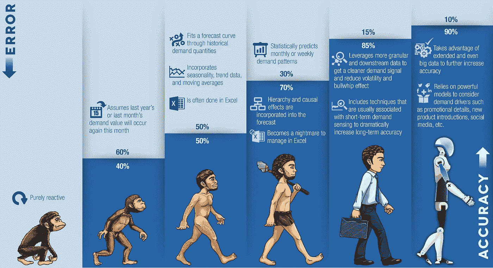
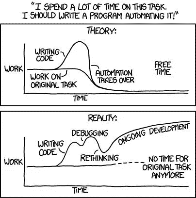

# 理解这 5 个基本概念，让自己听起来像机器学习专家

> 原文：<https://towardsdatascience.com/understand-these-5-basic-concepts-to-sound-like-a-machine-learning-expert-6221ec0fe960?source=collection_archive---------0----------------------->

[https://cdn2.hubspot.net/hub/395829/file-2619018693-jpg/TheEvolutionofForecasting-03-15ENJPG.jpg](https://cdn2.hubspot.net/hub/395829/file-2619018693-jpg/TheEvolutionofForecasting-03-15ENJPG.jpg)

*亚伦·爱戴是* [*机器盒子*](https://goo.gl/oYCHLf) *的联合创始人——这是一家机器学习初创公司，旨在让用机器学习来建造东西变得容易。*

大多数人似乎都对机器学习感到有点害怕或困惑。这是什么？它要去哪里？现在能给我一些钱吗？

所有有效的问题。事实是，你已经训练机器学习模型多年了，可能还没有意识到这一点。你用 iPhone 还是苹果照片？或者脸书怎么样？你知道它是如何向你展示一组面孔并让你识别它们的吗？嗯，通过标记这些照片，你正在训练一个面部识别模型来识别新面孔。恭喜你，你现在可以说你有训练机器学习模型的经验了！但在此之前，请阅读这些机器学习基础知识，这样你就可以准确地回答任何后续问题。

**1)机器学习的好处是可以预测**

如果你只是在图片中标记你朋友的脸，你就不是在使用机器学习模型。如果你上传一张新照片，突然它告诉你每个人是谁，那么你正在用机器学习气体做饭。机器学习的全部意义在于根据模式和其他训练它的因素来预测事物。它可以是任何东西；基于邮政编码和卧室数量的房价，基于一年中的时间和天气的航班延误可能性，图片中物体或人物的标记等。

**2)机器学习需要训练**

你必须告诉机器学习模型它试图预测什么。想想人类的孩子是如何学习的。他们第一次看到香蕉时，不知道那是什么。然后你告诉他们这是一根香蕉。下一次他们看到一个(不是你训练他们吃的那个，因为你已经吃过了)，他们会认出那是一个香蕉。机器学习以类似的方式工作。你给它看尽可能多的香蕉图片，告诉它这是一只香蕉，然后用一只没有被训练过的香蕉图片来测试它。这有点过于简化了，因为我省略了你必须告诉它什么不是香蕉的部分，并向它展示不同种类的香蕉，不同的颜色，不同视角和角度的图片等等。

**3) 80%的准确率被认为是成功的**

在技术上，我们还没有达到机器学习平台在识别图片中的香蕉时达到 100%准确率的地步。但是没关系。事实证明，人类也不是 100%准确。行业内的潜规则是，80%准确率的模型就是成功的。如果你想一想在你的收藏中正确识别 800，000 张图片是多么有用，尽管可能没有正确识别 200，000 张图片，你仍然节省了自己 80%的时间。从价值的角度来看，这是巨大的。如果我能挥动魔杖，让你的生产率提高那么多，你会给我很多钱。嗯，事实证明我可以，使用机器学习，所以请寄支票或现金。

2018 年更新:80%法则现在更像 90%法则了。

**4)机器学习不同于人工智能、深度学习或神经网络**

人们倾向于随便使用这些术语。要想听起来像专家，就要学会区别。

AI——人工智能只是指在完成特定任务方面与人类一样好(或更好)的计算机。它也可能意味着一个可以根据大量输入做出决定的机器人，就像终结者或 C3PO 一样。这是一个非常宽泛的术语，不是很有用。

机器学习是一种实现人工智能的方法。这意味着根据分析数据集的训练对某件事做出预测。有许多不同的方式，一个 ML 平台可以实现训练集来预测事情。

NL-神经网络是机器学习模型可以预测事物的方式之一。神经网络的工作有点像你的大脑，通过大量的训练来调整自己，以理解香蕉应该是什么样子的。你创建了一层层的节点，这些节点变得非常**深。**

**5)在人工智能拥有自我意识之前，我们还有一段路要走**

(  [https://xkcd.com/1319/)](https://xkcd.com/1319/))

我现在还不担心机器人会接管地球。主要是因为如果你曾经建立过一个机器学习模型，你就会知道它有多依赖你这个人来告诉它该做什么。即使你给它明确的指示，它通常也会出错。你必须对这些系统如此明确，以至于它突然变得有知觉的可能性微乎其微。即使是一个简单的网页，显示一个带有单词的框，也需要你准确地告诉它这个框出现在哪里，它是什么形状，它是什么颜色，如何在不同的浏览器上工作，如何在不同的设备上正确显示等等。等等。等等。

即使是非常深的神经网络接管世界，将我们变成电池，也有很多障碍，主要是因为没有人告诉它这样做(希望如此)。