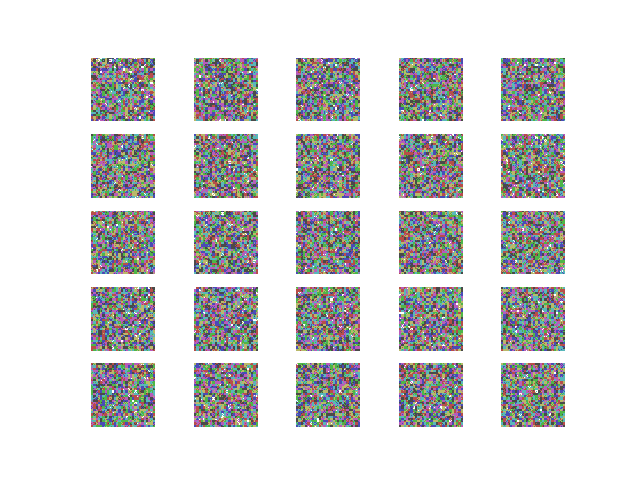
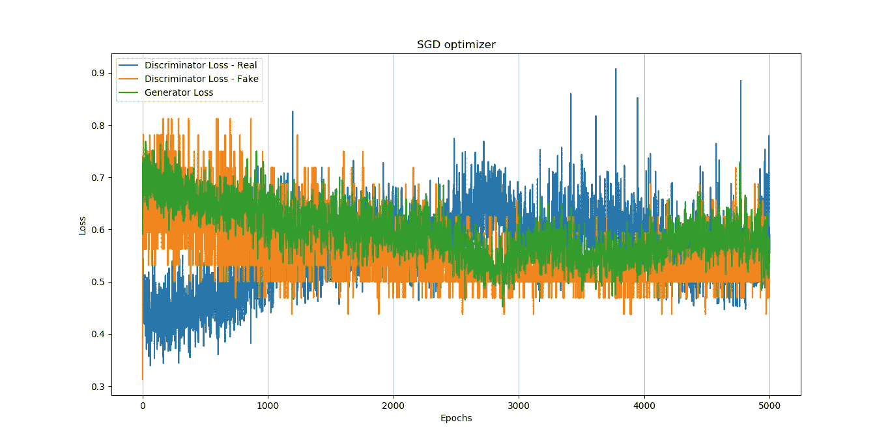
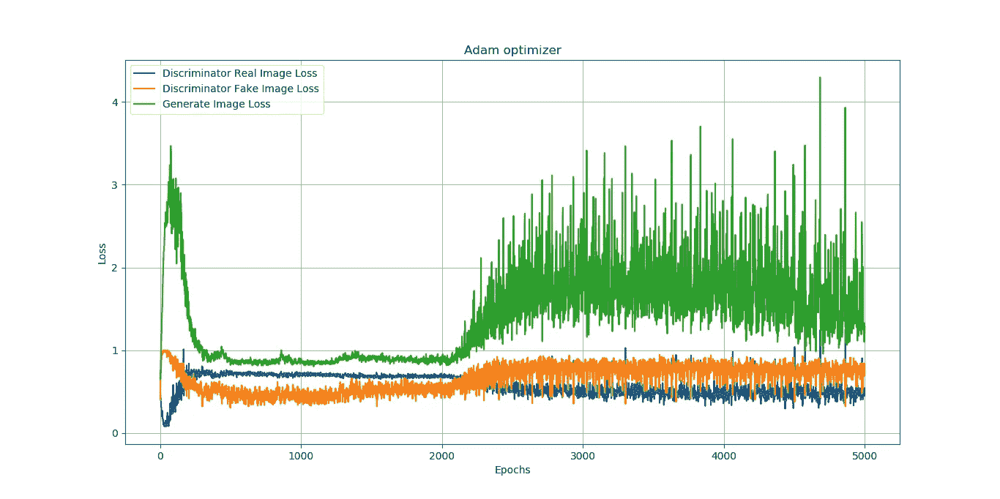

# 了解和优化 gan(回到基本原则)

> 原文：<https://towardsdatascience.com/understanding-and-optimizing-gans-going-back-to-first-principles-e5df8835ae18?source=collection_archive---------0----------------------->

**Fig 1**. Improvement of fake image generation of faces over training using basic GAN algorithm

自从 Ian Goodfellow 首次提出生成性对抗网络(GANs)架构以来，围绕该架构的宣传一直在增长，并且大量的进步和应用每天都变得越来越令人着迷。但是对于任何想开始使用 GANs 的人来说，想知道从哪里开始是相当棘手的。不要惊慌。这篇文章将指导你。

和许多事情一样，完全理解一个概念的最好方法是触及根本。抓住首要原则。对于甘斯来说，这里是原文->([https://arxiv.org/abs/1406.2661](https://arxiv.org/abs/1406.2661))。要理解这类论文，有两种方法，理论的和实践的。我通常更喜欢后者，但如果你喜欢深入研究数学，这里的是我的好友 [Sameera](https://medium.com/u/bc1eaea94061?source=post_page-----e5df8835ae18--------------------------------) 的一篇很棒的帖子，从理论上分解了整个算法。与此同时，本帖将使用 Keras 以最纯粹的形式呈现该算法的简单实现。让我们开始吧。

在 GAN 的基础设置中有两个模型，即生成器和鉴别器，其中生成器不断地与鉴别器竞争，鉴别器是正在学习区分模型分布(例如生成的假图像)和数据分布(例如真实图像)的对手。这个概念被一个伪造者对警察的场景形象化了，在这个场景中，生成模型被认为是伪造者生成假币，而鉴别模型被认为是警察试图检测假币。这个想法是，随着彼此之间的不断竞争，伪造者和警察都在彼此的角色中改进，但最终伪造者达到了生产与真钞难以区分的假钞的阶段。简单。现在让我们把它写成代码。

本文提供的示例脚本用于生成虚假的人脸图像。我们试图用该算法实现的最终结果如图 1 所示。

**建立发电机模型**

因此，发电机模型应该吸收一些噪声，并输出一个令人满意的图像。这里我们使用 Keras 序列模型以及密集和批量标准化层。使用的激活函数是 Leaky Relu。请参考下面的代码片段。发电机模型可以分为几个模块。由密集层->活化->批量归一化组成的一个块。添加了三个这样的块，最后一个块将像素转换成我们期望输出的图像的形状。该模型的输入将是形状为(100)的噪声向量，并且该模型在最后被返回。注意每个密集层中的节点是如何随着模型的进展而增加的。

**建立鉴别器模型**

鉴别器接收一个图像输入，将其展平并通过两个密集->激活模块，最终输出一个介于 1 和 0 之间的标量。输出 1 应该表示输入图像是真实的，否则为 0。就这么简单。参考下面的代码。

*注意:-
你可以在以后修改这些模型，增加更多的模块，更多的批量标准层，不同的激活等等。根据这个例子，这些模型足以理解 GANs 背后的概念。*

**发现损失并训练**

我们计算三个损失，在本例中全部使用二元交叉熵来训练两个模型。

首先是鉴别器。它被训练成两种方式，如下面的代码所示。首先为真实图像(数组“img”)输出 1，然后为生成的图像(数组“gen_img”)输出 0。随着训练的进行，鉴别器在这项任务上有所提高。但是我们的最终目标在理论上达到了，此时鉴别器对两种类型的输入都输出 0.5(即，不确定是假还是真)。

接下来是训练发电机，这是一个棘手的问题。为了做到这一点，我们首先公式化一个给定发电机输出的鉴别器的组合模型。记住！理想情况下，我们希望这个值为 1，这意味着鉴别器将生成的假图像识别为真实图像。所以我们针对 1 训练组合模型的输出。参见下面的代码。

**现在我们来玩吧！这是代码的要点，可以简单地理解 GANs 的工作方式。**

****完整代码可以在我的 GitHub 上* [*这里*](https://github.com/miranthajayatilake/GANwKeras) *找到。您可以参考所有用于导入 RGB 图像、初始化模型并将结果记录在代码中的附加代码。还要注意，在训练期间，小批量被设置为 Hi32 图像，以便能够在 CPU 上运行。
此外，示例中使用的真实图像是来自 CelebA 数据集的 5000 幅图像。这是一个开源的数据集，我已经把它上传到我的 Floydhub 上以便于下载，你可以在这里找到***。****

*有许多方法可以优化代码以获得更好的结果，并了解算法的不同组件如何影响结果的效率。观察结果，同时调整不同的组件，如优化器，激活器，规格化，损失计算器，超参数等，是增强你对算法理解的最好方法。我选择改变优化。*

*因此，我以 32 个为一批，训练了 5000 个纪元，用三种优化算法进行了测试。使用 Keras，这个过程就像导入和替换优化器函数的名称一样简单。所有 Keras 内置的优化器都可以在这里找到。
还绘制了每种情况下的损失，以了解模型的行为。*

1.  *使用 SGD(随机梯度下降优化器)。输出和损耗变化分别如图 2 和图 3 所示。*

**

***Fig 2\.** Output of the GAN using SGD as the optimizer*

**

***Fig 3**. Plot showing the variation of losses while training the GAN using SGD*

*注释——虽然收敛有噪声，但我们可以看到，发生器损耗随着时间的推移而下降，这意味着鉴别器倾向于将假图像检测为真图像。*

*2.使用 RMSProp 优化器。输出和损耗变化分别如图 4 和图 5 所示。*

**

***Fig 4\.** Output of the GAN using RMSProp as the optimizer*

*损失:*

**

***Fig 5**. Plot showing the variation of losses while training the GAN using RMSProp*

*注释—这里我们还可以看到发电机损耗在下降，这是一件好事。令人惊讶的是，真实图像上的鉴别器损耗增加了，这非常有趣。*

*3.使用亚当优化器。输出和损耗变化分别如图 6 和图 7 所示。*

**

***Fig 6\.** Output of the GAN using Adam as the optimizer*

**

***Fig 7**. Plot showing the variation of losses while training the GAN using Adam*

*注释 adam 优化器产生了迄今为止最好的结果。请注意鉴别器对假图像的损失如何保持较大的值，这意味着鉴别器倾向于将假图像检测为真图像。*

# *评论*

*我希望这篇文章从实用的角度传达了对 GANs 内部工作的基本看法，以理解和了解如何改进基本模型。在不同的应用程序上，开源社区中有许多 GANs 的实现，对基本原则有一个良好的理解将极大地帮助你理解这些进步。此外，GANs 对于深度学习来说相对较新，有许多研究途径对任何感兴趣的人开放。*

*所以你可以探索无限的可能性！*