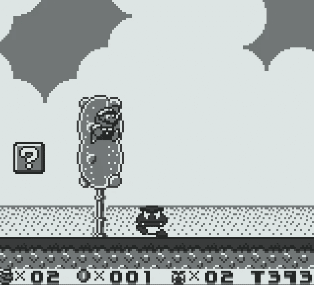

# 通过超级马里奥了解机器学习的基础

> 原文：<https://towardsdatascience.com/understanding-basics-of-machine-learning-through-super-mario-5ed93c7d587d?source=collection_archive---------3----------------------->

Super Mario Land for gameboy

有很多关于神经网络和机器学习的文章，因为这个主题在过去几年里非常受欢迎。这个领域似乎非常难以接近和理解，许多人可能认为必须是数学家或统计学家才能掌握机器学习的概念。然而，机器学习和神经网络的基本概念不一定像人们想象的那样复杂。

本文的目的是通过一个任何人都能理解的简单例子来解释机器学习如何工作的高级概念。希望它能给你兴趣和信心，让你继续阅读和学习更多关于这个主题的知识，打破让它看起来如此不可接近的令人生畏的障碍。

## 强化学习

机器学习程序与常规程序的不同之处在于，程序员没有明确定义逻辑。程序员创造了一个程序，它有能力自学如何成功地完成手头的任务。我要举的例子很可能会被认为是一个强化学习的机器学习程序。这个程序接受**输入**，做出自己的决定并产生一个**输出**，然后从输出产生的**回报**中学习，一遍又一遍地重复整个过程。这听起来可能很抽象，但这和我们人类学习如何做事的方式非常相似。下面我将把它分解成人类能够理解的步骤。还有什么比超级马里奥更好的表达方式呢？

要开始我们的思维实验，你必须想象你对电脑游戏完全陌生。你甚至从未听说过它们，更不用说以前玩过了。然后有人给你一个超级马里奥的游戏。

## 投入

你看着屏幕，看到简单的 2D 风景。这被认为是您的输入；你开始看这个小图形，这是马里奥，然后是风景中的所有其他物体。

## 输出

你有四种可能的方式与游戏互动。你可以左，右，蹲，跳。这些是你的输出。您可以根据输入来决定应该选择哪个输出。

## 报酬

你目前不知道游戏中有什么潜在的奖励，但是很快你就会亲身体验到。每个输出的奖励在游戏中会有所不同。如果你只是向左或向右走，回报是相当低的。如果你走进一枚硬币，奖励会稍微高一点。如果你跳进一个神秘的盒子，奖励会更高。然而，如果你被敌人击中，你的奖励是负的——不用说，负奖励更像是一种惩罚。

## 你学习如何玩超级马里奥

完全新手如何玩游戏，你开始按下右箭头。马里奥向右移动，你会得到奖励。然而，当你继续按右箭头时，马里奥最终击中了一个古姆巴，在这个古姆巴上你得到了死亡的奖励！

Mario got rewarded by death for hitting the Goomba

别担心，你可以重新开始。这一次，当你记录向你走来的古姆巴的输入时，你尝试其他的输出来获得不同的回报。经过几次尝试后，你意识到在那次遭遇中获得最高奖励的输出是跳到古姆巴上面，或者跳过它。你现在开始学习如何玩超级马里奥。

Mario is rewarded by staying alive for jumping over the Goomba

这就是强化学习的概念在现实生活中的工作方式。机器学习程序一开始是一张白纸，对它应该做的任务一无所知。然后，它接受一个输入，即它所处的环境，并开始试图找出哪个输出给它最高的回报。这个概念非常符合人类如何通过**试错**来学习做新的事情。我们尝试一种方式，然后是不同的方式，直到我们得到我们想要或期望的回报。

## 但是每个人都已经知道如何玩超级马里奥了…

的确，没有人真的需要学习如何玩超级马里奥，因为它是一个非常直观的游戏。甚至小孩子也能成功地玩这个游戏。

这样做的原因是，我们在游戏中加入了以前的经验，因此可以更好地掌握游戏规则，更快地获得更高的奖励。在机器学习中，这将被视为**训练**。

## 培养

如前所述，每当机器学习程序开始试图找出如何成功完成一项任务时，它都会从头开始。因此，给程序一些训练数据是很重要的，这样它就有了一些开始的基础，这样它就不会一遍又一遍地犯小错误，直到它最终知道任务是什么。

当然，如果有足够的时间，机器学习算法将能够训练自己成功完成给定的任务。这可能需要很长时间，因此为您的程序提供高质量的训练数据以获得更准确的结果是非常重要的。

## 结论

他们从这篇阅读中得到的关键是理解机器学习算法如何比程序性程序更类似于人类如何学习完成任务。在过程程序中，决策是通过条件语句硬编码到程序中的。例如，这将是程序员识别超级马里奥游戏中的威胁，并输入如下语句:*如果检测到威胁，则执行该特定动作，否则继续执行*。这种过程方法和机器学习方法之间的主要区别是，最终，计算机程序有自主权做出自己的决定。理解这一点很重要，因为机器学习程序可以用于其他类似的任务，而不必重新编程。我们的示例程序可以在学习玩超级马里奥后很好地学习如何玩任何其他游戏，并且成功率很高，并且玩的游戏越多，玩的游戏越好。这种行为非常类似于一个人在玩不同的游戏时会变得越来越好，尽管每个游戏并不完全相同。我们利用以前的经验学得更快。

这篇文章只是对一个更深入的主题的一个非常简短的概述。如果你对深入研究人工智能和机器学习感兴趣，我会推荐[这个文章系列](https://medium.com/machine-learning-for-humans/why-machine-learning-matters-6164faf1df12)。

如果你喜欢这篇文章，请鼓掌和评论！