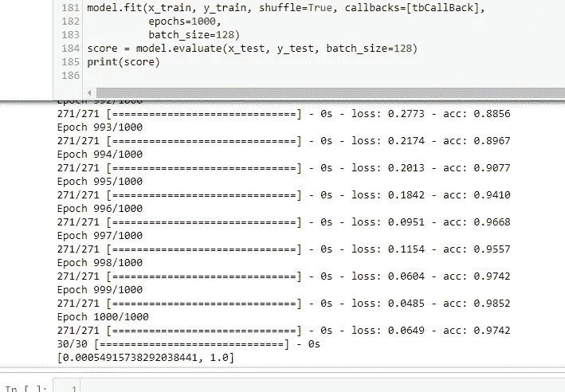
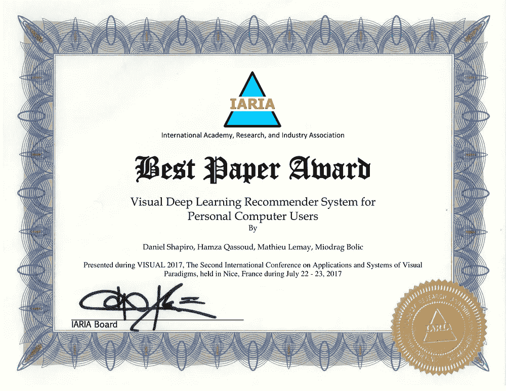

# 用人工智能理解事件

> 原文：<https://towardsdatascience.com/understanding-events-with-artificial-intelligence-12e1ec3c5c9?source=collection_archive---------0----------------------->

我们遇到了很多客户需求，归结起来就是使用人工智能来理解事件。有些系统需要将事件分类，有些需要监听特定的事件，有些需要预测事件。这些要求通常包括给一个事件分配一个分数，然后根据分配的分数对所有事件进行排名。

Events can be analyzed in a lot of ways, including sequence, location, numerical, categorical, image, text, and relationship data.

这些事件可以是谷歌日历事件、医疗警报、约会网站上的日期，或者在 [GenRush](http://genrush.com) 的情况下，事件可以根据现实世界中的事件为一家公司指明新的潜在客户。

这些事件理解问题是隐藏在“事件”一词复杂性背后的经典[分类和回归](https://www.quora.com/What-is-the-main-difference-between-classification-problems-and-regression-problems-in-machine-learning)需求。对于序列预测，我们使用 [LSTM/GRU/RNN](http://colah.github.io/posts/2015-08-Understanding-LSTMs/) ，有时也使用 DNN(例如，当事件序列形成一种模式时，你可以用图表表示/查看)。但是在本文中，让我们把重点放在事件处理的非顺序和非位置部分。让我们更详细地看看如何将一个事件转化为一组人工智能可以使用的功能。

因此，我们有很多事件，我们希望人工智能在特定事件发生时通知人类用户。我们立即发现一个经典的假阳性对假阴性的难题出现了。我在医院/ [医疗通知系统](http://s3.amazonaws.com/rdcms-aami/files/production/public/Libraries/Alarms/2017_BIT_MA_ClinicalAlarmManagement.pdf)中见过很多这样的例子，当时我正和 Mathieu Lemay 一起研究医疗设备。如果人工智能经常错误地通知(假阳性)，那么用户将忽略这些通知。然而，如果系统错过了关键事件，那么用户会认为人工智能没有注意，这是正确的。

让我们更深入一层，讨论 AI 可以观察到的“事件”的一些特征，以便做出通知决策。模型观察物体的特征是为了理解它。我们在机器学习领域所做的工作是识别特征，并以它“喜欢”的方式将其暴露给机器学习模型。想想这种事件到特征的映射，比如一个女孩的照片？)以身高和罩杯大小为模特“特征”的杂志。就像 pinup 模型一样，我们需要一些方法来比较和对比事件。把每个事件想象成一张棒球卡，里面有一堆可处理的信息。事件可以包含以下类型的信息:序列、位置、数字、分类、图像、文本和关系。

我们决定不考虑**序列数据**(例如，事件之前发生了什么，事件之后发生了什么)，所以让我们来谈谈这些其他事件特征。对于 [GenRush](http://genrush.com) ，我们从一个 [Google API](https://developers.google.com/maps/documentation/geocoding/start) 获取**位置数据**，该 API 将地址转换成经度和纬度。我在过去的文章中提到过这类事情，也有更详细的描述。这就是通常所说的地理信息系统。位置数据可用于分类和回归，但我们不要关注这一方面，因为像序列数据一样，利用这些数据有很多注意事项。**数字数据**是作为一个数字有意义的东西，你可以安全地与其他数字进行比较。数字事件数据的一个例子是称为“容量”的字段。事件的容量是一个可以比较的东西。例如，门牌号不是数字。这是一个数字，但是布罗德维尔大街 888 号的房子并不比 900 号的房子小。门牌号、邮政编码和国家都是**分类数据**的例子。也许可以用偶数/奇数来确定房子的朝向，但作为数字是没有用的。为了避免数据集中出现大量频率为 1 的类别，这些数据需要按照频率进行组织，并进行二进制化。低频分类特征并不能真正告诉你事件，所以我们可以放心地把这些东西扔到“其他”桶里。**事件中的图像数据**可以是与谷歌日历事件列表相关联的一组图片。我们有一些很酷的基于 CNN 的技术来将这些数据压缩成固定大小的向量，但这超出了本文的范围。文本数据通常是事件描述的主体，但也可以包括与事件相关的元数据中的文本，例如社交媒体帖子和事件响应。我们使用单词嵌入模型来更好地理解文本的意思。关于事件的**关系数据**是从一个**知识图**中提取的，该知识图是根据爬虫可以看到的关系构建的。更具体地说，我们可以设置一个爬虫来构建所有事件的所有参与者的图，其中图中的每个节点(即顶点)是一个电子邮件地址或一个事件，而弧(即边)将一个电子邮件地址连接到一个事件。因此，参加同一事件的三个人(电子邮件)可以被拉入图中的一个关系中。这个简单的图表告诉你谁和谁一起参加活动。它有各种对事件分类有用的信息，比如有多少人参加了一个事件，一起参加事件的人群是什么，谁参加了很多事件，等等。基数是一个重要的分类特征，因为当我们想要通过将事件标记为“小”或“大”来理解它们时，知道有多少人参加真的很有帮助。我知道。似乎显而易见。但是后退一步，想想我们从一个简单的“事件”项目中提取了多少特征。

既然我们已经展示了这些特征，让我们缩小一下，看看一个事件是如何变成带有伪代码的特征向量的:

下面是 keras 中用于分类特征向量(x)和伴随的基本事实数据(y)的简单 DNN:

现在有一些棘手的问题，我们没有进入这里，像建立知识图，并行运行几个模型(CNN 与 DNN)，建立一个通知框架与 AWS SES/SNS，建立二进制地图等。但是，我希望您能从本文中很好地理解如何构建一个事件分类器，首先是一个特征提取函数，然后是一个对特征向量进行分类的 DNN。

所以你有它。事件可以变成人工智能可以理解的特征。

我紧接着一些好消息写这篇文章。我们最近在深度学习人工智能方面的工作获得了两个奖项！首先是[视觉深度学习推荐系统](http://www.iaria.org/conferences2017/AwardsVISUAL17.html)的**最佳论文奖**。更重要的是，我们还因为一篇无人监督的深度学习论文获得了[顶级论文奖](http://www.iaria.org/conferences2017/AwardsINTELLI17.html)；我在上一篇文章中讨论过的那个。欢乐时光！

Awards! [Booyah](https://www.quora.com/What-is-the-origin-of-the-word-booyah) Lemay Solutions. [More on battle cries here.](https://en.wikipedia.org/wiki/Oorah_(Marines))

We got the best paper award for this paper. It sure was an uphill climb.

我在一个不安全的 98db[听 Avicii 的歌，还在爬山，并在两个明天到期的不同项目上埋头苦干。我为什么要告诉你这些？我想告诉你我的感受。就在此时此地 2017 年 10 月 8 日。在赎罪日禁食 25 小时后，上周末休息了 3 天，我回到了工作中，凌晨 2 点起床，和一个新客户计划下一件大事。为什么？我超级上进。](http://gbhsweb.glenbrook225.org/gbs/science/phys/class/sound/u11l2b.html)

正如所料，我们正在发展以跟上项目的增长。新文章(和一些后期工作产品)滞后的原因是我们在过去一个月的工作节奏，加上繁重的旅行和 T2 的假期。我们有 11 个正在进行的项目。在过去的一年中，我们通常在任何时候都是 5。感谢上帝 [JIRA](https://www.atlassian.com/software/jira) 和[懈怠](https://slack.com)。

我们现在有 6 名工程忍者。我们有一名博士和一名博士候选人，一名硕士和硕士候选人，一名高级开发人员和一名 MBA。都是工科本科生。为什么这么多高等教育？嗯，这种机器学习的东西很难，我们需要重量级人物。我自己也做得太多了。是时候下放更多权力了。

在试图保持这篇文章的概括性的同时，我开始深入细节。太深？我愿意接受一些建设性的批评。如果你喜欢这篇关于人工智能的文章，那么请尝试一下**拍手工具**。轻点那个。跟着我们走。去吧。我也很高兴在评论中听到你的反馈。你怎么想呢?

编码快乐！

-丹尼尔
[丹尼尔@lemay.ai](mailto:daniel@lemay.ai) ←打个招呼。
[LEMAY . AI](https://lemay.ai)
1(855)LEMAY-AI

您可能喜欢的其他文章:

*   [人工智能和不良数据](/artificial-intelligence-and-bad-data-fbf2564c541a)
*   [人工智能:超参数](/artificial-intelligence-hyperparameters-48fa29daa516)
*   [人工智能:让你的用户给你的数据贴上标签](https://medium.com/towards-data-science/artificial-intelligence-get-your-users-to-label-your-data-b5fa7c0c9e00)