# 文本数据深度学习方法的直观实践方法— Word2Vec、GloVe 和 FastText

> 原文：<https://towardsdatascience.com/understanding-feature-engineering-part-4-deep-learning-methods-for-text-data-96c44370bbfa?source=collection_archive---------0----------------------->

## [了解特征工程](https://towardsdatascience.com/tagged/tds-feature-engineering)(第四部分)

## 驯服非结构化文本数据的更新、高级策略


# 介绍

处理非结构化文本数据非常困难，尤其是当你试图构建一个智能系统，像人类一样解释和理解自由流动的自然语言时。您需要能够处理嘈杂的、非结构化的文本数据，并将其转换为任何机器学习算法都可以理解的结构化、矢量化格式。来自自然语言处理、机器学习或深度学习的原理所有这些都属于人工智能的大伞下，是该行业的有效工具。基于我以前的帖子，这里要记住的重要一点是，任何机器学习算法都是基于统计学、数学和优化的原则。因此，他们还不够聪明，不能以原始的、自然的形式处理文本。我们在 [***第 3 部分:文本数据的传统方法***](/understanding-feature-engineering-part-3-traditional-methods-for-text-data-f6f7d70acd41) ***中介绍了一些从文本数据中提取有意义特征的传统策略。我鼓励你去看看同样的网站，做一个简短的复习。在本文中，我们将探讨更高级的特征工程策略，这些策略通常利用深度学习模型。更具体地说，我们将涵盖 [**Word2Vec**](https://en.wikipedia.org/wiki/Word2vec) ，[**GloVe**](https://nlp.stanford.edu/projects/glove/)**和 [**FastText**](https://research.fb.com/fasttext/) 型号。*****

# **动机**

**我们已经多次讨论过，包括在我们之前的文章 中的 [***中，特征工程是创建更好的机器学习模型的秘方。永远记住，即使有了自动化特征工程能力的出现，你仍然需要理解应用这些技术背后的核心概念。否则，它们只是黑盒模型，你不知道如何针对你试图解决的问题进行调整和优化。***](/understanding-feature-engineering-part-3-traditional-methods-for-text-data-f6f7d70acd41)**

## **传统模式的缺点**

**用于文本数据的传统(基于计数的)特征工程策略涉及属于通常被称为单词袋模型的模型家族的模型。这包括术语频率、TF-IDF(术语频率-逆文档频率)、N 元语法等等。虽然它们是从文本中提取特征的有效方法，但由于模型的固有性质只是一个非结构化单词的包，我们会丢失每个文本文档中邻近单词周围的附加信息，如语义、结构、序列和上下文。这为我们探索更复杂的模型提供了足够的动力，这些模型可以捕捉这些信息，并为我们提供单词的向量表示特征，通常称为嵌入。**

## **对单词嵌入的需求**

**虽然这确实有些道理，但是我们为什么要有足够的动力去学习和构建这些单词嵌入呢？关于语音或图像识别系统，所有信息已经以嵌入在高维数据集中的丰富密集特征向量的形式存在，如音频频谱图和图像像素强度。然而，当涉及到原始文本数据时，尤其是像单词包这样基于计数的模型，我们处理的是单个单词，这些单词可能有自己的标识符，并且没有捕获单词之间的语义关系。这导致文本数据的巨大稀疏词向量，因此，如果我们没有足够的数据，我们可能最终会得到糟糕的模型，甚至由于维数灾难而过度拟合数据。**

****

**Comparing feature representations for audio, image and text**

**为了克服基于词袋模型的特征丢失语义和特征稀疏的缺点，我们需要利用[***【VSMs】***](https://en.wikipedia.org/wiki/Vector_space_model)*向量空间模型，在这个连续的向量空间中基于语义和上下文相似度嵌入词向量。事实上， [***分布语义学***](https://en.wikipedia.org/wiki/Distributional_semantics#Distributional_Hypothesis) 领域中的 [***分布假说***](https://en.wikipedia.org/wiki/Distributional_semantics#Distributional_Hypothesis) 告诉我们，在同一语境中出现和使用的词在语义上彼此相似，具有相似的意义。简单来说，*‘一言以蔽之’*。其中一篇详细谈论这些语义词向量和各种类型的著名论文是[*‘不要算，预测！Baroni 等人*](http://clic.cimec.unitn.it/marco/publications/acl2014/baroni-etal-countpredict-acl2014.pdf)对上下文计数与上下文预测语义向量的系统比较。我们不会深入探讨，但简而言之，有两种主要的上下文单词向量方法。*等基于计数的方法 [***【潜在语义分析】(LSA)***](https://en.wikipedia.org/wiki/Latent_semantic_analysis)*可用于计算单词与其相邻单词在语料库中出现频率的一些统计度量，然后根据这些度量为每个单词构建密集的单词向量。 ***预测方法*** 像 [***基于神经网络的语言模型***](http://www.scholarpedia.org/article/Neural_net_language_models) 尝试通过查看语料库中的单词序列从其相邻单词中预测单词，在此过程中，它学习分布式表示，给我们提供密集的单词嵌入。在本文中，我们将重点关注这些预测方法。*****

# ****特征工程策略****

****让我们看看处理文本数据并从中提取有意义的特征的一些高级策略，这些策略可用于下游的机器学习系统。请注意，您可以在我的 GitHub 库[](https://github.com/dipanjanS/practical-machine-learning-with-python/tree/master/bonus%20content/feature%20engineering%20text%20data)**中访问本文中使用的所有代码，以供将来参考。我们将从加载一些基本的依赖项和设置开始。******

```
****import pandas as pd
import numpy as np
import re
import nltk
import matplotlib.pyplot as pltpd.options.display.max_colwidth = 200
%matplotlib inline****
```

******我们现在将采用一些文档的语料库，我们将在其上执行所有的分析。对于其中一个语料库，我们将重用我们上一篇文章中的语料库， [***第 3 部分:文本数据的传统方法***](/understanding-feature-engineering-part-3-traditional-methods-for-text-data-f6f7d70acd41) 。为了便于理解，我们将代码描述如下。******

******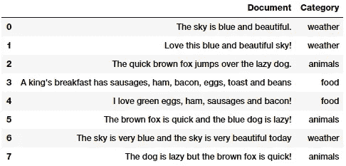******

******Our sample text corpus******

******我们的玩具语料库由属于几个类别的文档组成。本文中我们将使用的另一个语料库是通过`nltk`中的`corpus`模块从 [***项目中免费获得的***](https://www.gutenberg.org/) ***[***钦定版圣经***](https://www.gutenberg.org/files/10/10-h/10-h.htm) 。在下一节中，我们将很快加载它。在我们谈论特征工程之前，我们需要预处理和规范化这个文本。*********

## ***文本预处理***

***可以有多种清理和预处理文本数据的方式。在自然语言处理(NLP)管道中大量使用的最重要的技术已经在本系列 [***第 3 部分***](/understanding-feature-engineering-part-3-traditional-methods-for-text-data-f6f7d70acd41) 的 ***【文本预处理】*** 部分中详细强调。由于本文的重点是功能工程，就像我们的上一篇文章一样，我们将重用我们简单的文本预处理程序，它专注于删除文本语料库中的特殊字符、额外空格、数字、停用词和小写字母。***

***一旦我们准备好了基本的预处理流水线，让我们首先把它应用到我们的玩具语料库中。***

```
***norm_corpus = normalize_corpus(corpus)
norm_corpus**Output
------** array(['sky blue beautiful', 'love blue beautiful sky',
       'quick brown fox jumps lazy dog',
       'kings breakfast sausages ham bacon eggs toast beans',
       'love green eggs ham sausages bacon',
       'brown fox quick blue dog lazy', 
       'sky blue sky beautiful today',
       'dog lazy brown fox quick'],
      dtype='<U51')***
```

***现在让我们使用`nltk`加载基于 [***钦定版圣经***](https://www.gutenberg.org/files/10/10-h/10-h.htm) 的其他语料库，并对文本进行预处理。***

***下面的输出显示了我们的语料库中的总行数，以及预处理如何对文本内容进行处理。***

```
*****Output
------**Total lines: 30103

Sample line: ['1', ':', '6', 'And', 'God', 'said', ',', 'Let', 'there', 'be', 'a', 'firmament', 'in', 'the', 'midst', 'of', 'the', 'waters', ',', 'and', 'let', 'it', 'divide', 'the', 'waters', 'from', 'the', 'waters', '.']

Processed line: god said let firmament midst waters let divide waters waters***
```

***让我们看看现在流行的一些单词嵌入模型和来自我们语料库的工程特征！***

# ***Word2Vec 模型***

***该模型由谷歌在 2013 年创建，是一种基于预测性深度学习的模型，用于计算和生成高质量、分布式和连续的单词密集矢量表示，这些表示捕捉上下文和语义的相似性。本质上，这些是无监督的模型，可以接受大量文本语料库，创建可能单词的词汇表，并在表示该词汇表的向量空间中为每个单词生成密集的单词嵌入。通常你可以指定单词嵌入向量的大小，向量的总数实质上就是词汇量的大小。这使得这个密集向量空间的维数比使用传统单词袋模型构建的高维稀疏向量空间低得多。***

***Word2Vec 可以利用两种不同的模型架构来创建这些单词嵌入表示。这些包括:***

*   *****连续单词包(CBOW)模型*****
*   *****跳格模型*****

***最初由 Mikolov 等人介绍，我建议感兴趣的读者阅读围绕这些模型的原始论文，包括 Mikolov 等人的 [*【单词和短语的分布式表示及其组合性】*](https://arxiv.org/pdf/1310.4546.pdf)和 Mikolov 等人的 [*【向量空间中单词表示的有效估计】*](https://arxiv.org/pdf/1301.3781.pdf)，以获得一些很好的深入观点。***

# ***连续词汇袋模型***

***CBOW 模型架构试图基于源上下文单词(周围单词)来预测当前目标单词(中心单词)。考虑一个简单的句子， ***“敏捷的棕色狐狸跳过懒惰的狗”*** ，这可以是成对的 ***(context_window，target_word)*** 其中如果我们考虑大小为 2 的上下文窗口，我们有这样的例子: ***(【敏捷，狐狸】、棕色)、(【the，棕色)、敏捷)、(【the，狗】、*** 等等。因此，该模型试图基于`context_window`单词来预测`target_word`。***

******

***The CBOW model architecture (Source: [https://arxiv.org/pdf/1301.3781.pdf](https://arxiv.org/pdf/1301.3781.pdf) Mikolov el al.)***

***虽然 Word2Vec 系列模型是无监督的，但这意味着你可以给它一个没有额外标签或信息的语料库，它可以从语料库中构建密集的单词嵌入。但是一旦你有了这个语料库，你仍然需要利用一个监督的分类方法来得到这些嵌入。但是我们将从语料库本身中进行，没有任何辅助信息。我们现在可以将这个 CBOW 架构建模为深度学习分类模型，使得我们接受 ***上下文单词作为我们的输入，X*** 并且尝试预测 ***目标单词，Y*** 。事实上，构建这种架构比 skip-gram 模型更简单，在 skip-gram 模型中，我们试图从源目标单词预测一整串上下文单词。***

# ***实施连续单词袋(CBOW)模型***

***虽然使用像 gensim 这样的具有 Word2Vec 模型的健壮框架是很好的，但是让我们从头开始尝试实现它，以获得一些关于幕后真正工作方式的观点。我们将利用我们的 ***圣经语料库*** 中包含的`norm_bible`变量来训练我们的模型。实施将集中在四个部分***

*   *****建立语料库词汇*****
*   *****构建一个 CBOW(上下文，目标)生成器*****
*   *****构建 CBOW 模型架构*****
*   *****训练模型*****
*   *****获取单词嵌入*****

***不要再拖延了，让我们开始吧！***

## *****建立语料库词汇*****

***首先，我们将首先构建我们的语料库词汇，从我们的词汇中提取每个唯一的单词，并为其映射一个唯一的数字标识符。***

```
*****Output
------**Vocabulary Size: 12425
Vocabulary Sample: [('perceived', 1460), ('flagon', 7287), ('gardener', 11641), ('named', 973), ('remain', 732), ('sticketh', 10622), ('abstinence', 11848), ('rufus', 8190), ('adversary', 2018), ('jehoiachin', 3189)]***
```

***因此，您可以看到，我们已经在语料库中创建了独特单词的词汇表，以及将单词映射到其独特标识符的方法，反之亦然。如果需要，`**PAD**`术语通常用于将上下文单词填充到固定长度。***

## ***构建一个 CBOW(上下文，目标)生成器***

***我们需要由目标中心词和周围上下文词组成的词对。在我们的实现中，一个 ***目标单词*** 的长度为`**1**`，而 ***周围上下文*** 的长度为`**2 x window_size**`，其中我们在语料库中的目标单词前后取`**window_size**` 单词。通过下面的例子，这将变得更加清楚。***

```
*****Context (X): ['old','testament','james','bible'] -> Target (Y): king
Context (X): ['first','book','called','genesis'] -> Target(Y): moses
Context(X):['beginning','god','heaven','earth'] -> Target(Y):created
Context (X):['earth','without','void','darkness'] -> Target(Y): form
Context (X): ['without','form','darkness','upon'] -> Target(Y): void
Context (X): ['form', 'void', 'upon', 'face'] -> Target(Y): darkness
Context (X): ['void', 'darkness', 'face', 'deep'] -> Target(Y): upon
Context (X): ['spirit', 'god', 'upon', 'face'] -> Target (Y): moved
Context (X): ['god', 'moved', 'face', 'waters'] -> Target (Y): upon
Context (X): ['god', 'said', 'light', 'light'] -> Target (Y): let
Context (X): ['god', 'saw', 'good', 'god'] -> Target (Y): light*****
```

***前面的输出应该让您对 ***X*** 如何形成我们的上下文单词有了更多的了解，我们正试图根据这个上下文来预测目标中心单词 ***Y*** 。举个例子，如果原文是*‘太初神造天地’*，经过预处理，去掉停用词后就变成了*‘太初神* ***造了*** *【天地’*，对我们来说，我们要达到的是，给定*【始、神、天、地】*为语境，目标中心词是什么，这种情况下就是' ***创造了'*** 。***

## ***构建 CBOW 模型架构***

***我们现在利用`tensorflow`之上的`keras`来为 CBOW 模型构建我们的深度学习架构。为此，我们的输入将是传递到嵌入层的上下文单词(用随机权重初始化)。单词嵌入被传播到 lambda 层，在那里我们平均出单词嵌入 ***(因此称为 CBOW，因为我们在平均时并不真正考虑上下文单词中的顺序或序列)*** ，然后我们将这个平均的上下文嵌入传递到预测我们的目标单词的密集 softmax 层。我们将其与实际的目标单词进行匹配，通过利用`categorical_crossentropy`损失来计算损失，并在每个时期执行反向传播，以在该过程中更新嵌入层。下面的代码向我们展示了我们的模型架构。***

***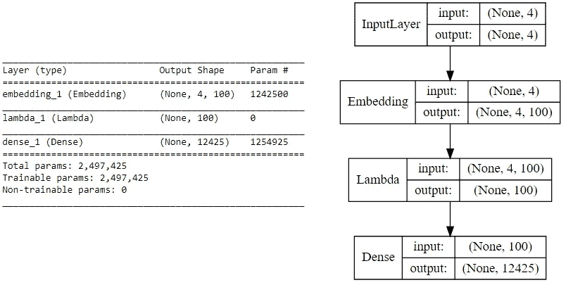***

***CBOW model summary and architecture***

***如果你仍然难以可视化上述深度学习模型，我建议你通读我之前提到的论文。我将尝试用简单的术语来总结这个模型的核心概念。我们有尺寸为`**(2 x window_size)**`的 ***输入上下文单词*** ，我们将把它们传递给尺寸为`**(vocab_size x embed_size)**`的 ***嵌入层*** ，这将为这些上下文单词`**(1 x embed_size for each word)**`中的每一个给出 ***密集单词嵌入*** 。接下来，我们使用一个***λ层*** 来平均这些嵌入，并得到一个 ***平均密集嵌入*** `**(1 x embed_size)**`，它被发送到 ***密集 softmax 层*** ，后者输出最可能的目标单词。我们将其与实际的目标单词进行比较，计算损失，反向传播误差以调整权重(在嵌入层中)，并对多个时期的所有*(上下文，目标)*对重复该过程。下图试图解释同样的情况。***

***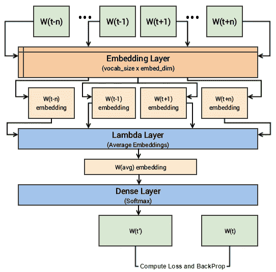***

***Visual depiction of the CBOW deep learning model***

***我们现在准备在我们的语料库上训练这个模型，使用我们的数据生成器输入 ***(上下文，目标单词)*** 对。***

## ***训练模型***

***在我们完整的语料库上运行模型需要相当多的时间，所以我只运行了 5 个时期。您可以利用下面的代码，并在必要时增加更多的历元。***

```
***Epoch: 1 	Loss: 4257900.60084
Epoch: 2 	Loss: 4256209.59646
Epoch: 3 	Loss: 4247990.90456
Epoch: 4 	Loss: 4225663.18927
Epoch: 5 	Loss: 4104501.48929***
```

> *****注意:**运行这个模型计算量很大，如果使用 GPU 进行训练，效果会更好。我在一个 AWS `**p2.x**`实例上用 Tesla K80 GPU 对其进行了训练，仅 5 个纪元就花了我将近 1.5 小时！***

***一旦这个模型被训练，相似的单词应该基于嵌入层具有相似的权重，并且我们可以测试出相同的权重。***

## ***获取单词嵌入***

***为了获得整个词汇表的单词嵌入，我们可以利用下面的代码从嵌入层中提取出相同的内容。我们不在位置 0 进行嵌入，因为它属于填充项`**(PAD)**`，而填充项并不是真正感兴趣的单词。***

******

***Word Embeddings for our vocabulary based on the CBOW model***

***因此，您可以清楚地看到，每个单词都有一个大小为`**(1x100)**`的密集嵌入，如前面的输出所示。让我们试着根据这些嵌入，为感兴趣的特定单词找出一些上下文相似的单词。为此，我们基于密集嵌入向量在我们的词汇表中的所有单词之间建立成对距离矩阵，然后基于最短(欧几里德)距离找出每个感兴趣单词的 n 个最近邻居。***

```
*****(12424, 12424)****{'egypt': ['destroy', 'none', 'whole', 'jacob', 'sea'],
 'famine': ['wickedness', 'sore', 'countries', 'cease', 'portion'],
 'god': ['therefore', 'heard', 'may', 'behold', 'heaven'],
 'gospel': ['church', 'fowls', 'churches', 'preached', 'doctrine'],
 'jesus': ['law', 'heard', 'world', 'many', 'dead'],
 'john': ['dream', 'bones', 'held', 'present', 'alive'],
 'moses': ['pharaoh', 'gate', 'jews', 'departed', 'lifted'],
 'noah': ['abram', 'plagues', 'hananiah', 'korah', 'sarah']}*****
```

***你可以清楚地看到，其中一些在上下文中有意义 ***【上帝，天堂】******【福音，教会】*** 等等，而一些可能没有意义。训练更多的纪元通常会得到更好的结果。现在，我们将探讨 skip-gram 体系结构，与 CBOW 相比，它通常会给出更好的结果。***

# ***跳格模型***

***跳格模型体系结构通常试图实现 CBOW 模型的反向操作。它试图在给定目标单词(中心单词)的情况下预测源上下文单词(周围的单词)。考虑到我们前面的简单句子， ***“敏捷的棕色狐狸跳过懒惰的狗”。*** 如果我们使用 CBOW 模型，我们得到成对的 ***(context_window，target_word)*** 其中如果我们考虑大小为 2 的上下文窗口，我们有类似于 ***([quick，fox]，brown)，([the，brown)，quick)，([the，dog]，lazy)*** 等例子。现在考虑到 skip-gram 模型的目的是从目标单词预测上下文，该模型通常反转上下文和目标，并试图从其目标单词预测每个上下文单词。于是任务就变成了预测上下文 ***【快，狐狸】*** 给定目标词 ***【布朗】*** 或***【the，brown】***给定目标词 ***【快】*** 等等。因此，该模型试图基于目标单词来预测上下文窗口单词。***

******

***The Skip-gram model architecture (Source: [https://arxiv.org/pdf/1301.3781.pdf](https://arxiv.org/pdf/1301.3781.pdf) Mikolov el al.)***

***就像我们在 CBOW 模型中讨论的那样，我们现在需要将这种跳过语法的架构建模为深度学习分类模型，以便我们将*目标单词作为我们的输入*，并尝试*预测上下文单词。*这变得有点复杂，因为在我们的上下文中有多个单词。我们通过将每个 ***(目标，上下文 _ 单词)对*** 分解成 ***(目标，上下文)对*** 来进一步简化这一点，使得每个上下文仅由一个单词组成。因此，我们之前的数据集被转换成像 ***(棕色，快速)，(棕色，狐狸)，(快速，the)，(快速，棕色)*** 这样的对。但是如何监督或训练模型知道什么是上下文相关的，什么不是？***

***为此，我们喂我们的跳过图模型对 ***(X，Y)*** 其中 ***X*** 是我们的 ***输入******Y***是我们的 ***标签*** 。我们通过使用 ***[(目标，上下文)，1]*** 对作为 ***实际输入样本*** 来做到这一点，其中 ***目标*** 是我们感兴趣的单词，而 ***上下文*** 是出现在目标单词附近的上下文单词，并且 ***正标签 1*** 指示这是上下文相关的对。我们还输入 ***[(目标，随机)，0]*** 对作为 ***负输入样本*** 其中 ***目标*** 再次是我们感兴趣的单词，但是 ***随机*** 只是从我们的词汇表中随机选择的单词，与我们的目标单词没有上下文或关联。因此 ***否定标记 0*** 表示这是一个上下文不相关的对。我们这样做是为了让模型能够学习哪些词对是上下文相关的，哪些是不相关的，并为语义相似的词生成相似的嵌入。***

# ***实现跳格模型***

***现在，让我们从头开始尝试并实现这个模型，以获得一些关于幕后工作方式的视角，这样我们就可以将其与 CBOW 模型的实现进行比较。我们将像往常一样利用包含在`**norm_bible**`变量中的圣经语料库来训练我们的模型。实施将集中在五个部分***

*   *****建立语料库词汇*****
*   *****构建一个 skip-gram [(目标，上下文)，关联]生成器*****
*   *****构建跳格模型架构*****
*   *****训练模型*****
*   *****获取单词嵌入*****

***让我们开始构建我们的 skip-gram Word2Vec 模型吧！***

## ***建立语料库词汇***

***首先，我们将遵循构建语料库词汇的标准流程，从我们的词汇中提取每个唯一的单词，并分配一个唯一的标识符，类似于我们在 CBOW 模型中所做的。我们还维护将单词转换成它们的唯一标识符的映射，反之亦然。***

```
***Vocabulary Size: 12425
Vocabulary Sample: [('perceived', 1460), ('flagon', 7287), ('gardener', 11641), ('named', 973), ('remain', 732), ('sticketh', 10622), ('abstinence', 11848), ('rufus', 8190), ('adversary', 2018), ('jehoiachin', 3189)]***
```

***正如我们所希望的那样，语料库中的每个独特的单词现在都是我们词汇表的一部分，带有一个独特的数字标识符。***

## ***构建一个 skip-gram [(目标，上下文)，相关性]生成器***

***现在是时候构建我们的跳格生成器了，它会像我们之前讨论的那样给我们一对单词和它们的相关性。幸运的是，`keras`有一个可以使用的漂亮的`skipgrams`实用程序，我们不必像在 CBOW 中那样手动实现这个生成器。***

> *****注:**功能`[**skipgrams(…)**](https://keras.io/preprocessing/sequence/#skipgrams)`出现在`[**keras.preprocessing.sequence**](https://keras.io/preprocessing/sequence)`中***
> 
> ***此函数将一系列单词索引(整数列表)转换为以下形式的单词元组:***
> 
> ***-(字，字在同一个窗口)，标签为 1(阳性样本)。***
> 
> ***-(单词，从词汇表中随机抽取的单词)，标签为 0(负样本)。***

```
*****(james (1154), king (13)) -> 1
(king (13), james (1154)) -> 1
(james (1154), perform (1249)) -> 0
(bible (5766), dismissed (6274)) -> 0
(king (13), alter (5275)) -> 0
(james (1154), bible (5766)) -> 1
(king (13), bible (5766)) -> 1
(bible (5766), king (13)) -> 1
(king (13), compassion (1279)) -> 0
(james (1154), foreskins (4844)) -> 0*****
```

***因此，您可以看到我们已经成功地生成了所需的跳转图，并且基于前面输出中的示例跳转图，您可以根据标签(0 或 1)清楚地看到什么是相关的，什么是不相关的。***

## ***构建跳格模型架构***

***我们现在在`tensorflow`的基础上利用`keras`来为跳格模型构建我们的深度学习架构。为此，我们的输入将是我们的目标单词和上下文或随机单词对。每一个都被传递给它自己的嵌入层(用随机权重初始化)。一旦我们获得了目标和上下文单词的单词嵌入，我们就把它传递给一个合并层，在那里我们计算这两个向量的点积。然后，我们将这个点积值传递给密集的 sigmoid 层，该层根据这对单词是上下文相关的还是只是随机单词来预测 1 或 0(***Y’***)。我们将其与实际的相关性标签( ***Y*** )进行匹配，通过利用`mean_squared_error`损失来计算损失，并在该过程中利用每个时期执行反向传播来更新嵌入层。下面的代码向我们展示了我们的模型架构。***

***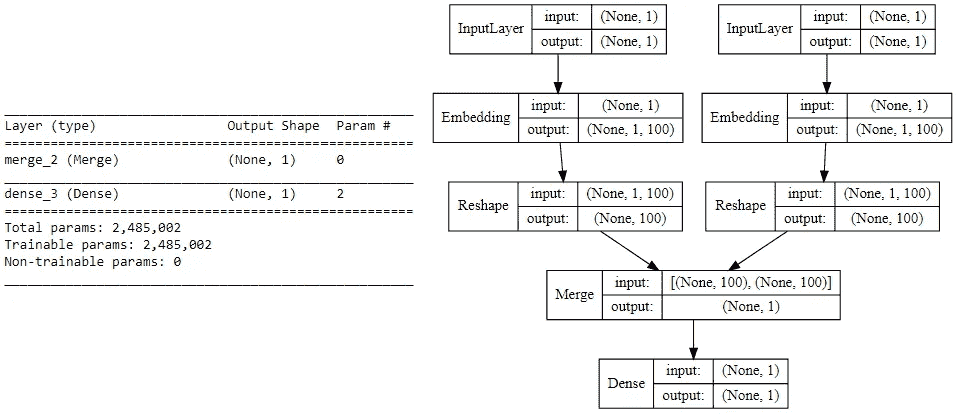***

***Skip-gram model summary and architecture***

***理解上面的深度学习模型非常简单。不过，为了便于理解，我会尽量用简单的词语来概括这个模型的核心概念。对于每个训练示例，我们有一对输入单词，由具有唯一数字标识符的一个输入目标单词 ***和具有唯一数字标识符的一个上下文单词 ***组成。如果是 ***一个正例*** 这个词有上下文意义，是 ***一个上下文词*** 和我们的 ***标注 Y=1*** ，否则如果是 ***一个负例*** ，这个词没有上下文意义，只是 ***一个随机词*** 和我们的 ***标注 Y=0 我们将把它们中的每一个传递给它们自己的 ***嵌入层*** ，大小为`**(vocab_size x embed_size)**`，这将为这两个单词`**(1 x embed_size for each word)**`中的每一个给我们 ***密集单词嵌入*** 。接下来我们使用一个 ***合并层*** 来计算这两个嵌入的 ***点积*** 并得到点积值。这然后被发送到 ***密集 s 形层*** ，其输出 1 或 0。我们将其与实际标签 Y (1 或 0)进行比较，计算损失，反向传播误差以调整权重(在嵌入层中)，并对多个时期的所有 ***【目标，上下文】*** 对重复该过程。下图试图解释同样的情况。************

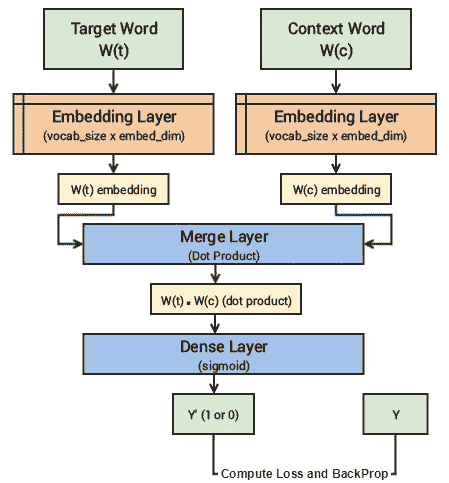

Visual depiction of the Skip-gram deep learning model

现在让我们开始用跳步图训练我们的模型。

## 训练模型

在我们的完整语料库上运行该模型需要相当多的时间，但比 CBOW 模型少。因此，我只运行了 5 个时期。您可以利用下面的代码，并在必要时增加更多的历元。

```
Epoch: 1 Loss: 4529.63803683
Epoch: 2 Loss: 3750.71884749
Epoch: 3 Loss: 3752.47489296
Epoch: 4 Loss: 3793.9177565
Epoch: 5 Loss: 3716.07605051
```

一旦这个模型被训练，相似的单词应该基于嵌入层具有相似的权重，并且我们可以测试出相同的权重。

## 获取单词嵌入

为了获得整个词汇表的单词嵌入，我们可以利用下面的代码从嵌入层中提取出相同的内容。请注意，我们只对目标单词嵌入层感兴趣，因此我们将从我们的`**word_model**`嵌入层中提取嵌入。我们不在位置 0 进行嵌入，因为词汇表中没有一个单词的数字标识符为 0，我们忽略它。


Word Embeddings for our vocabulary based on the Skip-gram model

因此，您可以清楚地看到，每个单词都有一个大小为`**(1x100)**`的密集嵌入，如前面的输出所示，类似于我们从 CBOW 模型中获得的结果。现在让我们对这些密集的嵌入向量应用欧几里德距离度量来为我们的词汇表中的每个单词生成成对的距离度量。然后，我们可以基于最短(欧几里德)距离找出每个感兴趣单词的 n 个最近邻，类似于我们在 CBOW 模型的嵌入中所做的。

```
(**12424, 12424)****{'egypt': ['pharaoh', 'mighty', 'houses', 'kept', 'possess'],
 'famine': ['rivers', 'foot', 'pestilence', 'wash', 'sabbaths'],
 'god': ['evil', 'iniquity', 'none', 'mighty', 'mercy'],
 'gospel': ['grace', 'shame', 'believed', 'verily', 'everlasting'],
 'jesus': ['christ', 'faith', 'disciples', 'dead', 'say'],
 'john': ['ghost', 'knew', 'peter', 'alone', 'master'],
 'moses': ['commanded', 'offerings', 'kept', 'presence', 'lamb'],
 'noah': ['flood', 'shem', 'peleg', 'abram', 'chose']}**
```

从结果中可以清楚地看到，对于每个感兴趣的单词，许多相似的单词是有意义的，并且我们已经获得了比 CBOW 模型更好的结果。让我们现在使用 [**t-SNE**](https://en.wikipedia.org/wiki/T-distributed_stochastic_neighbor_embedding) 来可视化这些单词嵌入，T11 代表[***t-分布式随机邻居嵌入***](https://en.wikipedia.org/wiki/T-distributed_stochastic_neighbor_embedding) 一种流行的[降维](https://en.wikipedia.org/wiki/Dimensionality_reduction)技术来在较低维(例如 2-D)中可视化高维空间。


Visualizing skip-gram word2vec word embeddings using t-SNE

我用红色标记了一些圆圈，这些圆圈似乎显示了在向量空间中位置相近的上下文相似的不同单词。如果你发现任何其他有趣的模式，随时让我知道！

# 基于 Gensim 的鲁棒 Word2Vec 模型

虽然我们的实现足够好，但它们还没有优化到能在大型语料库上很好地工作。由雷迪姆·řehůřek 创建的`[**gensim**](https://radimrehurek.com/gensim/)`框架由 Word2Vec 模型的健壮、高效和可伸缩的实现组成。我们将在圣经语料库中利用同样的方法。在我们的工作流程中，我们将标记化我们的规范化语料库，然后关注 Word2Vec 模型中的以下四个参数来构建它。

*   `**size**` **:** 一词嵌入维度
*   `**window**` **:** 上下文窗口大小
*   `**min_count**` **:** 最小字数
*   `**sample**` **:** 常用词的下采样设置

在建立我们的模型之后，我们将使用我们感兴趣的单词来查看每个单词的顶部相似单词。


这里的相似词肯定与我们感兴趣的词更相关，这是预料之中的，因为我们对这个模型进行了更多次迭代，这一定产生了更好和更多的上下文嵌入。你注意到什么有趣的联想了吗？

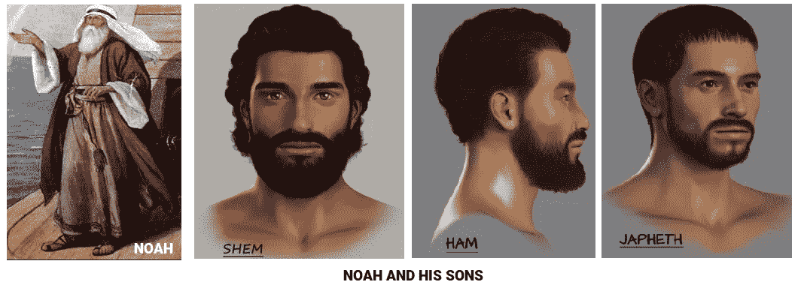

Noah’s sons come up as the most contextually similar entities from our model!

在使用 t-SNE 将它们的维度减少到 2-D 空间之后，让我们也使用它们的嵌入向量来可视化感兴趣的单词和它们的相似单词。


Visualizing our word2vec word embeddings using t-SNE

我画的红圈指出了我发现的一些有趣的联想。根据我之前的描述，我们可以清楚地看到 ***诺亚*** 和他的儿子们根据我们模型中的单词 embeddings 彼此非常接近！

# 将 Word2Vec 特性应用于机器学习任务

如果你还记得阅读过上一篇文章 [***第三部分:文本数据的传统方法***](/understanding-feature-engineering-part-3-traditional-methods-for-text-data-f6f7d70acd41) 你可能已经看到过我使用特性来完成一些实际的机器学习任务，比如聚类。让我们利用我们的其他顶级语料库，并尝试实现同样的目标。首先，我们将在语料库上构建一个简单的 Word2Vec 模型，并可视化嵌入。


Visualizing word2vec word embeddings on our toy corpus

请记住，我们的语料库非常小，因此要获得有意义的单词嵌入，并让模型获得更多的上下文和语义，更多的数据是有帮助的。那么在这个场景中嵌入的单词是什么呢？它通常是每个单词的密集向量，如以下单词 ***sky*** 的示例所示。

```
w2v_model.wv['sky']**Output
------**array([ 0.04576328,  0.02328374, -0.04483001,  0.0086611 ,  0.05173225, 0.00953358, -0.04087641, -0.00427487, -0.0456274 ,  0.02155695], dtype=float32)
```

现在，假设我们想从我们的玩具语料库中聚集八个文档，我们需要从每个文档中出现的每个单词中获得文档级嵌入。一种策略是平均文档中每个单词的单词嵌入量。这是一个非常有用的策略，你可以用它来解决你自己的问题。现在让我们将它应用到我们的语料库中，以获得每个文档的特征。

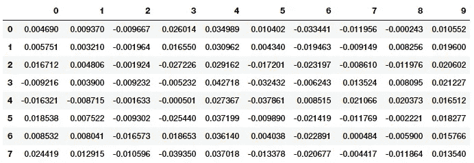

Document level embeddings

现在我们有了每个文档的特征，让我们使用 [***相似性传播***](https://en.wikipedia.org/wiki/Affinity_propagation) 算法对这些文档进行聚类，这是一种基于数据点之间的*“消息传递”*概念的聚类算法，并且不需要将聚类的数量作为显式输入，而这是基于分区的聚类算法经常需要的。

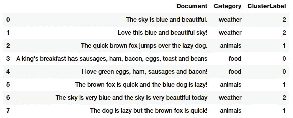

Clusters assigned based on our document features from word2vec

我们可以看到，我们的算法已经根据 Word2Vec 特性将每个文档聚类到正确的组中。相当整洁！我们还可以通过使用 [***主成分分析(PCA)***](https://en.wikipedia.org/wiki/Principal_component_analysis) 来将特征维度降低到二维，然后将其可视化(通过对每个聚类进行颜色编码)，来可视化每个文档在每个聚类中的位置。

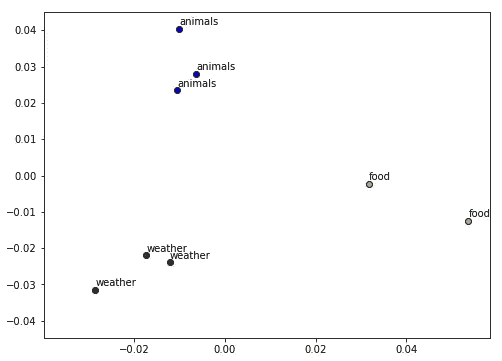

Visualizing our document clusters

每一个簇中的文档看起来都是有序的，因为每个簇中的文档彼此靠近，而与其他簇相距较远。

# 手套模型

GloVe 模型代表全局向量，这是一种无监督的学习模型，可用于获得类似于 Word2Vec 的密集单词向量。然而，该技术是不同的，并且在聚集的全局单词-单词共现矩阵上执行训练，给我们一个具有有意义的子结构的向量空间。这种方法是由 Pennington 等人在斯坦福发明的，我推荐你阅读关于 GloVe 的原始论文，[*‘GloVe:Global Vectors for Word Representation’*Pennington 等人的文章](https://nlp.stanford.edu/pubs/glove.pdf)，这是一篇很好的阅读材料，可以让你对这个模型的工作原理有一些了解。

我们不会在这里过多地讨论该模型的实现细节，但是如果你对实际代码感兴趣，你可以查看官方的 [*页面*](https://nlp.stanford.edu/projects/glove/) 。我们将保持事情简单，并试图理解手套模型背后的基本概念。我们已经讨论了基于计数的矩阵分解方法，如 LSA 和预测方法，如 Word2Vec。这篇论文声称，目前，两个家庭都有明显的缺陷。像 LSA 这样的方法有效地利用了统计信息，但它们在单词类比任务上表现相对较差，比如我们如何找出语义相似的单词。像 skip-gram 这样的方法可能在类比任务上做得更好，但是它们在全局水平上很少利用语料库的统计数据。

GloVe 模型的基本方法是首先创建一个由(单词，上下文)对组成的巨大的单词-上下文共现矩阵，使得该矩阵中的每个元素表示单词与上下文(可以是单词序列)一起出现的频率。想法是应用矩阵分解来近似这个矩阵，如下图所示。


Conceptual model for the GloVe model’s implementation

考虑到***【WC】***矩阵、 ***词-特征(WF)*** 矩阵和 ***特征-上下文(FC)*** 矩阵，我们尝试对`**WC = WF x FC**`进行因式分解，这样我们的目标是从*和 ***FC*** 中重构 ***WC*** 为此，我们通常用一些随机权重初始化***【WF】***和 ***FC*** ，并尝试将它们相乘以获得***【WC’***(WC 的近似值)，并测量它与 ***WC*** 的接近程度。我们多次使用[*【SGD】*](https://en.wikipedia.org/wiki/Stochastic_gradient_descent)来最小化误差。最后， ***单词特征矩阵(WF)*** 给出了每个单词的单词嵌入，其中 ***F*** 可以预设为特定的维数。需要记住的非常重要的一点是，Word2Vec 和 GloVe 模型在工作方式上非常相似。它们都旨在建立一个向量空间，其中每个单词的位置都受其相邻单词基于上下文和语义的影响。Word2Vec 从单词共现对的局部单个示例开始，GloVe 从语料库中所有单词的全局聚合共现统计开始。*

# *将手套特征应用于机器学习任务*

*让我们尝试利用基于手套的嵌入来完成我们的文档聚类任务。非常流行的`[**spacy**](https://spacy.io)`框架具有基于不同语言模型利用手套嵌入的能力。你也可以[获得预先训练好的单词向量](https://nlp.stanford.edu/projects/glove/)，并根据需要使用`gensim`或`spacy`加载它们。我们将首先安装 spacy 并使用 [en_vectors_web_lg](https://spacy.io/models/en#en_vectors_web_lg) 模型，该模型由在[普通爬行](http://commoncrawl.org/)上训练的 300 维单词向量组成。*

```
*# Use the following command to install spaCy
> pip install -U spacyOR> conda install -c conda-forge spacy# Download the following language model and store it in disk
[https://github.com/explosion/spacy-models/releases/tag/en_vectors_web_lg-2.0.0](https://github.com/explosion/spacy-models/releases/tag/en_vectors_web_lg-2.0.0)# Link the same to spacy 
> python -m spacy link ./spacymodels/en_vectors_web_lg-2.0.0/en_vectors_web_lg en_vecsLinking successful
    ./spacymodels/en_vectors_web_lg-2.0.0/en_vectors_web_lg --> ./Anaconda3/lib/site-packages/spacy/data/en_vecsYou can now load the model via spacy.load('en_vecs')*
```

*在`spacy`中也有自动安装模型的方法，如果需要，你可以查看他们的[模型&语言页面](https://spacy.io/usage/models)了解更多信息。我有一些同样的问题，所以我不得不手动加载它们。我们现在将使用`spacy`加载我们的语言模型。*

```
***Total word vectors: 1070971***
```

*这验证了一切都在正常工作。现在，让我们在玩具语料库中获取每个单词的手套嵌入。*

**

*GloVe embeddings for words in our toy corpus*

*我们现在可以使用 t-SNE 来可视化这些嵌入，类似于我们使用 Word2Vec 嵌入所做的。*

*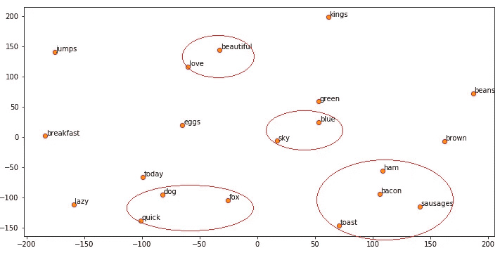*

*Visualizing GloVe word embeddings on our toy corpus*

*`spacy`的美妙之处在于，它会自动为你提供每个文档中单词的平均嵌入量，而不必像我们在 Word2Vec 中那样实现一个功能。我们将利用同样的方法为我们的语料库获取文档特征，并使用 [***k-means***](https://en.wikipedia.org/wiki/K-means_clustering) 聚类来对我们的文档进行聚类。*

**

*Clusters assigned based on our document features from GloVe*

*我们看到一致的集群，类似于我们从 Word2Vec 模型中获得的集群，这很好！GloVe 模型声称在许多情况下比 Word2Vec 模型表现更好，如下图所示，该图来自 Pennington 等人的[原始论文。](https://nlp.stanford.edu/pubs/glove.pdf)*

**

*GloVe vs Word2Vec performance (Source: [https://nlp.stanford.edu/pubs/glove.pdf](https://nlp.stanford.edu/pubs/glove.pdf) by Pennington et al.)*

*上述实验是通过在相同的 6B 令牌语料库(Wikipedia 2014 + Gigaword 5)上训练 300 维向量来完成的，该语料库具有相同的 40 万单词词汇和大小为 10 的对称上下文窗口，以防有人对细节感兴趣。*

# *快速文本模型*

*脸书在 2016 年首次推出了 [**FastText**](https://fasttext.cc/) 模型，作为普通 Word2Vec 模型的扩展和据称的改进。基于 Mikolov 等人的题为 [*“用子词信息丰富词向量”*](https://arxiv.org/pdf/1607.04606.pdf)的原始论文，这是深入理解该模型如何工作的一篇好文章。总的来说，FastText 是一个用于学习单词表示以及执行健壮、快速和准确的文本分类的框架。该框架由[脸书](https://www.facebook.com/)在 [**GitHub**](https://github.com/facebookresearch/fastText) 上开源，并声称有如下内容。*

*   *最近最先进的[英语单词矢量](https://fasttext.cc/docs/en/english-vectors.html)。*
*   *在维基百科上训练的 [157 种语言的单词向量和爬行](https://github.com/facebookresearch/fastText/blob/master/docs/crawl-vectors.md)。*
*   *用于[语言识别](https://fasttext.cc/docs/en/language-identification.html#content)和[各种监督任务](https://fasttext.cc/docs/en/supervised-models.html#content)的模型。*

*虽然我还没有从零开始实现这个模型，但根据这篇研究论文，以下是我对这个模型如何工作的了解。一般而言，像 Word2Vec 模型这样的预测模型通常将每个单词视为不同的实体(例如 ***，其中*** )，并为该单词生成密集嵌入。然而，这对于具有大量词汇和许多在不同语料库中不经常出现的罕见单词的语言来说是一个严重的限制。Word2Vec 模型通常忽略每个单词的形态结构，并将单词视为单个实体。FastText 模型*将每个单词视为一包字符 n 元语法。*这在文中也称为子字模型。*

*我们在单词的开头和结尾加上特殊的边界符号 **<** 和 **>** 。这使我们能够将前缀和后缀与其他字符序列区分开来。我们还将单词 ***w*** 本身包含在其 n-grams 的集合中，以学习每个单词的表示(除了它的字符 n-grams)。以单词 ***其中*** 和***n = 3***(tri-grams)为例，将由字符 n-grams: ***< wh、whe、her、ere、re >*** 和特殊序列 ***<其中>*** 表示整个单词。注意顺序，对应字 ***<她>*** 不同于三字组 ***她*** 来自字 ***其中*** 。*

*在实践中，本文推荐在抽取所有 n 元文法时，对于***n≥******3***和***n≤******6***。这是一种非常简单的方法，可以考虑不同组的 n 元语法，例如取所有的前缀和后缀。我们通常将一个单词的向量表示(嵌入)与每个 n 元语法相关联。因此，我们可以用一个单词的 n 元文法的向量表示的和或者这些 n 元文法的嵌入的平均值来表示这个单词。因此，由于这种基于单词的字符利用单个单词的 n 元语法的效果，稀有单词有更高的机会获得良好的表示，因为它们的基于字符的 n 元语法应该出现在语料库的其他单词中。*

# *将快速文本特征应用于机器学习任务*

*`gensim`包有很好的包装器，提供用户界面来利用`gensim.models.fasttext`模块下可用的 FastText 模型。让我们在圣经语料库 上再次应用这一点，看看我们感兴趣的单词和它们最相似的单词。*

**

*你可以在我们的 Word2Vec 模型的结果中看到很多相似之处，每个感兴趣的单词都有相关的相似单词。你注意到什么有趣的联系和相似之处了吗？*

*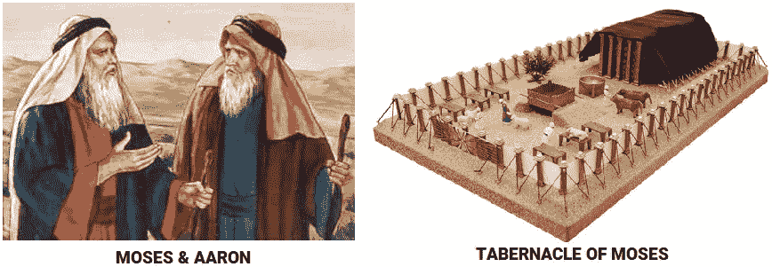*

*Moses, his brother Aaron and the Tabernacle of Moses*

> ***注意:**运行该模型在计算上是昂贵的，并且与 skip-gram 模型相比通常花费更多的时间，因为它为每个单词考虑 n-grams。如果使用 GPU 或良好的 CPU 进行训练，效果会更好。我在 AWS `***p2.x***`实例上对此进行了训练，花费了我大约 10 分钟的时间，相比之下，在常规系统上花费了 2-3 个小时。*

*现在让我们使用 [***主成分分析(PCA)***](https://en.wikipedia.org/wiki/Principal_component_analysis) 将单词嵌入维数降低到 2-D，然后将其可视化。*

*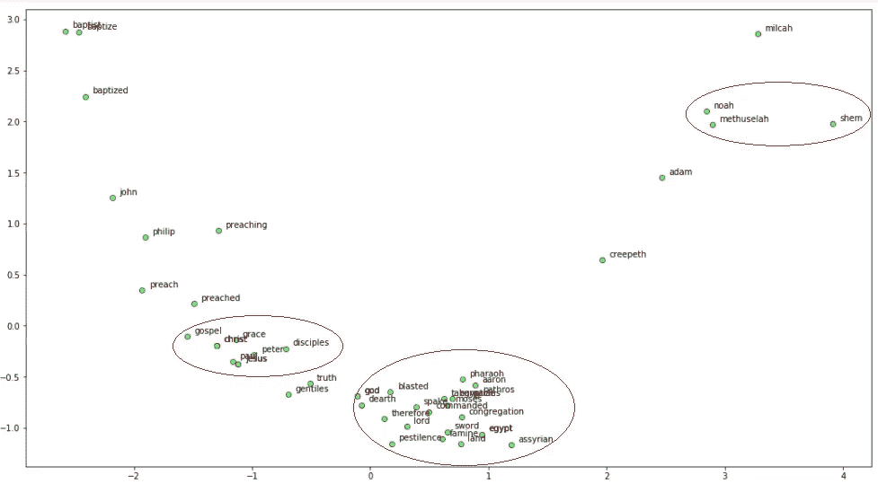*

*Visualizing FastTest word embeddings on our Bible corpus*

*我们可以看到很多有趣的图案！*诺亚*，他的儿子*闪*和爷爷*玛士撒拉*关系亲密。我们也看到*神*与*摩西*和*埃及*联系在一起，在那里它忍受了圣经中的瘟疫，包括*饥荒*和*瘟疫*。同样*耶稣*和他的一些*门徒*彼此关系密切。*

*要访问任何单词嵌入，您可以用如下单词索引模型。*

```
***ft_model.wv['jesus']**array([-0.23493268,  0.14237943,  0.35635167,  0.34680951,    
        0.09342121,..., -0.15021783, -0.08518736, -0.28278247,   
       -0.19060139], dtype=float32)*
```

*有了这些嵌入，我们可以执行一些有趣的自然语言任务。其中之一是找出不同单词(实体)之间的相似性。*

```
*print(ft_model.wv.similarity(w1='god', w2='satan'))
print(ft_model.wv.similarity(w1='god', w2='jesus'))**Output
------**
0.333260876685
0.698824900473*
```

*我们可以看到 ***【上帝】*** 与 ***【耶稣】*** 更紧密地联系在一起，而不是基于我们圣经语料库中的文本 ***【撒旦】*** 。挺贴切的！*

*考虑到单词嵌入的存在，我们甚至可以从一堆单词中找出奇怪的单词，如下所示。*

```
*st1 = "god jesus satan john"
print('Odd one out for [',st1, ']:',  
      ft_model.wv.doesnt_match(st1.split()))st2 = "john peter james judas"
print('Odd one out for [',st2, ']:', 
      ft_model.wv.doesnt_match(st2.split()))**Output
------**
**Odd one out for [ god jesus satan john ]: satan
Odd one out for [ john peter james judas ]: judas***
```

*有趣的和相关的结果，在这两种情况下，对于其他单词中的奇数实体！*

# *结论*

*这些例子应该让你对利用深度学习语言模型从文本数据中提取特征以及解决单词语义、上下文和数据稀疏性等问题的更新和有效的策略有一个很好的想法。接下来将详细介绍利用深度学习模型对图像数据进行特征工程的策略。敬请期待！*

*要了解连续数值数据的特征工程策略，请查看本系列的第 1 部分[](/understanding-feature-engineering-part-1-continuous-numeric-data-da4e47099a7b)**！***

***要了解离散分类数据的特征工程策略，请查看本系列的第 2 部分[](/understanding-feature-engineering-part-2-categorical-data-f54324193e63)**！*****

*****要了解针对非结构化文本数据的传统特征工程策略，请查看本系列的第 3 部分[](/understanding-feature-engineering-part-3-traditional-methods-for-text-data-f6f7d70acd41)**！*******

*******本文中使用的所有代码和数据集都可以从我的 [**GitHub**](https://github.com/dipanjanS/practical-machine-learning-with-python/tree/master/bonus%20content/feature%20engineering%20text%20data) 中访问*******

*****该代码也可作为 [**Jupyter 笔记本**](https://github.com/dipanjanS/practical-machine-learning-with-python/blob/master/bonus%20content/feature%20engineering%20text%20data/Feature%20Engineering%20Text%20Data%20-%20Advanced%20Deep%20Learning%20Strategies.ipynb)*****

*****除非明确引用，否则架构图是我的版权。你可以随意使用它们，但是如果你想在自己的作品中使用它们，请记得注明出处。*****

*****如果你对我的文章或数据科学有任何反馈、评论或有趣的见解要分享，请随时通过我的 LinkedIn 社交媒体频道联系我。*****

*****[](https://www.linkedin.com/in/dipanzan/) [## Dipanjan Sarkar -数据科学家-英特尔公司| LinkedIn

### 查看 Dipanjan Sarkar 在世界最大的职业社区 LinkedIn 上的个人资料。Dipanjan 有 5 份工作列在…

www.linkedin.com](https://www.linkedin.com/in/dipanzan/)*****