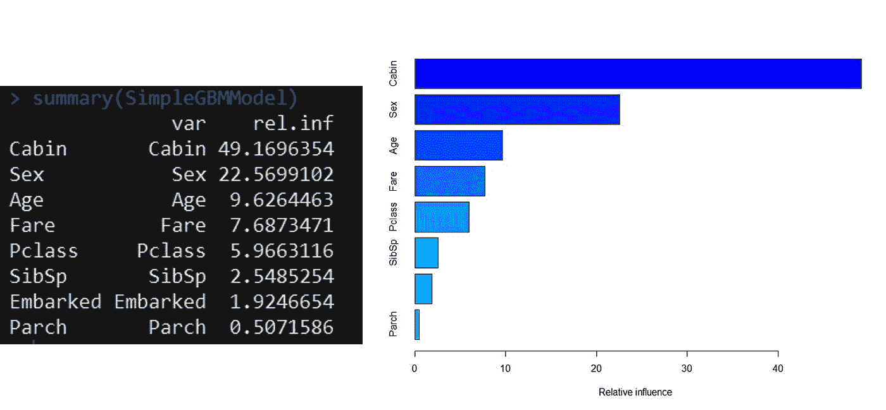
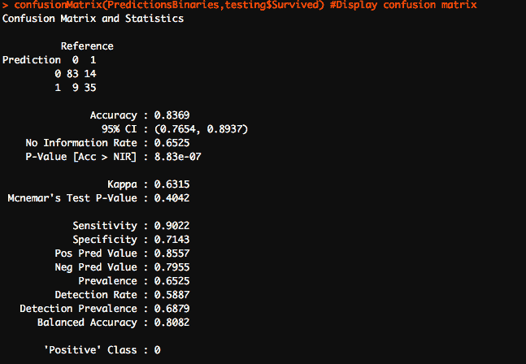
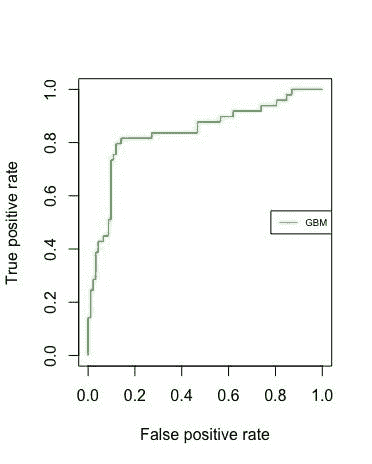

# 了解梯度增压机

> 原文：<https://towardsdatascience.com/understanding-gradient-boosting-machines-9be756fe76ab?source=collection_archive---------1----------------------->

<​a href​=”https://www.freepik.com/free-vector/binary-code-netwrok-technology-concept-background_2395548.htm"​>Designed by Starline<​/a>

# 动机:

虽然 Kaggle 竞赛中大多数获胜的模型都是一些高级机器学习算法的组合，但通常是这种组合一部分的一个特定模型是梯度推进机器。举个例子，[在这篇文章](http://blog.kaggle.com/2017/02/27/allstate-claims-severity-competition-2nd-place-winners-interview-alexey-noskov/)中，Allstate Claims Severity Kaggle 竞赛的获胜者 Alexey Noskov 将他在竞赛中的成功归功于 GBM 算法的另一个变种 XGBOOST。然而，尽管它大受欢迎，许多专业人士仍然使用这种算法作为一个黑箱。因此，本文的目的是为这种强大的机器学习技术奠定一个直观的框架。

**什么是梯度推进？**

先从了解 Boosting 开始吧！强化是一种将弱学习者转化为强学习者的方法。在 boosting 中，每个新树都适合原始数据集的修改版本。梯度推进算法(gbm)可以通过首先介绍 AdaBoost 算法来最容易地解释。AdaBoost 算法首先训练一个决策树，在该决策树中，每个观察值被赋予相同的权重。在评估第一棵树后，我们增加那些难以分类的观察值的权重，降低那些易于分类的观察值的权重。因此，第二棵树在这个加权数据上生长。这里，我们的想法是改进第一棵树的预测。因此，我们的新模型是*树 1 +树 2* 。然后，我们根据这个新的 2-树集成模型计算分类误差，并生长第三棵树来预测修正的残差。我们重复这个过程指定的迭代次数。后续的树帮助我们对之前的树没有很好分类的观察结果进行分类。因此，最终集合模型的预测是由先前树模型做出的预测的加权和。

梯度增强以渐进、累加和顺序的方式训练许多模型。AdaBoost 和梯度提升算法之间的主要区别在于这两种算法如何识别弱学习器(例如决策树)的缺点。虽然 AdaBoost 模型通过使用高权重数据点来识别缺点，但梯度增强通过使用损失函数中的梯度来执行相同的操作( *y=ax+b+e，e 需要特别提及，因为它是误差项)*。损失函数是一种衡量指标，它表明模型系数对基础数据的拟合程度。对损失函数的逻辑理解将取决于我们试图优化的内容。例如，如果我们试图通过使用回归来预测销售价格，那么损失函数将基于真实和预测的房价之间的误差。类似地，如果我们的目标是对信用违约进行分类，那么损失函数将是对我们的预测模型在对不良贷款进行分类方面有多好的一种衡量。使用梯度推进的最大动机之一是它允许优化用户指定的成本函数，而不是通常提供较少控制并且本质上不符合真实世界应用的损失函数。

# 在 R 中训练一个 GBM 模型

为了在 R 中训练一个 gbm 模型，首先必须安装并调用 gbm 库。gbm 函数要求您指定某些参数。您将从指定*公式*开始。这将包括你的反应和预测变量。接下来，您将指定响应变量的*分布*。如果没有指定，那么 gbm 将尝试猜测。一些常用的分布包括-“伯努利”(0–1 结果的逻辑回归)、“高斯”(平方误差)、“TD ist”(t 分布损失)和“泊松”(计数结果)。最后，我们将指定*数据*和 *n.trees* 参数(毕竟 gbm 是树的集合！)默认情况下，gbm 模型将假设 100 棵树，这可以很好地估计我们的 gbm 的性能。

在 Kaggle 的 Titanic 数据集上训练一个 gbm 模型:我使用了来自 Kaggle 的著名 Titanic 数据集[来说明我们如何实现一个 gbm 模型。我首先使用 *read.csv()* 函数将 Titanic 数据加载到我的 R 控制台中。然后，使用 createDataPartition()函数将原始数据集划分为单独的训练集和测试集。这种必要的划分在后期阶段非常有用，可以评估模型在单独的维持数据集(测试数据)上的性能，并计算 AUC 值。以下屏幕显示 R 代码。](https://www.kaggle.com/c/titanic/data)

注意:考虑到原始数据集的规模较小，我将 750 个观察值分配给训练，将 141 个观察值分配给测试保持。此外，通过定义一个种子值，我确保了每次都生成相同的随机数集。这样做将消除建模结果的不确定性，并帮助人们准确评估模型的性能。

下一步是使用我们的训练保持来训练 gbm 模型。虽然所有其他参数都与上一节中讨论的完全相同，但是还指定了另外两个参数- *交互。深度*和*收缩*。交互深度指定每棵树的最大深度(即训练模型时允许的变量交互的最高级别)。收缩率被认为是学习率。它用于减少或缩小每个附加的适合的基础学习者(树)的影响。它减少了增量步骤的大小，从而降低了每次连续迭代的重要性。

注意:即使我们最初用 1000 棵树训练我们的模型，我们也可以基于“开箱”或“交叉验证”技术来修剪树的数量，以避免过度拟合。我们将在后面看到如何将它合并到我们的 gbm 模型中(参见“调优 gbm 模型和提前停止”一节)

# 了解 GBM 模型输出

当您打印 gbm 模型时，它会提醒您在执行过程中使用了多少树或迭代。使用其内部计算，如变量重要性，它还会指出是否有任何预测变量在模型中没有影响。

gbm 建模的一个重要特征是可变重要性。将汇总函数应用于 gbm 输出会生成一个变量重要性表和一个模型图。下表根据各个变量的相对影响对其进行了排名，相对影响是一种衡量标准，表明每个变量在模型训练中的相对重要性。在泰坦尼克号模型中，我们可以看到船舱和性别是迄今为止我们 gbm 模型中最重要的变量。

# 调整 gbm 模型并提前停止

超参数调整对于 gbm 建模尤其重要，因为它们容易过度拟合。为 gbm 和随机森林等算法调整迭代次数的特殊过程称为“提前停止”。早期停止通过在单独的测试数据集上监控模型的性能来执行模型优化，并且一旦测试数据的性能停止提高超过一定的迭代次数，就停止训练过程。

它通过尝试自动选择拐点来避免过度拟合，在该拐点处，测试数据集的性能开始下降，而随着模型开始过度拟合，训练数据集的性能继续提高。在 gbm 的背景下，早期停止可以基于袋外样本集(“OOB”)或交叉验证(“cv”)。如上所述，停止训练模型的理想时间是在验证误差由于过度拟合而开始增加之前，验证误差已经减少并开始稳定。

虽然其他提升算法(如*“xgboost”*)允许用户指定一系列指标(如错误和日志损失)，但“gbm”算法专门使用指标“错误”来评估和测量模型性能。为了在“gbm”中实现提前停止，在训练我们的模型时，我们首先必须指定一个名为*“c . v folds”*的附加参数。其次，gbm 包附带了一个名为 *gbm.perf()* 的默认函数来确定最佳迭代次数。参数“方法”允许用户指定用于决定最佳树数的技术(“OOB”或“cv”)。

以下控制台屏幕显示按照“OOB”和“cv”方法的最佳树数。

此外，我们还将看到两个曲线图，表明基于各自使用的技术的最佳树木数量。左边的图表显示了测试(绿线)和训练数据集(黑线)的错误。蓝色虚线表示最佳迭代次数。人们还可以清楚地观察到，超过某个点(对于“cv”方法为 169 次迭代)，测试数据上的误差似乎由于过度拟合而增加。因此，我们的模型将在给定的最佳迭代次数上停止训练过程。

# 使用 gbm 的预测

最后， *predict.gbm()* 函数允许从数据中生成预测。gbm 预测的一个重要特性是用户必须指定树的数量。由于预测函数中的“*n . trees”*没有默认值，建模者必须指定一个。由于我们已经通过执行提前停止计算出了最佳的树数量，我们将使用最佳值来指定“ *n.trees* ”参数。我使用了基于交叉验证技术的最佳解决方案，因为在大型数据集上，交叉验证通常优于 OOB 方法。用户可以在预测函数中指定的另一个参数是*类型*，它控制函数生成的输出类型。换句话说，*类型*指的是 gbm 进行预测的尺度。

# 总结和评估结果:

最后，任何建模工作最重要的部分是评估预测和衡量模型的性能。我首先创建了一个混淆矩阵。混淆矩阵是一个非常有用的工具，它将模型的实际值与预测值进行比较。它被称为混淆矩阵，因为它揭示了你的模型在两个类之间有多混乱。混淆矩阵的列是真实类别，而矩阵的行是预测类别。在你制作混淆矩阵之前，你需要在一个给定的阈值上“切割”你的预测概率，以将概率转化为类别预测。使用 *ifelse()* 函数可以很容易地做到这一点。在我们的例子中，概率大于 0.7 的病例被标记为 1，即可能存活，概率较小的病例被标记为 0。记得调用“*插入符号”*库来运行混淆矩阵。

运行最后一行将产生我们的混淆矩阵。

看到我们模型的准确性，我和你一样高兴！深入到混淆矩阵，我们观察到我们的模型完美地预测了 141 个观察值中的 118 个，给了我们 83.69%的准确率。我们的模型有 23 个错误。这 23 个病例被分为假阴性和假阳性，分别为 9 和 14。

ROC 和 AUC:基于真阳性和假阳性，我绘制了 ROC 曲线并计算了我们的 AUC 值。

根据定义，ROC 曲线越靠近网格的左上角越好。左上角对应的是真阳性率 1，假阳性率 0。这进一步意味着好的分类器在曲线下有更大的面积。显然，我们的模型的 AUC 为 0.8389。

最后备注:

我希望这篇文章能帮助你对梯度推进算法的工作原理有一个基本的了解。欢迎在 [LinkedIn](https://www.linkedin.com/in/harshsingh12/) 上加我，我期待听到你的评论和反馈。此外，如果您有兴趣阅读更多关于这种强大的机器学习技术的信息，我将强烈推荐以下资源。

1.  [机器学习的梯度推进算法简介](https://machinelearningmastery.com/gentle-introduction-gradient-boosting-algorithm-machine-learning/)
2.  [一位 Kaggle 大师解释梯度推进](http://blog.kaggle.com/2017/01/23/a-kaggle-master-explains-gradient-boosting/)
3.  [梯度提升的自定义损失函数](/custom-loss-functions-for-gradient-boosting-f79c1b40466d)
4.  [用 R 中基于树的模型进行机器学习](https://www.datacamp.com/community/blog/new-course-ml-tree-based-models-R)

另外，我很高兴地分享我最近提交给泰坦尼克号卡格尔比赛的分数在前 20%。我最好的预测模型(准确率为 80%)是广义线性模型、梯度推进机器和随机森林算法的集合。我已经上传了我的代码到 GitHub，可以在:【https://lnkd.in/dfavxqh 访问