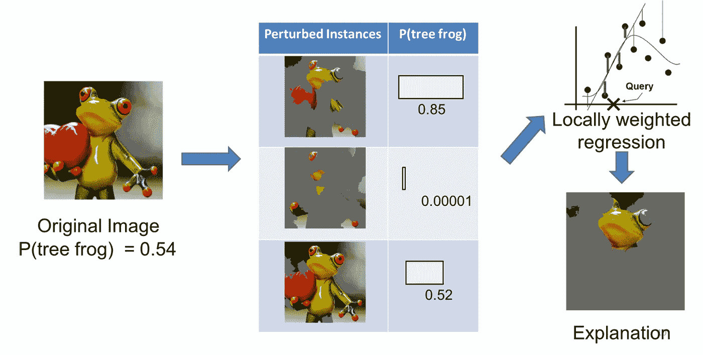

# 理解石灰如何解释预测

> 原文：<https://towardsdatascience.com/understanding-how-lime-explains-predictions-d404e5d1829c?source=collection_archive---------3----------------------->

[在最近的一篇文章](https://medium.com/@pferrandohernandez/interpretable-machine-learning-an-overview-10684eaa1fd7)中，我介绍了三种现有的方法来解释**任何**机器学习模型的个体预测。在这篇文章中，我将重点介绍其中的一种:**局部可解释的模型不可知解释** ( **LIME** )，这是马尔科·图利奥·里贝罗、萨梅尔·辛格和卡洛斯·盖斯特林在 2016 年提出的一种方法。

在我看来，它的名字完美地概括了这种解释方法背后的三个基本思想:

1.  **模型不可知论**。换句话说，与模型无关，这意味着 LIME 不会对其预测得到解释的模型做出任何假设。它将模型视为一个黑盒，因此它必须理解其行为的唯一方式是扰动输入，并观察预测如何变化。
2.  **可解释性**。首先，解释必须易于用户理解，这对于模型所使用的特征空间来说不一定是正确的，因为它可能使用太多的输入变量(即使是线性模型，如果它具有成百上千个系数，也可能难以解释)，或者它只是使用太复杂/非官方的变量(并且根据这些变量的解释将不会被人类解释)。出于这个原因，LIME 的解释使用了不同于原始特征空间的数据表示(称为*可解释表示*)。
3.  **地点**。LIME 通过在我们想要解释的实例附近用可解释的模型(例如，具有几个非零系数的线性模型)来近似黑盒模型来产生解释。

总之，LIME 根据可解释模型的组成部分(例如，线性回归中的系数)生成对预测的解释，该模型类似于关注点附近的黑盒模型，并通过新的数据表示进行训练以确保可解释性。

## 可解释的表示

为了确保解释是可解释的，LIME 将*可解释的表示*与模型使用的原始特征空间区分开来。可解释的表示必须是人类可理解的，因此它的维度不一定与原始特征空间的维度相同。

设 *p* 为原始特征空间 *X* 的维数，设*p’*为可解释空间*X’*的维数。可解释输入通过映射函数*hʸ: x’→x*映射到原始输入，具体到我们要解释的实例 *y* ∈ *X* 。

不同类型的映射用于不同的输入空间:

*   对于文本数据，可能的可解释表示是指示单词存在或不存在的二进制向量，尽管分类器可以使用更复杂和不可理解的特征，例如单词嵌入。形式上， *X'* ={0,1}ᵖ'≡ {0，1}× ⋅⋅⋅ × {0，1}其中 *p'* 是包含被解释的实例的单词数，映射函数将 1 或 0 的向量(分别是单词的存在或不存在)转换成模型使用的表示:如果它使用单词计数，映射将 1 映射到原始单词计数，0 映射到 0；但是如果模型使用单词嵌入，映射应该将任何用 1 和 0 的向量表示的句子转换成它的嵌入版本。
*   对于图像，可能的可解释表示是指示一组连续相似像素(也称为超像素)的存在或不存在的二进制向量。形式上， *X'* ={0,1}ᵖ'其中 *p'* 是所考虑的超级像素的数量，通常通过图像分割算法如快速移动来获得。在这种情况下，映射函数将 1 映射为保留原始图像中的超像素，将 0 映射为灰化超像素(表示缺失)。

Original representation (left) and interpretable representation (right) of an image. Sets of contiguous similar pixels (delimited by yellow lines) are called super pixels. Each super pixel defines one interpretable feature. Source: [https://www.oreilly.com/learning/introduction-to-local-interpretable-model-agnostic-explanations-lime](https://www.oreilly.com/learning/introduction-to-local-interpretable-model-agnostic-explanations-lime)

*   对于表格数据(即矩阵)，可解释的表示取决于特征的类型:分类、数值或混合数据。对于分类数据，*x’*={0,1}ᵖ，其中 p 是模型使用的特征的实际数量(即*p’= p*)，并且映射函数将 1 映射到实例的原始类，将 0 映射到根据训练数据的分布采样的不同类。对于数值型数据， *X'=X* 和映射函数是恒等式。但是，我们可以将数字特征离散化，这样它们就可以被认为是分类特征。对于混合数据，可解释的表示将是由对应于分类特征的二元特征和对应于数值特征的数值特征(如果它们没有被离散化)组成的一个 *p* 维空间。根据解释变量的类型，映射函数的每个组成部分也根据前面的定义来定义。

## 位置

虽然一个简单的模型可能无法全局近似黑盒模型，但在我们想要解释的个体实例的邻域中近似它可能是可行的。换句话说，LIME 依赖于这样一个假设，即每个复杂的模型在局部尺度上都是线性的。

从形式上来说，我们需要一个权重函数 *wʸ: X* →ℝ⁺，它给最接近我们想要解释的实例的实例 *z* ∈ *X* 最大权重，给最远的实例最小权重。

## 保真度-可解释性权衡

Ribeiro 等人将*解释*定义为模型*g:x’*→ℝ，使得 *g* ∈ *G* ，其中 *G* 是一类“潜在的”可解释模型，也就是说，可以容易地用视觉或文本工件呈现给用户的模型，例如线性模型或决策树。注意 *g* 的定义域是可解释空间*X’*。

假设𝔏 *(f,g,wʸ)* 是一个*损失函数*，它测量 *g* 在考虑权重 *wʸ* 的情况下近似 *f* 的准确度。由于不是每个 *g* ∈ *G* 都足够简单到可以被解释，我们让ω(*G*)作为一个正则化项来度量解释 *g* ∈ *G* 的复杂度(与可解释性相反)。例如，对于线性模型，ω(*g*)可以是非零系数的数量，而对于决策树，ω(*g*)可以是树的深度。

## 方法

设 *X* =ℝᵖ为特征空间。设 *y* ∈ℝᵖ为被解释实例的*原始表示*，而*y’*∈*x’*为其*可解释表示*。

同样，让ℝᵖ→ℝ成为被解释的模型。在分类中， *f(x)* 是 *x* 属于某一类的概率(或二元指标)。对于多个类，LIME 分别解释每个类，因此 *f(x)* 是相关类的预测。在回归中， *f(x)* 是回归函数。

最后，让 *g: X'* → ℝ作为解释模型。设𝔏 *(f,g,wʸ)* 是一个*损失函数*，它测量 *g* 在由 *wʸ* 定义的位置中逼近 *f* 的不忠实程度，设ω(*g*是解释的复杂度的度量 *g* ∈ *G*

为了确保可解释性和局部保真度，我们必须最小化𝔏( *f,g,wʸ* ，同时使ω(*g*)足够低，以便人类能够解释。因此，由石灰产生的解释ξ( *y* )由下式得到:

注意，该公式可用于不同的解释族 g、损失函数𝔏和正则化项ω。

实际上，LIME 用来产生解释的一般方法如下:

1.  生成实例的可解释版本的 N 个“扰动”样本来解释*y’*。设{*zᵢ'*∈*x’*| I = 1，…，N}为这些观测值的集合。
2.  通过映射函数恢复原始特征空间中的“扰动”观察值。设{*zᵢ*≦*hʸ(zᵢ')*∈*x*| I = 1，…，N}为原表示中的集合。
3.  让黑盒模型预测每一次“扰动”观察的结果。设{ *f(zᵢ)* ∈ℝ | i=1，…，N}为回答的集合。
4.  计算每个“被扰乱”的观察的权重。设{ *wʸ(zᵢ)* ∈ℝ⁺ | i=1，…，N}为权的集合。
5.  使用“扰动”样本及其响应的数据集{ *(z'ᵢ，f(zᵢ))*【∈x'×ℝ| I = 1，…，N}作为训练数据，求解上述方程。

请注意，复杂度不取决于训练集的大小(因为它产生对单个预测的解释)，而是取决于计算预测的时间 *f(z)* 和样本数量 *N* 。

步骤 1 中描述的采样过程取决于可解释空间*X’*，因此根据输入数据的类型而不同(参见“可解释表示”一节)。对于解释空间由二值特征组成的文本数据或图像(即*x’*={0,1}ᵖ')，样本*zᵢ'*∈*x’*是通过随机均匀抽取*y’*的非零元素得到的，其中抽取的次数也是均匀抽样的。对于表格数据(即矩阵)，步骤 1 取决于特征的类型，并且需要原始训练集。

对于文本数据，由于可解释空间是指示单词存在或不存在的二进制向量，因此该过程意味着从被解释的实例中随机移除单词。例如，如果我们试图解释文本分类器对句子“我讨厌这部电影”的预测，我们将扰动该句子，并得到对诸如“我讨厌电影”、“我这部电影”、“我电影”、“我讨厌”等句子的预测。请注意，如果分类器使用一些不可解释的表示，如单词嵌入，这仍然有效:在步骤 2 中，我们将使用单词嵌入来表示受干扰的句子，解释仍然是根据单词，如“仇恨”或“电影”。

对于图像，由于可解释空间是指示超像素的存在或不存在的二进制向量，所以该过程包括随机地使一些超像素变成灰色。换句话说，如果我们想要解释一幅图像的预测，我们将扰动该图像，并在具有一个或多个隐藏超像素的图像上获得预测。下图描述了这一过程:

Examples of perturbed instances of an image and their predictions. Source: [https://www.oreilly.com/learning/introduction-to-local-interpretable-model-agnostic-explanations-lime](https://www.oreilly.com/learning/introduction-to-local-interpretable-model-agnostic-explanations-lime})

对于表格数据(即矩阵)，分类特征和数值特征之间存在差异，但两种类型都依赖于训练集。对于分类特征(其可解释的表示是二进制的),扰动样本是通过根据训练分布进行采样，并在值与被解释的实例相同时生成为 1 的二进制特征而获得的。对于数字特征，通过从正态(0，1)分布采样并进行均值居中和缩放的逆运算(使用训练数据的均值和标准偏差)来扰乱正在解释的实例。

## 稀疏线性解释

Ribero 等人专注于他们所谓的*稀疏线性解释*，对应于解释族 *G* 的具体选择，损失函数𝔏和正则化项ω。这些选择没有明确的理由，但可以推断出一些可能的原因。它们是:

*   作为解释族的线性模型类 *G* 。 *g(z')=β⋅ z'*

线性模型让我们通过检查系数的大小和符号来衡量每个特征在预测中的影响。因此，线性模型提供了解释变量和响应之间的定性理解，这使得它们成为适合作为解释模型的潜在可解释模型。

*   定义在某个距离函数 *D* 上作为权函数的指数核。 *wʸ(z)=e^{-D(y,z) /σ }*

选择使用指数核是不合理的。使用的距离函数是文本数据的余弦相似性度量，以及图像和表格数据的欧几里德距离。然而，LIME 在 [Python](https://github.com/marcotcr/lime) 和 [R](https://cran.r-project.org/web/packages/lime/vignettes/Understanding_lime.html) 中的实现接受用户选择的任何其他距离。最后，即使没有讨论内核宽度σ的选择，它默认为σ=3/4 \sqrt{p}，其中 *p* 是特征的数量。

*   加权最小二乘误差作为损失函数。

其中 *(z'ᵢ，f(zᵢ)*是“扰动”样本的数据集，其响应如上所述。二次损失函数通常比其他损失函数在数学上更容易处理，特别地，加权最小二乘问题具有封闭形式的解。

*   将非零系数的数量限制为 *K* 作为正则项。

其中∥β∥₀=∑ⱼ|βⱼ|⁰是 L0“范数”(即β的非零项的数量)。正则化参数 *K* 对于解释任务至关重要，因为它确定了将呈现给用户的组件的数量。

注意，有两个超参数:用于解释的核宽度σ和特征数量 *K* 。

在前面的选择中，使用石灰进行解释所需的方程变为:

这个方程不能直接求解，因此他们通过首先使用特征选择技术选择 *K* 特征，然后通过加权最小二乘法估计系数来近似求解。

在原始论文中，作者使用 LASSO 产生的正则化路径(即 LASSO 作为收缩因子的函数估计的系数)选择 *K* 特征，然后通过加权最小二乘法估计系数。他们称这个过程为 K-LASSO。然而，LIME 的实现目前支持更多的特性选择算法来选择 *K* 特性。同样，所有特性都可以用于解释，但除非特性非常少，否则不推荐使用。

总的来说，LIME 用来近似前一个方程的解并产生对例如 *y* 解释的当前方法是:

1.  生成实例的可解释版本的 *N 个*“扰动”样本以解释 y’。设{*zᵢ'*∈*x’*| I = 1，…，N}为这些观测值的集合。
2.  通过映射函数恢复原始特征空间中的“扰动”观察值。设{*zᵢ≡hʸ(zᵢ')*∈*x*| I = 1，…，N}为原表示中的集合。
3.  让黑盒模型预测每一次“扰动”观察的结果。设{ *f(zᵢ)* ∈ℝ | i=1，…，N}为响应集合，设ℨ={ *(z'ᵢ，f(zᵢ)*∈*x '*×ℝ| I = 1，…，N}为“扰动”样本及其响应的数据集。
4.  计算每个“被扰乱”的观察的权重。设{ *wʸ(zᵢ)* ∈ℝ⁺ | i=1，…，N}为权的集合。
5.  从扰动的数据集ℨ.中选择最能描述黑盒模型结果的 k 个特征
6.  将加权线性回归模型(实际上，LIME 的当前实现是将正则化参数设置为 1 的加权岭回归)拟合到由步骤 5 中的 *K* 所选要素组成的要素缩减数据集。如果黑箱模型是回归量，线性模型会直接预测黑箱模型的输出。如果黑盒模型是分类器，线性模型将预测所选类别的概率。
7.  从线性模型中提取系数，并用它们来解释黑盒模型的局部行为。

下图显示了此图像处理过程的一个示例。注意，除了黑盒模型(分类器或回归器) *f* 和解释 *y* (及其可解释表示*y’*)的实例之外，前面的过程需要预先设置样本数量 *N* ，核宽度σ和解释长度 *K* 。

Explaining the prediction of a classifier with LIME. Source: [https://www.oreilly.com/learning/introduction-to-local-interpretable-model-agnostic-explanations-lime](https://www.oreilly.com/learning/introduction-to-local-interpretable-model-agnostic-explanations-lime})

在以后的文章中，我将解释如何使用 R 和 Python 解释带有 LIME 的 ML 模型的预测。