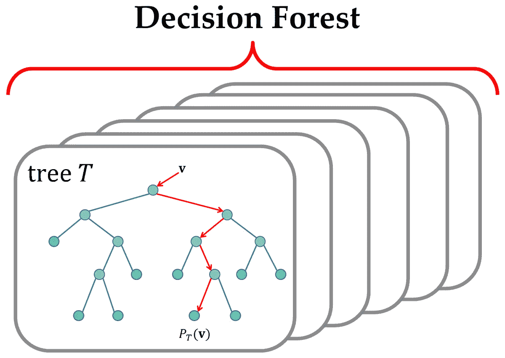
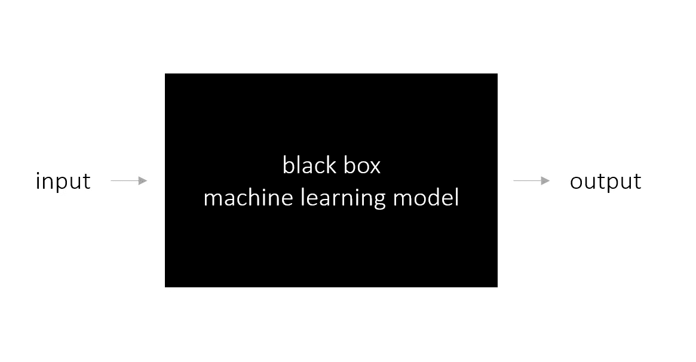
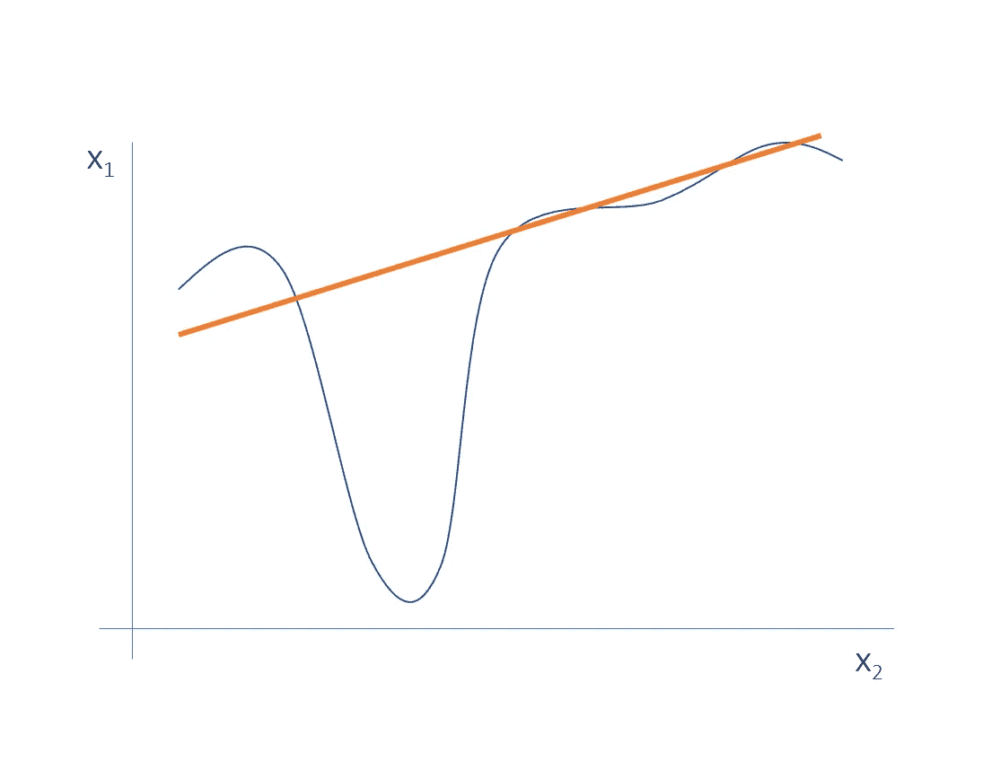

# 用石灰理解模型预测

> 原文：<https://towardsdatascience.com/understanding-model-predictions-with-lime-a582fdff3a3b?source=collection_archive---------1----------------------->

在我之前关于模型可解释性的[帖子](/interpretability-in-machine-learning-70c30694a05f)中，我概述了用于研究机器学习模型的常用技术。在这篇博文中，我将对[石灰](https://arxiv.org/abs/1602.04938)进行更详尽的解释。

LIME explaines of model predictions at the data sample level. It allows end-users to interpret these predictions and take actions based on them. [Source](https://www.oreilly.com/learning/introduction-to-local-interpretable-model-agnostic-explanations-lime)

## 为什么理解可解释性方法是必要的？

如果您信任一种解释模型预测的技术，那么理解该技术的基本机制以及任何与之相关的潜在陷阱是非常重要的。可解释性技术不是防错的，如果对方法没有很好的理解，你很可能将你的假设建立在错误的基础上。

在下面这篇关于[兰登森林重要性](http://explained.ai/rf-importance/index.html)的博客文章中，做了一个类似但更彻底的调查。要素重要性通常用于确定哪些要素在模型预测中起重要作用。随机森林提供了一种现成的方法来确定数据集中最重要的要素，许多人依赖于这些要素的重要性，将它们解释为数据集的“基本事实解释”。

A decision or random forest consists of multiple decision trees. By investigating which features are used to construct the ‘best’ trees, it is possible to get an estimate of the feature importance. [Source](https://dimensionless.in/introduction-to-random-forest/)

作者研究了两个随机森林(RF)实现以及它们提供的特性重要性的标准度量。作者表明，与随机森林重要性相比，当变量强相关时，排列重要性提供了更稳健的估计。我强烈推荐阅读他们的博客文章，以全面了解这些发现。

## 石灰

LIME 是模型不可知的，这意味着它可以应用于任何机器学习模型。该技术试图通过干扰数据样本的输入和理解预测如何变化来理解模型。

LIME assumes a black box machine learning model and investigates the relationship between input and output, represented by the model.

特定于模型的方法旨在通过分析内部组件以及它们如何交互来理解黑模型机器学习模型。在深度学习模型中，例如，可以调查激活单元并将内部激活链接回输入。这需要对网络有透彻的了解，并且不能扩展到其他模型。

LIME 提供了本地模型的可解释性。LIME 通过调整特征值来修改单个数据样本，并观察对输出产生的影响。通常，这也与人类在观察模型输出时感兴趣的内容有关。最常见的问题可能是:为什么会做出这种预测，或者是哪些变量导致了这种预测？

其他模型可解释性技术仅从整个数据集的角度回答了上述问题。要素重要性在数据集层面上解释了哪些要素是重要的。它允许您验证假设以及模型是否过度适应噪声，但是很难诊断特定的模型预测。

LIME attempts to play the role of the ‘explainer’, explaining predictions for each data sample. [Source](https://www.oreilly.com/learning/introduction-to-local-interpretable-model-agnostic-explanations-lime)

## 石灰背后的直觉

LIME 的一个关键要求是使用人类可以理解的可解释的输入表示。可解释表示的例子是例如 NLP 的弓形向量，或者计算机视觉的图像。另一方面，密集嵌入是不可解释的，应用石灰可能不会提高可解释性。

LIME 的输出是一个解释列表，反映了每个特征对数据样本预测的贡献。这提供了局部可解释性，并且还允许确定哪些特征变化将对预测产生最大影响。

An example of LIME applied to a classic classification problem. [Source](https://github.com/marcotcr/lime)

一个解释是通过用一个可解释的模型局部地逼近底层模型而产生的。可解释的模型是例如具有强正则化的线性模型、决策树等。可解释的模型在原始实例的小扰动上被训练，并且应该仅提供良好的局部近似。“数据集”是通过例如向连续特征添加噪声、移除单词或隐藏图像的部分来创建的。通过仅局部地近似黑盒*(在数据样本的邻域中)，任务被显著简化。*

## *潜在的陷阱*

*虽然酸橙的一般概念听起来很容易，但有几个潜在的缺点。*

*在当前的实现中，仅使用线性模型来近似局部行为。在某种程度上，当观察数据样本周围非常小的区域时，这种假设是正确的。然而，通过扩展这个区域，线性模型可能不足以解释原始模型的行为。对于那些需要复杂的、不可解释的模型的数据集，在局部区域会发生非线性。不能在这些场景中使用石灰是一个很大的缺陷。*

**

*A linear approximation of the local behaviour for two features is not a good representation and won’t capture the highly non-linear behaviour of the model.*

*其次，需要对数据执行的修改类型通常是特定于用例的。作者在他们的论文中给出了以下例子:
*例如，预测棕褐色调图像复古的模型不能用超级像素的存在与否来解释。**

*通常，简单的扰动是不够的。理想情况下，扰动将由数据集中观察到的变化驱动。另一方面，手动控制扰动可能不是一个好主意，因为它很可能会在模型解释中引入偏差。*

## *结论*

*LIME 是解释机器学习分类器(或模型)在做什么的一个很好的工具。它是模型不可知的，利用简单和可理解的想法，并且不需要很多努力来运行。和往常一样，即使使用 LIME，正确解释输出仍然很重要。*

*如果你对机器学习的可解释性有任何问题，我很乐意在评论中阅读。如果你想收到我博客上的更新，请在 [Medium](https://medium.com/@lars.hulstaert) 或 [Twitter](https://twitter.com/LarsHulstaert) 上关注我！*