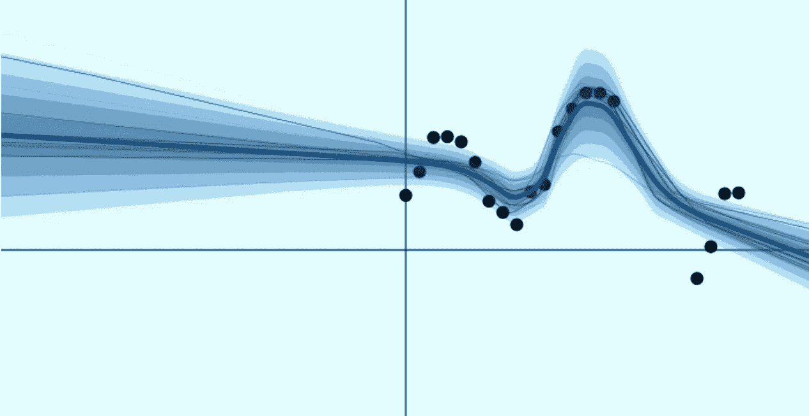
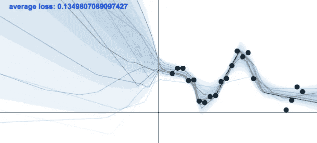
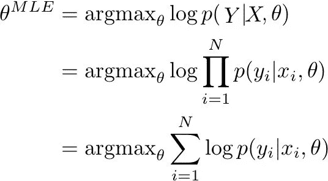
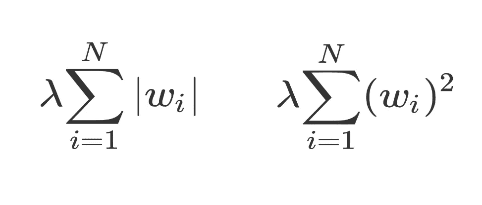

# 理解神经网络中的目标函数。

> 原文：<https://towardsdatascience.com/understanding-objective-functions-in-neural-networks-d217cb068138?source=collection_archive---------1----------------------->

这篇博文的目标读者是有机器学习经验的人，他们希望对用于训练神经网络的不同目标函数有更好的直觉。

## 介绍

我决定写这篇博客的原因有三点:

*   博客帖子经常解释优化方法，如随机梯度下降或其[变体](http://ruder.io/optimizing-gradient-descent/)，但很少花时间解释如何为神经网络构建目标函数。为什么均方误差(MSE)和交叉熵对数损失被用作 resp 的目标函数。回归分类？为什么添加一个正则化术语有意义？总的想法是，通过研究目标函数，人们可以了解为什么神经网络以它们的方式工作，或者为什么它们在其他情况下失败。

Cross entropy log loss between the ground truth p and network output q, used in classification problems.

Mean squared error between the ground truth y and network output y_tilde, used in regression problems.

*   神经网络以提供糟糕的概率估计而闻名，并且它们受到[反面例子](https://blog.openai.com/adversarial-example-research/)的困扰。简而言之:神经网络往往高度自信，即使它们是错误的。当它们部署在现实生活场景中时(例如自动驾驶汽车)，这可能是一个问题。自动驾驶汽车在 90 英里/小时的速度下做决定时应该是确定的。如果我们部署深度学习管道，我们应该知道它们的优势和劣势。
*   我一直想知道神经网络如何从概率的角度进行解释，以及它们如何适应更广泛的机器学习模型框架。人们倾向于用概率来谈论网络输出。神经网络的概率解释和它们的目标函数之间有联系吗？

这篇博文的主要灵感来自于我和我的朋友[布莱恩·特里普](http://www.briantrippe.com)在剑桥大学[计算和生物学习实验室](http://learning.eng.cam.ac.uk/Public/)所做的关于贝叶斯神经网络的工作。我强烈推荐任何人阅读布莱恩关于神经网络中变分推理的[论文](http://briantrippe.com/MPhilThesisSubmission.pdf)。

**免责声明**:在计算和生物学习实验室，贝叶斯机器学习技术被毫无歉意地作为未来的方向教授。因此，请注意这篇博文中的潜在偏见(😉).

## 监督机器学习

在有监督的机器学习问题中，我们经常考虑观察对( *x* ， *y* )的数据集 *D* ，并且我们尝试对以下分布建模:

例如，在图像分类中，x 代表图像，y 代表相应的图像标签。p(y|x，θ)表示给定图像 x 和由参数θ定义的模型的标签 y 的概率。

遵循这种方法的模型被称为判别模型。在判别或条件模型中，定义条件概率分布函数 p(y|x，θ)的参数是从训练数据中推断出来的。

基于观察数据 x(输入数据或特征值)，模型输出概率分布，然后用于预测 *y* (类别或真实值)。不同的机器学习模型需要估计不同的参数。线性模型(例如，由一组等于特征数量的权重定义的逻辑回归)和非线性模型(例如，由每层的一组权重定义的神经网络)都可以用来近似条件概率分布。

对于典型的分类问题，这组可学习参数θ用于定义不同标签上从 *x* 到[分类分布](https://en.wikipedia.org/wiki/Categorical_distribution)的映射。判别分类模型产生 N 个概率作为输出，N 等于类别的数量。每个 *x* 属于单个类别，但是模型不确定性通过输出类别上的分布来反映。通常，在做出决策时，会选择概率最大的类别。

In image classification, the network outputs a categorical distribution over image classes. The image above depicts the top 5 classes (classes with highest probability) for a test image.

注意，判别回归模型通常只输出一个预测值，而不是所有真实值的分布。这不同于鉴别分类模型，在鉴别分类模型中提供了所有可能类别的分布。这是否意味着歧视性模型在回归中会土崩瓦解？模型的输出不应该告诉我们哪些回归值比其他值更有可能吗？

虽然判别回归模型的单一输出是误导性的，但回归模型的输出实际上与众所周知的概率分布，即高斯分布有关。事实证明，判别回归模型的输出代表高斯分布的均值(高斯分布完全由均值和标准差定义)。有了这些信息，你就可以确定给定输入 x 的每个实值的可能性。

通常只对该分布的平均值进行建模，高斯的标准偏差要么不进行建模，要么被选择为在所有 *x* 上保持不变。在判别回归模型中，θ因此定义了从 x 到高斯均值的映射，y 从该高斯均值被采样。做决定时，几乎总是选择平均值。输出给定 x 的平均值和标准差的模型更能提供信息，因为该模型能够表达不确定的 x(通过增加标准差)。

A model needs to be uncertain in regions where there is no training data and certain in regions where it has training data. Such a model is displayed in the image above, from Yarin Gal’s blog post.

其他概率模型(如高斯过程)在建模回归问题中的不确定性方面做得更好，而判别回归模型在同时建模均值和标准差时往往过于自信。

高斯过程能够通过明确地模拟标准偏差来量化不确定性。高斯过程的唯一缺点是它们不能很好地适应大型数据集。在下图中，您可以看到 GP 模型在包含大量数据的区域周围具有较小的置信区间(由标准差确定)。在数据点很少的区域，置信区间明显变大。

A Gaussian Process model is certain at the data points, but uncertain at other places (image taken from [Sklearn](https://www.google.be/url?sa=i&rct=j&q=&esrc=s&source=images&cd=&cad=rja&uact=8&ved=0ahUKEwiQjpTIiqXXAhWLDBoKHRdaCDQQjhwIBQ&url=http%3A%2F%2Fscikit-learn.org%2F0.17%2Fauto_examples%2Fgaussian_process%2Fplot_gp_regression.html&psig=AOvVaw0Im8omKPY_J-HgrLFfrYi1&ust=1509890495868115))

在训练数据集上训练判别模型，以便学习代表类或真实值的数据中的属性。如果模型能够将高概率分配给正确的样本类或接近测试数据集中真实值的平均值，则该模型表现良好。

## 与神经网络连接

当神经网络被训练用于分类或回归任务时，使用神经网络对前述分布(分类和高斯)的参数进行建模。

当我们试图确定神经网络*的参数 *θ* 的最大似然估计(MLE)时，这变得很清楚。*MLE 对应于找到使训练数据的似然性(或等效对数似然性)最大化的参数 *θ* 。更具体地，下面的表达式被最大化:

p(Y | X，θ)表示当用模型确定时，训练数据中真实标签的概率。如果 p(Y | X，θ)更接近 1，这意味着模型能够确定训练集中的正确标签/均值。给定训练数据( *X* ， *Y* )由 *N* 个观察对组成，训练数据的可能性可以被重写为对数概率的和。

在分类和回归的情况下，p( *y* | *x，θ* )，单个对(x，y)的后验概率，可以重写为分类和高斯分布。在优化神经网络的情况下，目标是以这样的方式移动参数，即对于一组输入 *X* ，在输出(回归值或类)给出概率分布 *Y* 的正确参数。这通常通过梯度下降或其变体来实现。为了获得最大似然估计，目标是相对于真实输出优化模型输出:

*   最大化分类分布的对数对应于最小化近似分布和真实分布之间的交叉熵。
*   最大化高斯分布的对数对应于最小化近似平均值和真实平均值之间的均方误差。

因此，先前图像中的表达式可以被重写，并且分别导致交叉熵损失和均方误差，这是用于分类回归的神经网络的目标函数。

与更传统的概率模型相比，神经网络学习从输入到概率或均值的非线性函数很难解释。虽然这是神经网络的一个显著缺点，但神经网络能够建模的复杂函数的广度也带来了显著的优势。基于本节中的推导，很明显，在确定参数的 MLE 时出现的神经网络的目标函数可以用概率来解释。

神经网络的一个有趣的解释是它们与广义线性模型(线性回归、逻辑回归等)的关系。神经网络不是采用特征的线性组合(如 GLM 的方法)，而是产生高度非线性的特征组合。

# 最大后验概率

但是，如果神经网络可以被解释为概率模型，为什么它们提供糟糕的概率估计，并遭受对立的例子？为什么他们需要这么多数据？

我喜欢把不同的模型(逻辑回归、神经网络……)看作是在不同的搜索空间中寻找好的函数逼近器。虽然拥有一个非常大的搜索空间意味着在建模后验概率时有很大的灵活性，但这也是有代价的。例如，神经网络被证明是通用函数逼近器。这意味着只要有足够的参数，它们就可以逼近任何函数(太棒了！).然而，为了确保函数在整个数据空间中得到很好的校准，需要指数级的大数据集(昂贵！).

重要的是要知道一个标准的神经网络通常使用最大似然优化。使用 MLE 的优化倾向于过度拟合训练数据，并且需要大量数据来获得适当的结果。机器学习的目标不是找到一个能很好地解释训练数据的模型。您宁愿尝试找到一个模型，该模型能够很好地概括看不见的数据，并且不确定数据是否与训练数据显著不同。

使用最大后验概率(MAP)方法是一种有效的替代方法，当概率模型遭受过拟合时，通常会探索这种方法。那么在神经网络的上下文中，MAP 对应于什么呢？它对目标函数有什么影响？

类似于 MLE，MAP 也可以被重写为神经网络环境中的目标函数。本质上，使用 MAP，您可以在假定 *θ :* 的先验分布的同时，最大化给定数据的一组参数 *θ* 的概率

使用 MLE，只考虑公式的第一个元素(模型解释训练数据的能力)。对于 MAP，为了减少过拟合，模型满足先验假设(T4θ与先验的拟合程度)也很重要。

将平均值为 0 的高斯先验放在 *θ* 上对应于添加到目标的 L2 正则化(确保许多小权重)，而将拉普拉斯先验放在 *θ* 上对应于添加到目标的 L1 正则化(确保许多值为 0 的权重)。

L1 regularisation on the left and L2 regularisation on the right.

# 完全贝叶斯方法

在 MLE 和 MAP 的情况下，使用单个模型(具有单组参数)。尤其是对于复杂的数据，例如图像，数据空间中的某些区域很可能没有被很好地覆盖。这些区域中模型的输出取决于模型和训练过程的随机初始化，导致对数据空间的未覆盖段中的点的概率估计较差。

尽管 MAP 确保模型不会在这些区域过度拟合，但它仍然会导致模型过于自信。在完全贝叶斯方法中，这通过在多个模型上平均来解决，从而产生更好的不确定性估计。目标不是单一的一组参数，而是对参数的分布进行建模。如果所有模型(不同的参数设置)在未覆盖的区域提供不同的估计，这表明该区域有很大的不确定性。通过对这些模型进行平均，最终结果是一个在这些区域不确定的模型。这正是我们想要的！

在下一篇博文中，我将讨论贝叶斯神经网络，以及它们如何试图解决传统神经网络的上述问题。贝叶斯神经网络(BNN 的)仍然是一项积极的研究工作，在训练它们时没有明确的赢家方法。

我强烈推荐 Yarin Gal 关于深度学习中的不确定性的博文！