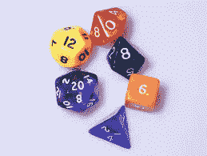
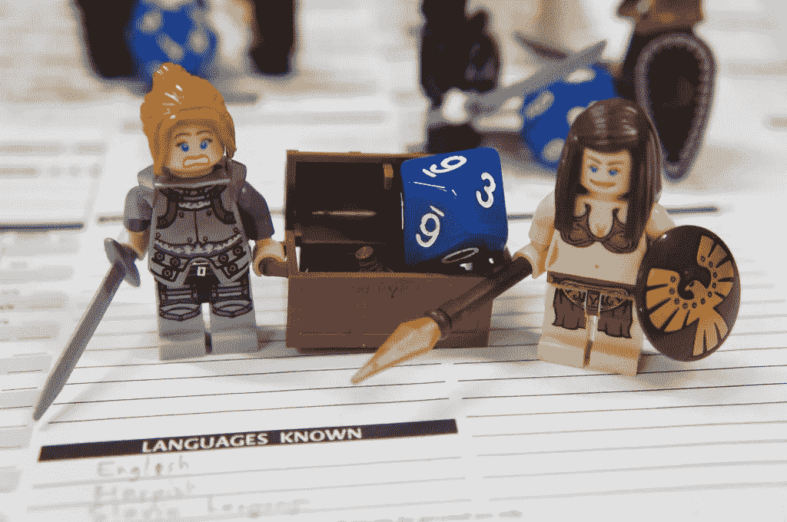

# 用龙与地下城理解概率论

> 原文：<https://towardsdatascience.com/understanding-probability-theory-with-dungeons-and-dragons-a36bc69aec88?source=collection_archive---------13----------------------->

## 第一章:独立事件&二项分布


[http://strangerthings.wikia.com/wiki/Dungeons_%26_Dragons](http://strangerthings.wikia.com/wiki/Dungeons_%26_Dragons)

概率论是一个丰富的数学分支，也与[哲学、神学和逻辑](https://www.stat.berkeley.edu/~aldous/Real-World/perception_cover.html)交叉。概率论起源于 17 世纪，当时数学家[帕斯卡和费马开始分析概率游戏的数学。帕斯卡和费马不仅对数学，而且对哲学和神学都有贡献。神学家和哲学专业的学生可能还记得帕斯卡的赌注，用简单的话来说，就是人类用自己的生命打赌上帝是否存在。因此，我们可以看到概率论的广泛影响。](https://www.dartmouth.edu/~chance/teaching_aids/books_articles/probability_book/amsbook.mac.pdf)

我们可以认为概率论是一个涉及面很广的领域，但我相信只要给出有用的例子，它既直观又容易掌握。概率论也是数据科学不可或缺的一部分，了解这一领域的基础知识将为更高级的主题提供坚实的基础，如回归和贝叶斯分析。

最近几个月，我花时间阅读了各种关于概率论和统计学的书籍，包括库珀和韦克斯开创性的*数据、模型和统计分析*。鉴于这些文本通常是实验和分析的跳板，我觉得将 Cooper 和 Weekes 所涉及的一些公理转化为现实世界的例子可能会很有趣。鉴于*更奇怪的东西*暂时还不会回来，我想浏览一下概率论，**用龙与地下城来比喻所讨论的各种公理**。

在这第一篇文章中，我将介绍概率论中独立和相关事件的含义，以及二项式分布，这是任何数据科学家工具箱中必不可少的一部分。



Image by [Diacritica](https://commons.wikimedia.org/wiki/User:Diacritica)

## **独立和非独立事件；滚动一个二十面模具**

在概率论中，我们有独立事件和非独立事件。Cooper 和 Weekes 将依赖事件定义为第一个事件的结果影响第二个事件的结果。因此，独立事件是指第一个事件*的结果不会*影响第二个事件。

一个独立事件的完美例子是两次掷骰子；事实上，这是概率论中的一个经典例子。在今天的帖子中，我们将对它进行一点 D&D 扭曲。

让我们想象一下，我们已经在每周一次的 D&D 游戏中安定下来。我们的地牢主人分发我们的骰子，我们看一看那个有二十面的骰子。我们可以注意到，如果我们掷两次，第一次的结果不会影响第二次的结果。不像我们在 D&D 的许多选择，我们的第一卷不会影响我们的下一卷。

不像地下城主，也不像那个当你的探险队询问桥边地精时一点帮助都没有的古怪村民，骰子不记得！

通过理解概率的数学，我们可以计算两个或更多独立事件的概率，因此可以连续两次掷出 20 个。找出这一点的乘法定理如下:

*如果 A 和 B 是独立的，那么 p(A 和 B) = P(A) * P(B)*

让我们想象一下，我们需要用 D&D 的招牌骰子让**掷出两个**二十个骰子。就其本身而言，20 卷的概率是 1/20。因此，p(A 和 B)的概率为:

1/20 * 1/20 = 0.0025

如您所见，这种情况发生的概率非常低！让我们希望我们不需要在我们的游戏中做两个 20 的卷。



[https://www.flickr.com/photos/42405591@N02/11013366686](https://www.flickr.com/photos/42405591@N02/11013366686)

**介绍二项式分布**

这一切都很好；我们现在知道我们的掷骰子不会相互影响。然而，我们还想知道在游戏中达到一定数量的 *x* 次掷骰数( *n* )的可能性有多大。我们知道，我们在游戏中的表现取决于我们掷骰子的结果——正如任何以前玩过 D & D 的人一样，有时 6 和 8 之间的差异可能意味着一切。

让我们回到谈判桌前，赶上我们的进度。我们的冒险就要结束了，情况不妙。我们走投无路了——对我们这群勇敢的冒险家来说，情况看起来不妙。我们在游戏中还有四次机会。我们需要在其中的三个上得到 20！

在概率论的框架下；我们有 n 次试验，我们的目标是 x 次成功，或者 n = 4，x = 3。

有了概率论，就可以理解我们勇敢的冒险者接这个任务的可能性有多大，或者说我们的地下城主在这些掷骰子的时候有多残忍(剧透；相当残忍)。我们可以使用二项式分布来做到这一点，二项式分布“描述了随机变量 x 在 n 次实验中出现次数的概率分布”(Cooper & Weekes，1983)。

分布的方程式如下:


## **关于阶乘的一个注记(n！还有 x！)**

*如果你是第一次统计 n！看起来会很困惑。n！指阶乘，即 n 乘以一系列递减的自然数。所以如果 n = 4，那么 n！是:*

*4 * 3 * 2 * 1*

## **回到二项式**

在 R 中，我们可以使用二项式函数来找出 4 次掷骰中有 3 次成功的可能性，例如，我们将在 4 次中掷出 23 次。我们知道掷出 20 的概率是 1/20。我们将使用 R 的 dbinom 函数，它采用以下值:

```
##Sample values
dbinom(x, size, prob, log = FALSE)dbinom(3,4,(1/20))
= 0.000475
```

几率肯定对我们不利。这是一个残酷的地下城主！对于你们当中勇敢的人来说，这里有一个 R 版本的文本游戏，它要求你从四个骰子中掷出三个二十来拯救你的勇敢冒险者。被警告；你可能会死(没有骰子相关的双关语)。要玩这个游戏，只需将代码复制并粘贴到你的 R 控制台上，然后输入 startGame()

[](https://github.com/hollyemblem/dd-binomial/blob/master/binomial-script.R) [## hollyemblem/DD-二项式

### 用 D&D 理解二项分布

github.com](https://github.com/hollyemblem/dd-binomial/blob/master/binomial-script.R) 

## **重温我们的冒险**

因此，我们已经了解了如何用概率论来理解用我们的骰子掷出两个 20 的机会，或者更广泛地说，乘法定理如何适用于独立事件。我们还学习了如何使用二项式分布来预测 n 次试验中的 x 次成功。我们也知道我们的地下城主有点刻薄，这不是什么好消息，但我们还是继续冒险！

掷骰子很有趣，但在我们的下一个游戏中，我们想改变一些事情。我们的地下城主承诺她会为我们的玩家准备一些新的角色表，但是，因为她有点刻薄，我们不能选择我们的新职业，相反，我们会从桌子上随机抽取一个。有 6 张，2 个德鲁伊，1 个野蛮人，1 个圣骑士，1 个术士和 1 个吟游诗人。我们需要计算出得到每个角色类别的概率。

在下一篇文章中，我们将着眼于相关事件和条件概率来帮助回答这个问题。我们可能还会问为什么我们的地下城主如此刻薄。

## 有用的资源

[https://www . varsitytutors . com/hotmath/hotmath _ help/topics/binomial-probability](https://www.varsitytutors.com/hotmath/hotmath_help/topics/binomial-probability)

[http://www . r-tutor . com/elementary-statistics/probability-distributions/binomial-distribution](http://www.r-tutor.com/elementary-statistics/probability-distributions/binomial-distribution)

[https://stat . ethz . ch/R-manual/R-devel/library/stats/html/binomial . html](https://stat.ethz.ch/R-manual/R-devel/library/stats/html/Binomial.html)