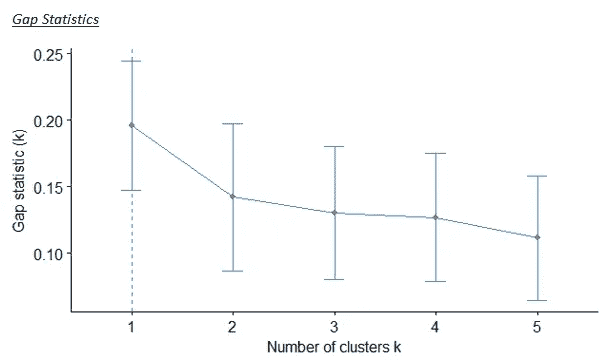
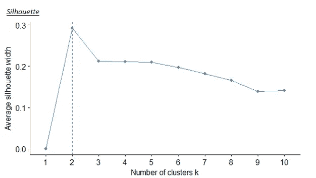
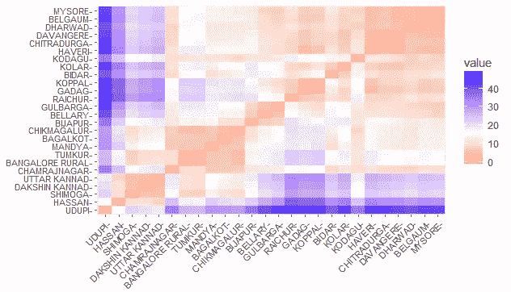
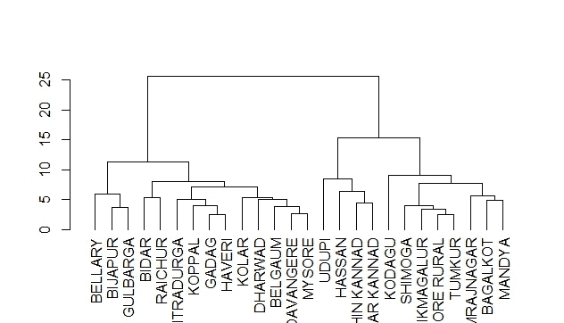
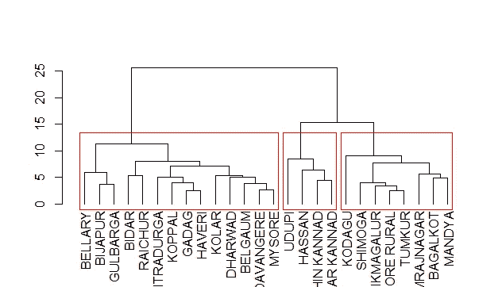

# 通过聚类分析了解卡纳塔克邦的初等教育质量

> 原文：<https://towardsdatascience.com/understanding-quality-of-primary-education-in-karnataka-through-cluster-analysis-95afd7238399?source=collection_archive---------19----------------------->

# **tldr；为什么要进行这项研究，研究结果是什么？**

新千年见证了小学入学率的大幅提升，从 2001 年的 79%上升到 2014 年的 93%。但正如我在之前的博客“通过数据可视化解读印度:印度教育系统”中所展示的，印度许多邦已经很低的学习水平在最近几年进一步下降。尽管本应影响学习成果的因素显示出有利的趋势，但还是发生了这种情况。私立学校在增加，辍学率很低并且保持稳定，一个班级的学生人数在下降，每个教师的学生人数也在下降。随着 2009 年《实时教育法》的通过，更多的资金以设施、学习材料等形式注入教育系统。那么，如何解释这种糟糕的学习状态呢？社会经济因素如成人文化程度、种姓制度是否在起作用？在本研究中，我使用聚类算法通过卡纳塔克邦的案例研究来挖掘潜在的原因。该算法创建了以小学学习成果为重点的学区群，并对每个学区群的特征进行了分析。

聚类分析产生 3 个聚类，标记为“第 1 层”、“第 2 层”和“第 3 层”。在各学区中，第 1 级的学习成果最高，第 3 级最低。每个组群的地区如下。

那么，区别特征是什么呢？请继续读下去…

# **来自 ASER、DISE 和 SocialCops 的数据**

在我之前的博客文章中，我已经提到了 DISE 和阿瑟。概括地说，ASER(年度教育状况报告)是一项年度调查，旨在为印度每个地区和邦的儿童入学率和基本学习水平提供可靠的估计。这项调查由非政府组织 Pratham 与当地伙伴组织的志愿者合作进行。

DISE(地区教育信息系统)收集全国所有学校的入学率、基础设施、教师和其他可用设施的信息。该数据库由[国立教育规划和管理大学](https://en.wikipedia.org/wiki/National_University_for_Educational_Planning_and_Administration)开发和维护。

第三，其中一个参数，即 RTE 符合性分数，来自 socialcops.com 网站。这里提取了 DISE 数据库中的 RTE 值，并计算了一个综合分数，以评估每个区的 RTE 实施水平。想了解更多关于 RTE 的知识？参考[这篇](http://mhrd.gov.in/rte)文章。

# **准备集群**

**数据分析参数有哪些？【2014 年收集了所有来源的数据。为什么是 2014 年？那一年来自所有三个来源的数据质量要好得多。例如，RTE 合规分数在随后几年无法在 socialcops.com 网站上获得。这项研究使用了卡纳塔克邦 26 个区的小学数据。Ramanagar、Yadgir、Chikkaballapur 和 Bangalore Urban 等地区不包括在内，因为 ASER 调查没有收集这些地区 2014 年的学习成果。这里使用了 18 个参数进行分析，包括社会经济特征、入学率、学校类型、教学媒介、学习水平。**

**一如既往的 R:**R 依然是我的最爱。所有用于数据准备、模型建立和可视化的代码都是用 r 编写的。

**探索数据:**这里的分析单位是区。使用箱线图和汇总函数进行数据探索。箱线图检测了变量的异常值，如男女比例、教师的性别分布、非在校儿童、私立学校入学率和阅读水平。经过进一步检查，发现这些值是适当的，没有应用异常值处理。

**关于聚类分析的更多信息:**聚类分析是一种基于无监督学习的数据挖掘技术。无监督学习探索“未标记”或“未分类”的数据，以找到隐藏的模式。这里没有目标属性。聚类分析将描述相似特征的对象分组。由于观测值较少，这里选择凝聚层次聚类技术。在各种凝聚过程中，使用沃兹方法。这种方法会合并对象，从而尽可能降低簇内方差。

**缩放和加权:**每个变量使用不同的测量类型。在本研究使用的变量中，教师的男女比例和性别分布是比率，RTE 合规分数以 10 分制衡量，而其余变量是百分比。对于有效的聚类，将变量调整到一个共同的范围是非常重要的。这被称为“缩放”。应用基础包中的函数“scale ”,将所有值标准化为 z 分数。下一步是“称重”。因为我们希望基于它们的性能来区分集群，所以我们给学习结果变量增加了更多的权重。我们将结果值增加了三倍。

# **建立模型**

**确定聚类数:**如何确定聚类数？为此，使用了肘法、剪影法和间隙统计法等方法。r 包 *factoextra* 用于确定给定聚类方法和数据可视化的最佳聚类数。

所以，在 2 和 3 之间很难抉择。为了收集更多关于区分因素的信息，我决定分成 3 组。

**计算距离矩阵:**凝聚式层次聚类算法以距离矩阵为输入。距离矩阵是显示对象对之间距离的表格。这里，r 包 *factoextra* 再次用于计算和可视化距离*。*计算每个特征的一对区域之间的欧几里德距离。生成的热图如下，随着距离的增加，颜色从红色变为蓝色。

**算法:**在凝聚层次聚类中，每个对象被分配到自己的聚类中，然后算法迭代进行，在每个阶段加入两个最相似的聚类，继续进行，直到只有一个聚类。这里，来自*集群*包的 *hclust* 函数用于构建算法。被监护人的方法。“D2”用于在每次迭代中合并两个相似的聚类。该算法生成以下树状图。

使用 *cutree* 功能，在 3 处截取树状图，确定为最佳数量。

# **通过专题地图可视化集群**

使用 *sp* 、 *rgdal* 、raster 和 *tmap* 软件包构建了一个显示学习成果的卡纳塔克邦专题地图。

# **我们来分析一下集群**

**学习成果不太令人满意**

即使在这些地区中学习水平最高的一级地区，也只有四分之三的儿童(STD 3-5)能够阅读标准 1 课文，只有三分之二的儿童(STD 3-5)能够做减法。在占总区一半以上的三级区中，平均值分别下降到 50%和 30%。

**第三级的更多地区**

表现最差的第 3 层集群有 14 个区。这个数字比其他两个性能更高的集群加起来还要多。性能最高的集群，第 1 层只有 4 个地区。

**区分集群的因素**

**识字率:**与第二层相比，第一层的总体识字率和女性识字率至少高出 10%,第二层是表现第二好的组群。一级教育的总体识字率超过 80%，而女性识字率约为 75%。三级学校的整体识字率和女性识字率最低，分别徘徊在 70%和 60%左右。

**种姓分布:**在一级地区，在册种姓和在册部落的入学率较低，分别为 11%和 3%。对于二级和三级学校，在册种姓入学率超过 20%。在三级学校中，ST 的入学率最高，为 11%。

OBC 的入学率在一级区最高，为 77%，其次是二级区的 66%和三级区的 56%。

**在册种姓和在册部落教师:**在一级区，在册种姓和在册部落教师的比例较低。在册种姓教师占教师总数的 8%，而在册部落教师约占 3%。在二线和三线城市，在册种姓和在册部落教师的比例分别约为 15%和 5%。

**男教师:**在一级地区，男教师比女教师多 2:1。在第二级和第三级，男女教师人数相当。

**教学语言:**在一级区，五分之一的儿童以英语为教学语言，是三级区平均水平的两倍。在二级学校，15%的学生选择英语作为教学语言。

**私立学校入学率:**私立学校入学率在一级区很高，为 35%,其次是二级区的 26%和三级区的 22%

**失学儿童:**在三级区，失学儿童的比例很高，为 3%。在一级和二级地区，不到 1%的儿童失学。

**学生教室比率(SCR) > 30 和学生教师比率(PTR) > 30 的学校百分比:**学生教室比率> 30 和学生教师比率> 30 的学校百分比在三级区更多，分别为 22%和 13%。一级和二级地区的选择性接种率约为 10 %, PTR 约为 7%。

**集群之间的相似性**

**儿童性别比例** : 各区儿童性别比例差异不大。每一级的平均男女比例都在 0 . 9 以上

RTE 得分:集群的平均 RTE 得分高于 8。

# **事实检验**

每个聚类中的平均值可以显示在下表中。

# **结论**

这项研究表明了影响学习成果的因素。一些积极影响学习成果的因素包括私立学校教育、英语作为教学媒介、整体和女性识字率、学生课堂比率和学生教师比率。这项研究还表明，即使在成绩最好的地区，学习成绩也达不到理想水平。所以，我们需要更多的数据来解释糟糕的学习状态。这可能包括学生和教师出勤率、教学质量、教师积极性水平、学生认知水平等方面的数据。这样的数据还不能从二手资料中获得，而且像教学质量、教师激励水平、学生认知水平等也很难量化。因此，任何深入研究这个问题的未来研究都需要收集原始数据。这既费时又费钱。但是我一定会继续努力…

想看看代码吗？参考我的 [github](https://github.com/mrinalini1977/primary_education_cluster_analysis) 库。