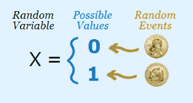

# 理解随机变量

> 原文：<https://towardsdatascience.com/understanding-random-variable-a618a2e99b93?source=collection_archive---------3----------------------->

随机变量在统计学和概率学中非常重要，如果有人想了解概率分布，这是必须的。随机变量经常与传统变量混淆。在这篇博文中，我们将看到什么是随机变量，以及为什么我们需要它们而不是传统变量。

Photo by [Alois Komenda](https://unsplash.com/@aloisk?utm_source=medium&utm_medium=referral) on [Unsplash](https://unsplash.com?utm_source=medium&utm_medium=referral)

在概率统计中，随机变量、随机数量或随机变量是一个变量，其可能值是随机现象的结果——维基百科

随机变量不同于我们传统的变量，就它所取的值而言。这是一个将随机过程的结果映射成数值的函数。

由于它具有随机性，所以取不同的值。

**为什么是随机变量？**

随机变量允许我们用数学的方式提问。

如果我们抛 5 枚硬币，想回答这样的问题:

1.恰好得到 3 个头的概率是多少？

2.少于 4 头的概率有多大？

3.得到 1 头以上的概率有多大？

那么我们一般的写法是:

p(当我们掷 5 次硬币时，恰好得到 3 个正面的概率)

p(当我们掷 5 次硬币时，得到少于 4 个正面的概率)

p(当我们掷 5 次硬币时，得到 1 个以上人头的概率)

但是，如果我们用随机变量来表示上述问题，那么我们会写:

1.P(X=3)

2.P(X <4)

3\. P(X> 1)

正如我们在上面看到的，随机变量使我们的任务更容易量化任何随机过程的结果，应用数学和执行进一步的计算。

假设我们有一个投掷硬币的随机过程/实验。两种可能结果中的一种可能是正面或反面。所以这里我们用 X 来表示随机变量，它代表这个随机过程的结果。

因此我们可以写作

X= 1，如果结果是正面

X= 0，如果结果是尾巴

这里，随机变量 X 将随机过程(抛硬币)的结果映射为数值(1 和 0)。

用来表示头部和尾部的值可以是任何值，不一定是 1 和 0。

为了便于理解，我们使用了 1 和 0。

将数值分配给随机过程结果的其他方式可以是:

X= 100，如果结果是正面

X= 50，如果结果是尾巴

**总结为三点**

> 我们有一个实验(扔硬币)
> 
> 我们给每个事件赋予价值
> 
> 这组值是一个随机变量。

**随机变量与代数中使用的传统变量有何不同？**

假设代数中使用的变量为 x，y，z，这里 x 可以是手机的数量，y =人头数，z=学生数。变量不过是一个字母字符，代表一个未知数。

例如:

x + 5 = 10

x 是一个变量，它的值是未知的，我们试图找到它的值。

经过评估，x=5。

随机变量不同于代数中的变量，因为它有一组完整的值，并且可以随机取其中的任何一个。代数中使用的变量一次只能有一个值。

如果随机变量 X={0，1，2，3}

那么 X 可以是随机的 0、1、2 或 3，其中每一个可能具有不同的概率。

我们用大写字母表示随机变量，以避免与传统变量混淆。

随机变量可以是离散的，也可以是连续的。

如果一个变量可以取可数个不同的值，那么它就是一个**离散随机变量**。

举个例子:在一个投掷 2 枚硬币的实验中，我们需要找出可能的人头数。

在这种情况下，X 是随机变量，它取的可能值是 0、1 和 2，这是离散的。

因此 X= {0，1，2}

如果一个随机变量在一个区间内取无穷多个值，则称其为**连续的**。

例如:假设一个城市的温度介于 30⁰和 45⁰之间。温度可以取 30⁰到 45⁰.之间的任何值所以温度可能是 30.13⁰或 40.15⁰，也可能是 30.13⁰和 40.15⁰.当我们说温度是 38⁰时，意思是它在 37.5 到 38.5 之间。所以在连续的随机变量中没有精确的或离散的观测值。

这是对随机变量的简单介绍。

感谢阅读！！