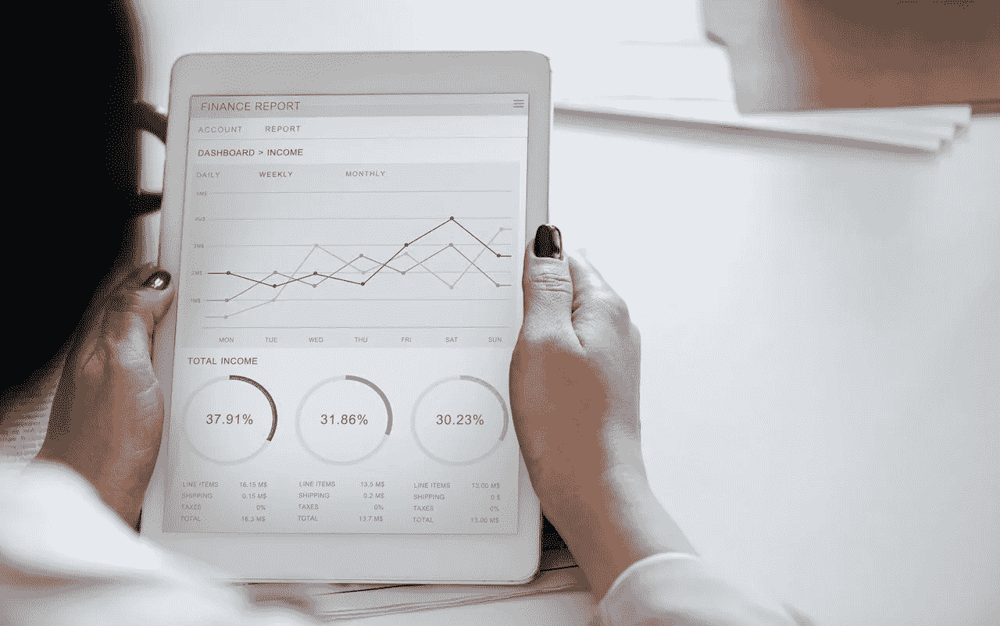

# 理解数据科学中的主观性

> 原文：<https://towardsdatascience.com/understanding-subjectivity-in-data-science-70a25b2ea39f?source=collection_archive---------12----------------------->

在一个完美的世界中，数据科学家在检查发现时会将主观性从他们的结论中剔除。

然而，在人们意识到发生了什么之前，偏见就已经悄然而至。意识到可能的主观性允许研究人员在相对确信其尽可能客观之前，努力将其最小化，并且不发表他们的工作。

## 人类是会犯错的

一个常见的思路是，仅仅在研究中使用大数据工具就可以消除偏见。但是，尽管这些进步将众多信息流汇集在一起进行分析，但人类仍然在该过程的各个阶段参与收集数据——人类天生就是主观的。

2016 年 9 月的一项研究希望利用大数据建立一个影响全球文明的事件的综合集合。它发现美国和拉丁美洲的系统很少通过[将它们注册为重要](https://techcrunch.com/2016/11/18/big-data-cant-bring-objectivity-to-a-subjective-world/)来复制相同的情况。

这是因为即使是最强大、最智能的大数据工具背后也有人，尤其是那些培训数据科学平台的人。由于人不是公正的存在，即使数据科学可以消除一些主观性，但人类天生就拥有它。

## 数据越多，找到支持材料就越容易

人们表现出确认偏差，这是一种倾向，即寻找支持某个观点的东西，而忽略冲突的信息。

数据科学的进步可能会恶化这一特征，因为它让个人能够访问大量数据，从而增加了他们找到支持他们观点的材料[的可能性](https://sloanreview.mit.edu/article/for-better-decision-making-look-at-facts-not-data/)，只要他们足够努力地寻找。

如果发生这种情况，他们可能会发现将研究推向一个方向的信息，而忽略导致完全不同结论的相反发现。

## 主观数据是可变的

人们通过与他人交流获得主观数据。他们也可以通过基于通信做出假设和判断来收集信息。因此，数据的特征可能因人而异，甚至根据一个人在特定时刻的感受而变化。

相比之下，客观数据来自可验证的事实或事件，即使在多个来源之间也具有一致性。

主观数据包含个人解释的成分，而客观数据主要依赖于使用准确的细节来确认发生了什么或某人假设了什么。

主观性并不总是负面的。例如，某人[可以主观地修改显示销售区域或类似信息的映射数据](https://www.mapbusinessonline.com/blog/2018/06/06/business-map-subjective/),以支持公司的需求，并使利益相关者更容易获得统计数据。

然而，使用映射数据来解释事物的人必须注意彻底解释变量，否则可能会使个人得出错误的结论。

例如，当收集的样本不能充分反映总体情况时，抽样偏差[经常出现在研究](http://csmresearch.co/news/press-releases/4-types-of-bias-to-be-aware-of-in-research/)中。

他们可以使用地图上的注释来阐明样本大小和用于收集信息的技术。这些额外的见解给人们提供了他们得出明智结论所需的知识。

## 主观性可能会忽视重要的现实

如前所述，人类倾向于关注支持他们信念的材料，而忽略不支持的材料。有时，这个问题意味着数据科学家没有注意到他们研究中隐藏的发现。

贫穷、服务不足的社区[特别容易成为这个问题的受害者。例如，一个名为 Street Bump 的智能手机应用程序让波士顿居民在遇到坑洞时报告。这个想法是，来自应用程序的集体信息将让当地基础设施知道哪里存在最严重的问题，这个概念是有意义的。](https://nextcity.org/daily/entry/big-data-good-bad-help-disadvantaged-communities)

然而，来自低收入社区的人怎么办？他们可能住在坑坑洼洼的地方，却买不起该应用程序所需的智能手机来简化报告过程。

## 大数据是在恶化种族偏见吗？

警察部门越来越依赖大数据来预测未来的犯罪，并找出如何在多个社区中最佳地分配警察。

然而，分析人士指出，种族偏见在执法部门非常普遍。研究表明，与非洲裔美国人和拉丁美洲人相比，警察不太可能阻止白人，即使这两个群体表现出相同的行为。

执法人员必须评估输入数据的所有特征，并确定输入数据的某些方面是否会教授算法来强调和延续种族偏见，而不是仅仅相信大数据的结果是准确的。

即使没有大数据平台，这样的事情也可能发生。例如，一个特定管辖区的官员可能会说，“我的经验告诉我，我因暴力犯罪而逮捕的非裔美国人比白种人多，”一个同事可能会说同样的话。

然而，仔细观察统计数据可以发现，非裔美国人在这些非法活动中只占一小部分，但官员们过于依赖个人经验，无法做出客观的结论。

## 努力减少有偏见的大数据

从科学家每天处理的信息数据中去除主观性是不可能的。

然而，一个负责任的数据科学家必须意识到这种偏见的存在，并有意识地尝试最小化它们，无论是通过检查数据中不太明显的方面，还是回答最重要的问题，“我是否忽略了什么？”

*图像由* [*Rawpixel*](https://www.pexels.com/photo/white-ipad-955447/)