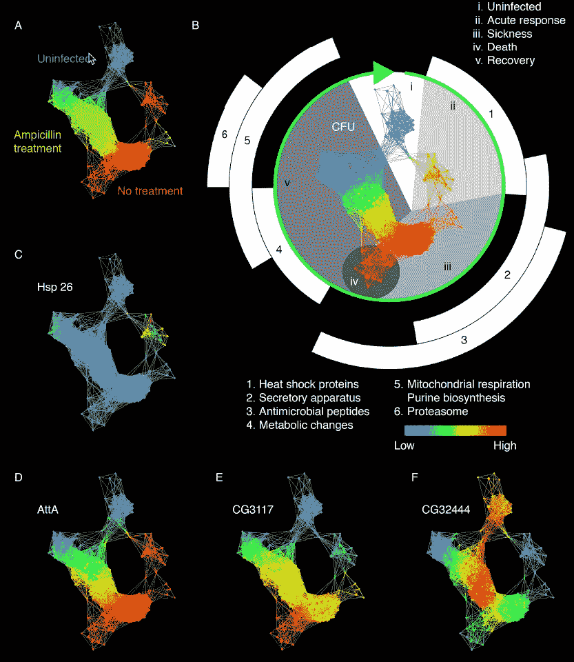

# 理解疾病周期:斯坦福大学使用 TDA 的突破性研究

> 原文：<https://towardsdatascience.com/understanding-the-disease-cycle-groundbreaking-research-from-stanford-using-tda-81cfb595d605?source=collection_archive---------2----------------------->

这篇原创的[博客](https://www.ayasdi.com/blog/life-sciences/understand-disease-cycle-groundbreaking-research-stanford-using-tda/)于 2017 年首次出现在 Ayasdi 网站上。

我们合作项目的最大回报之一就是看到开创性的工作使用我们的软件发表。[史丹福微生物学](https://microimmuno.stanford.edu/)，特别是[大卫·施奈德博士](https://med.stanford.edu/profiles/david-schneider)和他的实验室似乎每年都达到这个地位。

也就是说，他们最近从 DARPA 获得了 600 万美元的资助，以继续他们在理解疾病康复方面的开创性工作。他们的工作如此重要，以至于在 PLOS 的两家独立的报纸上发表。两篇论文都展示了我们的底层技术[拓扑数据分析(TDA)](https://www.ayasdi.com/resources/whitepaper/tda-and-machine-learning/) 如何被用于绘制宿主循环通过疾病空间的方式。

这项工作是使用我们的平台的无监督学习能力进行的，并通过使用横截面数据的疾病地图的可视化来区分。

目前，当动物/人类从疾病中康复时，没有/几乎没有收集到数据，因此潜在的商业影响是显著的，并且将因疾病指征而异。

Schneider 实验室使用 TDA 对数据进行聚类，而没有强加连接结构，例如层次模式或最小分支树。拓扑网络提供了一个健康空间的惊人表示，类似于疾病地图，其中网络的不同区域对应于疾病的不同部分:舒适、疾病和康复。事实上，老鼠和人类的数据集形成了这些优雅的、定义清晰的循环结构。

施尼德博士的团队绘制了寄生虫、红细胞、粒细胞或网织红细胞等参数的强度——发现小鼠和人类感染在许多方面是共线的，具有相同的事件顺序。TDA 图被用来将活的和死的老鼠分成两条不同的路径，然后确定两组之间基因表达的差异。研究人员证明，红细胞和网织红细胞在存活和死亡小鼠中的表现不同，因为它们通过疾病空间的路径不同。

一个有趣的因素是，TDA 是在这种情况下唯一可行的技术。

TDA 制作的图形更明显是循环的，因为拓扑网络拉近了间隙。他们将被感染的宿主穿越的“疾病空间”可视化，并确定了感染过程的不同状态。弹性系统不适合用树来描述，用环来描述更好——但是环避开了大多数分析方法。

另一方面，TDA 对数据的“形状”很敏感，不会任意线性化一个循环，然后强迫它适应一棵树。相反，这种分析只是将相关的数据点聚集起来，用网络图上的节点表示，图形的形状揭示了时间点之间的联系。在弹性系统的情况下，如从感染中恢复的主机，此图形成一个循环。

下面是每篇论文的作者摘要和实际论文的链接。

[通过绘制疾病空间图跟踪对感染的抵御能力](http://journals.plos.org/plosbiology/article?id=10.1371%2Fjournal.pbio.1002436)

“当我们生病时，我们渴望康复；因此，医学的一个主要目标是促进复原力——宿主在感染后恢复健康的能力。虽然在实验室中，我们可以通过对接种时间和剂量的精确了解来研究对感染的反应，但诊所中的病人却没有这些信息。这就产生了一个问题，因为我们不容易区分处于感染早期阶段的患者和在感染后期出现的更具疾病耐受性的患者，前者将发展为严重疾病。这两类患者之间的区别很重要，因为对疾病耐受性较差的患者需要更积极的治疗方案。为了确定患者在感染时间线上的位置，我们绘制了“疾病地图”,通过“疾病空间”追踪患者的路线。“我们选择在病人生病和康复时产生循环图的症状。通过使用小鼠-疟疾模型，我们证明了弹性较低的个体在这个空间中走更宽的回路，这表示感染时间更长，症状更严重。我们发现这种循环行为也适用于人类，并表明携带镰状细胞特征的人对疟疾感染更有抵抗力。”

[描述疾病耐受性需要多少个参数？](http://journals.plos.org/plosbiology/article?id=10.1371/journal.pbio.1002435)

“这是一个直观的假设，即感染期间症状的严重程度必须与病原体载量相关联。然而，解释健康如何随病原体负荷变化的剂量-反应关系是非线性的，可以描述为“疾病耐受曲线”;这种关系随着宿主或病原体的遗传特性以及环境条件而变化。我们研究了这条曲线形状的变化可以告诉我们免疫反应的潜在回路。使用一个模型系统，我们用细菌病原体单核细胞增生李斯特氏菌感染果蝇，我们观察到一个 S 形的疾病耐受曲线。这种类型的曲线可以用标准方式用三个或四个参数来描述，这使我们能够开发一个简单的数学模型来解释随着免疫反应的变化，曲线预计会如何改变形状。在观察了由于宿主和病原体遗传变异导致的曲线形状变化后，我们得出结论，李斯特菌感染造成的损害不是由过度旺盛的免疫反应造成的，而是由病原体更直接地造成的。”

要成为合作者，请发电子邮件给我们，姓名为[collaborations@ayasdi.com](mailto:collaborations@aysadi.com)。