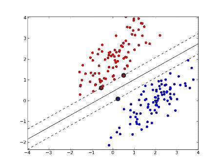
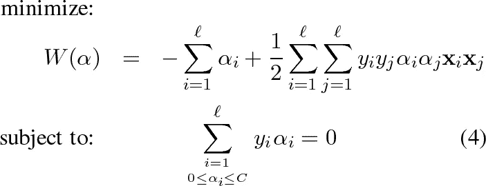
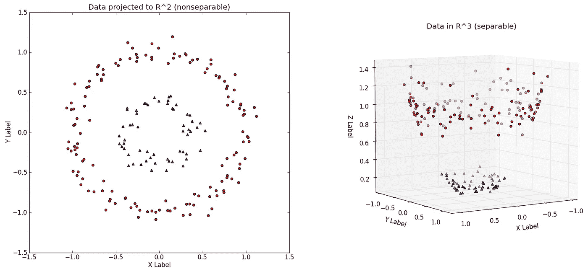

# 理解内核技巧。

> 原文：<https://towardsdatascience.com/understanding-the-kernel-trick-e0bc6112ef78?source=collection_archive---------0----------------------->

我观察到，就像我一样，我们中的许多人试图学习支持向量机，发现很难理解内核的智慧。这花了我相当多的时间和资源，但我终于渡过了这条河，我打算帮助你们也这样做。这中间可能看起来很混乱，但是只要有一点耐心和坚持，我很确定你最终会有一个好主意。那么，让我们现在就开始吧！

对于那些不熟悉 SVM 的人，这里有一个简短的介绍。在数据分类问题中，SVM 可以用来为线性可分的数据集提供最大的分离间隔。也就是说，在可以被选择来分离用于分类的数据集的所有可能的决策边界中，它从两个类中选择离所述决策边界最近的点最远的决策边界。这应该有点令人困惑，所以这里有一个图来帮助你得到一个直觉。

这里有两个班级，红色和蓝色。中间的线是决策边界。突出显示的点是支持向量。所有这些点和直线之间的距离是所有可能的决策边界中的最大值，因此这是最佳值。

现在这样不好吗？它是，除了这是适用的事实；以它的原始形式；仅适用于线性可分数据。如果不是呢？输入内核。这个想法是，我们的数据，在我们的 n 维空间中是不可线性分离的，在一个更高维的空间中可能是可线性分离的。为了理解内核是如何工作的，一些数学知识是必要的，所以做好准备！

比方说决策边界。即，分离类的超平面具有由向量 w 给出的权重(系数)。这是我们需要找到的。我们试图最大化从这个 w 向量到最近点(支持向量)的距离，所以这现在成为我们的约束。省去了后面的一些数学知识，我要请你们在这里假定，为了解决这个问题，我们解决了以下问题

我会给你一个简单的解释这个看起来可怕但本质简单的等式。l 是我们训练数据中数据点的数量。y 表示数据点的输出，为了方便起见，我们表示为+1 或-1。x 是每个训练示例中的特征向量。α现在……嗯，α是拉格朗日常数。为了对此进行简要概述，拉格朗日乘数用于包含解决最小化或最大化问题的约束，从而使我们在达到我们的解决方案时不必担心它们。
无论如何，当最小化 W(alpha)[作为 alpha 的函数的权重向量]时，我们看到术语 x*x(转置)。也就是说，我们不需要确切的数据点，只需要它们的内积来计算我们的决策边界。有什么大不了的，对吧？那么如果是这样呢？这有什么帮助？
这意味着，如果我们想要将现有数据转换为更高维度的数据，这在许多情况下有助于我们更好地分类(参见下图中的示例),我们不需要计算数据的精确转换，我们只需要高维度空间中数据的内积。这在不可线性分离的数据集中非常有效！

得到高维空间的内积比得到高维空间的实际点要容易得多。通过简单地使用‘d’的指数将我们的数据映射到‘d’维空间的多项式核对于我们的解决方案是有效的。高斯核，在数学上，将我们的数据映射到一个无限维的空间(是的，我没有拼错)。这些只是众多可用内核中的一部分。通过这种方式，我们甚至不需要访问高维空间就可以得到我们的解。

当然，这里涉及的数学和逻辑比我在这里解释的要多得多，但是我希望我已经能够给你一个关于内核技巧的像样的直觉。快乐学习！