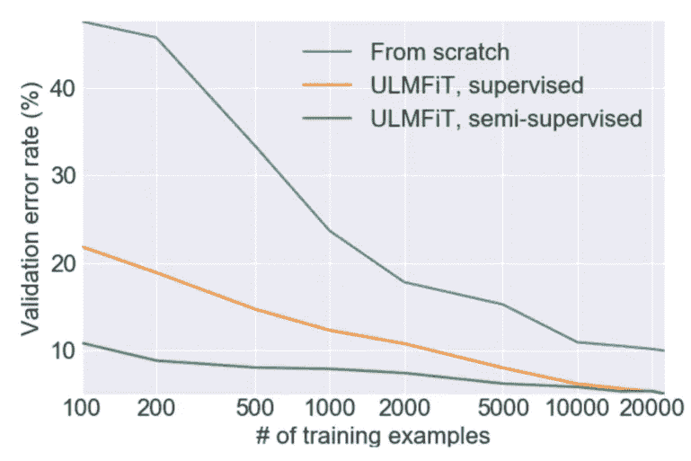

# 通用语言模型来增强您的 NLP 模型

> 原文：<https://towardsdatascience.com/universal-language-model-to-boost-your-nlp-models-d59469dcbd64?source=collection_archive---------7----------------------->

来自 [fast.ai](http://fast.ai) 的人们已经因其前沿的深度学习课程而闻名，他们才刚刚开始。昨天，他们[发表了他们对各种 NLP 问题的预训练语言模型的研究](http://nlp.fast.ai/classification/2018/05/15/introducting-ulmfit.html)。这项研究非常棒。看看这些结果:

Taken from [https://arxiv.org/abs/1801.06146](https://arxiv.org/abs/1801.06146)

蓝线表示仅针对该任务训练的新模型，橙色表示针对该任务微调的预训练语言模型，绿色表示针对该任务数据集微调为 LM，然后针对其目标微调的预训练模型。最后一个选项比第一个选项取得了更好的结果，但数据量却少了 100 倍！

基本上，他们的方法允许使用预训练的 LMs，并使用更少的数据获得更好的结果。这和 ResNets 在 ImageNet 上的预训练在计算机视觉上做的差不多。他们已经发布了所有的[源代码，并在 WikiText 103 上预先训练了 LM](http://nlp.fast.ai/category/classification.html.)(103 百万字)，所以可以在你的研究/项目中随意使用它。

# 它是如何工作的

简而言之，食谱如下:

1.  在大型数据集上训练 LM 或下载预先训练的 LM。
2.  在你的数据上微调这个 LM。
3.  加几层，微调一下，解决手头的任务。
4.  干得好！你可能刚刚取得了 SOTA 的成绩。现在，您可以选择另一个问题并返回到步骤 2。

现在让我们更仔细地看看每一步。

1.  只是一个三层 LSTM，具有精心调整的丢弃参数，如本文中描述的(AWD-LSTM)在 WikiText 103(28，595 篇预处理的维基百科文章和 1.03 亿字)上训练。
2.  根据上一步的数据对语言模型进行微调。一般来说，当模型忘记了它以前学过的东西时，就会产生一个问题。为了解决这个问题，作者提出了两种技术:区别微调(从最后一层到第一层，以某个因子减少每个先前层的学习速率，在这个特定情况下为 2.6)和倾斜三角形学习速率(在迭代的第一~10%线性增加 LR，然后线性减少它)。
3.  最后，添加一些完全连接的层，并为该任务训练模型。为了避免灾难性的遗忘这一步，作者建议逐步解冻(首先冻结所有预先训练的权重，并在每个时期后解冻一层，从最后到第一)。此外，对于分类任务，他们将大文档分成几批，并用最后一批的隐藏状态初始化模型。
4.  他们已经报告了 6 项任务的 SOTA 结果，并且正在进行中。

这真是太棒了。相对于 CV，NLP 中的分类相当困难，但是现在我们可以用几百个例子训练一个好的模型。这种方法不仅适用于分类，而且适用于几乎所有类型的 NLP 问题。我想这项研究将会产生和几年前单词向量一样大的影响。看到最终能用它解决多少任务，我真的很激动。