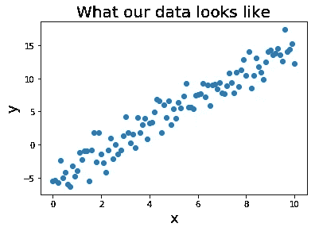
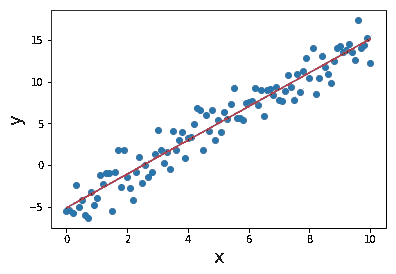
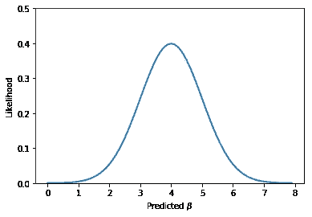
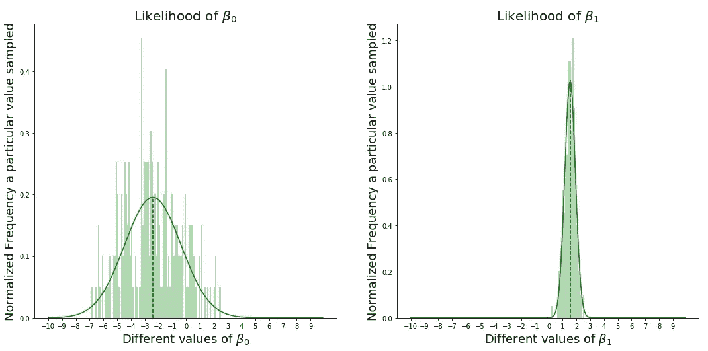
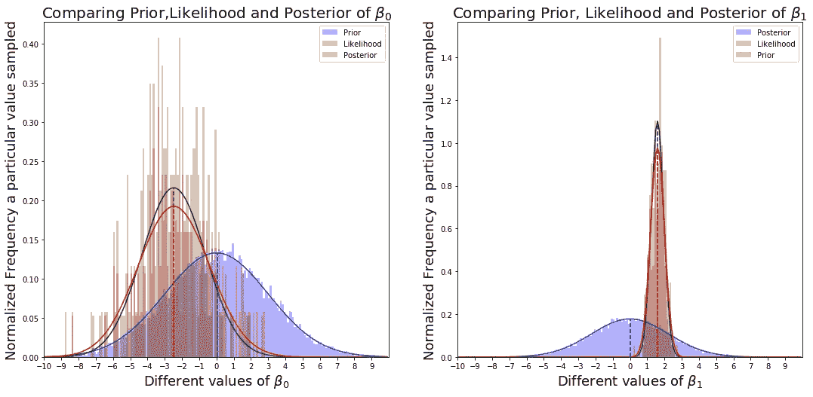

# 解开贝叶斯黑魔法:非贝叶斯主义者实施贝叶斯回归

> 原文：<https://towardsdatascience.com/unraveling-bayesian-dark-magic-non-bayesianist-implementing-bayesian-regression-e4336ef32e61?source=collection_archive---------2----------------------->

首先，我是一个深度学习的人，直到最近我都很满意这一点。但我最近成了一个恶性小样本高维问题的受害者！所以我不得不把我的头转向擅长从小的学习的算法，并告诉我“*我对那次学习*有多有信心”。

这对我来说是一个相当突然的变化。因为我已经远离贝叶斯“东西”太久了。但是现在是改变的时候了。所以我不得不(几乎)从头开始学习。我被诸如先验、后验概率、 *KL-Divergence* 、 *Evidence Lower BOund (ELBO)* 之类的术语轰炸着(希望有一天我会再写一篇关于后两者的帖子！).然后我意识到“嘿，这和 frequentist 类型的算法没什么不同”。所以是时候解开结构化知识这个大球了，希望不要掉进兔子洞。

让我简单介绍一下将要发生的事情。所以我们要从一个频率主义类型的回归例子开始。然后，我们将会看到为什么我们可能想要用更有前途的技术来解决我们的例子，比如贝叶斯线性回归(显然是不确定性信息)。在那之后，我们将陈述贝叶斯规则，随后是关于我们如何能够采用贝叶斯规则来为给定的数据找到一个好的模型的快速注释。有了这个我们就可以定义先验、似然和后验项(我的意思是定义。不了解)。然后，我们将沿着一条漫长的道路(很长，但很有启发性)讨论这些术语。当我们讨论这些术语时，我们将看到我们在示例中得到的结果，以建立一些上下文。最后，我们将通过比较我们开始时(之前)和我们发现的最佳(之后)来做一个快速评估。

# 我们要解决的问题:Y= β1 X + β0 + ε

线性回归的第一个假设是，我们假设数据具有以下形式。

从这种模型生成的数据如下所示。

# 普通最小二乘(OLS)线性回归

假设我们得到了这个数据集，我们需要拟合一条线。我们通过将问题公式化如下来做到这一点。

我们的目标是找到β1 和β0，使数据的 RMSE(均方根误差)最小。从数学上来说，

首先让我们用线性回归拟合一条简单的直线。

A line fit to data with OLS linear regression

## 那么，这个结果说明了什么？

看起来还不错。事实上几乎是正确的。但是对于有限的数据区域，我真的可以依靠线性回归给出的答案吗？我不这么认为。我想要一个基本上说，

> 嘿，我之前看过很多这方面的数据，所以我对自己的预测还是蛮有信心的。

或者

> 嗯，这一点在我没有看到太多数据的地方。答案大概是这样，但我不太确定。

类似这样的。

Fitting lines with Bayesian linear regression. The red dashed line represent the mean line where the red solid lines on both sides represent the 95% confidence interval

你可以看到，在没有数据的地方，置信界限是如何增加的(因此答案的不确定性增加了)。但是线性回归给不了你这个。这就是为什么我们需要贝叶斯线性回归。那么，我们如何使用高级的“贝叶斯”疗法来解决这个问题呢？

重要的事情先来！所有贝叶斯“东西”的圣杯

# 贝叶斯规则

给定事件 *B* 发生的事件 *A* 发生的概率(*后*——你感兴趣但不知道的事情)由给定事件 A 发生的事件 B 发生的概率(*可能性*)乘以 A 发生的概率(*前*)给出。

## 贝叶斯定理和这个问题有什么关系？

很好，我们已经听过无数次了！我想知道的是这和机器学习有什么关系。为此，设 *A* 为学习模型的参数(即β0 和β1)，用θ表示， *B* 为你的数据， *D* 。现在让我们解释一下贝叶斯规则中的每个实体。

通过求解这个问题，我们将得到给定数据下θ (β0 和β1)中所有参数的联合分布。这正是我们所需要的。换句话说，P(θ|D)将告诉我们给定数据β0=0.5，β1=2.0，概率为 0.5，β0=1.5，β1=3.0，概率为 0.1。所以我们知道β0=1.5 β1=3.0 并不完全脱离这个世界(这是我们实际上在 frequentist 方法中假设的)！这叫做后验分布。

我们通过计算来计算

*   P(D|θ):如果我们的模型中有参数θ，我们有多大可能看到想要的数据
*   P(θ):我们对参数θ可能位于何处的先验信念。这越接近真实的后验概率，你就能越快越好地找到正确的后验概率
*   P(D):这是一个常数值，代表观察数据的概率

# 先验 P(θ):我们对什么样的参数的信念？

我们需要从一些参数值开始，对吗？在贝叶斯设置中，你不用一个值来指定事物，而是用分布来表示(例如高斯/正态分布)。在我们的例子中，我们可能会说，

## 用概率分布指定参数

嘿，我相信参数β0 可以用一个均值为 0，标准差为 3 的正态来表示。也就是说，

类似地，你说对于β1，

如果我们对β的许多值进行采样，我们就更接近真正的正态分布。如您所见，对于β0 和β1，许多值在接近 0 时被采样，但是与β0 相比，β1 更受挤压(与β1 相比，在 0 附近不太集中)

Priors we chose for β0 and β1

## 为什么是正态分布？

你会问为什么我们使用正态分布？正态分布具有非常好的分析特性。这样，我们就有了后验分布的均值和方差的解析解。关于[解析后验解](https://en.wikipedia.org/wiki/Bayesian_linear_regression#Posterior_distribution)的更多细节。

## 为什么一个好的先验(P(θ))如此重要？

因为你的后路取决于此。也就是说，关闭你的前部到后部，你会更快到达真正的后部。要知道为什么，假设你的先验和后验是相同的，那么当你从先验采样时，你实际上是从后验采样(这是我们需要的)。

现在开始下一个重要的部分。看到数据的可能性。

# 可能性 P(D|θ):对于给定的θ，看到数据的可能性有多大

对于给定的一组参数，我们如何计算数据的似然性？换句话说，我们想要计算，

P(Y|X，θ)

下面，我们将做一步一步的探索，找到一个方程，我们可以计算这个实体的值。

## 计算可能性:P(Y|X，θ)

## 1.根据单个数据样本(Y 和 X)编写数据集(Y，X)

现在让我们试着为上面的项建立一个方程。

这是真的，因为假设，

*   【数据点(，易)是独立同分布的

## 2.用 x，β1，β0 和ε来写 y

现在让我们回忆一下我们的数据是什么样的，

我们可以把这个方程代入似然方程，

## 3.使用条件变量隔离ε

我们给出了所有的 x，β1，β0，所以我们可以把它们从等式中去掉，

这样考虑这个变换，如果我需要 P(A+B|B)这和 P(A|B)是一样的，因为我们知道 B 是“**给定**”。换句话说，P(B|B) = 1，所以我们可以从 P(A+B|B)的顶部去掉 B，而 P(A|B)不受伤害。

## 4.假设:噪声与数据无关

现在我们开始下一个重要的假设，

*   *噪声与数据无关*

这给了我们，

## 5.使用 PDF 的写入概率

记住我们的噪声是正态分布的，我们可以得到正态 as 的概率密度函数(PDF ),

## 6.假设:零均值恒定方差噪声

在线性回归中，我们对其中的噪声成分做了两个重要的假设。也就是说，它是正态分布，

*   *这是零均值*
*   *它有一个恒定的方差*

有了这两个假设，将噪声值代入我们得到的方程，

我们已经有了，

## 7.最终似然方程

所以让我们把它插上电源，

是的，都完成了！这是一个简单的变换系列，加上一些假设，以达到某种可计算的可能性函数。

## 使符号更简单

为了使事情更简单，从这一点开始，我们说，

这样一来，

## 直觉:如果 y=β1 x，似然如何寻找β1？

在我们的例子中有两个参数。所以为了简单起见，暂时忘掉β0。假设 y 和 x 是根据下式生成的

现在，我们通过尝试一系列不同的β1 值来进行近似，这将产生一个新的 y

对于β1 值的范围。可能性 P(y|x，β1)如下所示。

你可以看到接近 4 我们有很高的可能性看到数据。这正是我们所需要的。

## 更多直觉:我们前面例子的可能性

您可以将其推广到任意数量的β值(在我们的示例中是β1 和β0 值)。这是我们在例子中得到的图表。

## 上面的图表说明了什么？

上图显示，当β0 接近-2.5，β1 接近 1.5 时，我们最有可能看到数据 X，y。还要注意，β1 的可能性是一个很大的峰值，而β0 的分布更广。现在，作为一个练习，思考这对于每个变量对模型准确性的影响意味着什么。

希望这足够澄清事情。让我们继续到后面

# 后验 P(θ | D):我们最终需要什么？

后验概率是给定观察数据时参数(即β0 和β1)的概率密度函数。快速回忆一下，这是我们想要的最终结果(贝叶斯规则的左侧)。为了计算这个我们需要计算 *P(Y|X，* β1，β0 *)* ， *P(* β1，β0 *)* 和 *P(X，Y)* 放在一起产生，

现在实体 P(X，Y)将是常数。因为无论我们对模型做了什么，无论我们有什么数据都会在那里。所以不会变。所以我要用一个常数 Z 来替换 P(X，Y)，我们稍后会讨论如何计算这个 Z。

换句话说，

> 后验只是一个加权的先验，其中权重是对于给定的先验值看到数据的可能性

所以有两种方法可以解决这个问题。

*   得到后验概率的解析解
*   通过对许多β1 和β0 进行采样来求解该方程，然后近似后验概率

## 我们将使用取样。因为我们想通过更多的实践来学习

我们感兴趣的是后验概率和先验概率的表现。所以用解析解得到答案对我们来说就是作弊。让我们通过抽样来计算。

因此，我们将制定上述方程，以适应采样。

然后，我们通过从β0 和β1 各自的先验中提取 15000 个不同的值来近似完整的后验概率，并计算这些β0 和β1 组合的可能性。更具体地说，对于我们的例子，

所以我们解决了，

我们有后路。因为数据是独立的，β1 和β0 是独立的，所以我们可以把上面的实体写成，

通过赋予我们讨论过的符号简化，我们得到，

# 证据(Z=P(D)):使后验和达到 1

Z = P(D) = P(X，Y)

*P(D)* —这有时被称为证据，表示看到数据的概率。由...给出，

# 我们如何计算 Z？

我们如何能近似这一点？我们只是得到β1 和β0 样本的所有不同组合的 P(D|β1，β0)P(β1，β0)的总和(即贝叶斯规则的顶部)。我们取样越多，观察数据的概率就越真实，P(D)就越大。更具体地说，我们可以通过下式计算 Z，

这没有什么可怕的，这只是将 P 的顶部(β1(i)，β0(i)|xj，yj)一遍又一遍地相加，得到我们对不同的β1 和β0 采样的总次数。Z 的存在使得后验概率下的面积加起来等于 1(你知道，因为这是一个概率分布)

# 对于我们的例子，先验、似然、后验结合在一起

下面我们把先验的、可能性的和后验的都放在一个地方来说明看起来如何。

## 图表显示了什么？

我可以做两个重要的观察。

*   你可以看到，由于我们的先验稍微偏离了真实的后验概率，这种可能性实际上将后验概率从先验概率中抽离出来。如果先验越来越接近真正的后验，你会看到这种拉力在减弱
*   下一个观察是，参数β1 似乎比β0 更敏感。否则，β1 的变化比β0 的变化更能影响结果的准确性。

最后，我们做一个比较，看看从先验分布(只有前 500 个样本)和后验分布采样的线的差异。我将让你来判断哪个更好。

# 如何获得新数据点的答案？

这很简单，因为我们有了β1 和β0 的后验分布。你只需从后验样本中抽取不同的β1 和β0，并得到这些β1 和β0 中每一个的值***【y】***(即***y =β1 x+β0***)***，*** 。有了这组 ***y*** 对于 ***x*** 的潜在候选，就可以计算出 y 的均值和 ***y*** 的标准差。

Jupyter 笔记本可在此处获得:

[https://github . com/thushv 89/exercises _ thushv _ dot _ com/blob/master/Bayesian _ linear _ regression . ipynb](https://github.com/thushv89/exercises_thushv_dot_com/blob/master/bayesian_linear_regression.ipynb)

# 结束语

所以这有点长，但希望能揭开贝叶斯方法的一些“黑暗秘密”。通过一个示例任务，我们理解了贝叶斯线性回归是如何工作的；Y= β1 X + β0 + ε。

我们首先看到频率主义者的方法解决了问题，但是忽略了一些关键信息；答案的不确定性。然而，我们看到贝叶斯方法不仅会给出最有可能的答案，还会告诉我们这个答案的不确定性。