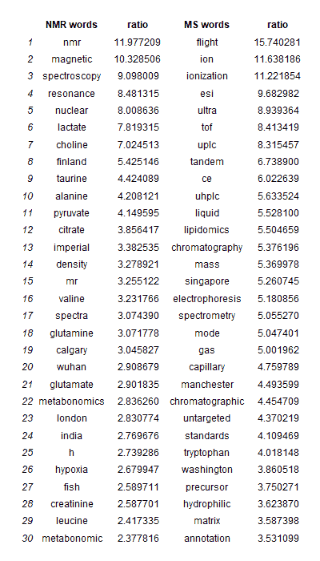
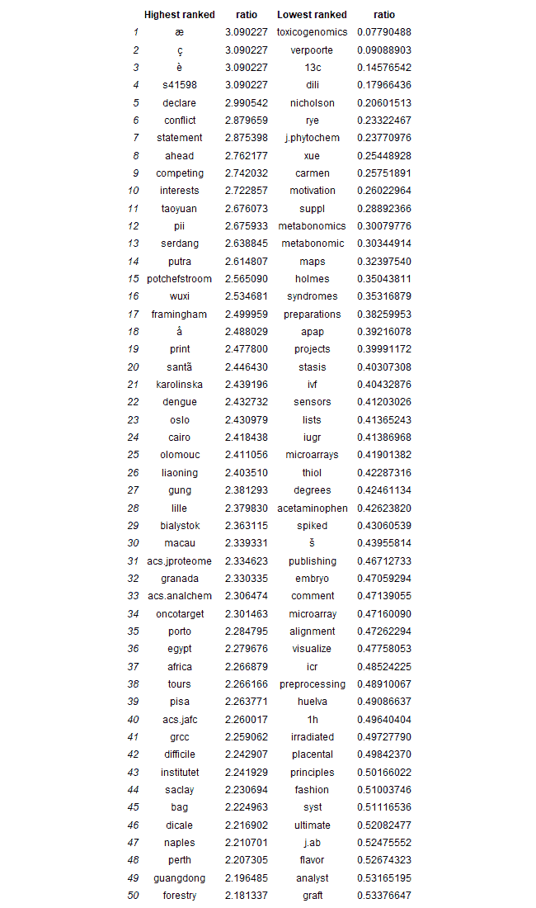
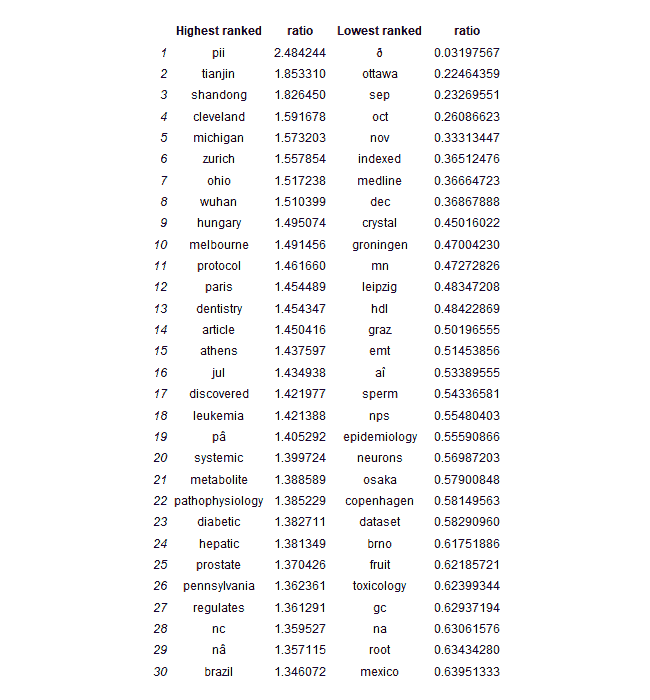
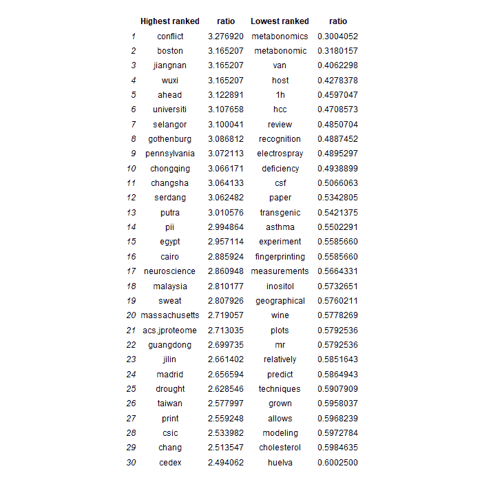
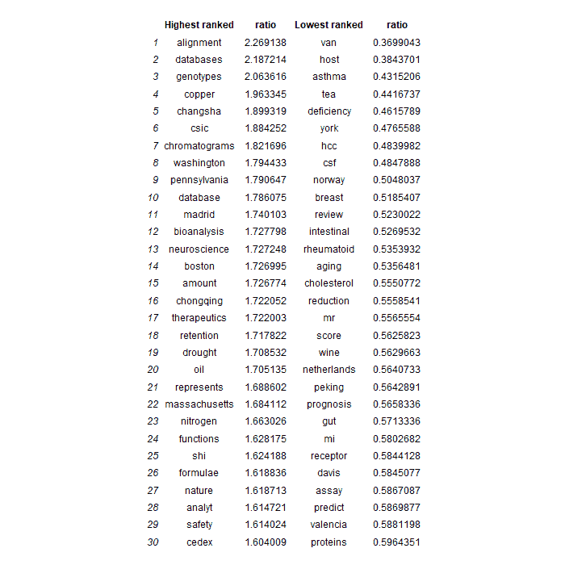

# 通过摘要的数据挖掘对代谢组学的当前和潜在趋势进行无监督分析

> 原文：<https://towardsdatascience.com/unsupervised-analysis-of-current-and-potential-trends-in-metabolomics-through-data-mining-of-ee26acbd10a0?source=collection_archive---------8----------------------->

## 在短短几秒钟内不断更新有趣趋势的信息，这不是很酷吗？这是可能的，如果你挖掘文章摘要。

一个科学领域的进步取决于其从业者的自我评价。研究人员探索书目，以探索研究领域和相关领域的新兴模式。有了这些信息，他们可以研究现场社区感兴趣的新想法。

随着科学领域的蓬勃发展，在研究过程中获得新的见解需要更高的复杂性。因此，研究人员需要缩小他们的专业领域，以便为他们合作的跨学科团队贡献比较优势。

不幸的是，这种专业化可能意味着对相关领域发生的有趣趋势的认知度较低，而这些趋势可能有助于科学领域的进一步发展。油田可能越来越多地被封闭在筒仓中，其中一些程序是默认执行的，而不适应其他油田已经普遍存在的改进。

评论和会议是跟上新的有趣发展的有效手段。尽管如此，它们需要时间和认知投资，这些投资可以更好地用于继续推进项目。如果有某种方法能够以一种更自动和更容易解释的方式意识到新的有趣模式，那将是非常有益的。

[Google Trends](https://trends.google.com/trends/) 支持调查和比较质谱和核磁共振等概念中的时间模式:

Google Trends

(试着在图片上找到圣诞节和暑假。)

尽管如此，Google Trends 只能处理单个概念，而不能处理关联概念。例如，“血液代谢组学”不能与“尿液代谢组学”相比，因为“血液代谢组学”和“尿液代谢组学”不是代谢组学研究中通常使用的概念。此外，对于谷歌趋势，我们需要在分析之前识别有趣的概念。但是，我们如何分析那些我们甚至不知道分析起来有意思的东西呢？

如果我们首先收集尽可能多的感兴趣领域的文本信息，就有可能对趋势进行“无监督分析”。有了这些信息，我们就可以分析一个词在一段时间内的使用次数，以及各种因素对其使用的影响。例如，合乎逻辑的是，使用核磁共振(nmr)作为分析平台的代谢组学文章比使用质谱(MS)作为分析平台的代谢组学文章更多地使用“NMR”一词。

通过在其搜索引擎中寻找具有例如“nmr 代谢组学”或“ms 代谢组学”的文章，然后导出找到的文章的摘要，可以从 Pubmed 数据库中提取文本信息。然后，R 包'[记号赋予器](https://cran.r-project.org/web/packages/tokenizers/vignettes/introduction-to-tokenizers.html)'能够将导出的摘要组织成可以分析的单词列表。

核磁共振和质谱文章中最典型的词是哪些？

不出所料，排名大多被各分析平台的特定术语和代谢物占据。还可以找到一些专注于具体分析平台的研究中心。有趣的是，鱼似乎更容易被核磁共振分析而不是质谱分析。

这些信息可能很奇怪，并会产生一些转发，但可能不会有太大的成效。更有趣的可能是分析例如相对于前几年，哪些词在 2016 年的代谢组学中增加最多:

我们将永远拥有巴黎，“代谢组学”。我不会过度分析结果，因为科学产出可能有不规则的模式。尽管如此，2016 年似乎有相当多的新兴代谢组学文章来自非西方国家。对“1H”和“13C”的兴趣似乎也在下降，这可能是因为核磁共振的相关性在下降。

我还发现新出现的对利益冲突的担忧很有意思。尽管如此，这可能与《代谢组学》杂志最近提交的稿件中这一部分的要求相混淆。

(是的，在最差的排名中也有几个著名的名字……)

如果你需要写一篇代谢组学综述，或者你只是想在下一次会议上成为代谢组学的潮人/酷猎人/潮流引领者/什么的，与 2016 年相比，你可能对 2017 年代谢组学中正在流行或正在流行的词语更感兴趣:

很高兴看到指纹降低了它的相关性。跳上剖析的潮流；)

现在我们来分析一下相关领域有意思的趋势。如前所述，当试图在一个科学领域取得进展时，开发新方法的典型方式是试图从其他领域获取想法。代谢组学与蛋白质组学的联系比与其他组学的联系更紧密，蛋白质组学产生的年度研究产出比代谢组学大得多。因此，分析代谢组学中尚未探索的蛋白质组学的可能趋势是一个好主意。下面是蛋白质组学 2017 年和 2016 年的单词对比结果:

您是否发现了您尚未意识到的与代谢组学相关的感兴趣的领域或研究中心？

最后，我们可以分析代谢组学中多元分析的可能趋势。与前几年的文章相比，我们使用多元分析分析了 2016 年代谢组学文章中的趋势词，结果如下:

很明显，这里有一个混淆因素:与代谢组学中的多变量分析相比，该排名提供了代谢组学中更多的关于单词趋势的信息。像“代谢组学”或“代谢组学”这样的词，在多变量分析中没有相关性，是减少最多的词。

纠正这种混杂因素影响的一种方法是，通过分析 2016 年代谢组学中增加的词时计算的比率，将计算的比率“归一化”。例如，“代谢组学”的标准化是这样工作的:

*   在代谢组学多元分析中的趋势词分析中有 0.318 的比值。
*   在代谢组学趋势词分析中有 0.303 的比值。
*   在代谢组学的多变量分析中，单词的趋势重要性的归一化比率是 0.318/0.303=1.049。那么 2016 年‘代谢组学’在代谢组学多元分析中的重要性并没有发生有意义的变化。

修正后的排名给出了以下结果:

这里出现了一些有趣的词语。例如,“茶”、“酒”和“脑脊液”在多变量分析中似乎没有取得类似于其他研究矩阵中所示的进展。是因为这些矩阵的多元分析没有提供有意义的优势吗？或者，是否有可能尝试整合多变量技术来提高相关研究中获得的洞察力？

这些例子仅仅给出了在几秒钟内探索代谢组学(或任何其他科学领域)和可以利用的相关领域的当前趋势的无限可能性的不足直觉。如果有一些“参数调整”来过滤我们分析中不感兴趣的词，或者过滤来自旧文章或低引用计数/影响因子期刊的文章的摘要，那么可以开发更高质量的分析。此外，如果进行多年分析，以避免从任意模式得出错误结论，分析可能会得到改善。