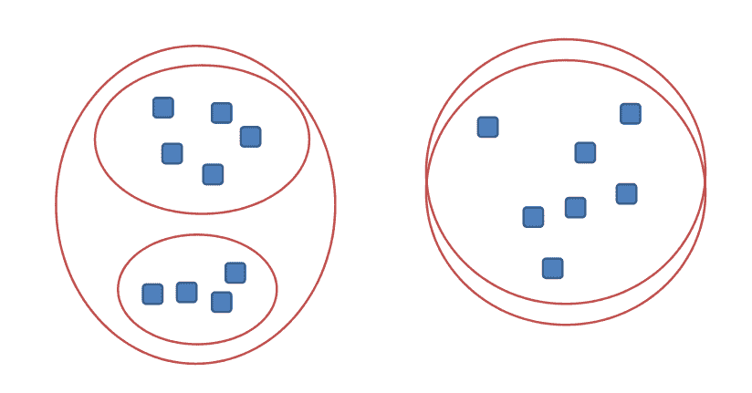
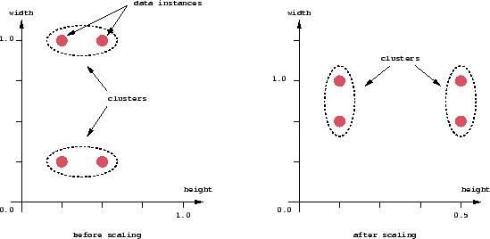
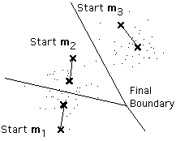
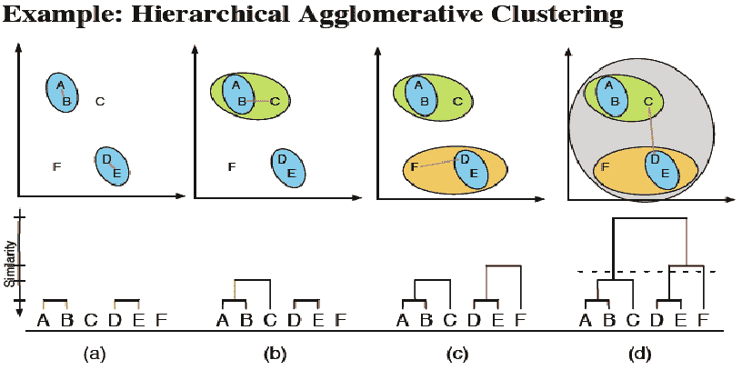
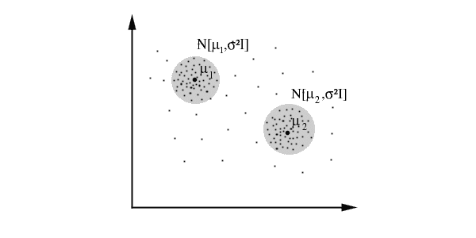

# 无监督学习和数据聚类

> 原文：<https://towardsdatascience.com/unsupervised-learning-and-data-clustering-eeecb78b422a?source=collection_archive---------0----------------------->

涉及机器学习的任务可能不是线性的，但它有许多众所周知的步骤:

*   问题定义。
*   数据准备。
*   学习一个底层模型。
*   通过定量和定性评估改进基础模型。
*   展示模型。

解决新问题的一个好方法是以最好的方式识别和定义问题，并学习从数据中获取有意义信息的模型。虽然模式识别和机器学习中的问题可以有各种类型，但它们可以大致分为三类:

*   监督学习:
    由“教师”给系统提供示例输入及其期望输出，目标是学习将输入映射到输出的一般规则。
*   无监督学习:
    没有给学习算法贴标签，让它自己在输入中寻找结构。无监督学习本身可以是一个目标(发现数据中的隐藏模式)，也可以是达到目的的一种手段(特征学习)。
*   强化学习:
    一个系统与一个动态环境进行交互，在这个环境中它必须执行某个目标(比如驾驶车辆或者与对手进行游戏)。当系统导航其问题空间时，系统被提供奖励和惩罚方面的反馈。

介于监督学习和无监督学习之间的是半监督学习，其中教师给出一个不完整的训练信号:一个训练集，其中丢失了一些(通常是许多)目标输出。在这篇博文中，我们将重点讨论无监督学习和数据聚类。

**无监督学习**

在一些模式识别问题中，训练数据由一组输入向量 x 组成，没有任何相应的目标值。这种无监督学习问题的目标可能是发现数据中的相似示例组，这被称为*聚类*，或者确定数据如何在空间中分布，被称为*密度估计*。更简单地说，对于 n 采样空间 x1 到 xn，没有为每个样本提供真实的类标签，因此称为*无师学习*。

***无监督学习的问题:***

*   与监督学习任务相比，无监督学习更难..
*   既然没有答案标签，我们如何知道结果是否有意义？
*   让专家看看结果(外部评估)
*   定义聚类的目标函数(内部评估)

***尽管存在这些问题，为什么还需要无监督学习？***

*   标注大型数据集的成本非常高，因此我们只能手动标注几个例子。示例:语音识别
*   可能有这样的情况，我们不知道数据被分成多少/什么类。示例:数据挖掘
*   在设计分类器之前，我们可能希望使用聚类来深入了解数据的结构。

无监督学习可以进一步分为两类:

*   *参数无监督学习* 在这种情况下，我们假设数据的参数分布。它假设样本数据来自一个总体，该总体遵循基于一组固定参数的概率分布。从理论上讲，在一个正态分布族中，所有成员都具有相同的形状，并且通过均值和标准差被*参数化*。这意味着如果你知道均值和标准差，并且分布是正态的，你就知道任何未来观察的概率。参数无监督学习涉及高斯混合模型的构建和使用期望最大化算法来预测所讨论的样本的类别。这种情况比标准的监督学习困难得多，因为没有可用的答案标签，因此没有正确的准确性测量来检查结果。
*   *非参数无监督学习* 在无监督学习的非参数化版本中，数据被分组到聚类中，其中每个聚类(希望)表示数据中存在的类别和类的一些信息。这种方法通常用于建模和分析小样本数据。与参数模型不同，非参数模型不需要建模者对总体的分布做出任何假设，因此有时被称为无分布方法。

***什么是聚类？***

聚类可以被认为是最重要的*无监督学习*问题；因此，和其他这类问题一样，它处理的是在一组未标记的数据中找到一个*结构*。聚类的一个宽泛定义可以是“将对象组织成其成员在某些方面相似的组的过程”。因此，*群集*是它们之间“相似”并且与属于其他群集的对象“不相似”的对象的集合。

**基于距离的聚类。**

给定一组点，利用点之间的距离的概念，将这些点分组为一些*簇*，使得

*   内部(集群内)距离应该很小，即集群成员彼此接近/相似。
*   外部(集群内)距离应该很大，即不同集群的成员不相似。

***聚类的目标***

聚类的目标是确定一组未标记数据的内部分组。但是如何决定什么是好的集群呢？可以看出，不存在独立于聚类最终目标的绝对“最佳”标准。因此，应该由用户来提供这个标准，以使聚类的结果符合他们的需要。

在上图中，我们如何知道什么是最佳的集群解决方案？

为了找到特定的聚类解决方案，我们需要定义聚类的相似性度量。

***邻近度***

对于聚类，我们需要为两个数据点定义一个接近度。这里的接近度是指样本彼此之间的相似/不相似程度。

*   相似性度量 S(xi，xk):大如果 xi，xk 是相似的
*   相异(或距离)测度 D(xi，xk):小若 xi，xk 相似

有多种相似性度量可以使用。

*   向量:余弦距离

*   集合:Jaccard 距离

*   点:欧几里德距离
    q=2

一个“好的”邻近度测量非常依赖于应用。在问题的“自然”变换下，聚类应该是不变的。此外，在进行聚类时，不建议对来自多个分布的数据进行标准化。

**聚类算法**

聚类算法可以分类如下:

*   排他聚类
*   重叠聚类
*   分层聚类
*   概率聚类

在第一种情况下，数据以排他的方式分组，因此如果某个数据点属于某个确定的群，那么它不能被包括在另一个群中。下图显示了一个简单的例子，其中点的分离是通过二维平面上的直线实现的。

相反，第二种类型，即重叠聚类，使用模糊集对数据进行聚类，使得每个点可能属于两个或更多个具有不同隶属度的聚类。在这种情况下，数据将与适当的成员资格值相关联。

分层聚类算法基于两个最近的聚类之间的联合。起始条件是通过将每个数据点设置为一个簇来实现的。经过几次迭代后，它到达最终想要的簇。

最后，最后一种聚类使用完全概率的方法。

在这篇博客中，我们将讨论四种最常用的聚类算法:

*   k 均值
*   模糊 K-均值
*   分层聚类
*   高斯混合

这些算法都属于上面列出的聚类类型之一。而 K-means 是一种*排他聚类*算法，模糊 K-means 是一种*重叠聚类*算法，层次聚类是明显的，最后混合高斯是一种*概率聚类*算法。我们将在下面的段落中讨论每种聚类方法。

**K 均值聚类**

K-means 是最简单的无监督学习算法之一，它解决了众所周知的聚类问题。该过程遵循一种简单且容易的方式，通过先验固定的一定数量的聚类(假设 k 个聚类)来对给定数据集进行分类。主要思想是定义 k 个中心，每个聚类一个。这些质心应该以一种巧妙的方式放置，因为不同的位置会导致不同的结果。因此，更好的选择是将它们放置在尽可能远离彼此的地方。下一步是获取属于给定数据集的每个点，并将其与最近的质心相关联。当没有点悬而未决时，第一步完成，早期分组完成。在这一点上，我们需要重新计算 k 个新的质心作为上一步得到的聚类的重心。在我们有了这 k 个新质心之后，必须在相同的数据集点和最近的新质心之间进行新的绑定。已经生成了一个循环。作为这个循环的结果，我们可能会注意到 k 个质心一步一步地改变它们的位置，直到不再发生变化。换句话说，质心不再移动。

最后，该算法旨在最小化*目标函数*，在这种情况下是平方误差函数。目标函数

在哪里

是数据点 xi 和聚类中心 cj 之间的选定距离度量，是 *n* 个数据点距它们各自聚类中心的距离的指示符。

该算法由以下步骤组成:

*   *设 X = {x1，x2，x3，…..，xn}是数据点的集合，V = {v1，v2，…。，vc}是中心的集合。*
*   *随机选择‘c’个聚类中心。*
*   *计算每个数据点和聚类中心之间的距离。*
*   *将数据点分配到所有聚类中心中距离聚类中心最小的聚类中心。*
*   *使用*重新计算新的聚类中心

*其中，“ci”代表第 I 个聚类中数据点的数量。*

*   *重新计算每个数据点与新获得的聚类中心之间的距离。*
*   *如果没有数据点被重新分配，则停止，否则从步骤 3 开始重复。*

虽然可以证明该过程将总是终止，但是 k-means 算法不一定找到对应于全局目标函数最小值的最优配置。该算法对初始随机选择的聚类中心也非常敏感。可以多次运行 k-means 算法来减少这种影响。

K-means 是一种简单的算法，已经被应用于许多问题领域。正如我们将要看到的，使用模糊特征向量是一个很好的扩展候选。

k-means 过程可以被视为用于将 n 个样本划分成 k 个聚类的贪婪算法，以便最小化到聚类中心的平方距离之和。它确实有一些弱点:

*   未指定初始化方法的方式。一种流行的开始方式是随机选择 k 个样本。
*   可能发生的情况是，最接近于 **m** i 的样本集是空的，使得 **m** i 不能被更新。这是一个需要在实现过程中处理的问题，但通常会被忽略。
*   结果取决于 k 的值，并且没有描述最佳“k”的最佳方式。

最后一个问题特别麻烦，因为我们通常无法知道存在多少个集群。在上面显示的示例中，应用于相同数据的相同算法产生了以下 3 均值聚类。它比 2 均值聚类更好还是更差？

不幸的是，对于任何给定的数据集，没有找到最佳聚类数的通用理论解决方案。一种简单的方法是比较不同 k 类的多次运行的结果，并根据给定的标准选择最佳的一个，但我们需要小心，因为根据定义，增加 k 会导致更小的误差函数值，但也会增加过拟合的风险。

**模糊 K 均值聚类**

在模糊聚类中，每个点都有属于每个聚类的概率，而不是像传统的 k-means 那样完全属于一个聚类。模糊 k-means 特别试图通过用概率代替距离来处理点在中心之间或不明确的问题，概率当然可以是距离的某个函数，例如具有相对于距离倒数的概率。模糊 k-means 使用基于这些概率的加权质心。初始化、迭代和终止的过程与 k-means 中使用的过程相同。产生的聚类最好作为概率分布来分析，而不是标签的硬分配。应该认识到，如果数据点最接近质心，则 k-均值是模糊 k-均值的特殊情况，此时使用的概率函数简单地为 1，否则为 0。

模糊 k 均值算法如下:

*   **假设**固定数量的集群 *K.*
*   **初始化:**随机初始化与聚类相关的 k-means *μk* 并计算每个数据点 *Xi* 是给定聚类 *K* ，*P(PointXiHasLabelK | Xi，K)成员的概率。*
*   **迭代:**给定所有数据点的隶属概率，重新计算聚类的质心作为加权质心 *Xi* :

*   **终止**:迭代直至收敛或达到用户指定的迭代次数(迭代可能陷入局部最大值或最小值)

为了更好地理解，我们可以考虑这个简单的一维例子。给定一个数据集，假设把它表示为分布在一个轴上。下图显示了这一点:

看这幅图，我们可以在两个数据集中附近识别出两个集群。我们将用‘A’和‘B’来指代它们。在本教程中展示的第一种方法 k-means 算法——中，我们将每个数据点与一个特定的质心相关联；因此，这个隶属函数看起来像这样:

相反，在模糊 k-means 方法中，相同的给定数据点不仅仅属于明确定义的聚类，而是可以放在中间。在这种情况下，隶属函数遵循更平滑的线，以指示每个数据点可以属于具有不同隶属度的几个聚类。

在上图中，显示为红色标记点的数据点更属于 B 类，而不是 A 类。“m”的值 0.2 表示这种数据点对 A 的隶属度。

**层次聚类算法**

给定一组要聚类的 N 个项目和一个 N*N 距离(或相似性)矩阵，分层聚类的基本过程如下:

*   首先将每个项目分配到一个分类中，这样，如果您有 N 个项目，那么现在您有 N 个分类，每个分类只包含一个项目。让聚类之间的距离(相似性)与它们包含的项目之间的距离(相似性)相同。
*   找到最接近(最相似)的一对聚类，并将它们合并成一个聚类，这样现在就少了一个聚类。
*   计算新分类和每个旧分类之间的距离(相似性)。
*   重复第 2 步和第 3 步，直到所有项目都聚集成一个大小为 n 的簇。

**聚类为高斯分布的混合体**

还有另一种处理聚类问题的方法:基于*模型的*方法，该方法包括对聚类使用某些模型，并试图优化数据和模型之间的拟合。

在实践中，每个聚类都可以用参数分布来表示，如高斯分布。因此，整个数据集由这些分布的混合*建模。
具有高可能性的混合模型往往具有以下特征:*

*   成分分布具有高“峰值”(一个聚类中的数据是紧密的)；
*   混合模型很好地“覆盖”了数据(数据中的主要模式由成分分布捕获)。

基于模型的集群的主要优势:

*   可用的经过充分研究的统计推断技术；
*   选择组件分布的灵活性；
*   获得每个聚类的密度估计；
*   “软”分类是可用的。

*高斯混合* 这种最广泛使用的聚类方法是基于学习一个*高斯混合*:

混合模型是 k 个分量分布的混合，共同构成混合分布 *f* ( *x* ):

*αk* 表示第*k 个*分量在构造 *f(x)* 中的贡献。在实践中，经常使用参数分布(例如高斯分布)，因为已经做了大量工作来了解它们的行为。如果你用每一个 *fk* ( *x* )代替一个高斯模型，你会得到一个众所周知的高斯混合模型(GMM)。

*EM 算法*

期望最大化假设您的数据由多个多元正态分布组成(注意，这是一个*非常强的假设，尤其是当您固定了聚类数的时候！).换句话说，EM 是一种当模型中的一些变量不可观察时(即当你有潜在变量时)最大化似然函数的算法。你可能会问，如果我们只是想最大化一个功能，为什么不利用现有的机制来最大化一个功能呢？如果你试图通过求导并把它们设为 0 来最大化，你会发现在很多情况下，一阶条件没有解。这是一个先有鸡还是先有蛋的问题，为了求解模型参数，你需要知道未观测数据的分布；但是你的未观测数据的分布是你的模型参数的函数。*

期望最大化试图通过反复猜测未观察数据的分布来解决这个问题，然后通过最大化实际似然函数的下限来估计模型参数，并重复直到收敛:

期望值最大化算法

*   从猜测模型参数值开始
*   **E-step** :对于每个有缺失值的数据点，使用你的模型方程求解缺失数据的分布，给出你当前对模型参数的猜测和观测数据(注意你是在求解每个缺失值的分布，而不是期望值)。现在我们有了每个缺失值的分布，我们可以计算关于未观察变量的似然函数的*期望值*。如果我们对模型参数的猜测是正确的，这个预期的可能性将是我们观察到的数据的实际可能性；如果参数不正确，它将只是一个下限。
*   **M 步**:现在我们已经得到了一个不含未观测变量的期望似然函数，最大化这个函数，就像你在完全观测情况下所做的那样，从而得到你的模型参数的新估计。
*   重复直到收敛。

***与聚类相关的问题***

集群有许多问题。其中包括:

*   由于时间复杂性，处理大量维度和大量数据项可能会有问题；
*   该方法的有效性取决于“距离”的定义(对于基于距离的聚类)。如果一个*明显的*距离度量不存在，我们必须“定义”它，这并不总是容易的，尤其是在多维空间中；
*   聚类算法的结果(在许多情况下可以是任意的)可以以不同的方式解释。

***可能的应用***

聚类算法可以应用于许多领域，例如:

*   *营销*:给定一个包含客户属性和过去购买记录的大型客户数据数据库，找到具有相似行为的客户群；
*   *生物学*:根据植物和动物的特征对它们进行分类；
*   *保险*:识别平均索赔成本高的汽车保险保单持有人群体；识别欺诈；
*   *地震研究*:对观测到的地震震中进行聚类，识别危险区域；
*   *环球网*:文档分类；聚集网络日志数据以发现相似访问模式的组。