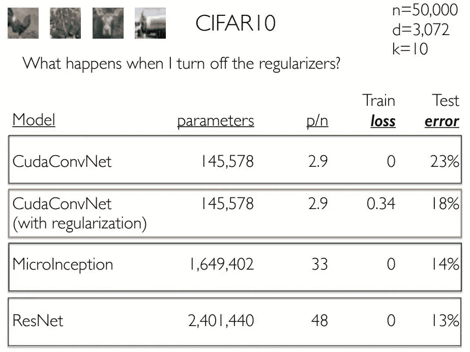

# 深度学习能源前景的起伏

> 原文：<https://towardsdatascience.com/ups-and-downs-of-deep-learning-energy-landscapes-6d5741c12877?source=collection_archive---------20----------------------->

Vincent van Gogh, The Starry Night, 1889, MoMA The Museum of Modern Art

尽管在行业中被广泛采用，但我们对深度学习的理解仍然滞后。

[20]由[21]很好地总结，确定了四个研究分支:

*   **非凸优化**:我们处理一个非凸函数，但是 SGD 有效。为什么 SGD 甚至会收敛？
*   **过度参数化和泛化**:深度神经网络如何避免维数灾难？

> 理论家们一直认为，拥有成千上万个神经元的网络，以及它们之间数量级更多的单独加权连接，应该会遇到一个基本问题:过度参数化*【19】*

*   **深度的作用**:深度如何帮助神经网络收敛？深度和概括有什么联系？[21]
*   **生成模型**:为什么生成对抗网络(GANs)如此有效？我们可以用什么理论性质来稳定它们或避免模式崩溃？[21]

在这一系列文章中，我们将关注两个方面:

1.  损失函数的拓扑分析
2.  最小值的宽度或平坦度

# 1.损失函数拓扑

[1]是一个很好的起点:作者将深度神经网络的经验风险函数与 H-球形自旋玻璃模型联系起来。

自旋玻璃模型似乎是一个非常丰富的研究方向的伟大起点。我们应该走这条路吗？[4]普鲁登斯警告说:

> 这个基于损失函数拓扑的理论图有几个缺点。首先，机器学习的最终衡量标准是泛化精度，而不是最小化损失函数，损失函数仅捕捉模型与训练数据的拟合程度[……]其次，根据经验，较深的最小值比较浅的最小值具有较低的泛化精度

在继续我们关于损失函数拓扑的工作之前，让我们看看什么是极小值的平坦性。

# 2.最小值的平坦性

考虑[5]中讨论的图 X 中的卡通能源景观(经验损失函数)。

robust and non-robust minima [5]

[5]注意，在参数的贝叶斯先验下，比如分别在位置 x_robust 和 x _ non-robust 的固定方差的高斯分布，较宽的局部最小值比右边的尖锐谷具有更高的边缘化可能性。换句话说，[5]指出，位于更宽的局部最小值(如 x_robust)中的参数可能比全局最小值具有更高的损失，应该比那些简单地位于全局最小值的参数概括得更好[9]。

平坦度的定义是什么？[6]概述了宽度(平坦度)的定义。定义包括:

*   一个平坦的最小值作为*权重空间中的一个大的连通区域，其中误差保持近似恒定*【7】
*   着眼于临界点周围损失函数的局部曲率的定义。特别是编码在 Hessian 特征值中的信息(谱范数，迹线)〔5〕
*   局部熵[5]

我发现局部熵的概念在解释极小值的“平坦性”时非常有说服力和教育性。

从实践的角度来看，局部熵控制权重，这是显式正则化所尝试的:权重正则化(衰减)、丢弃和批量范数正则化。

# 平坦度=泛化？

在上一节中，通过查看局部熵，我们试图对定义一个好的解决方案的尝试有一个感觉。关于平面度的最佳定义仍然没有一致的意见。[6]指出

> 然而，当遵循平坦性的几个定义时，我们已经表明，平坦极小值应该比尖锐极小值概括得更好的结论在没有进一步的上下文的情况下不能照原样应用。以前使用的定义没有考虑到一些常用的深层架构的复杂几何结构。特别地，由对称性引起的模型的不可识别性允许人们改变最小值的平坦性而不影响它所代表的函数。此外，误差表面相对于参数的整个几何形状可以在不同的参数化下任意改变。本着[18]的精神，我们的工作表明，需要更加小心地定义平坦度，以避免所研究模型的几何形状退化。这种概念也不能脱离模型或输入空间的特定参数化

换句话说，平坦度的精确定义是一个活跃的研究课题，可以用来建立推广的充分必要条件[17]。

此外，虽然显式优化平坦度可能会有所帮助(正如我们在局部熵的情况下看到的)，但从经验证据来看，DNN 和 SGD 可以完成这项工作，即使没有正则化的太多帮助。

What happens when I turn off regularizers? [16]

这鼓励了对深度学习经验损失函数的拓扑的研究。我们没有浪费时间去理解 Choromanska 等人的工作。H-球形自旋玻璃模型是非常有用的起点，并在深度学习研究人员的工作、统计物理学和随机矩阵理论之间建立了联系。

然而，正如作者自己在[11]中指出的，[1]依赖于相对粗糙的假设。然而，研究继续取得进展:[12]表明，在轻度过度参数化和类丢失噪声的情况下，具有一个隐藏层和分段线性激活的神经网络的训练误差在每个局部最小值处为零。[13]表明，在限制较少的假设下，每个局部最小值都是全局最小值，并且每个不是全局最小值的临界点都是鞍点。[12]和[13]中的结果得到了经验证据:例如，见[14]，其中作者认为*作为一阶特征，我们认为经验风险的景观只是一个(超)盆地的集合，每个盆地都有一个平坦的全局最小值*

Over-parameterization? [15]

**在下一篇文章**中，我们将会看到[12]，[13]以及麻省理工学院的 Tomaso Poggio 的工作([14]，[15])；**我们将尝试在损失函数拓扑研究、极小值平坦性和过度参数化的作用之间建立联系。**

# 参考

[1] Choromanska，Anna 等人，“多层网络的损失表面”*人工智能与统计*。2015，[链接](http://proceedings.mlr.press/v38/choromanska15.pdf)

[2] Torben Krüger，讲义，研究生研讨会:随机矩阵、自旋眼镜和深度学习[链接](https://sites.google.com/site/torbenkruegermath/home/graduate-seminar-random-matrices-spin-glasses-deep-learning)

[3]奥芬格、安东尼奥、热拉尔·本·阿鲁斯和 jiří·切尔内。"随机矩阵和自旋玻璃的复杂性."*纯数学与应用数学通讯*66.2(2013):165–201[链接](https://arxiv.org/pdf/1003.1129.pdf)

[4]张，姚等，“机器学习中的能量-熵竞争与随机梯度下降的有效性”*分子物理*(2018):1–10[链接](https://arxiv.org/pdf/1803.01927.pdf)

[5] Chaudhari，Pratik 等，“熵-sgd:偏向梯度下降进入宽谷” *arXiv 预印本 arXiv:1611.01838* (2016)。[链接](https://arxiv.org/pdf/1611.01838.pdf)

[6] Dinh，Laurent，et al .“ *arXiv 预印本 arXiv:1703.04933*(2017)[链接](https://arxiv.org/pdf/1703.04933.pdf)

[7] Hochreiter、Sepp 和 Jürgen Schmidhuber。“平极小值。”*神经计算*9.1(1997):1–42。[链接](http://www.bioinf.jku.at/publications/older/3304.pdf)

[8] Martin，Charles“深度学习为什么有效:来自理论化学的观点”，MMDS 2016 [链接](http://mmds-data.org/presentations/2016/s-martin.pdf)

[9]] G. E. Hinton 和 D. Van Camp，《第六届计算学习理论年会论文集》(ACM，1993)第 5-13 页。

[10]内里·梅尔哈夫。"统计物理和信息理论."*通信和信息理论的基础和趋势*6.1–2(2010):1–212。[链接](http://webee.technion.ac.il/people/merhav/papers/p138f.pdf)

[11] Choromanska、Anna、Yann LeCun 和 Gérard Ben Arous。"公开问题:多层网络损耗面的景观."*学习理论会议*。2015 [链接](http://proceedings.mlr.press/v40/Choromanska15.pdf)

[12] Soudry，丹尼尔和 Yair Carmon。"没有坏的局部极小值:多层神经网络的数据独立训练误差保证." *arXiv 预印本 arXiv:1605.08361*(2016)[链接](https://arxiv.org/pdf/1605.08361.pdf)

[13]川口健二。“没有可怜的局部极小值的深度学习。”*神经信息处理系统的进展*。2016.[链接](https://pdfs.semanticscholar.org/f843/49b38c61467f3ba8501a3fcff61c87a505e3.pdf)

[14]廖、、托马索·波焦。"理论二:深度学习中经验风险的前景." *arXiv 预印本 arXiv:1703.09833*(2017)[链接](https://arxiv.org/pdf/1703.09833.pdf)

[15]张，，等*深度学习理论 sgd 的泛化性质*。大脑、思维和机器中心(CBMM)，2017 [链接](https://dspace.mit.edu/bitstream/handle/1721.1/107841/CBMM-Memo-067-v3.pdf?sequence=6)

[16]本·雷希特在 ICLR 2017 上的演讲，[链接](https://iclr.cc/archive/www/lib/exe/fetch.php%3Fmedia=iclr2017:recht_iclr2017.pdf)

[17] Sathiya Keerthi，深度神经网络中优化和泛化之间的相互作用，第三届真实世界机器学习年度研讨会，[链接](http://www.keerthis.com/Optimization_and_Generalization_Keerthi_Criteo_November_08_2017.pptx)

[18] Swirszcz、Grzegorz、Wojciech Marian Czarnecki 和 Razvan Pascanu。"深度网络训练中的局部最小值."(2016) [链接](https://pdfs.semanticscholar.org/6496/93b2437378699945d36e8203d79a93454273.pdf)

[19] Chris Edwards，深度学习在噪音中寻找信号，ACM 通讯，2018 年 6 月，第 61 卷第 6 期，第 13-14 页[链接](https://cacm.acm.org/magazines/2018/6/228030-deep-learning-hunts-for-signals-among-the-noise/fulltext)

[20] Sanjeev Arora，走向深度学习的理论理解，ICML 2018 [链接](https://www.dropbox.com/s/qonozmne0x4x2r3/deepsurveyICML18final.pptx?dl=0)

[21] Arthur Pesah，更好理解深度学习的最新进展第一部分[链接](/recent-advances-for-a-better-understanding-of-deep-learning-part-i-5ce34d1cc914)