# 美国警察杀人:数据告诉我们什么

> 原文：<https://towardsdatascience.com/us-police-killings-what-the-data-tells-us-563f8b052452?source=collection_archive---------5----------------------->

## **2015-2016 年警察杀人的探索性数据分析**

Photo by [Spenser Young](https://unsplash.com/@spenseryoung?utm_source=medium&utm_medium=referral) on [Unsplash](https://unsplash.com?utm_source=medium&utm_medium=referral)

# 介绍

在这篇文章中，我们将分析美国最热门的政治话题之一，包括从制度种族主义到执法人员在社会中的角色等问题。但首先，我想请你帮个忙。在接下来的 10 分钟里，让我们把我们先入为主的关于什么是真的观念留在门口。先前的领域知识对于从数据中做出推论是至关重要的。但是，如果我们基于预先存在的信念建立我们的统计模型，我们就不太可能得到正确的答案，而更有可能提出错误的问题。那是我关于统计哲学的演讲。让我们开始吧。

# 背景和目标

由美国自由主义者和自由意志主义者推动、遭到坚定保守派强烈反对的越来越多的观点是，美国有一个有缺陷的执法系统，让太多无辜平民付出了生命代价。美国警察每年杀死大约 1000 人。如果我们将这一数字与芬兰等其他发达国家进行对比，2013 年芬兰警察只开了 6 枪，我们会看到一幅怪诞的画面。但是如果我们看看[其他暴力犯罪和凶杀水平相似的国家](https://www.economist.com/international/2018/03/08/in-some-countries-killer-cops-are-celebrated)，情况会变得更加模糊。在这个项目中，我们将把我们的范围限制在分析美国境内的警察杀人事件，并试图根据导致杀人的警察遭遇的数据得出有用的见解。事不宜迟，我们来挖掘一下数据。

# 使用的数据集

我们在这个项目中使用了 5 个数据集:
1)2016 年的警察杀人数据集
2)2015 年的相同框架数据集
3)2015 年 1 月至 6 月的数据集，其数据点少于 2)但事件的信息特征更多
4)2015 年美国各州人口和暴力犯罪事件数据集
5)包含 1000 多个美国城市统计数据的数据集

前两个是由英国报纸《卫报》的一个项目“统计的”编辑的。第三个由内特·西尔弗的[五三八](https://fivethirtyeight.com/)编辑。我从网站上收集了这三样东西，卡格尔。我自己定制了州人口的第四个数据集，减少了联邦调查局汇编的数据。第五组城市统计数据来自 www.simplemaps.com 的 T4。你可以在我的 [GitHub 库](https://github.com/nadir2115/US-Police-Data-2015-16)上找到所有这些文件。

# 预处理:数据清理和特征工程

该项目将于 [R](https://www.google.com/search?q=R+project&oq=R+project&aqs=chrome..69i57j69i61l3j69i60l2.5039j0j7&sourceid=chrome&ie=UTF-8) 完成。数据可视化是 R 的主要优势之一，在这种分析中非常方便。我的编程脚本和情节在 GitHub 上公开。

**合并数据集:**我们使用的前两个数据集来自同一个来源，因此将它们合并在一起只需要一行代码。第三个数据集虽然相似，但来自不同的来源，因此我们需要解决其中的差异。尽管它拥有前两个版本的所有功能，但其中一些功能的命名略有不同。这一张还有其他特征，涉及发生杀戮的地区/区域的人口统计细节。我们不是试图将所有三个数据集合并在一起，而是将前两个数据集的较大合并数据集用于我们的大多数可视化，并在查看人口统计数据时专门使用第三个数据集。第四和第五组数据也将用于比较不同的州和城市在警察杀人方面的差异。

**删除和转换特征:**我们删除了 ID、姓名和街道地址等识别特征，因为它们对于每个案例几乎都是唯一的，不允许我们得出任何一般化的结论。我们还删除了日期功能:年、月和日。我检查以确保这些变量是均匀分布的，因此我们不会丢失任何有价值的信息。对于扩展特征数据集，我们还删除了任何用作发生凶杀的县/地区的名称/ID 的特征。这些值对于每个事件来说也是唯一的，并排除了一般趋势。我们确实留下了位置特征，例如城市、州、纬度和经度。当我们加载数据集时，这些要素中的许多以错误的格式导入到我们的数据框中。因此，我们必须手动检查数据集摘要，以确保数字特征确实保存为数字信息，分类特征保存为因子等，并在它们不正确时将其转换为正确的格式。

**缺少值和数据子集**:一小部分数据点缺少一些特征的值，比如经度和纬度。但是，当我们试图可视化某些特征时，与其将这些数据点从我们的数据框架中完全移除，不如相应地使用数据框架的子集来省略特定的数据点更有意义。

**特征提取:**接下来我们添加一些新的特征。我们将特征区域添加到我们的数据集中。根据谋杀发生的州，我们将数据点分配到美国的四个地区之一:西部、南部、中西部和东北部。我们还添加了另一个功能，年龄组，将死者分成不同的年龄组。

调整我们的特征后，我们的 5 个数据集具有以下特征:

***A)具有扩展特征的 2015 年数据集- 467 起杀戮*** *1)年龄-死者年龄
2)性别-死者性别
3)种族-种族/死者种族
4)城市-事件发生的城市
5)州-事件发生的州
6)纬度-纬度，从地址地理编码
7)经度-经度， 从地址地理编码
8)执法机构-事件涉及的机构
9)原因-死亡原因
10)持有武器-死者如何/是否持有武器
11)地区-事件发生的美国地区
12)年龄组-死者所属的年龄组
13)份额 _ 白人-非西班牙裔白人人口的份额
14)份额 _ 黑人-黑人人口的份额， 不合并)15)份额 _ 西班牙裔-西班牙裔/拉丁裔(任何种族)人口的份额
16)p _ 收入-地区级个人收入中值
17)h _ 收入-地区级家庭收入中值
18)县收入-县级家庭收入中值
19)贫困率
20)尿酸-地区级失业率
21)大学-25+人口的份额与 BA*

***B)2015–16 数据集- 2226 杀戮-***

*数据集 A 的特征 1-12*

***C)*******2015 年各州数据集*** *-
1)各州 ID
2)人口
3)2015 年暴力犯罪事件**

****D)城市数据集*** *1)城市
2)州 ID
3)州名
4)人口
5)人口规模
6)人口密度**

# ***分析:地理可视化&地图***

*首先，我们将比较不同的州，然后看看警察杀人最多的城市。*

*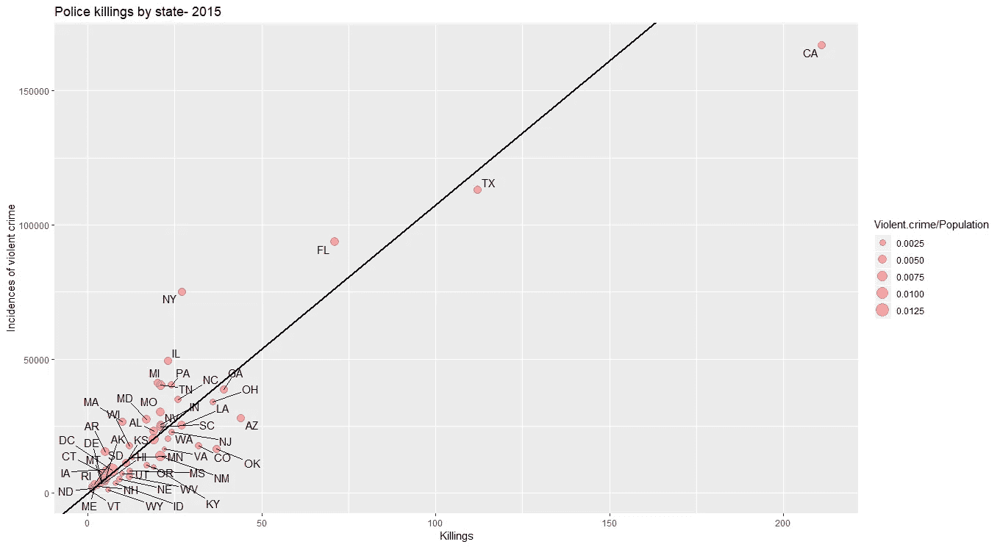*

*y 轴代表 2015 年每个州的暴力犯罪数量，x 轴代表同一时期该州的警察杀人数量。这条直线穿过原点，它的梯度是美国的暴力事件总数除以杀人总数。在大多数情况下，这两个因素是成比例的，但也有异常值。俄克拉何马州、亚利桑那州和加利福尼亚州(在这两个统计数据中均领先一英里)的警察杀人率高得不成比例，这是由暴力事件造成的。另一方面，与暴力事件相比，纽约的杀人率低得不成比例。鉴于暴力事件与一个州的人口成比例，如果我们要为每个州的人口、暴力事件和杀戮创建一个 3D 散点图，我们会看到类似于穿过 3D 平面的直线的东西(它在我的 R 脚本中，但为了简单起见，我没有包括它)。*

*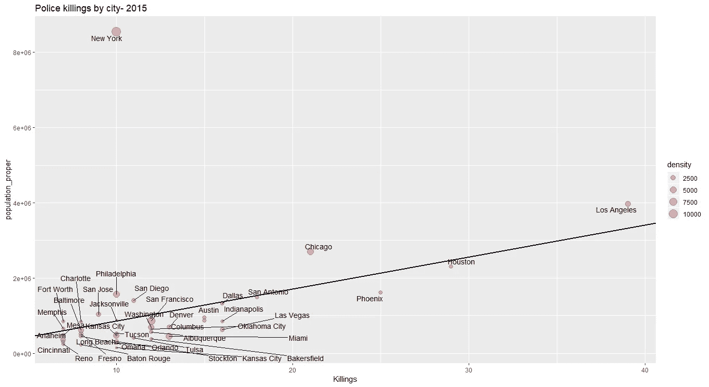*

*我们为 2015 年发生 10 起或更多警察杀人事件的城市绘制了类似的图。这次我们用城市的[人口(适当)](https://en.wikipedia.org/wiki/City_proper)代替了暴力事件，我们仍然观察到类似的相关性，这并不奇怪，因为暴力犯罪事件通常也与城市人口成比例。纽约市比纽约州更是一个异数，就其人口而言，谋杀率低得不成比例。接下来，我们将在地块上放置一些地图，以便更好地显示位置。*

***地图方法-** 对于所有的地图可视化，我们将使用 2015 年至 2016 年的大型数据集，并忽略阿拉斯加州和夏威夷州的杀戮，因此我们可以在地理上放大以查看更精细的细节。尽管遗漏了这两个州，我们仍然报道了美国 99%的谋杀案，所以我们没有遗漏太多信息。对于我们的地图，我们将利用 r 中的" [ggplot2](https://cran.r-project.org/web/packages/ggplot2/ggplot2.pdf) "库。虽然这些绘图也可以使用" [ggmap](https://cran.r-project.org/web/packages/ggmap/ggmap.pdf) "库来完成，但我使用了" [ggplot2](https://cran.r-project.org/web/packages/ggplot2/ggplot2.pdf) "和" [sf](https://cran.r-project.org/web/packages/sf/index.html) "库的组合。如果你是一个有抱负的数据科学家，我强烈建议你学习如何充分利用这些 R 库。*

*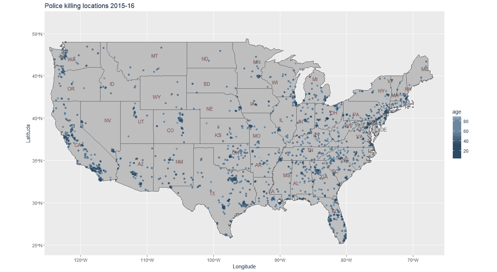*

*对于第一张地图，我们正在查看 2015 年至 2016 年期间的所有警察杀人事件，圆点阴影表示死者的年龄。如果你注意到肯塔基、田纳西、弗吉尼亚和北卡罗来纳地区的点，似乎那些在那里被杀的人比其他地方被杀的人年龄稍大。第二个观点，如果你熟悉美国地图的话，应该很明显，那就是杀戮集中在城市，越大的城市越集中。这没什么好惊讶的。如果你看到下面的美国人口热图，你会注意到这两张图看起来有些相似。*

*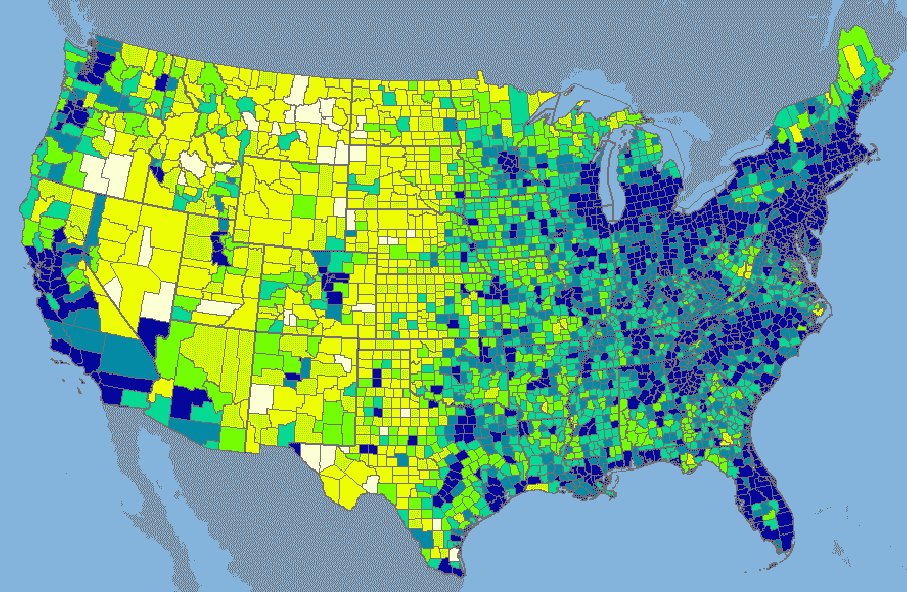*

*Heat map representing US population density*

*现在让我们来看一个更小的数据子集，它只包含手无寸铁时被杀的人。这将是 389 人，或大约 17.4%的人在这两年中被杀害。*

**

*如果这些数据代表了现在仍在发生的事情，那么杀害手无寸铁的人似乎也是美国的一个普遍问题。枪击似乎也是这里死亡的主要原因(2015 年至 2016 年，枪击造成了超过 90%的死亡)，羁押中死亡是第二大死亡原因。现在，让我们来研究一下种族/民族因素是如何影响这一情况的。*

***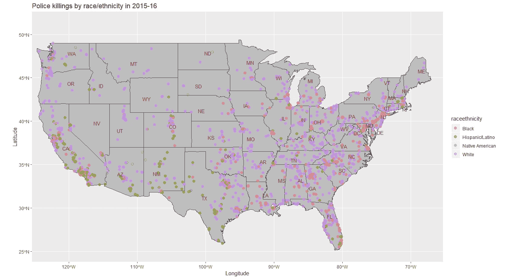*

*第一张地图涵盖了数据集中所有 8 个种族/族裔类别的杀人案件。但是因为群太多，有点难跟。因此，我们将我们的数据集子集化，只包括那些被杀害的“黑人”、“白人”、“西班牙裔/拉丁裔”或“土著美国人”。通过这样做，我们仍然保留了 95%以上的数据点，并获得了更清晰的视觉效果。似乎被杀害的白人遍布全国大部分地区。在巴尔摩、DC 和芝加哥犯罪猖獗的地区，黑人似乎占了死者的绝大部分。可以理解的是，西班牙裔/拉美裔在西班牙裔/拉美裔人口密集的州，如加利福尼亚、新墨西哥和得克萨斯州，占了更多的死者，也占了墨西哥边境城镇的大多数死者。南加州似乎是上述三个种族/民族的密集结合。印第安人的死亡似乎集中在亚利桑那州和新墨西哥州的印第安人保留地附近。*

# *分析:条形图和直方图*

*停留在种族/民族的话题上，让我们快速地看一下不同的民族和种族是如何随着年龄而不同的。*

**

*遇害的阿拉伯裔美国人的平均年龄最低，而那些被归类为“未知”的人的平均年龄最高。但是这些群体没有大量的数据点。因此，让我们把注意力集中在构成大部分(几乎 95%)数据集的 3 个群体上:黑人、白人和西班牙裔/拉丁裔。我们可以看到这里也有明显的差异，所以让我们用一些直方图更深入地了解一下。*

*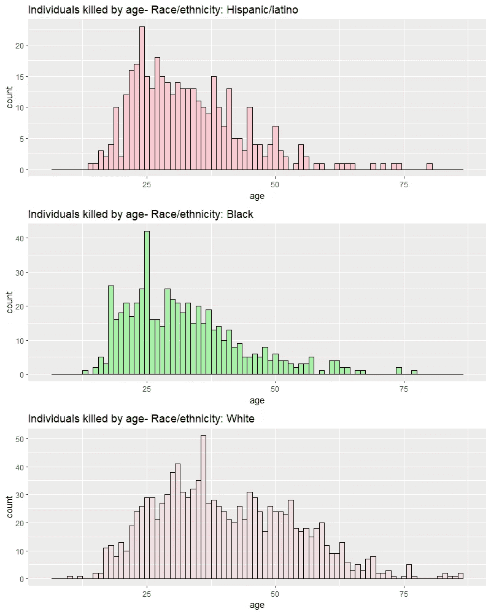*

*被杀害的西班牙裔/拉美裔人的年龄往往低于被杀害的白人，黑人的平均年龄最低。白人、西班牙裔/拉美裔和黑人的平均年龄分别为 38 岁、31 岁和 30 岁。然而，值得注意的是，这些群体的平均年龄分别为 42.9 岁、28.1 岁和 33.3 岁。这至少解释了为什么被杀害的白人群体的平均年龄最高。白人图表的尾端也延伸到更老的年龄，但可以理解的是，他们有更多的离群值，因为他们占了数据集的一半以上。同样值得注意的是，美国西班牙裔/拉美裔的中值年龄下降是因为他们社区的很大一部分是第一代移民，他们往往比美国的平均年龄更年轻。他们也倾向于比其他两个群体拥有更多的孩子。*

*继续谈论年龄这个话题，让我们来看看美国不同地区的情况是如何不同的，并通过更多的因素来缩小范围。*

**

*很难通过该图得出关于年龄和地区的结论，因为柱状图并不意味着显示实例的数量，而是侧重于按百分位数的细分。但是看起来(如果你检查一下数据就会发现)在中西部和西部死亡的人的年龄比在东北部和南部死亡的人要低。在所有地区，被杀害的持刀者的年龄都高于其对应部分(假设我们排除一小部分携带车辆的人，“其他人”，或案件“有争议”的人)。*

*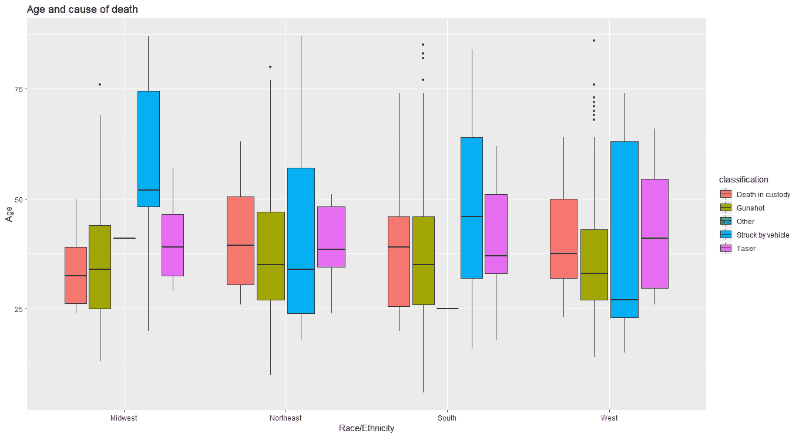*

*枪击似乎是 90%以上案件的死因，确切地说是 2021/2226 起案件。除中西部地区外，所有地区在羁押中被杀者的年龄中位数(这是第二大死亡原因，共 82 起)都略高于被枪杀者。有趣的是，根据箱线图的上四分位数，死者被车辆撞击的案例涉及老年人。虽然他们只收集了一小部分数据，但这些病例数量巨大(总共 49 例，4 个地区各至少 9 例)。*

*让我们从我们在 538 数据集上找到的额外信息开始，按收入进行细分。请注意，这只是 2015 年 1 月至 6 月间死亡的不到 500 人的信息。首先，让我们看看收入。*

*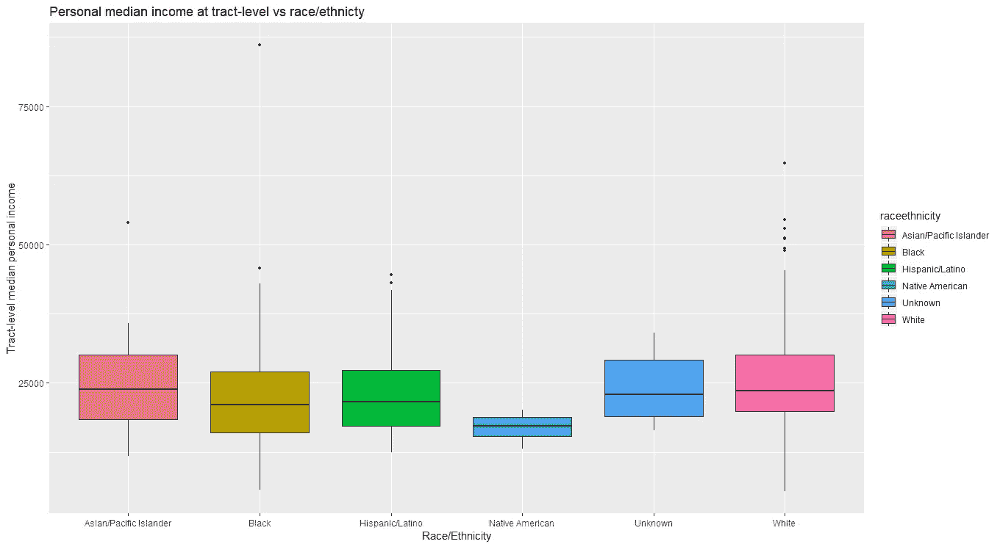**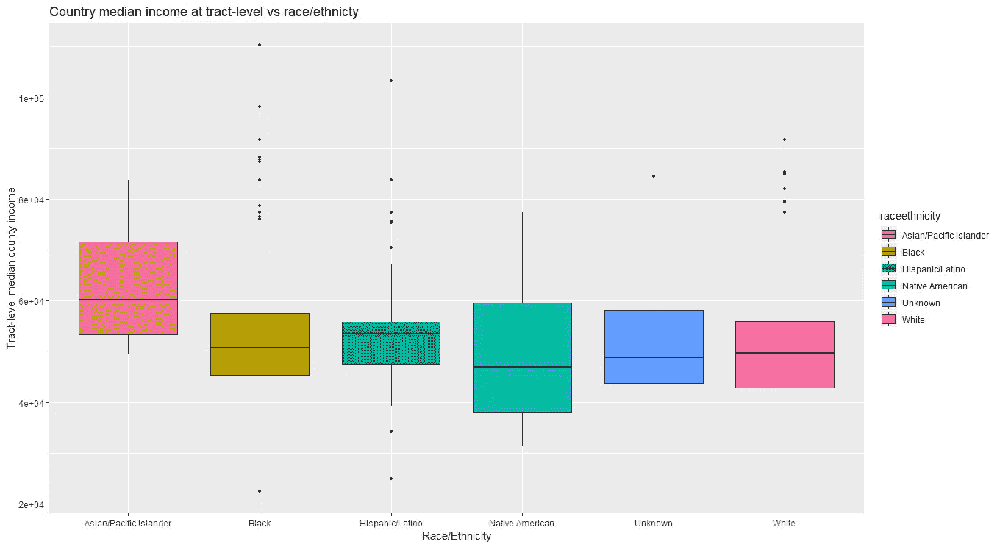**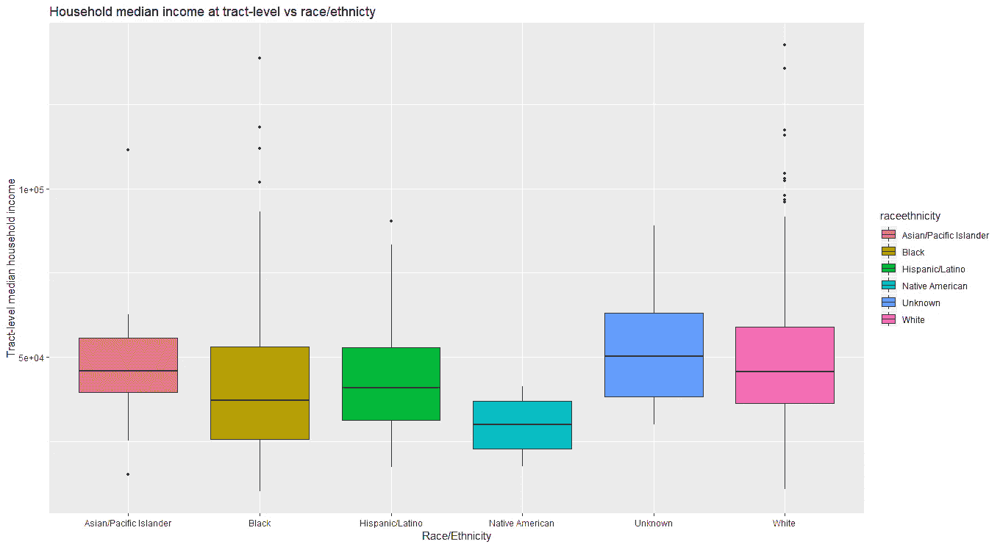*

*这里需要注意的重要一点是，这些收入**不是被杀害的个人的**，而是居住在发生杀戮的地方的人们的收入。用消息来源的话说，“人口普查区域是通过使用 Bing 地图和 Google Maps APIs 将地址地理编码为纬度/经度，然后将点叠加到 2014 年人口普查区域上来确定的”。然而，我们确实看到了一些模式，表明相当数量的死者是在代表死者种族背景的县/市/地区被杀害的。在所有收入类别中，杀害土著美国人发生在收入最低的地区，而亚裔美国人则处于另一端。根据[维基百科](https://en.wikipedia.org/wiki/List_of_ethnic_groups_in_the_United_States_by_household_income)，2018 年每个种族/族裔的家庭收入中位数如下:*亚裔-80，720，白人- 61，349，夏威夷土著和其他太平洋岛民-57，112，西班牙裔或拉丁裔(任何种族)-46，882，美洲印第安人和阿拉斯加土著- 39，719，黑人或非裔美国人- 38，555* 。有趣的是，美洲原住民的收入似乎比黑人高。但是根据杀人事件的数据，美国原住民在低收入地区被杀的人数比黑人多。在许多其他事情中，这可能表明，要么许多黑人在没有黑人家庭占主导地位的社区被杀害，要么当土著美国家庭被归类为与土著阿拉斯加人相同的群体时，他们的国民收入得到了提高。为了更好地理解它，我们将偏离这个项目范围之外的数据，所以我将把这个任务留给那些好奇的人。值得注意的是，我们看到的分类中值收入都明显低于任何种族/民族的全国中值收入。对于我们的数据集，杀戮发生在中等家庭收入为 42，759 美元的地区。美国 2018 年家庭收入中值为 57112 美元。2015 年至 2016 年，不到 24%的警察杀人事件发生在家庭收入高于全国中位数的人口普查区。如果我们 2015-16 年的数据代表了美国警察杀人的总体情况，那么杀人事件更有可能发生在贫困地区。让我们来看看这些地区的贫困率。*

*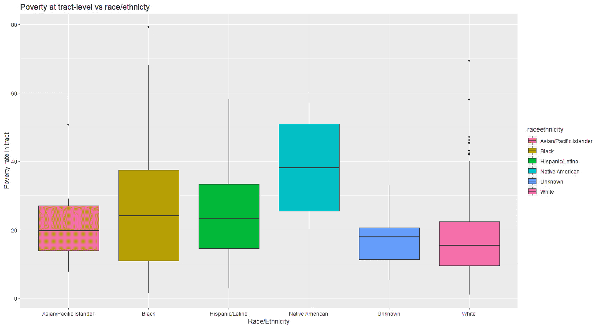*

*类似的收入模式在小块土地上的贫困率中也可以看到，美洲原住民在最贫困的地方被杀害。众所周知，印第安人保留地的贫困率为 28.4 %，而所有印第安人的贫困率为 22%。这两个数字都远高于 12.7%的全国贫困率。现在让我们转到发生杀戮的地方的种族/民族人口统计。*

*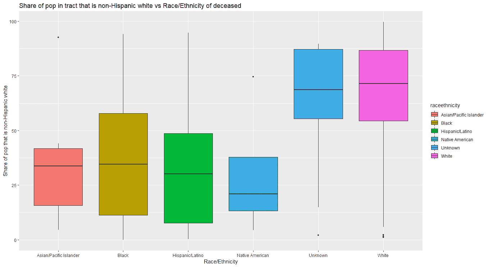**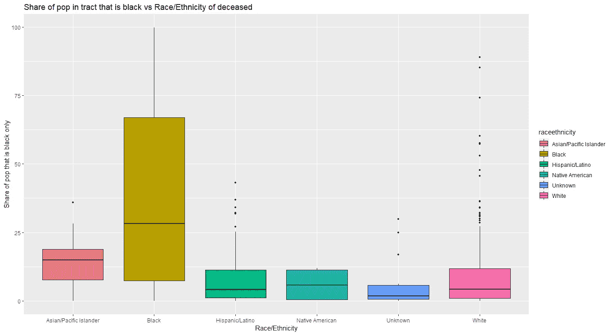**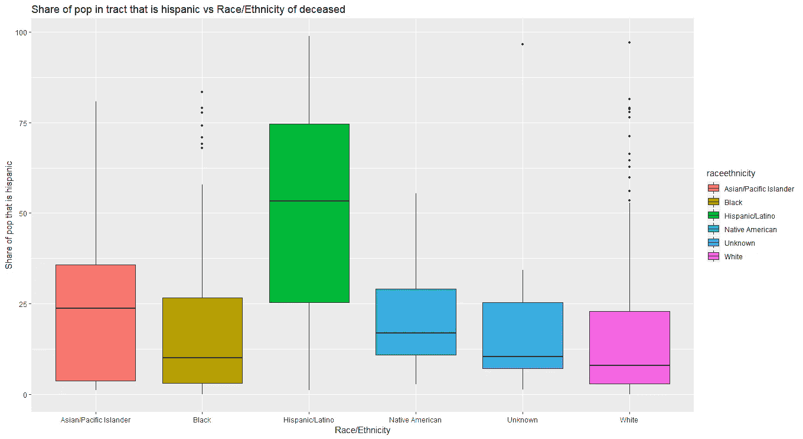*

*超过 75%的白人死者是在非西班牙裔白人占 50%以上的社区被杀害的。据报道，黑人和西班牙裔/拉丁裔在他们各自的种族/民族背景的人比你在美国普通社区中发现的人占人口的比例相对较大的社区中也被杀害。*

*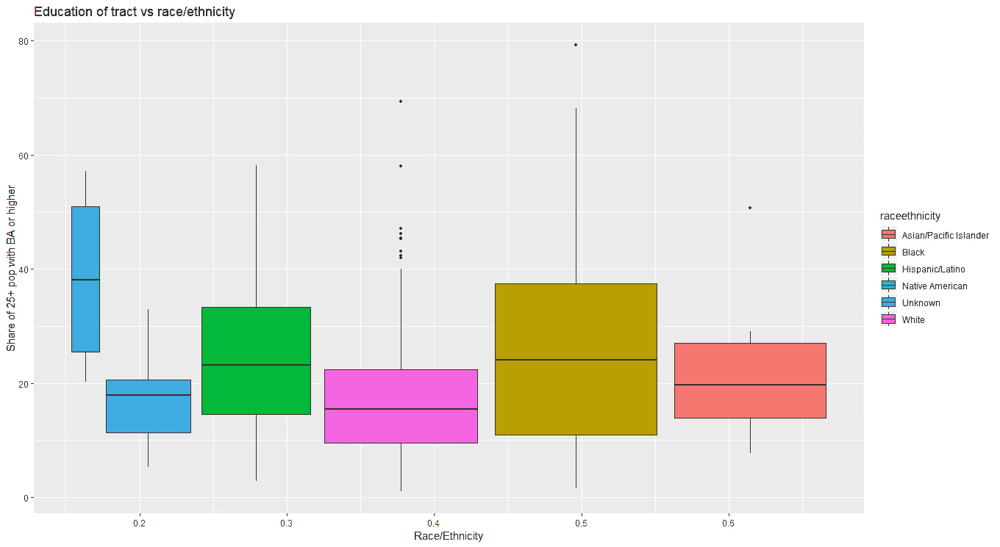*

*这个更有趣一点。看起来像是，出于某种原因，据报道，美洲原住民是在受教育程度较高的人群中被杀害的，而不是他们的同类。更有趣的是，如果我们看看黑人和西班牙裔被杀地区的大学教育水平，他们分别排在第二和第三位。我个人想不出好的假设来解释这种现象。如果你有答案，请随时告诉我。*

*现在，让我们离开该地区的人口统计数据，回到我们最初的 2015 年至 2016 年的一些堆积条形图数据集。在接下来的两个情节中，我们将探索一个我们还没有看到的特征，年龄组。*

*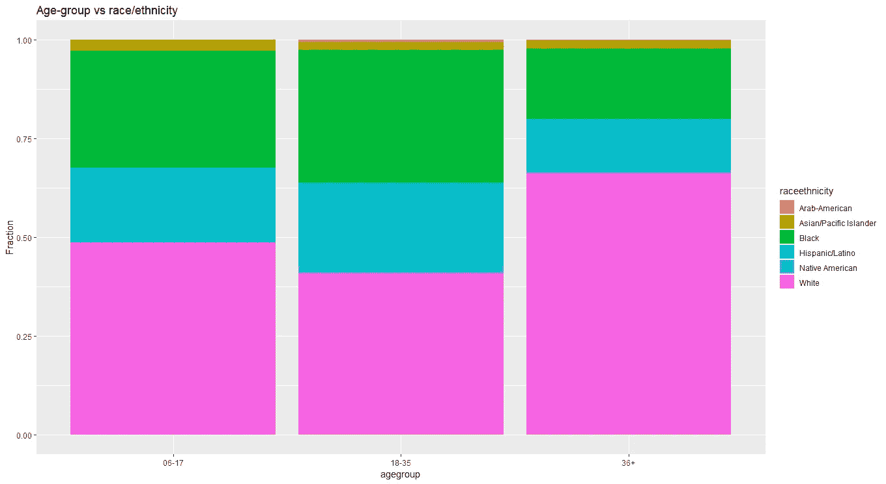***

*在讨论这两个图之前，我们应该注意到 38 名死者据报道年龄在 18 岁以下，而其他 2 个年龄组每个都有超过 1000 个数据点。由于 18 岁以下年龄组的数据样本量要小得多，因此从这个年龄组得出的推论比从其他两个年龄组得出的推论更不可能代表整个人口中发生的情况。话虽如此，让我们来看看图表。直觉上，年龄最大的一组白人比例最高是有道理的。在美国的老年人群中，白人的比例往往比 T2 人高。第二个挺有意思的。在这三个年龄组中，被杀害的未成年人携带武器或刀具的比例最低。18 岁以下年龄组的被杀者手无寸铁的比例也最高(26.3%)。请注意，这里没有足够的信息来得出这些统计数据反映了总体情况的结论。但是如果进一步分析发现它们具有代表性，就有理由担心了。*

**

*在上面的剧情中，我们看到了被不同地域杀死的人的“武装”状态。值得注意的是，每个地区被杀者中手无寸铁的比例高得惊人，不同地区之间的比例从 16.9%到 18.5%不等。*

*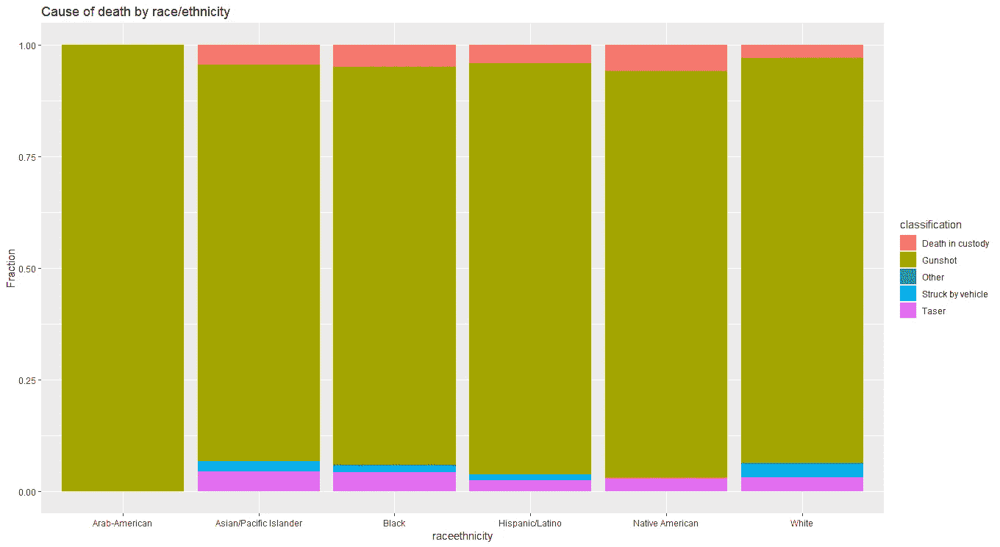*

*枪击似乎造成了每个种族的绝大多数死亡。第二大死因似乎更有趣一些。白人在羁押中的死亡率最低(不包括被杀害的 7 名阿拉伯裔美国人)，而印第安人的死亡率最高。下一个情节也很有趣。*

*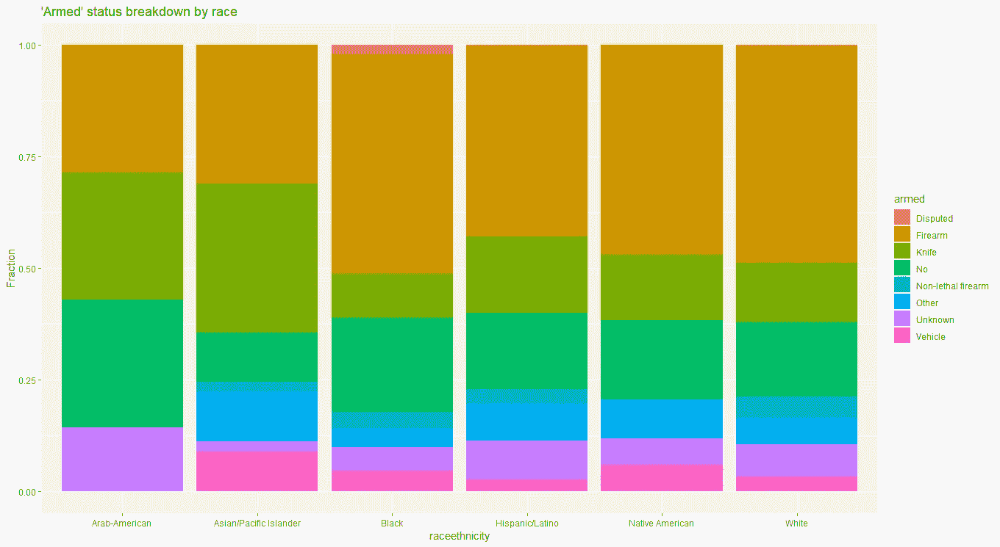*

**如果我们假设*我们的数据代表了当今警察杀人的总体趋势，那么被杀的黑人比其他任何种族/民族更有可能携带枪支(本案中有 49.1%)。这也意味着他们比其他种族/民族群体更不容易在被杀时持刀。更有趣的是，如果我们排除 7 名阿拉伯裔美国人，这将意味着黑人比任何其他种族/族裔群体更有可能在被杀时手无寸铁(2015-16 年被杀的黑人中有 20.9%没有武器)。这些见解，如果是真的，可以联系到备受争议的讨论，将黑人与拥有枪支联系起来的刻板印象是否会导致更多手无寸铁的黑人被杀。这使得一个完美的赛格威进入我们项目的下一部分。*

*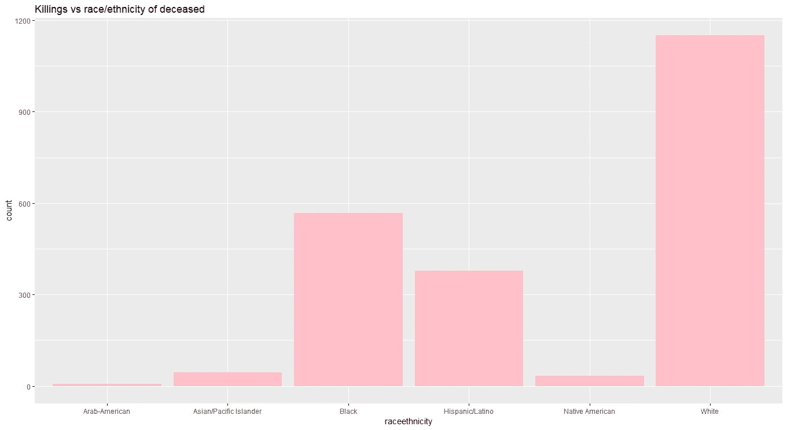*

# *讨论-理解种族偏见*

*为了给上面的图表提供数字，下面是 2015 年至 2016 年杀人总数的种族/民族汇总:*

****2015-16 警察杀害死者种族/民族:
-*** *阿拉伯裔美国人-7
-亚裔/太平洋岛民-45
-黑人-568
-西班牙裔/拉丁裔-378
-美洲原住民-34
-其他-1
-不详-43
-白人- 1150**

*你可能会注意到，黑人在死者中占了不成比例的大部分(超过 25%)，而在美国总人口中仅占 12%。然而，试图纯粹基于这些统计数据找到有意义的结论将意味着我们忽略了它们背后的混杂因素。根据这份 [FBI 报告](https://www.bjs.gov/content/pub/pdf/VIOCRM.PDF)，黑人男性的杀人率比白人男性高 8 倍。一个统计学新手可能会过早地得出结论，认为高犯罪率是黑人高死亡率的原因。但是，再一次，基于这样的零星数据得出关于种族/民族的结论不仅是不正确的，而且是危险的无知。我们将打破观察研究的黄金法则:**相关性不等于因果关系**。贫困率、教育背景和社会经济地位等更深层次的混杂因素可以更好地预测群体中的暴力犯罪事件。*

***如果你不确定什么是混杂因素，就去读读* [*这个*](https://en.wikipedia.org/wiki/Confounding) *。这是一个既影响研究中的自变量又影响因变量的变量，如果不对其进行平衡，会导致研究人员得出错误的结论。例:吸烟者很可能喝咖啡，也很可能患胰腺癌。但是，如果一项调查喝咖啡影响的研究没有消除吸烟的影响，我们可能会错误地得出结论，喝咖啡会导致胰腺癌***

*如果我们有更多关于死亡个体的人口统计信息，我们将能够平衡几个混杂因素，并得出更好的结论。但是我们没有。这让我们面临一个最大的障碍:缺乏数据。没有一个全面跟踪所有警方互动的系统的问题是，我们只能获得导致杀戮的互动数据，即使这样，我们也只能获得不完整的数据。如果我们有关于警察与不同种族/民族的人有多少次互动的数据，以及其中有多少百分比导致了暴力/杀戮，我们就能更好地发现警察的偏见。目前，此类实例的数据只有在拥有数据的部门选择发布时才可用。那些选择这样做的部门可能根本不能代表美国警察部门的平均水平。正如你最近可能听说的，联邦调查局[计划从 2019 年开始收集所有涉及警察使用严重暴力的案件的数据。在某种程度上，这种变化将允许更好的分析。但是，从警察局获得所有这些数据可能仍然不能给我们想要的直接答案。这是因为我们无法通过实验室环境下的随机试验找到确切的答案。在观察性研究中，我们必须确保消除所有的混杂因素，比如我前面提到的那些。这并不容易做到，因为可能有我们甚至没有想到的混淆因素。](https://www.cbsnews.com/news/fbi-to-begin-collecting-national-police-use-of-force-data/)[用研究警察偏见的心理学家和神经学家基思·佩恩](https://fivethirtyeight.com/features/why-are-so-many-black-americans-killed-by-police/)的话说，“很难从经验上区分贫困、地理、种族、种族偏见和警察策略的影响”。*

# ***结论***

*虽然最后一段提到的复杂性可能会让我们这些试图找到这个令人不安的问题的结论的人感到有点沮丧，但我们有理由充满希望。即使有当前的限制，我们也能够对这个问题形成重要的见解(就像我们在这个项目中提出的那样)。我将以最后一个想法来结束这篇文章。我相信只有两件事让我们无法找到正确的答案。首先是足够的数据，我们正在缓慢但稳步地实现这一目标。第二是有更多好奇的人愿意看这些数据并提出正确的问题。这个小组可能由像**你、**是的，你这样的人组成，如果你已经在文章中提到了。*

**感谢你到目前为止的阅读。我希望这篇文章教会你一些新的东西，无论是关于 R 的探索性数据分析还是关于美国警察暴力的问题。如果你认为这对你认识的其他人来说是有趣或有教育意义的，请与他们分享。如果你喜欢这篇文章，并有什么想和我分享的，请随时发表评论，通过电子邮件联系我，地址是 nadir.nibras@gmail.com 或 https://www.linkedin.com/in/nadirnibras/*[T5](https://www.linkedin.com/in/nadirnibras/)*。我致力于改进我的方法、分析或数据集，所以如果你有任何建议，请随时评论或告诉我。如果你想关注我在数据科学方面的更多工作，请在 Medium 和 Linkedin 上关注我。
此外，如果你是数据科学或其在理解世界中的应用的粉丝，请联系我。和其他统计爱好者聊天总是很有趣，我很乐意在有趣的项目上合作:)**