# 用 AWS Glue 和 Databricks Spark-XML 处理 XML

> 原文：<https://towardsdatascience.com/use-aws-glue-and-or-databricks-spark-xml-to-process-xml-data-21eaef390fda?source=collection_archive---------2----------------------->

## 快速介绍 Glue 和一些 XML 处理技巧，这从来都不容易

如果您对数据的质量和结构有严格的规定，使用非结构化数据有时会很麻烦，可能会包括对数据进行控制的**庞大的**任务。

在本文中，我将分享我使用 Glue transformations 和 Databricks Spark-xml 库处理 XML 文件的经验。

AWS Glue 是 AWS 提供的 ETL 服务。它有三个主要组件，即数据目录、爬虫和 ETL 作业。因为爬虫帮助你提取你的数据的信息(模式和统计)，数据目录被用于集中的元数据管理。使用 ETL 作业，您可以使用 Glue proposed 脚本或带有附加库和 jar 的自定义脚本来处理存储在 AWS 数据存储上的数据。

XML…首先，您可以使用 Glue crawler 来探索数据模式。由于 xml 数据大多是多级嵌套的，所以爬行的元数据表将具有复杂的数据类型，如结构、结构数组……并且您将无法使用 Athena 查询 xml，因为它不受支持。所以有必要将 xml 转换成平面格式。要展平 xml，您可以选择一种简单的方法来使用 Glue 的魔法(！)，一个简单的技巧将其转换为 csv 格式，或者您可以使用 Glue transformations 来展平数据，稍后我将对此进行详细说明。

您需要小心展平，这可能会导致空值，即使数据在原始结构中是可用的。

我将给出一个替代方法的例子，根据您的用例选择哪一个取决于您。

*   爬网 XML
*   使用粘合作业转换为 CSV
*   使用 Glue PySpark 转换来展平数据
*   另一种方法是:使用 Databricks Spark-xml

数据集:【http://opensource.adobe.com/Spry/data/donuts.xml 

代码片段:[https://github.com/elifinspace/GlueETL/tree/article-2](https://github.com/elifinspace/GlueETL/tree/article-2)

0.将数据集上传到 S3:

从给定的链接下载文件，并转到 AWS 控制台上的 S3 服务。

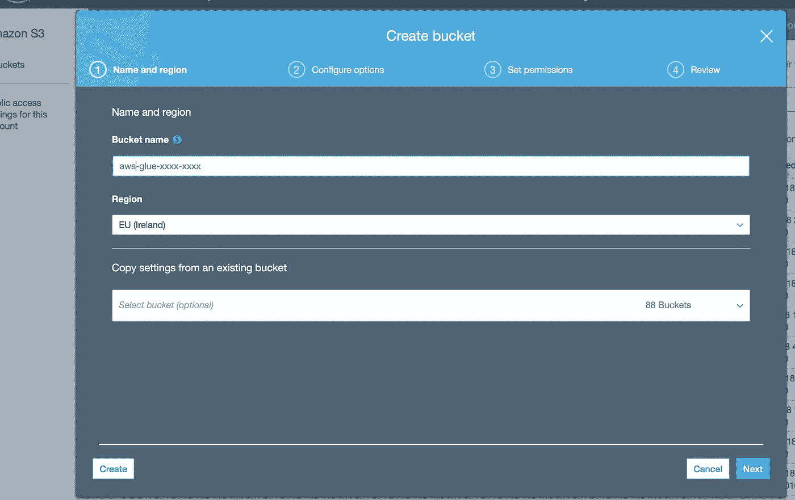

Create a bucket with “aws-glue-” prefix(I am leaving settings default for now)

单击 bucket 名称，然后单击 Upload:(这是最简单的方法，您也可以设置 AWS CLI 以从本地机器与 AWS 服务交互，这需要更多的工作，包括安装 AWS CLI/配置等。)

点击添加文件，选择你想上传的文件，然后点击上传。

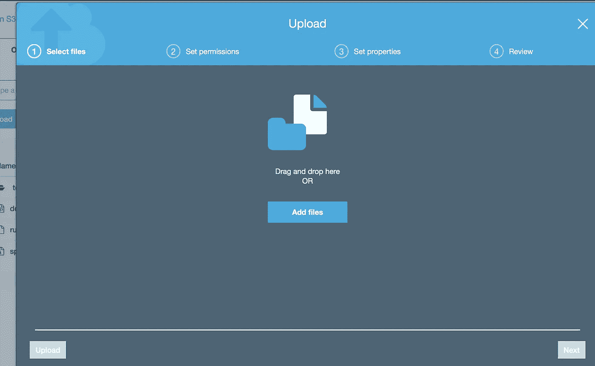

You can setup security/lifecycle configurations, if you click Next.

1.  爬网 XML 元数据

首先，如果您知道 xml 数据中的标记可以选择作为模式探索的基础级别，那么您可以在 Glue 中创建一个定制的分类器。如果没有自定义分类器，Glue 将从顶层推断模式。

在上面的 xml 数据集示例中，我将选择“items”作为我的分类器，并像下面这样轻松地创建分类器:

转到 Glue UI，单击数据目录部分下的分类器选项卡。

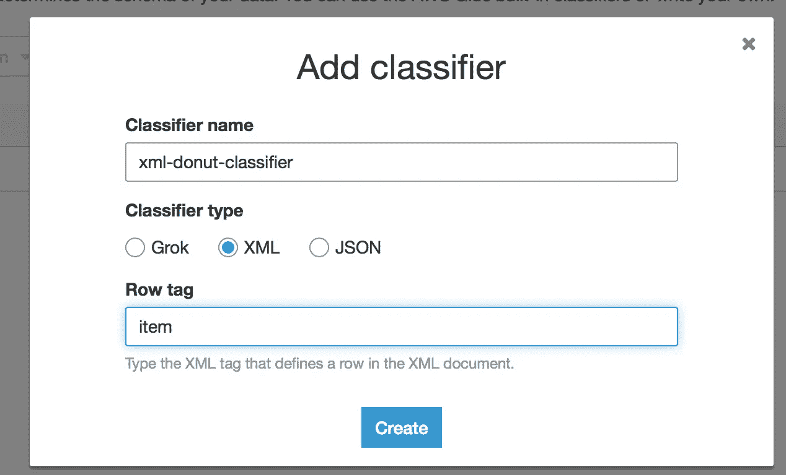

“item” will be the root level for the schema exploration

我用分类器创建了爬虫:

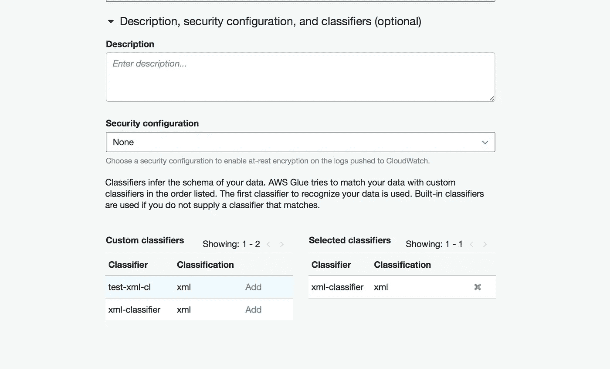

Give the crawler a name and Select the classifier from the list

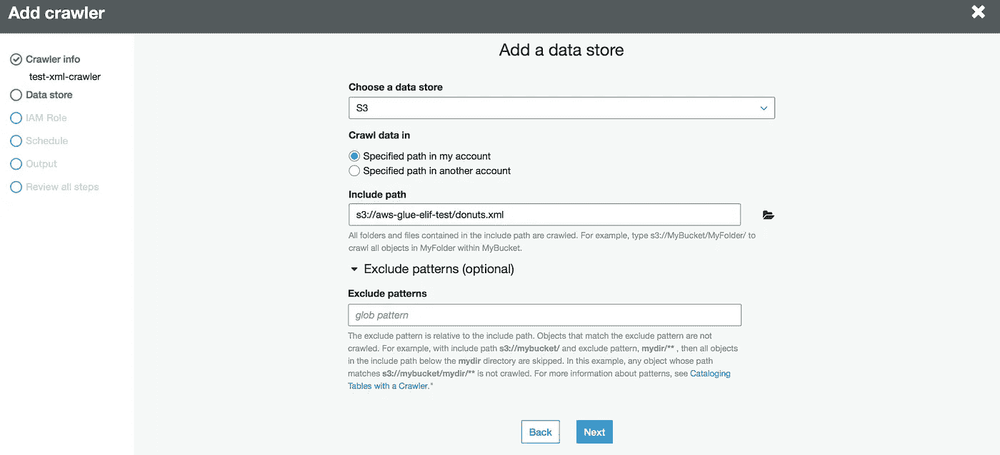

Leave everything as default for now , browse for the sample data location (‘Include path’)

添加另一个数据存储:否

您可以在 S3 存储桶上使用具有相关读/写权限的 IAM 角色，也可以创建一个新角色:

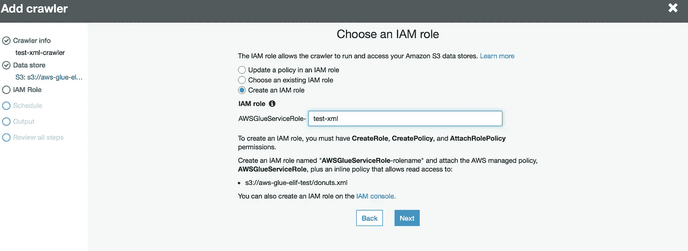

频率:按需运行

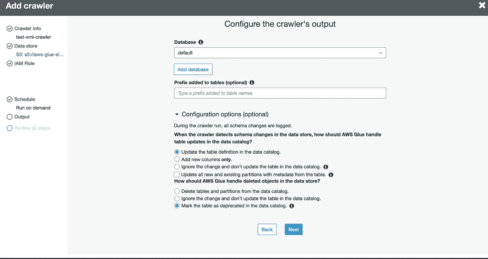

Choose the default db(or you can create a new one) and leave settings as default

查看并单击完成。

现在我们已经准备好运行爬虫了:选择爬虫并点击 Run Crawler，一旦状态为“ready ”,访问数据库部分并查看数据库中的表。

(Tables added :1 means that our metadata table is created )

转到表并过滤您的数据库:

单击表名，输出模式如下:

现在我们有了模式的概念，但是我们有复杂的数据类型，需要将数据扁平化。

2.转换为 CSV:

这很简单，我们将使用 Glue 提供的脚本:

转到 ETL 菜单中的作业部分并添加作业:

Name the job and choose the IAM role we created earlier simply(make sure that this role has permissions to read/write from/to source and target locations)

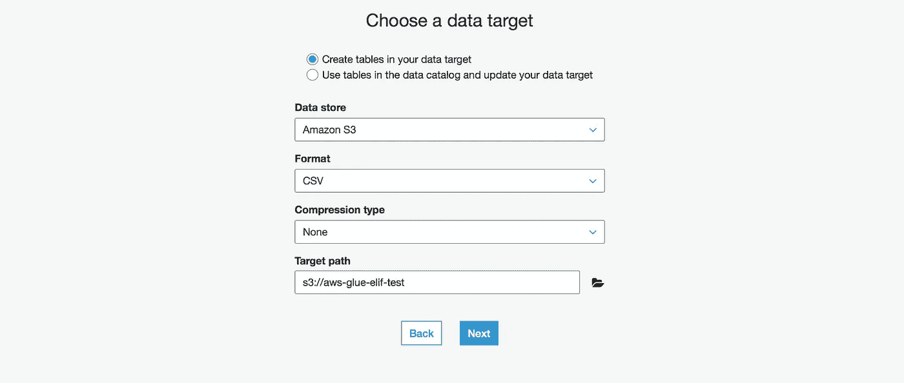

Tick the option above,Choose the target data store as S3 ,format CSV and set target path

现在是神奇的一步:(如果我们选择 parquet 作为格式，我们将自己进行展平，因为 Parquet 可以有复杂的类型，但对于 csv 来说，映射很容易显示。)

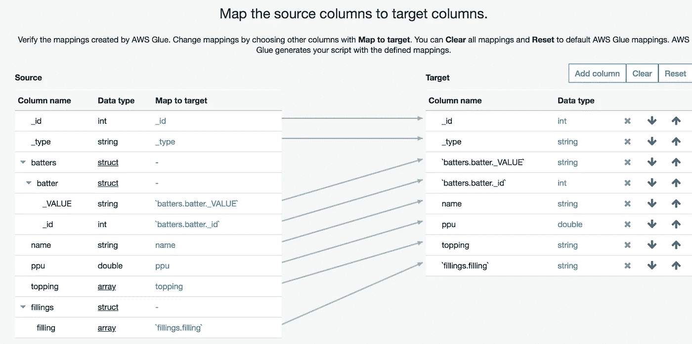

You can rename, change the data types, remove and add columns in target. I want to point that the array fields mapped to string which is not desirable from my point of view.

我把一切都保留为默认，审查，保存并继续编辑脚本。

粘附建议的脚本:

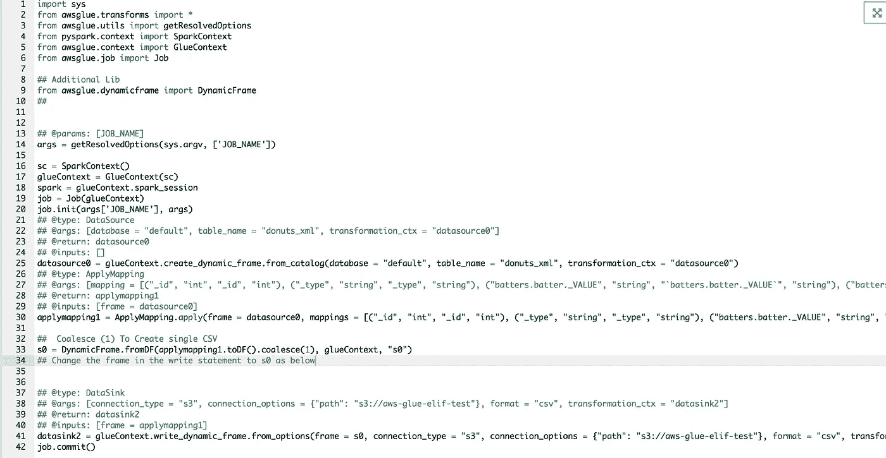

We can Run the job immediately or edit the script in any way.Since it is a python code fundamentally, you have the option to convert the dynamic frame into spark dataframe, apply udfs etc. and convert back to dynamic frame and save the output.(You can stick to Glue transforms, if you wish .They might be quite useful sometimes since the Glue Context provides extended Spark transformations.)

我在建议的脚本中添加了一些行来生成单个 csv 输出，否则输出将是基于分区的多个小 CSV 文件。

保存并单击“Run Job ”,这将带来一个配置检查，因此您可以将 DPU 设置为 2(最小的值)并按如下方式设置超时:

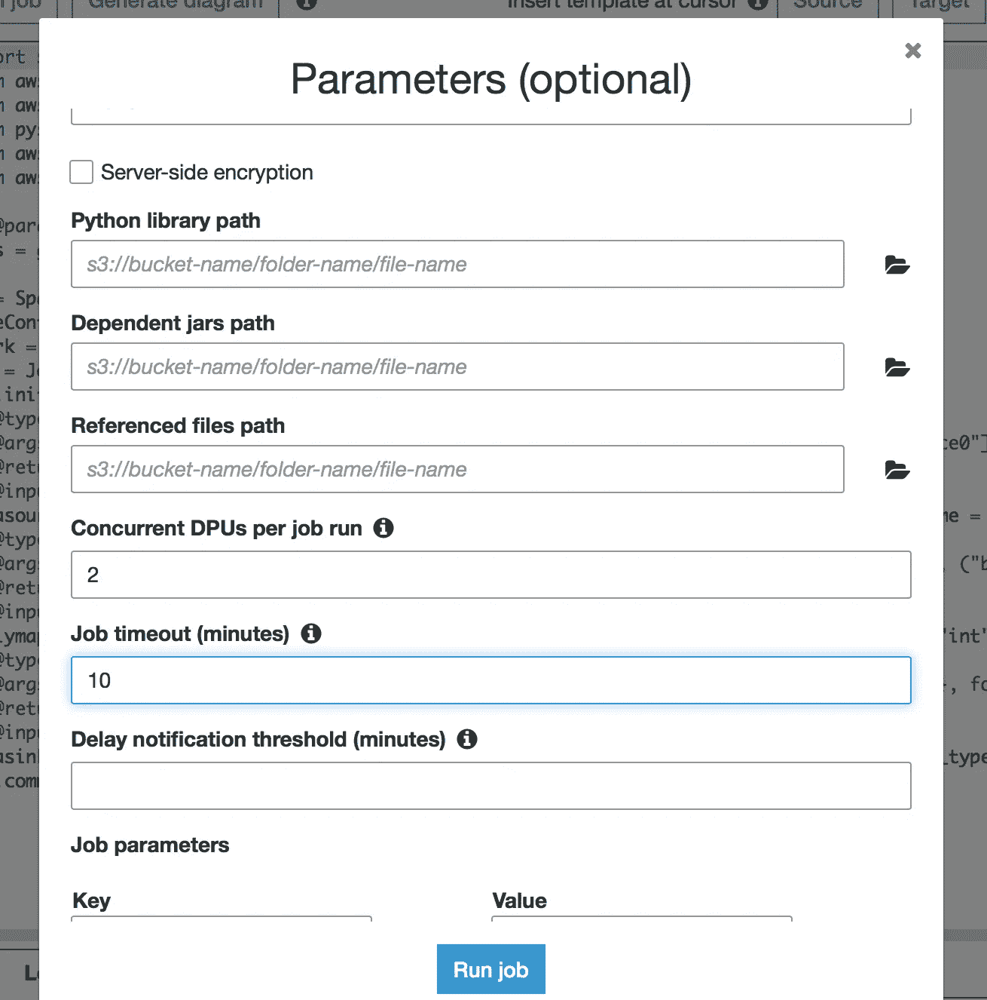

让我们运行并查看输出。您可以监视 Glue UI 中的状态，如下所示:

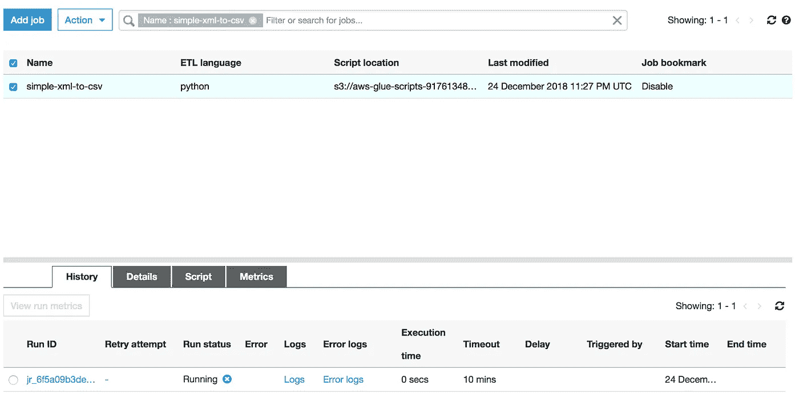

运行状态成功后，转到您的目标 S3 位置:

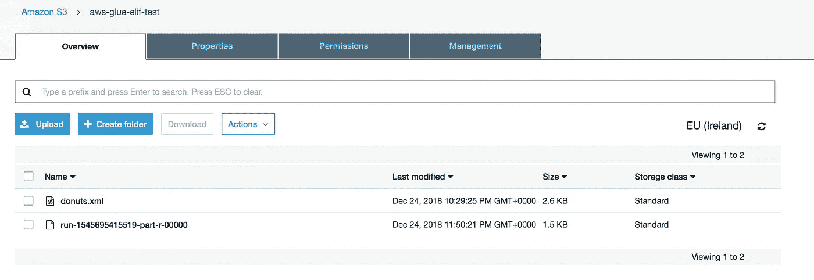

单击文件名并转到如下所示的“选择自”选项卡:

如果向下滚动，可以通过单击显示文件预览/运行 SQL(Athena 在后台)轻松预览和查询小文件:

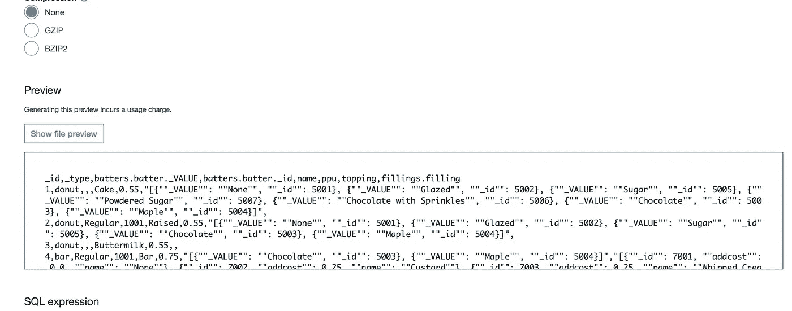

The struct fields propagated but the array fields remained, to explode array type columns, we will use pyspark.sql explode in coming stages.

3.粘合 PySpark 转换用于取消嵌套

Glue 提供了两种 pyspark 变换:

*   Relationalize:取消嵌套列、透视数组列、为关系操作(连接等)生成连接键。)，生成帧列表
*   UnnestFrame:取消框架嵌套，为数组类型的列生成 joinkey，生成一个包含所有字段(包括 join key 列)的框架。

我们将使用 Glue DevEndpoint 来可视化这些转换:

Glue DevEndpoint 是数据存储的连接点，用于调试脚本，使用 Glue Context 和 Sagemaker 或 Zeppelin 笔记本对数据进行探索性分析。

此外，您还可以从 Cloud9 访问这个端点，cloud 9 是基于云的 IDE 环境，用于编写、运行和调试您的代码。您只需要在 Cloud9 实例上生成 ssh 密钥，并在创建端点时添加公共 SSH 密钥。要连接到端点，您将使用端点详细信息中的“SSH 到 Python REPL”命令(在 Glue UI 中单击端点名称)，用您在 Cloud9 实例上的位置替换私钥参数。

*   创建一个 Glue DevEndpoint 和一个 Sagemaker 笔记本:

我将把这个端点也用于 Databricks spark-xml 示例，所以从[https://mvnrepository . com/artifact/com . data bricks/spark-XML _ 2.11/0 . 4 . 1](https://mvnrepository.com/artifact/com.databricks/spark-xml_2.11/0.4.1)下载 jar 文件到您的 PC，上传 jar 到 S3 并相应地设置“依赖 jars 路径”:

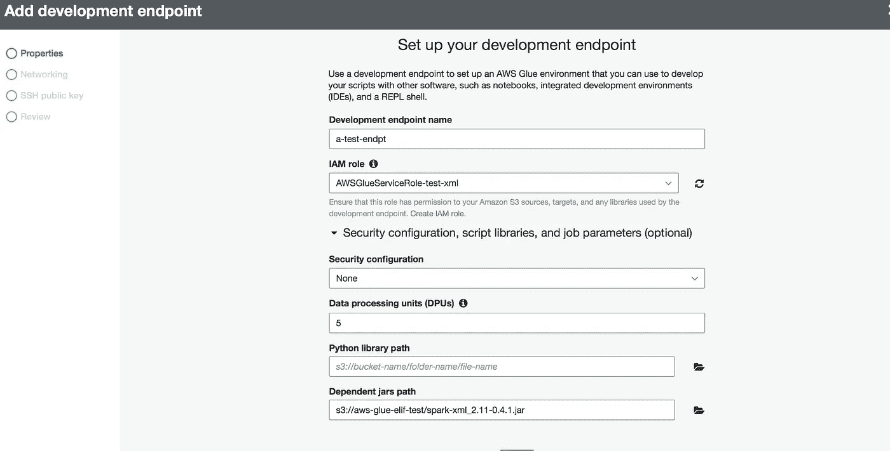

Name it and choose the IAM role we used before.If you have a codebase you want to use, you can add its path to Python library path.

您可以将所有其他配置保留为默认配置，然后单击 Finish。大约需要。端点准备就绪需要 6 分钟。

一旦端点准备就绪，我们就可以创建一个笔记本来连接它。

选择您的端点，然后从操作下拉列表中单击创建 Sagemaker 笔记本。笔记本创建完成后，需要几分钟时间准备就绪。

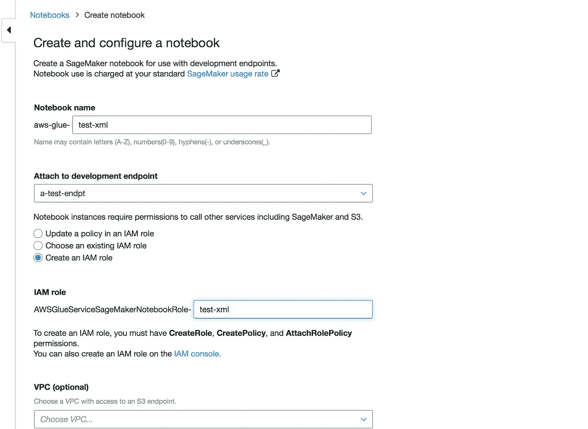

Name it, leave default settings and name the new IAM role , click Create Notebook

打开笔记本并创建一个新的 Pyspark 笔记本:

您可以从我们之前创建的 csv 作业中复制并粘贴样板文件，如下所示更改 glueContext 行，并注释掉与作业相关的库和代码片段:

You can either create dynamic frame from catalog, or using “from options” with which you can point to a specific S3 location to read the data and, without creating a classifier as we did before ,you can just set format options to read the data.

你可以在[https://docs . AWS . Amazon . com/glue/latest/DG/AWS-glue-programming-ETL-format . html](https://docs.aws.amazon.com/glue/latest/dg/aws-glue-programming-etl-format.html)中找到更多关于格式选项的信息

*   关系化:

我在以下步骤中使用了由 from options 创建的框架:(即使您使用了 catalog 选项，输出也是一样的，因为 catalog 不会为数据保存静态模式。)

You can see that the transform returns a list of frames, each has an id and index col for join keys and array elements respectively.

如果看根表会更清楚。例如，填充在根表的这个字段中只有一个整数值，这个值与上面的根 _ 填充 _ 填充帧中的 id 列相匹配。

重要的是，我们看到“batters.batter”字段传播到多个列中。对于项目 2，“batters.batter”列被标识为 struct，但是对于项目 3，该字段是一个数组！。所以用胶水工作的难度就来了。

If you have complicated multilevel nested complicated structure then this behavior might cause lack of maintenance and control over the outputs and problems such as data loss ,so alternative solutions should be considered.

*   Unnest 框架:

让我们看看这个转换将如何给我们一个不同的输出:

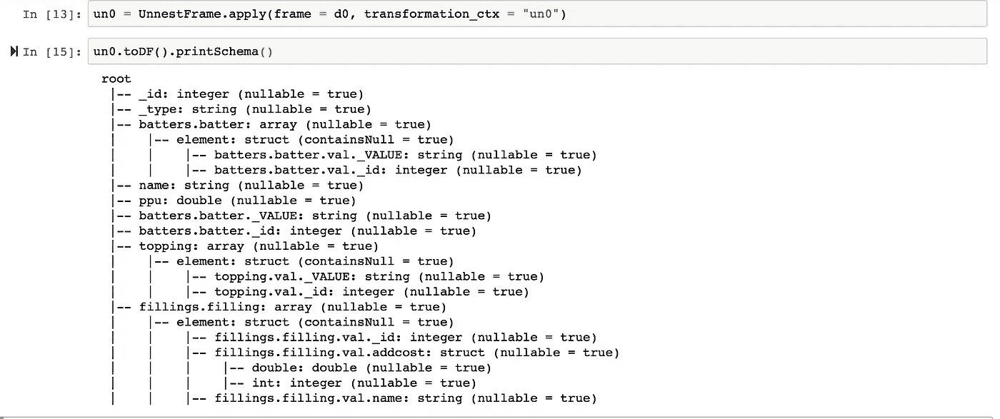

We can see that this time everything is in one frame but again “batters.batter” resulted in multiple columns , this brings uncertainty around the number of columns also. Considering an ETL pipeline, each time a new file comes in, this structure will probably change.

和 unnest 可以展开上层结构，但在展平结构数组方面无效。因此，由于我们不能在动态帧上应用 UDF，我们需要将动态帧转换为 Spark 数据帧，并在列上应用 explode，以将数组类型的列分散到多行中。我将把这部分留给你自己调查。

Moreover I would expect to have not two different spread of “batters.batter” and imho there could be an “array of structs” type column for this field and the “item 2” would have an array of length 1 having its one struct data.

最后… Databricks spark-xml:

这可能不是最好的解决方案，但这个软件包在控制和精度方面非常有用。一个很好的特性是，不可解析的记录也会被检测到，并且一个 _corrupt_record 列会被添加相关信息。

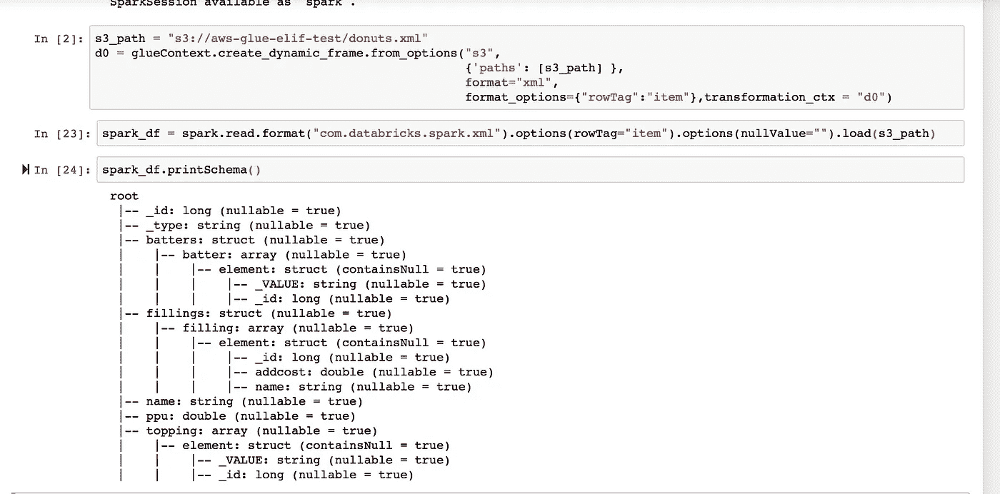

Now here is the difference I expected :) . You can see that “batters.batter” is an array of structs. Moreover for more reading options, you can have a look at [https://github.com/databricks/spark-xml](https://github.com/databricks/spark-xml)

Batters : No nulls, no probs

因此，您不需要考虑是否存在结构或数组列，您可以通过使用提取的模式来编写一个用于展开数组列的通用函数。

顺便提一下，我在 Glue 环境中使用了 Databricks 的 Spark-XML，但是您可以将它用作独立的 python 脚本，因为它独立于 Glue。

我们看到，尽管 Glue 提供了一行转换来处理半/非结构化数据，但是如果我们有复杂的数据类型，我们需要处理样本，看看什么符合我们的目的。

希望你喜欢它！